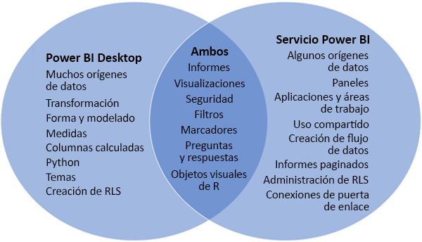
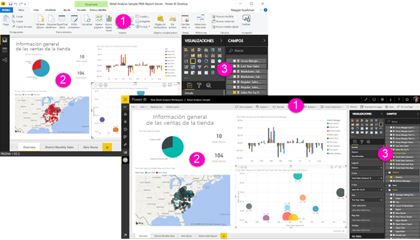

# Comparación de Power BI Desktop y el servicio Power BI

En un diagrama de Venn en el que se comparan Power BI Desktop y el servicio Power BI, el área en la parte central muestra cómo ambos se superponen. Esto quiere decir que algunas tareas se pueden realizar tanto en Power BI Desktop como en el servicio Power BI. Pero, a ambos lados del diagrama de Venn, la aplicación y el servicio presentan características únicas.  

**Power BI Desktop** es una herramienta de creación de informes y análisis de datos completa. Cuando un usuario instala la aplicación gratuita en su equipo local, puede conectarse a muchos orígenes de datos diferentes y combinarlos en un modelo de datos (lo que se suele denominar modelado). La [Guía de introducción de Power BI Desktop](desktop-getting-started.md) le orientará por este proceso.

El **servicio Power BI** es un servicio en línea basado en la nube que sirve para editar un informe superficialmente y fomentar la colaboración en los equipos y las empresas. En el servicio Power BI también puede conectarse a orígenes de datos, pero el modelado está limitado. 

La mayoría de los diseñadores de informes que trabajan con proyectos de inteligencia empresarial usan **Power BI Desktop** para crear informes y, luego, recurren al **servicio Power BI** para compartir los informes con los demás.

## Edición de informes

Se pueden crear y editar *informes* tanto en la aplicación como en el servicio. Un informe puede tener una o varias páginas con objetos visuales y colecciones de objetos visuales. Puede agregar marcadores, botones, filtros y opciones de obtención de detalles para mejorar la navegación en los informes.

Los editores de informes en Power BI Desktop y en el servicio Power BI son similares. Constan de tres secciones:  

1. Las barras de navegación superiores, que son distintas en Power BI Desktop y en el servicio Power BI    
2. El lienzo del informe     
3. Los paneles **Campos**, **Visualizaciones** y **Filtros**

En este vídeo se muestra el editor de informes en Power BI Desktop. 

<iframe width="560" height="315" src="https://www.youtube.com/embed/IkJda4O7oGs" frameborder="0" allowfullscreen></iframe>

## Colaboración en el servicio Power BI

Después de crear los informes, puede guardarlos en un *área de trabajo* en el **servicio Power BI**, donde puede colaborar con sus compañeros. Los *paneles* se crean a partir de estos informes y, acto seguido, esos paneles e informes se comparten con los consumidores de informes dentro y fuera de la organización. Los consumidores de informes los visualizan en el servicio Power BI en [la vista de lectura](consumer/end-user-reading-view.md), no en la vista de edición, dado que carecen de acceso a todas las características disponibles para los creadores de informes. 

## Pasos siguientes

[¿Qué es Power BI Desktop?](desktop-what-is-desktop.md)

[Creación de un informe](service-report-create-new.md) en el servicio Power BI

[Conceptos básicos para diseñadores](service-basic-concepts.md)

¿Tiene más preguntas? [Pruebe la comunidad de Power BI](http://community.powerbi.com/)

