# Uso compartido de informes y paneles de Power BI con compañeros y otros usuarios
*Compartir* es una buena manera de permitir que otros usuarios tengan acceso a sus paneles e informes. Power BI ofrece también [varias maneras de colaborar y distribuir los paneles e informes](service-how-to-collaborate-distribute-dashboards-reports.md).

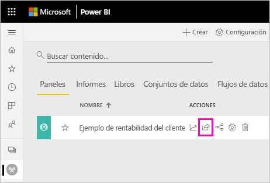

Con el uso compartido, si comparte contenido dentro o fuera de su organización, se necesita una [licencia de Power BI Pro](service-features-license-type.md). Sus destinatarios también necesitan licencias de Power BI Pro, excepto si el contenido está en una [función premium](service-premium-what-is.md). 

Puede compartir paneles e informes de la mayoría de las ubicaciones del servicio de Power BI: Favoritos, Recientes, Mi área de trabajo y Compartidos conmigo, si el propietario lo permite. También puede compartir elementos desde otras áreas de trabajo si tiene el [rol de administrador, miembro o colaborador](service-new-workspaces.md#roles-in-the-new-workspaces) en el área de trabajo. 

Cuando comparte un panel o un informe, los usuarios con quienes los comparte pueden verlos e interactuar con ellos, pero no modificarlos. Ellos ven los mismos datos que usted ve en el panel o informe, a menos que se aplique la [seguridad de nivel de fila (RLS)](service-admin-rls.md). Los compañeros con los que los comparte también pueden compartirlos a su vez con sus propios compañeros, si tienen permiso para hacerlo. Los usuarios que no pertenecen a la organización pueden ver el panel o el informe, e interactuar con ellos, pero no compartirlos. 

No se puede *compartir* contenido directamente desde Power BI Desktop. Los [informes se publican desde Power BI Desktop](desktop-upload-desktop-files.md) en el servicio Power BI. Sin embargo, puede [compartir un panel desde las aplicaciones móviles de Power BI](consumer/mobile/mobile-share-dashboard-from-the-mobile-apps.md).  

## Vídeo: Compartir un panel
Vea cómo Amanda comparte el panel con sus compañeros dentro y fuera de la compañía. Luego, siga las instrucciones paso a paso que aparecen debajo del vídeo para intentarlo.

<iframe width="560" height="315" src="https://www.youtube.com/embed/0tUwn8DHo3s?list=PL1N57mwBHtN0JFoKSR0n-tBkUJHeMP2cP" frameborder="0" allowfullscreen></iframe>

## Uso compartido de un panel o informe

1. En una lista de paneles o informes, o en un panel o informe abierto, seleccione **Compartir** .

2. En el cuadro superior, escriba las direcciones de correo electrónico completas de las personas, los grupos de distribución o los grupos de seguridad. No se puede compartir con listas de distribución dinámicas. 
   
   Puede compartir contenido con gente cuya dirección no pertenezca a su organización, pero recibirá una advertencia al hacerlo. Obtenga más información sobre el [uso compartido desde fuera de la organización](#share-a-dashboard-or-report-outside-your-organization) en este artículo.
   
   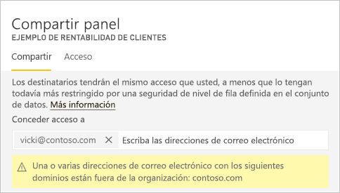 
 
   >[!NOTE]
   >El cuadro de entrada admite, como máximo, 100 usuarios o grupos distintos. Vea [Uso compartido con más de 100 usuarios](#share-with-more-than-100-separate-users) en este artículo para obtener información sobre cómo compartir con más usuarios.

3. Agregue un mensaje si lo desea. Es opcional.
4. Para permitir que sus compañeros de trabajo compartan el contenido con otros, active la casilla **Permitir que los destinatarios compartan su panel (o informe)** .
   
   La acción de permitir que otras personas compartan se denomina *volver a compartir*. Si les deja, pueden volver a compartir desde el servicio Power BI y las aplicaciones móviles, o reenviar la invitación de correo electrónico a otras personas de su organización. La invitación expira transcurrido un mes. Los usuarios ajenos a su organización no pueden volver a compartir contenido. Como propietario del contenido, puede desactivar la posibilidad de volver a compartir o revocar usos compartidos de forma individual. Vea [Detención o cambio del uso compartido](#stop-or-change-sharing) en este artículo.

5. Si selecciona **Permitir que los usuarios compilen nuevo contenido a partir de los conjuntos de datos subyacentes**, estos podrán crear sus propios informes en otras áreas de trabajo basadas en el conjunto de contenido de este panel. Obtenga más información sobre la [creación de informes basados en conjuntos de datos de diferentes áreas de trabajo](service-datasets-discover-across-workspaces.md).

1. Seleccione **Compartir.**
   
   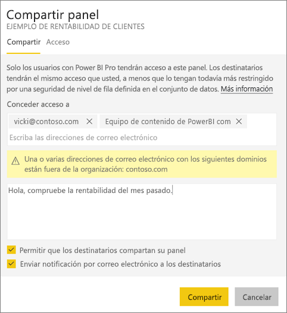  
   
   Power BI envía una invitación por correo electrónico a cada usuario, pero no a los grupos, con un vínculo al contenido compartido. Verá una notificación de **correcto**. 
   
   Cuando los destinatarios de su organización hacen clic en el vínculo, Power BI agrega el panel o informe a su página de lista **Compartido conmigo**. Estos pueden seleccionar su nombre para ver el contenido que ha compartido. 
   
   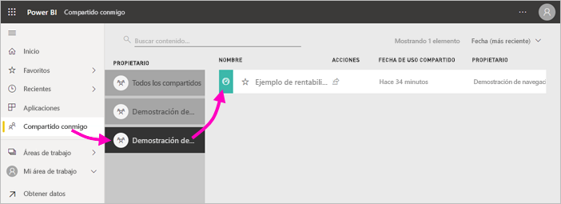
   
   Cuando los destinatarios externos a su organización hacen clic en el vínculo, ven el panel o informe, pero no en el portal habitual de Power BI. Obtenga más información sobre el [uso compartido con usuarios externos a la organización](#share-a-dashboard-or-report-outside-your-organization) en este artículo.

## Consulta de quién tiene acceso a un panel o informe
En ocasiones necesitará ver a las personas con las que ha compartido y ver con quiénes lo han compartido esas personas.

1. En la lista de paneles e informes, o en el panel o informe propiamente dicho, seleccione **Compartir** . 
2. En el cuadro de diálogo **Compartir panel** o **Compartir informe**, seleccione **Acceso**.
   
    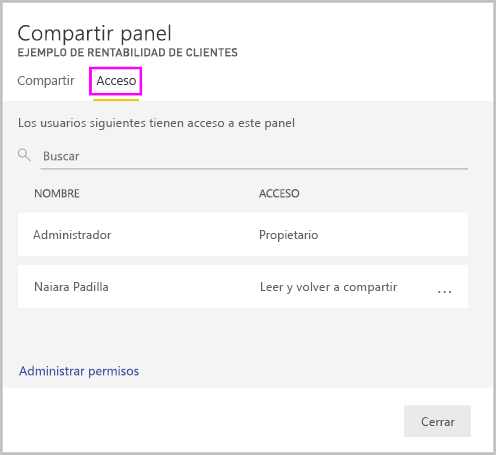

    Los usuarios ajenos a su organización se muestran como **Invitado**.

    En esta vista, puede [detener o cambiar los permisos de uso compartido](#stop-or-change-sharing) en este artículo. 

## Uso compartido de un panel o informe fuera de la organización
Si comparte contenido con usuarios ajenos a la organización, estos recibirán un correo electrónico con un vínculo al panel o informe compartido. Tendrán que iniciar sesión en Power BI para ver lo que se ha compartido. Si no tienen una licencia de Power BI Pro, se pueden registrar para obtenerla haciendo clic en el vínculo.

Después de iniciar sesión, verán el panel o informe compartido en su propia ventana del explorador, no en el portal de Power BI habitual. Para acceder más tarde a este panel o informe, tendrán que agregar el vínculo a los marcadores.

No pueden editar el contenido del panel ni del informe. Pueden interactuar con los gráficos y cambiar los filtros o las segmentaciones, pero no guardar los cambios. 

Solo los destinatarios directos verán el panel o informe compartido. Por ejemplo, si ha enviado el mensaje de correo electrónico a Vicki@contoso.com, solo Vicki verá el panel. Nadie más puede ver el panel, incluso aunque Vicki les reenvíe el vínculo. Vicki tendrá que usar la misma dirección de correo electrónico para acceder; si inicia sesión con otra dirección de correo electrónico, no tendrá acceso al panel.

Los usuarios externos a la organización no verán ningún dato si se ha implementado la seguridad de nivel de fila o de rol en los modelos tabulares de Analysis Services locales.

Si envía un vínculo desde una aplicación móvil de Power BI a contactos externos a su organización, al hacer clic en el vínculo, se abrirá el panel en el explorador, no en la aplicación móvil de Power BI.

### Permisos de edición de contenido para los usuarios externos

El administrador de Power BI puede permitir a los usuarios externos editar y administrar el contenido de la organización. En ese caso, los usuarios externos no tendrán esa experiencia de solo consumo. Pueden editar y administrar el contenido de la organización. Obtenga más información sobre la [distribución de contenido de Power BI a usuarios externos invitados con Azure AD B2B](service-admin-azure-ad-b2b.md).

## Detención o cambio del uso compartido
Solo el propietario del panel o informe puede activar y desactivar Volver a compartir.

### Si aún no ha enviado la invitación para compartir
* Desactive la casilla **Permitir que los destinatarios compartan su panel (o informe)** en la parte inferior de la invitación antes de enviarla.

### Si ya ha compartido el panel o informe
1. En la lista de paneles e informes, o en el panel o informe propiamente dicho, seleccione **Compartir** . 
2. En el cuadro de diálogo **Compartir panel** o **Compartir informe**, seleccione **Acceso**.
   
    
3. Seleccione los puntos suspensivos ( **...** ) junto a **Leer y volver a compartir** y seleccione:
   
   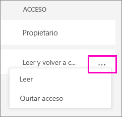
   
   * **Lectura** para impedir que esa persona comparta con nadie más.
   * **Quitar acceso** para impedir que esa persona vea el contenido compartido.

4. En el cuadro de diálogo **Eliminar acceso**, decida si quiera quitar también el acceso al contenido relacionado, como informes y conjuntos de datos. Si quita elementos con un icono de advertencia , también se recomienda quitar el contenido relacionado. De lo contrario, no se mostrará correctamente.

    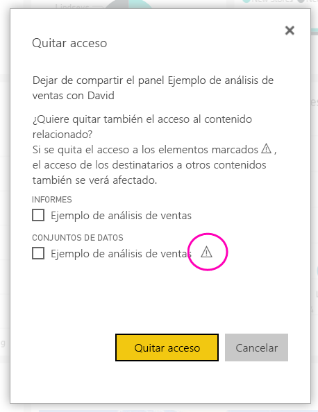

## Limitaciones y consideraciones
Aspectos que hay que tener en cuenta sobre el uso compartido de paneles e informes:

* Por lo general, usted y sus compañeros ven los mismos datos en el panel o informe. Por tanto, si tiene permisos para ver más datos que ellos, verán todos los datos en el panel o informe. Pero si se aplica la [seguridad de nivel de fila (RLS)](service-admin-rls.md) al conjunto de datos subyacente de un panel o informe, las credenciales de cada usuario determinan los datos a los que puede acceder.
* Todos los usuarios con quienes comparta el panel podrán visualizarlo e interactuar con los informes relacionados en la [vista de lectura](consumer/end-user-reading-view.md#reading-view). Por lo general, no pueden crear informes ni guardar cambios en los informes existentes. Pero si selecciona **Permitir que los usuarios compilen nuevo contenido a partir de los conjuntos de datos subyacentes**, estos podrán crear informes propios en otras áreas de trabajo basados en el conjunto de datos de este panel o informe.
* Aunque ningún usuario puede ver o descargar el conjunto de datos, pueden acceder directamente al conjunto de datos mediante la característica Analizar en Excel. Un administrador puede restringir la capacidad de usar Analizar en Excel para todos los miembros de un grupo. Sin embargo, la restricción es para todos los usuarios de ese grupo y para todas las áreas de trabajo a las que pertenece el grupo.
* Todo el mundo puede [actualizar los datos](refresh-data.md) manualmente.
* Si usa Office 365 para el correo electrónico, puede compartir datos con los miembros de un grupo de distribución. Para ello, escriba la dirección de correo electrónico asociada al grupo de distribución.
* Los compañeros de trabajo que tengan el mismo dominio de correo electrónico y aquellos cuyo dominio sea distinto, pero esté registrado en el mismo inquilino, pueden compartir el panel con otros. Por ejemplo, imagine que los dominios contoso.com y contoso2.com están registrados en el mismo inquilino y que la dirección de correo electrónico es konrads@contoso.com. Tanto ravali@contoso.com como gustav@contoso2.com pueden compartir el panel, siempre y cuando les otorgue permiso para compartirlo.
* Si sus compañeros de trabajo ya tienen acceso a un panel o informe específico, puede enviar un vínculo directo con solo copiar la dirección URL cuando se encuentre dentro del panel o informe. Por ejemplo: `https://powerbi.com/dashboards/g12466b5-a452-4e55-8634-xxxxxxxxxxxx`.
* Del mismo modo, si sus compañeros de trabajo ya tienen acceso a un panel específico, puede [enviar un vínculo directo al informe subyacente](service-share-reports.md). 

### Uso compartido con más de 100 usuarios

Como máximo, puede compartir con 100 usuarios o grupos en una sola acción de uso compartido. Sin embargo, puede conceder acceso a un elemento a más de 500 usuarios. Estas son algunas sugerencias:

- Comparta contenido varias veces mediante la especificación individual de los usuarios.
- Comparta contenido con un grupo de usuarios que incluya todos los usuarios. 
- Cree el informe o el panel en un área de trabajo y, después, cree una aplicación desde el área de trabajo. Puede compartir la aplicación con muchos más usuarios. Obtenga más información sobre la [publicación de aplicaciones en Power BI](service-create-distribute-apps.md).

## Solución de problemas de uso compartido

### Los destinatarios del panel ven un icono de bloqueo en un icono o un mensaje "Permisos requeridos"

Las personas con las que comparte puede que vean un icono de bloqueo en un panel o un mensaje "Permisos requeridos" al intentar ver un informe.

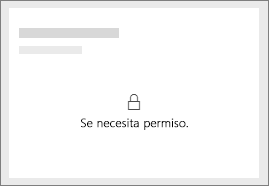

Si es así, debe concederles permiso al conjunto de datos subyacente.

1. Vaya a la pestaña **Conjuntos de datos** en la lista de contenido.

1. Seleccione el símbolo de puntos suspensivos ( **…** ) junto al conjunto de datos y, después, haga clic en **Administrar permisos**.

    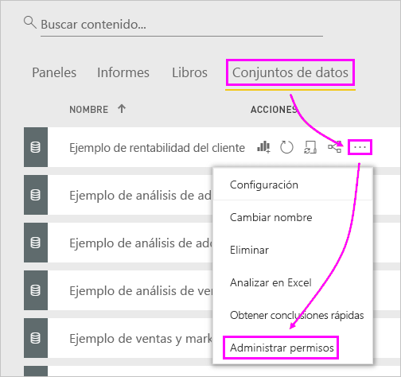

1. Seleccione **Agregar usuario**.

    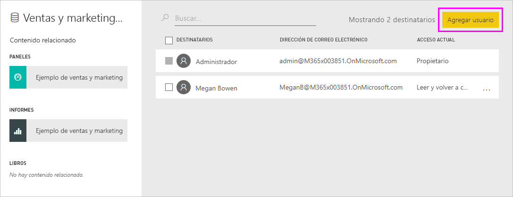

1. Escriba las direcciones de correo electrónico completas de las personas, los grupos de distribución o los grupos de seguridad. No se puede compartir con listas de distribución dinámicas.

    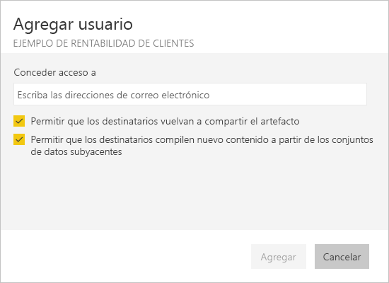

1. Seleccione **Agregar**.

### No se puede compartir un panel o informe

Para compartir un panel o informe, necesita permiso para volver a compartir el contenido subyacente (es decir, los informes y conjuntos de datos relacionados). Si ve un mensaje que indica que no se puede compartir, solicite al autor del informe que le conceda permisos para volver a compartir los informes y los conjuntos de datos.

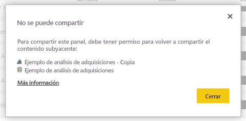

## Pasos siguientes

* [¿Cómo debo compartir paneles e informes y colaborar en ellos?](service-how-to-collaborate-distribute-dashboards-reports.md)
* [Uso compartido de informes de Power BI con los compañeros](service-share-reports.md)
* ¿Tiene alguna pregunta? [Pruebe la comunidad de Power BI](https://community.powerbi.com/)

