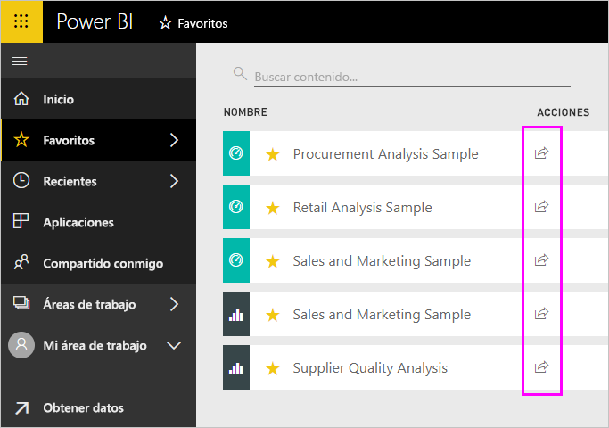
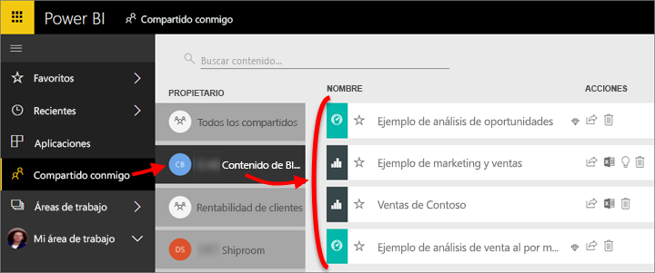

# Uso compartido de informes y paneles de Power BI con compañeros y otros usuarios
*Compartir* es una buena manera de permitir que otros usuarios tengan acceso a sus paneles e informes. Power BI ofrece también [varias maneras de colaborar y distribuir los paneles e informes](service-how-to-collaborate-distribute-dashboards-reports.md).

Con el uso compartido, si comparte contenido dentro o fuera de su organización, se necesita una [licencia de Power BI Pro](service-features-license-type.md). Los destinatarios también necesitan licencias de Power BI Pro, a menos que el contenido en un [capacidad Premium](service-premium-what-is.md). 

Puede compartir paneles e informes de la mayoría de los lugares en el servicio Power BI: Favoritos, recientes, compartido conmigo (si el propietario lo permite), Mi área de trabajo u otras áreas de trabajo. Cuando comparte un panel o un informe, los usuarios con quienes los comparte pueden verlos e interactuar con ellos, pero no pueden modificarlos. Ellos ven los mismos datos que usted ve en el panel o informe, a menos que se aplique la [seguridad de nivel de fila (RLS)](service-admin-rls.md). Los compañeros con los que los comparte también pueden compartirlos a su vez con sus propios compañeros, si tienen permiso para hacerlo. Las personas fuera de su organización pueden también ver e interactúan con el panel o informe, pero no pueden compartirlo. 

También puede [compartir un panel desde cualquiera de las aplicaciones móviles de Power BI](consumer/mobile/mobile-share-dashboard-from-the-mobile-apps.md). Sin embargo, no pueden compartir los paneles en Power BI Desktop.

## Vídeo: Compartir un panel
Observe cómo Amanda comparte su panel con compañeros tanto de su empresa como externos. Luego, siga las instrucciones paso a paso que aparecen debajo del vídeo para intentarlo.

<iframe width="560" height="315" src="https://www.youtube.com/embed/0tUwn8DHo3s?list=PL1N57mwBHtN0JFoKSR0n-tBkUJHeMP2cP" frameborder="0" allowfullscreen></iframe>

## Uso compartido de un panel o informe

1. En una lista de paneles o informes, o en un panel o informe abierto, seleccione **Compartir** .

2. En el cuadro superior, escriba las direcciones de correo electrónico completas de las personas, los grupos de distribución o los grupos de seguridad. No se puede compartir con listas de distribución dinámicas. 
   
   Puede compartir contenido con gente cuya dirección no pertenezca a su organización, pero recibirá una advertencia al hacerlo.
   
    
 
   >[!NOTE]
   >El cuadro de entrada admite, como máximo, 100 usuarios o grupos. Si tiene que compartir con un gran número de usuarios, considere la posibilidad de crear el panel en un área de trabajo y [distribuirla como una aplicación](service-create-distribute-apps.md).
   > 
   > 

3. Agregue un mensaje si lo desea. Es opcional.
4. Para permitir que sus compañeros compartan el contenido con otros usuarios, active **permitir que los destinatarios compartan su panel (o informe)** .
   
   La acción de permitir que otras personas compartan se denomina *volver a compartir*. Si les deja, pueden volver a compartir desde el servicio Power BI y las aplicaciones móviles, o reenviar la invitación de correo electrónico a otras personas de su organización. La invitación expira transcurrido un mes. Los usuarios ajenos a su organización no pueden volver a compartir contenido. Como propietario del contenido, puede desactivar la posibilidad de volver a compartir o revocar usos compartidos de forma individual. Consulte [dejar de compartir o impedir que otros compartan](#stop-sharing-or-stop-others-from-sharing).

5. Seleccione **Compartir.**
   
     
   
   Power BI envía una invitación por correo electrónico a las personas, pero no a los grupos, con un vínculo al contenido compartido. Verá una notificación de **correcto**. 
   
   Cuando los destinatarios de su organización hacen clic en el vínculo, Power BI agrega el panel o informe a su página de lista **Compartido conmigo**. Estos pueden seleccionar su nombre para ver el contenido que ha compartido. 
   
   
   
   Cuando los destinatarios externos a su organización hacen clic en el vínculo, ven el panel o informe, pero no en el portal habitual de Power BI. Para obtener más información, consulte [compartir un panel o informe con personas fuera de su organización](#share-a-dashboard-or-report-with-people-outside-your-organization).

## ¿Quién tiene acceso a un panel o informe que ha compartido?
En ocasiones necesitará ver a las personas que ha compartido con y vea quiénes lo han compartido con:

1. En la lista de paneles e informes, o en el panel o informe propiamente dicho, seleccione **Compartir** . 
2. En el **compartir panel** o **compartir informe** cuadro de diálogo, seleccione **acceso**.
   
    

    Los usuarios ajenos a su organización se muestran como **Invitado**.

## Dejar de compartir o impedir que otros compartan
Solo el propietario del panel o informe puede activar y desactivar Volver a compartir.

### Si aún no ha enviado la invitación para compartir
* Desactive el **permitir que los destinatarios compartan su panel (o informe)** casilla de verificación en la parte inferior de la invitación antes de enviarlo.

### Si ya ha compartido el panel o informe
1. En la lista de paneles e informes, o en el panel o informe propiamente dicho, seleccione **Compartir** . 
2. En el **compartir panel** o **compartir informe** cuadro de diálogo, seleccione **acceso**.
   
    
3. Seleccione los puntos suspensivos ( **...** ) junto a **Leer y volver a compartir** y seleccione:
   
   
   
   * **Lectura** para impedir que esa persona comparta con nadie más.
   * **Quitar acceso** para impedir que esa persona vea el contenido compartido.

4. En el **quitar acceso** diálogo cuadro, decida si también desea quitar el acceso al contenido relacionado, como informes y conjuntos de datos. Si quita los elementos con un icono de advertencia , es mejor eliminar también el contenido relacionado ya que no se muestra correctamente.

    

## Uso compartido de un panel o informe con personas fuera de la organización
Cuando se comparte con personas fuera de su organización, recibirán un correo electrónico con un vínculo en el panel o informe compartido, que debe iniciar sesión en Power BI para ver. Si no tienen una licencia de Power BI Pro, puede registrarse para obtener una licencia después de hacer clic en el vínculo.

Después de iniciar sesión, verán el panel o informe compartido en su propia ventana del explorador, no en el portal habitual de Power BI. Para acceder más adelante en este panel o informe, debe marcar el vínculo.

No pueden editar el contenido del panel ni del informe. Aunque puede interactuar con los gráficos y cambiar los filtros o segmentaciones, no pueden guardar sus cambios. 

Solo los destinatarios directos pueden ver el panel o informe compartido. Por ejemplo, si se ha enviado el mensaje de correo electrónico a Vicki@contoso.com, solo Vicki puede ver el panel. Nadie puede ver el panel, incluso si tienen el vínculo. Vicki debe usar la misma dirección de correo electrónico para tener acceso a él; Si se suscribe con cualquier otra dirección de correo electrónico, ella no tendrá acceso al panel.

Los usuarios ajenos a su organización no pueden ver ningún dato si se implementó seguridad de nivel de fila o de rol en los modelos tabulares de Analysis Services locales.

Si envía un vínculo desde una aplicación móvil de Power BI a personas fuera de su organización, al hacer clic en el vínculo abre el panel en un explorador, no en la aplicación móvil de Power BI.

Si se [permiten a los usuarios externos invitados edición y administración de contenido de la organización](service-admin-portal.md#export-and-sharing-settings), la experiencia predeterminada solo consumo no se aplica a ellos. [Más información](service-admin-azure-ad-b2b.md).

## Limitaciones y consideraciones
Aspectos que hay que tener en cuenta sobre el uso compartido de paneles e informes:

* Por lo general, usted y sus compañeros ven los mismos datos en el panel o informe. Por lo tanto, si tiene permisos para ver más datos que ellos, podrán ver todos sus datos en el panel o informe. Sin embargo, si se aplica la [seguridad de nivel de fila (RLS)](service-admin-rls.md) al conjunto de datos subyacente a un panel o informe, se usan las credenciales de cada persona para determinar los datos a los que puede tener acceso.
* Todo el mundo comparte su panel puede verlo e interactuar con los informes relacionados en [la vista de lectura](consumer/end-user-reading-view.md#reading-view). No pueden crear informes ni guardar cambios en los informes existentes.
* Aunque nadie puede ver o descargar el conjunto de datos, podrán tener acceso el conjunto de datos directamente mediante el análisis de la característica de Excel. Un administrador puede restringir la capacidad de usar la característica analizar en Excel para todos los miembros de un grupo. Sin embargo, la restricción es para todos los usuarios de ese grupo para cada área de trabajo a la que pertenece el grupo.
* Todo el mundo puede [actualizar los datos](refresh-data.md) manualmente.
* Si usa Office 365 para el correo electrónico, puede compartir datos con los miembros de un grupo de distribución. Para ello, escriba la dirección de correo electrónico asociada al grupo de distribución.
* Compañeros de trabajo que comparten el dominio de correo electrónico y compañeros de trabajo cuyo dominio es distinto, están registrados en el mismo inquilino, pueden compartir el panel con otros usuarios. Por ejemplo, si los dominios contoso.com y contoso2.com están registrados en el mismo inquilino y su dirección de correo electrónico es konrads@contoso.com, a continuación, ambos ravali@contoso.com y gustav@contoso2.com pueden compartir, siempre y cuando se les diera permiso para compartir.
* Si sus compañeros ya tienen acceso a un panel específico o un informe, puede enviar un vínculo directo al copiar la dirección URL cuando se encuentre en el panel o informe. Por ejemplo: `https://powerbi.com/dashboards/g12466b5-a452-4e55-8634-xxxxxxxxxxxx`
* Del mismo modo, si sus compañeros ya tienen acceso a un panel específico, puede [enviar un vínculo directo al informe subyacente](service-share-reports.md). 
* Puede compartir con, a lo sumo, 100 usuarios o grupos de acción de un solo recurso compartido. Sin embargo, puede conceder acceso a un elemento a más de 500 usuarios. Para ello, comparta varias veces mediante la especificación de los usuarios individualmente o compartir con un grupo de usuarios que contiene todos los usuarios.

## Solución de problemas de uso compartido

### Los destinatarios del panel ven un icono de bloqueo en un icono o un mensaje "Permisos requeridos"

Las personas con las que comparte puede que vean un icono de bloqueo en un panel o un mensaje "Permisos requeridos" al intentar ver un informe.

Si es así, deberá concederles permiso al conjunto de datos subyacente:

1. Vaya a la pestaña **Conjuntos de datos** en la lista de contenido.

1. Seleccione los puntos suspensivos ( **...** ) junto al conjunto de datos, a continuación, seleccione **administrar permisos**.

    

1. Seleccione **Agregar usuario**.

    

1. Escriba las direcciones de correo electrónico completas de las personas, los grupos de distribución o los grupos de seguridad. No se puede compartir con listas de distribución dinámicas.

    

1. Seleccione **Agregar**.

### No se puede compartir un panel o informe

Para compartir un panel o informe, necesita permiso para volver a compartir el contenido subyacente; es decir, cualquier relacionados con informes y conjuntos de datos. Si ve un mensaje que indica que no se puede compartir, solicite al autor del informe para proporcionar a volver a compartir permisos para los informes y conjuntos de datos.

## Pasos siguientes
* ¿Quiere hacer algún comentario? Vaya al [sitio de la comunidad de Power BI](https://community.powerbi.com/) para efectuar sus sugerencias.
* [¿Cómo debo compartir paneles e informes y colaborar en ellos?](service-how-to-collaborate-distribute-dashboards-reports.md)
* [Compartir un informe de Power BI filtrado](service-share-reports.md).
* ¿Tiene alguna pregunta? [Pruebe la comunidad de Power BI](http://community.powerbi.com/).

