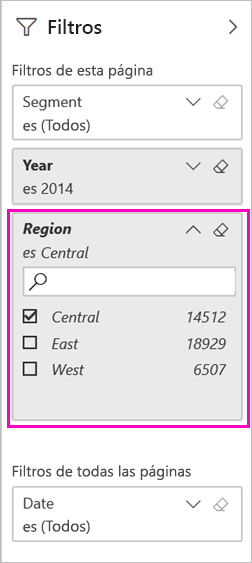
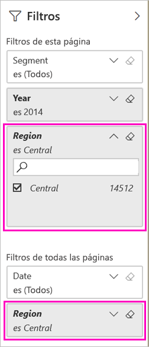
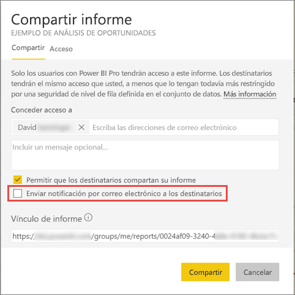

# Dos maneras de compartir un informe de Power BI filtrado
*Compartir* es una buena manera de permitir que otros usuarios tengan acceso a sus paneles e informes. ¿Qué sucede si quiere compartir una versión filtrada de un informe? Quizás un informe que muestra solamente los datos de una ciudad, vendedor o año determinados. Intente filtrar un informe y compartirlo, o crear una dirección URL personalizada. El informe se filtra cuando los destinatarios lo abren por primera vez. Pueden quitar el filtro modificando la dirección URL. 

Power BI ofrece también [otras maneras de colaborar y distribuir sus informes](service-how-to-collaborate-distribute-dashboards-reports.md). Con el uso compartido, usted y sus destinatarios necesitarán una [licencia de Power BI Pro](service-features-license-type.md) o que el contenido esté en una [capacidad premium](service-premium-what-is.md). 

## Dos formas de filtrar un informe

Con ambas técnicas de filtrado, usamos la aplicación de plantilla de ejemplo de marketing y ventas. ¿Quiere probarlo? También puede instalar la aplicación de plantilla [Ejemplo de marketing y ventas](https://appsource.microsoft.com/product/power-bi/microsoft-retail-analysis-sample.salesandmarketingsample?tab=Overview).

### Establecimiento de un filtro

Abra un informe en [Vista de edición](consumer/end-user-reading-view.md) y aplique un filtro.

En este ejemplo, vamos a filtrar la página YTD Category (Categoría hasta la fecha) de la aplicación de plantilla Ejemplo de marketing y ventas para mostrar solo los valores donde **Región** es igual a **Central**. 
 

Guarde el informe.

### Creación de un filtro en la dirección URL

Al agregar el filtro al final de la dirección URL de la página del informe, el comportamiento es ligeramente diferente. La página filtrada tiene el mismo aspecto. Sin embargo, Power BI agrega el filtro a todo el informe y quita los demás valores del panel de filtro.  

Agregue lo siguiente al final de la dirección URL de la página del informe:
   
    ?filter=*tablename*/*fieldname* eq *value*
   
El campo debe ser de tipo número, fecha y hora o cadena. Los valores de *tablename* o *fieldname* no pueden contener espacios.
   
En nuestro ejemplo, el nombre de la tabla es **Geo**, el nombre del campo es **Región** y el valor por el que quiere filtrar es **Central**:
   
    ?filter=Geo/Region eq 'Central'

El explorador agrega caracteres especiales para representar espacios, apóstrofos y barras diagonales, así que el resultado es:
   
    app.powerbi.com/groups/xxxx/reports/xxxx/ReportSection4d00c3887644123e310e?filter=Geo~2FRegion%20eq%20'Central'

Guarde el informe.

Consulte el artículo [Filtro de un informe con parámetros de cadena de consulta en la URL](service-url-filters.md) para información mucho más detallada.

## Compartir el informe filtrado

1. Cuando [comparta el informe](service-share-dashboards.md), desactive la casilla **Enviar notificación por correo electrónico a los destinatarios**.

    

4. Envíe el vínculo con el filtro que creó anteriormente.

## Pasos siguientes
* [Formas de compartir el trabajo en Power BI](service-how-to-collaborate-distribute-dashboards-reports.md)
* [Compartir un panel](service-share-dashboards.md)
* ¿Tiene más preguntas? [Pruebe la comunidad de Power BI](https://community.powerbi.com/).
* ¿Quiere hacer algún comentario? Vaya al [sitio de la comunidad de Power BI](https://community.powerbi.com/) para efectuar sus sugerencias.

