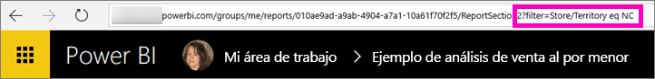

# Filtrar un informe de Power BI y compartirlo con compañeros de trabajo
*Compartir* es una buena manera de permitir que otros usuarios tengan acceso a sus paneles e informes. ¿Qué sucede si quiere compartir una versión filtrada de un informe? Quizás un informe que muestra solamente los datos de una ciudad, vendedor o año determinados. Intente filtrar un informe y compartirlo o crear una dirección URL personalizada. El informe se filtrará cuando los destinatarios lo abran por primera vez. Pueden quitar el filtro modificando la dirección URL. 

Power BI ofrece también [varias maneras de colaborar y distribuir sus informes](service-how-to-collaborate-distribute-dashboards-reports.md). Con el uso compartido, usted y sus destinatarios necesitarán una [licencia de Power BI Pro](service-features-license-type.md) o que el contenido esté en una [capacidad premium](service-premium-what-is.md). 

## Dos maneras de filtrar un informe

### Establecer un filtro

Abra el informe en [vista de edición](consumer/end-user-reading-view.md), aplique el filtro y guarde el informe.
   
En este ejemplo, vamos a filtrar el [ejemplo de Análisis de venta directa](sample-tutorial-connect-to-the-samples.md) para mostrar solo los valores donde **Territory** sea igual a **NC**.
   

### Crear un filtro en la dirección URL

Agregue lo siguiente al final de la dirección URL de la página del informe:
   
?filter=*tablename*/*fieldname* eq *value*
   
El campo debe ser de tipo número, fecha y hora o cadena. Los valores de *tablename* o *fieldname* no pueden contener espacios.
   
En nuestro ejemplo, el nombre de la tabla es **Almacén**, el nombre del campo es **Territorio** y el valor por el que quiere filtrar es **NC**:
   
?filter=Tienda/Territorio eq 'NC'
   

   
El explorador agrega caracteres especiales para representar espacios, apóstrofos y barras diagonales, así que es resultado es:
   
app.powerbi.com/groups/me/reports/010ae9ad-a9ab-4904-a7a1-xxxxxxxxxxxx/ReportSection2?filter=Store%252FTerritory%20eq%20%27NC%27

Consulte el artículo [filtrar un informe con parámetros de cadena de consulta en la dirección URL](service-url-filters.md) para mucho más detalle.

## Compartir el informe filtrado

1. Cuando se [compartir el informe](service-share-dashboards.md), desactive la **envíe una notificación por correo electrónico a los destinatarios** casilla de verificación.

    

4. Envíe el vínculo con el filtro que creó anteriormente.

## Pasos siguientes
* ¿Quiere hacer algún comentario? Vaya al [sitio de la comunidad de Power BI](https://community.powerbi.com/) para efectuar sus sugerencias.
* [¿Cómo debo compartir paneles e informes y colaborar en ellos?](service-how-to-collaborate-distribute-dashboards-reports.md)
* [Compartir un panel](service-share-dashboards.md)
* ¿Tiene más preguntas? [Pruebe la comunidad de Power BI](http://community.powerbi.com/).

