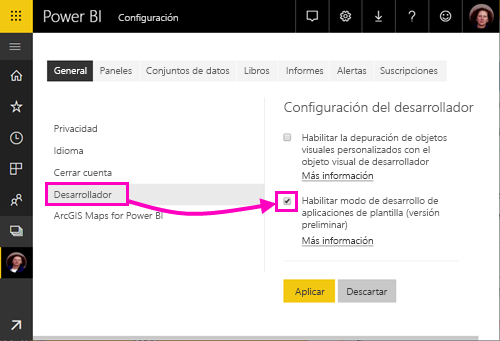
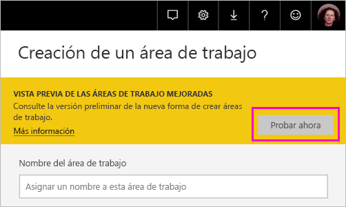
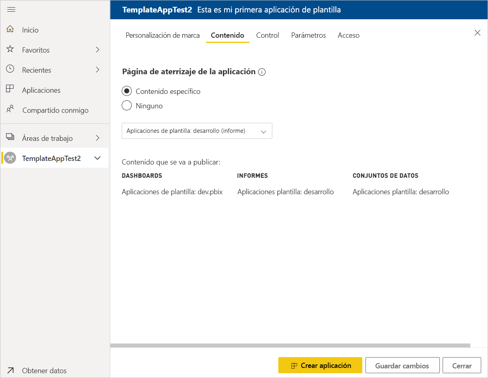
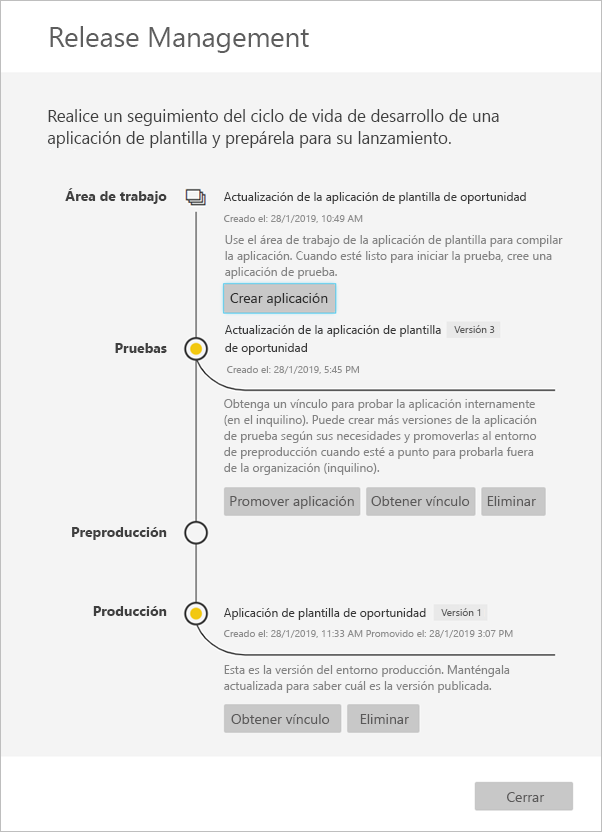

# Creación de una aplicación de plantilla en Power BI (versión preliminar)

Las nuevas *aplicaciones de plantilla* de Power BI permiten a los asociados de Power BI crear aplicaciones de Power BI con poca o ninguna codificación, e implementarlas en cualquier cliente de Power BI.  Este artículo contiene instrucciones paso a paso para crear una aplicación de plantilla de Power BI.

Si puede crear paneles e informes de Power BI, puede convertirse en un *desarrolladores de aplicaciones de la plantilla* y compila y empaqueta contenido analítico en un *aplicación*. Puede implementar la aplicación en otros inquilinos de Power BI a través de cualquier plataforma disponible, como AppSource, o si se utiliza en su propio servicio web. Como un generador tiene la posibilidad de crear un paquete de análisis protegido para su distribución.

Los administradores de inquilinos de Power BI controlan quién de la organización puede crear aplicaciones de plantilla y quién puede instalarlas. Aquellos usuarios que están autorizados pueden instalar la aplicación de la plantilla, a continuación, modificarlo y distribuirla a los consumidores de Power BI en su organización.

## Requisitos previos

Estos son los requisitos para crear una aplicación la plantilla:  

- Una [licencia de Power BI Pro](service-self-service-signup-for-power-bi.md).
- Una [instalación de Power BI Desktop](desktop-get-the-desktop.md) (opcional).
- Familiaridad con la [conceptos básicos de Power BI](service-basic-concepts.md)
- Permisos para crear una aplicación de plantilla. Vea la [configuración de aplicaciones de plantilla en el portal de administración](service-admin-portal.md#template-apps-settings-preview) de Power BI para obtener más información.

## Habilitación del modo de desarrollador de aplicaciones

Para crear una aplicación de plantilla que se pueda distribuir a otros inquilinos de Power BI, tendrá que estar en modo de desarrollador de aplicaciones. En caso contrario, simplemente se crea una aplicación para los consumidores de Power BI en su propia organización.

1. Abra el servicio Power BI en un explorador.
2. Vaya a **Configuración** > **General** > **Desarrollador** > **Habilitar modo de desarrollo de aplicaciones de plantilla**.

    

    Si no ve esta opción, póngase en contacto con el administrador de Power BI para que le conceda [permisos para el desarrollo de aplicaciones de plantilla](service-admin-portal.md#template-apps-settings-preview) en el portal de administración.

3. Seleccione **Aplicar**.

## Creación del área de trabajo de la aplicación de plantilla

Para crear una aplicación de plantilla que se pueda distribuir a otros inquilinos de Power BI, tendrá que crearla en una de las nuevas áreas de trabajo de la aplicación.

1. En el servicio Power BI, haga clic en **Áreas de trabajo** > **Crear área de trabajo de la aplicación**.

    

2. En **Crear un área de trabajo**, en **Vista previa de las áreas de trabajo mejoradas**, haga clic en **Intentar ahora**.

    

3. Proporcione un nombre, una descripción (opcional) y un logotipo de imagen (opcional) para el área de trabajo de la aplicación.

4. Active **Desarrollar una aplicación de plantilla**.

    

5. Seleccione **Guardar**.
>[!NOTE]
>Necesita permisos de administrador de Power BI para promocionar las aplicaciones de la plantilla.

## Creación del contenido en la plantilla de aplicación

Como sucede con un área de trabajo de la aplicación estándar de Power BI, el siguiente paso consiste en crear el contenido en el área de trabajo.  En esta versión de versión preliminar de las aplicaciones de plantilla, solo se admite uno de cada tipo: un conjunto de datos, un informe y un panel.

- [Cree el contenido de Power BI](power-bi-creator-landing.md) en el área de trabajo de la aplicación.

Si va a usar parámetros en Power Query, asegúrese de que tengan tipos bien definidos (por ejemplo, Texto). Los tipos Todo y Binario no se admiten.

En [Sugerencias para la creación de aplicaciones de plantilla en Power BI (versión preliminar)](service-template-apps-tips.md) se proporcionan sugerencias que puede tener en cuenta al crear informes y paneles para la aplicación de plantilla.

## Creación de la aplicación de plantilla de prueba

Ahora que tiene contenido en el área de trabajo, está listo para empaquetarlo en una aplicación de plantilla. El primer paso consiste en crear una aplicación de plantilla de prueba, accesible únicamente desde dentro de la organización en su inquilino.

1. En el área de trabajo de la aplicación de plantilla, haga clic en **Crear aplicación**.

    

    En este caso, que rellene las opciones de creación adicionales para la aplicación de la plantilla, en cinco categorías:

    **Personalización de marca**

    
    - Nombre de aplicación
    - Descripción
    - Sitio de soporte técnico (vínculo se presenta en la información de la aplicación después de redistribuir la aplicación como aplicación de la organización de la plantilla)
    - Logotipo de la aplicación (límite de tamaño de archivo de 45 K, relación de aspecto 1:1, .png .jpg .jpeg formatos)
    - Color de tema de la aplicación

    **Contenido**

    **Página de inicio de la aplicación:** Definir un informe o panel a la página de aterrizaje de la aplicación, use una página de aterrizaje que le dará la impresión de la derecha:

    

    **Control**

    Establecer límites y restricciones que tendrán los usuarios de la aplicación con el contenido de la aplicación. Puede usar este control para proteger la propiedad intelectual de la aplicación.

    

    >[!NOTE]
    >Exportar a formato .pbix siempre está bloqueado para los usuarios que instalen la aplicación.

    **Parámetros**

    Use esta categoría para administrar el comportamiento del parámetro cuando se conecta a orígenes de datos. Obtenga más información sobre [crear parámetros de consulta](https://powerbi.microsoft.com/blog/deep-dive-into-query-parameters-and-power-bi-templates/).

    
    - **Valor**: valor de parámetro predeterminado.
    - **Requiere**: úsela para requerir el instalador para un parámetro específico del usuario de entrada.
    - **Bloqueo**: Bloqueo impide que el instalador de actualización de un parámetro.
    - **Estática**: Habilitar en caso de que la aplicación contiene *sólo* datos de ejemplo. Al seleccionar **estático**, el Asistente para instalación no preguntar a los usuarios para conectarse a un origen de datos.

    **Acceso** en la fase de prueba, decidir qué otras personas de su organización pueden instalar y probar la aplicación. No se preocupe, siempre puede volver y cambiar esta configuración más adelante (configuración no afecta a acceso de la aplicación distribuida de la plantilla).

2. Haga clic en **Crear aplicación**.

    Verá un mensaje que indica que la aplicación de prueba está lista, con un vínculo para copiar y compartir con los evaluadores de la aplicación.

    

    También ha realizado el primer paso del proceso de administración de versiones, que se muestra a continuación.

## Administración de la versión de la plantilla de aplicación

Antes de publicar esta aplicación de plantilla, querrá asegurarse de que esté lista. Power BI ha creado el panel de administración de versiones, donde puede realizar el seguimiento e inspeccionar la ruta de versiones completa de la aplicación. También puede desencadenar la transición de una etapa a otra. Las fases comunes son:

- Generar la aplicación de prueba: solo para realizar pruebas en la organización.
- Promover el paquete de prueba a la fase de preproducción: para realizar pruebas fuera de la organización.
- Promover el paquete de preproducción a producción: la versión de producción.
- Eliminar todos los paquetes o comenzar de nuevo desde la fase anterior.

La dirección URL no cambia cuando alterna entre las fases de versión. La promoción no afecta a la propia dirección URL.

Analicemos las fases:

1. En el área de trabajo de la aplicación de plantilla, haga clic en **Release Management** (Administración de versiones).

    

2. Haga clic en **Crear aplicación**.

    Si anteriormente ha creado la aplicación de prueba en **Creación de la aplicación de plantilla de prueba**, el punto de color amarillo junto a **Pruebas** ya está rellenado y no es necesario hacer clic en **Crear aplicación** aquí. Si hace clic, retrocederá al proceso de creación de la aplicación de plantilla.

3. Haga clic en **Obtener vínculo**.

    

4. Para probar la experiencia de instalación de la aplicación, copie el vínculo de la ventana de notificación y péguelo en otra ventana del explorador.

    Desde aquí, seguirá los mismos pasos que seguirán los clientes. Vea [Instalación y distribución de aplicaciones de plantilla en la organización](service-template-apps-install-distribute.md) para obtener su versión.

5. En el cuadro de diálogo, haga clic en **Instalar**.

    Cuando la instalación se realice correctamente, verá una notificación en la que se indica que la nueva aplicación está lista.

6. Haga clic en **Ir a la aplicación**.
7. En **Empezar a trabajar con la nueva aplicación**, verá la aplicación como la ven los clientes.

    
8. Haga clic en **Explorar la aplicación** para comprobar la aplicación de prueba con los datos de ejemplo.
9. Para realizar cambios, vuelva a la aplicación en el área de trabajo original. Actualice la aplicación de prueba hasta que esté satisfecho.
10. Cuando esté listo para promover su aplicación al entorno de preproducción para otras pruebas fuera de su inquilino, vuelva a la **Release Management** panel y seleccione **aplicación promover**. 

    

    >[!NOTE]
    > Cuando se promueve la aplicación esté públicamente disponible fuera de su organización.

11. Haga clic en **Promover** para confirmar la elección.
12. Copie esta nueva dirección URL para compartir fuera del inquilino con el fin de realizar pruebas. Este vínculo también es la que enviar para comenzar el proceso de distribución de la aplicación en AppSource mediante la creación de un [nueva oferta de Cloud Partner Portal](https://docs.microsoft.com/azure/marketplace/cloud-partner-portal/power-bi/cpp-publish-offer). Enviar vínculos de entorno de preproducción a Cloud Partner Portal. Después de la aplicación se aprueba y recibirá notificación de que está publicada en AppSource, a continuación, puede promover este paquete a producción en Power BI.
13. Cuando la aplicación esté lista para producción o para compartirla a través de AppSource, vuelva al panel **Release Management** y haga clic en **Promover aplicación** junto a **Preproducción**.
14. Haga clic en **Promover** para confirmar la elección.

    Ahora la aplicación está en producción, lista para su distribución.

    

Para hacer que la aplicación esté disponible a miles de usuarios de Power BI en todo el mundo, le animamos a enviarla a AppSource. Vea [Oferta de aplicación de Power BI](https://docs.microsoft.com/azure/marketplace/cloud-partner-portal/power-bi/cpp-power-bi-offer) para obtener más información.

## Actualización de la aplicación

Ahora que la aplicación está en producción, puede empezar de nuevo en la fase de prueba, sin interrumpir la aplicación en producción.

1. En el panel **Release Management**, haga clic en **Crear aplicación**.
2. Vuelva a realizar el proceso de creación de la aplicación.
3. Después de establecer **Personalización de marca**, **Contenido**, **Control** y **Acceso**, vuelva a hacer clic en **Crear aplicación**.
4. Haga clic en **Cerrar** y vuelva a **Release Management**.

   Ahora verá que tiene dos versiones: la versión en producción, además de una nueva versión de prueba.

    

5. Cuando esté listo para promover su aplicación al entorno de preproducción para otras pruebas fuera de su inquilino, vuelva al panel de administración de versiones y seleccione **aplicación promover** junto a **pruebas**.
6. El vínculo ya está disponible, vuelva a enviarlo a Cloud Partner Portal siguiendo los pasos descritos en [actualización de la oferta de aplicación de Power BI](https://docs.microsoft.com/azure/marketplace/cloud-partner-portal/power-bi/cpp-update-existing-offer).

>[!NOTE]
>Promueva su aplicación a la fase de producción solo después de la aplicación está aprobada por Cloud Partner Portal y ha publicado con.

## Pasos siguientes

Vea cómo interactúan los clientes con la aplicación de plantilla en [Instalación, personalización y distribución de aplicaciones de plantilla en la organización](service-template-apps-install-distribute.md).

Vea [Oferta de aplicación de Power BI](https://docs.microsoft.com/azure/marketplace/cloud-partner-portal/power-bi/cpp-power-bi-offer) para obtener información sobre cómo distribuir la aplicación.
