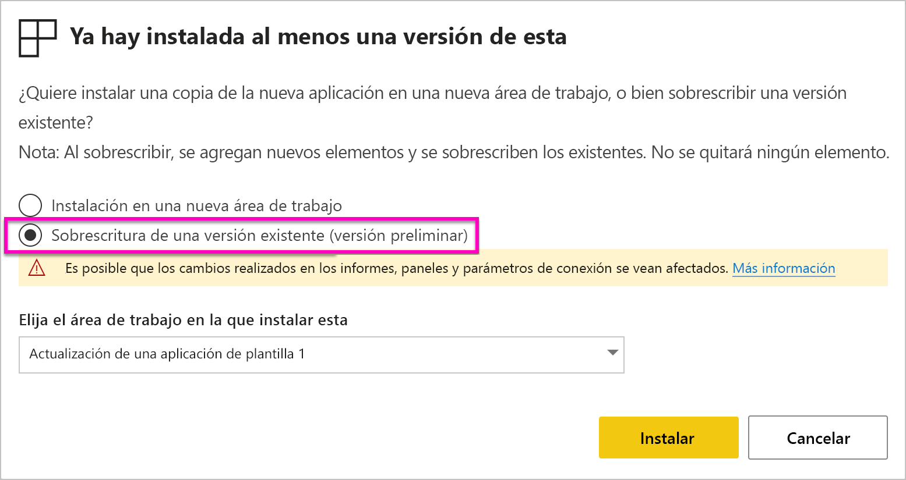
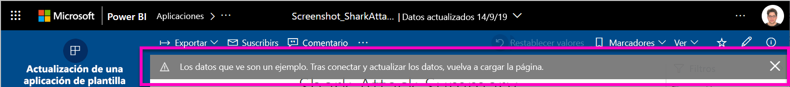

# Instalación y distribución de aplicaciones de plantilla en la organización: Power BI

¿Es un analista de Power BI? Si es así, este artículo explica cómo instalar *aplicaciones de plantilla* para conectarse a muchos de los servicios que usa para dirigir su negocio, como Salesforce, Microsoft Dynamics y Google Analytics. Puede modificar los paneles e informes para satisfacer las necesidades de su organización y distribuirlos después a sus compañeros de trabajo como una *aplicación*. 

Si está interesado en crear aplicaciones de plantilla para distribuirlas usted mismo, vea [Creación de una plantilla de aplicación en Power BI](service-template-apps-create.md). Los asociados de Power BI pueden crear aplicaciones de Power BI con poca o ninguna codificación e implementarlas en los clientes de Power BI. 

## Requisitos previos  

Estos son los requisitos para instalar, personalizar y distribuir una aplicación de plantilla: 

- Una [licencia de Power BI Pro](service-self-service-signup-for-power-bi.md).
- Familiaridad con los [conceptos básicos de Power BI](service-basic-concepts.md).
- Vínculo de instalación válido del creador de la aplicación plantilla o AppSource. 
- Permisos para instalar aplicaciones de plantilla. 

## Instalación de una aplicación de plantilla

Es posible que reciba un vínculo a una aplicación de plantilla. En caso contrario, puede buscar una que le interese en AppSource. En cualquier caso, después de la instalación, puede modificarla y distribuirla a su propia organización.

### Búsqueda en AppSource desde un explorador

En un explorador, haga clic en este vínculo para abrir AppSource filtrado por las aplicaciones de Power BI:

- https://appsource.microsoft.com/marketplace/apps?product=power-bi

### Búsqueda en AppSource desde el servicio Power BI

1. En el panel de navegación del servicio Power BI, haga clic en **Aplicaciones** > **Obtener aplicaciones**.

    

2. En AppSource, haga clic en **Aplicaciones**.

    

3. Examine o busque la aplicación, y después haga clic en **Obtenerla ahora**.

4. En el cuadro de diálogo, haga clic en **Instalar**.

     Si tiene una licencia de Power BI Pro, la aplicación se instala con su área de trabajo asociada. La aplicación se personaliza en el área de trabajo asociada.

    Cuando la instalación se realice correctamente, verá una notificación en la que se indica que la nueva aplicación está lista.
4. Haga clic en **Ir a la aplicación**.
5. En **Empezar a trabajar con la nueva aplicación**, seleccione una de las tres opciones:

    

    - **Explorar la aplicación**: exploración básica de datos de ejemplo. Comience aquí para obtener la apariencia de la aplicación. 
    - **Conectar datos**: cambie el origen de datos de los datos de ejemplo al suyo propio. Puede volver a definir los parámetros de conjunto de datos y las credenciales del origen de datos. Vea [Limitaciones conocidas](service-template-apps-tips.md#known-limitations) en el artículo sobre sugerencias para aplicaciones de plantilla. 
    - **Ir a área de trabajo** (opción más avanzada): puede realizar cualquier cambio permitido por el desarrollador de la aplicación.

    O bien, omita este cuadro de diálogo y acceda a un área de trabajo asociada directamente a través de **Áreas de trabajo** en el panel de navegación.
    >[!NOTE]
    >Instalación de una aplicación de plantilla instalada tanto en una *aplicación de organización* como en una *área de trabajo*. Obtenga más información sobre la [distribución de aplicaciones en Power BI](service-create-distribute-apps.md).
 
6. Antes de compartirla con lo compañeros de trabajo, le interesará conectarse a sus propios datos. También querrá modificar el informe o el panel para que funcione para la organización. Además, en este momento puede agregar otros informes o paneles.

   Si selecciona un vínculo de instalación de una aplicación que no figure en AppSource, se le mostrará el cuadro de diálogo de validación, en el que deberá confirmar su elección.

   

   >[!NOTE]
   >Para instalar aplicaciones de la plantilla que no figuren en AppSource, deberá solicitar permiso al administrador. Vea la [configuración de aplicaciones de plantilla en el portal de administración](service-admin-portal.md#template-apps-settings) de Power BI para obtener más información.

## Personalización y publicación de la aplicación

Después de actualizar la aplicación para la organización, está listo para publicarla. Los pasos son los mismos que para publicar cualquier otra aplicación.

1. Cuando haya terminado la personalización, en la lista de áreas de trabajo seleccione **Actualizar aplicación** en la esquina superior derecha.  

    

2. En **Detalles**, puede modificar el color de fondo y la descripción.

   

3. En **Navegación**, puede usar el nuevo generador de navegación de la aplicación o seleccionar el panel o el informe para la página de aterrizaje. Para obtener más detalles, consulte [Diseño de la experiencia de navegación](service-create-distribute-apps.md#design-the-navigation-experience).

   

4. En **Acceso**, conceda acceso a usuarios concretos o a toda la organización.  

   

5. Haga clic en **Actualizar aplicación**. 

6. Una vez publicada correctamente, puede copiar el vínculo y compartirlo con los usuarios a quienes haya proporcionado acceso. Si lo ha compartido con ellos, también la verán en la pestaña **Mi organización** de AppSource.

## Actualización de una aplicación de plantilla

Los creadores de aplicaciones de plantilla pueden publicar nuevas versiones a través de AppSource o de un vínculo directo. Al hacerlo, puede actualizar la aplicación de plantilla al volver a instalar la aplicación con la misma versión o una más reciente.

  >[!NOTE]
  >Al instalar una nueva versión, se sobrescriben los cambios realizados en los informes y paneles. Para conservar los informes y paneles actualizados, puede guardarlos con un nombre o ubicación diferentes antes de instalarlos.

- **Sobrescritura de una versión existente:** sobrescribe el área de trabajo existente con la versión actualizada de la aplicación de plantilla.

   

- **Instalación en una nueva área de trabajo:** instala una versión nueva del área de trabajo y la aplicación que necesita volver a configurar.

### Comportamiento de sobrescritura

* Al sobrescribir, se actualizan los informes, los paneles y el conjunto de datos dentro del *área de trabajo*, no de la aplicación. La sobrescritura no cambia la navegación, la configuración y el permiso de la aplicación.
* Después de actualizar el área de trabajo, debe *actualizar la aplicación* para aplicar los cambios del área de trabajo a la aplicación de la organización.
* La sobrescritura mantiene los parámetros y la autenticación configurados. Después de la actualización, se inicia una actualización automática del conjunto de datos. Durante ese tiempo, la aplicación, los informes y los paneles de la organización presentan la experiencia de *datos de ejemplo*.
  
* Al sobrescribir siempre se muestran datos de ejemplo hasta que se completa la actualización. Si el autor de la aplicación de plantilla ha realizado cambios en el conjunto de datos o en los parámetros, los usuarios del área de trabajo y la aplicación seguirán viendo la experiencia de *datos de ejemplo*.
* Al sobrescribir nunca se eliminan los informes o paneles *nuevos* que haya agregado al área de trabajo. Sobrescribe los informes y paneles originales con los cambios del autor original.

>[!IMPORTANT]
>Recuerde [actualizar la aplicación](#customize-and-publish-the-app) después de sobrescribir para aplicar los cambios en los informes y el panel de los usuarios de la aplicación de la organización.

## Pasos siguientes

[Creación de áreas de trabajo con sus compañeros en Power BI](service-create-workspaces.md)
