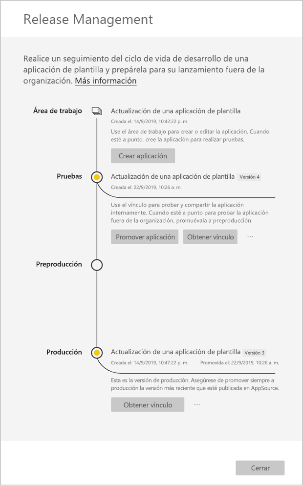

# Actualización, eliminación y extracción de una aplicación de plantilla

Ahora que la aplicación está en producción, puede empezar de nuevo en la fase de prueba, sin interrumpir la aplicación en producción.
## Actualización de la aplicación

1. En el panel **Release Management**, haga clic en **Crear aplicación**.
2. Vuelva a realizar el proceso de creación de la aplicación.
3. Después de establecer **Personalización de marca**, **Contenido**, **Control** y **Acceso**, vuelva a hacer clic en **Crear aplicación**.
4. Haga clic en **Cerrar** y vuelva a **Release Management**.

   Ahora verá que tiene dos versiones: la versión en producción, además de una nueva versión de prueba.

    

5. Cuando esté listo para promover la aplicación al entorno de preproducción para realizar más pruebas fuera del inquilino, vuelva al panel Release Management y seleccione **Promover aplicación** junto a **Pruebas**.
6. El vínculo ya está disponible. Vuelva a enviarlo a Cloud Partner Portal según los pasos descritos en [Actualizar una oferta de aplicación de Power BI](https://docs.microsoft.com/azure/marketplace/cloud-partner-portal/power-bi/cpp-update-existing-offer).
7. En CPP debe **publicar** su oferta de nuevo, y también validarla.

>[!NOTE]
>Solo debe promover la aplicación a la fase de producción después de que la aplicación sea aprobada por Cloud Partner Portal y la haya publicado.

## Extracción del área de trabajo
Revertir a la versión anterior de una aplicación de la plantilla es más fácil que nunca con la funcionalidad de extracción. Los pasos siguientes extraerán una versión específica de la aplicación a partir de varias fases de publicación en una nueva área de trabajo:

1. En el panel de administración de versiones, presione más **(...)**  y, a continuación, **Extraer**.

     
2. En el cuadro de diálogo, escriba el nombre del área de trabajo extraída. Se agregará una nueva área de trabajo.

Se restablece el nuevo control de versiones del área de trabajo y puede continuar desarrollando y distribuyendo la aplicación de plantilla desde el área de trabajo recién extraída.

## Eliminación de una versión de la aplicación de plantilla
El área de trabajo de la aplicación de plantilla es el origen de una aplicación de plantilla distribuida activa. Para proteger a los usuarios de la aplicación de la plantilla, no es posible eliminar un área de trabajo sin quitar primero todas las versiones de la aplicación creada en el área de trabajo.
La eliminación de una versión de la aplicación también elimina la dirección URL de la aplicación que ya no funcionará.

1. En el panel de administración de versiones, seleccione los puntos suspensivos **(...)** y, a continuación, **Eliminar**.
 
 

>[!NOTE]
>Asegúrese de no eliminar la versión de la aplicación que están utilizando los clientes o **AppSource** o ya no funcionará.

## Pasos siguientes

Vea cómo interactúan los clientes con la aplicación de plantilla en [Instalación, personalización y distribución de aplicaciones de plantilla en la organización](service-template-apps-install-distribute.md).

Vea [Oferta de aplicación de Power BI](https://docs.microsoft.com/azure/marketplace/cloud-partner-portal/power-bi/cpp-power-bi-offer) para obtener información sobre cómo distribuir la aplicación.
