# Inicio rápido: Moverse por el servicio Power BI

Ahora que ya conocemos los conceptos básicos de Power BI, echemos un vistazo al **servicio Power BI**. Tal y como se ha mencionado anteriormente, puede que una persona de su equipo dedique todo su tiempo a **Power BI Desktop** para combinar datos y elaborar informes para otros usuarios, mientras que otro lo dedique plenamente a usar el servicio Power BI, sea para ver el contenido creado por otros usuarios e interactuar con él (experiencia de **consumo**), sea para obtener datos y crear sus propios informes y paneles (experiencia de **creación**). En este inicio rápido importaremos datos de ejemplo y los usaremos para obtener información básica sobre el servicio Power BI. 
 
## Requisitos previos

- Si no está registrado para Power BI, [registrarse para obtener una versión de prueba gratuita](https://app.powerbi.com/signupredirect?pbi_source=web) antes de empezar.

- Leer los [conceptos básicos del servicio Power BI](service-basic-concepts.md).

## Abrir el servicio Power BI y obtener algunos datos
Vamos a obtener algunos datos de ejemplo para usarlos en nuestro recorrido por el servicio Power BI. Proporcionamos todo tipo de datos de ejemplo que se pueden explorar, pero esta vez nos vamos a quedar con los datos sobre comercios minoristas.    
1. Abra app.powerbi.com y seleccione el vínculo de **Ejemplos**. 

    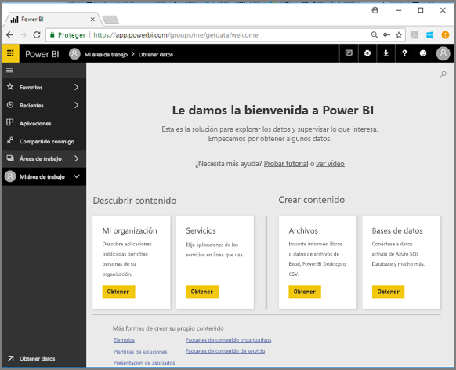

2. Seleccione **Ejemplo de análisis de minoristas > Conectar**.

    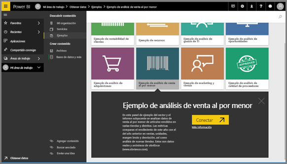

    El servicio Power BI importa el ejemplo y abre el panel. Los paneles son algo que diferencia el servicio Power BI de Power BI Desktop. El ejemplo incluye también un informe y un conjunto de datos, en los que nos detendremos más adelante.

    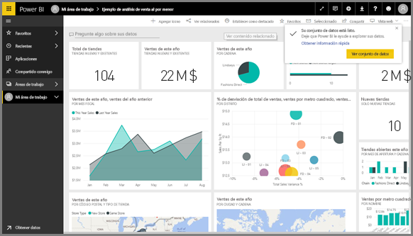

Vea cómo Amanda le presenta la experiencia de navegación del servicio Power BI.  A continuación, siga las instrucciones paso a paso que aparecen debajo del vídeo para explorarlo usted mismo.

<iframe width="560" height="315" src="https://www.youtube.com/embed/G26dr2PsEpk" frameborder="0" allowfullscreen></iframe>

## Ver el contenido (paneles, informes, libros, conjuntos de datos, áreas de trabajo, aplicaciones)
Para comenzar, vamos a examinar cómo se organiza el contenido básico (paneles, informes, conjuntos de datos, libros). El contenido se muestra dentro del contexto de un área de trabajo. En este momento, solo hay un área de trabajo que se llama **Mi área de trabajo**. En Mi área de trabajo se almacena todo el contenido del que se es propietario. Puede considerarla como su espacio aislado o área de trabajo para su propio contenido. Puede compartir el contenido de Mi área de trabajo con colegas. En Mi área de trabajo, el contenido está organizado en cuatro pestañas: Paneles, Informes, Libros y Conjuntos de datos.

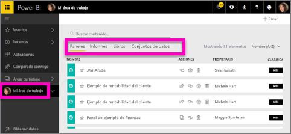

Seleccione un área de trabajo en el panel de navegación izquierdo y las pestañas correspondientes al contenido asociado (paneles, informes, libros y conjuntos de datos) rellenarán el lienzo de Power BI a la derecha.

Si es un usuario nuevo, solo verá un área de trabajo, **Mi área de trabajo**.

Dentro de esas pestañas (también conocidas como *vistas de contenido*), verá información sobre el contenido, así como las acciones que puede realizar en relación con ese contenido.  Por ejemplo, en la pestaña Paneles puede, entre otras muchas cosas, abrir un panel, compartir, eliminar, buscar, crear contenido y ordenar.

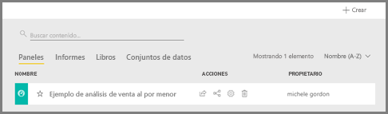

Abra el panel; para ello, seleccione el nombre correspondiente.

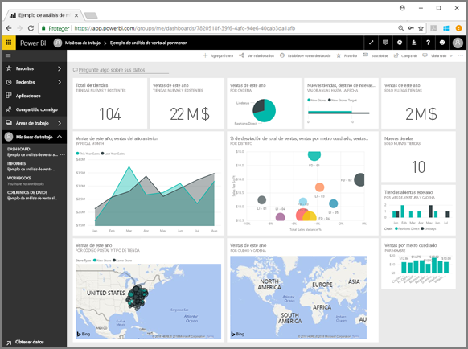

## Marcar un panel y un informe como favorito
**Favoritos** le permite acceder rápidamente al contenido más importante para usted.  

1. Con el panel abierto, seleccione **Favorito** en la esquina superior derecha.
   
   
   
   **Favorito** cambia a **Quitar de Favoritos** y el icono de estrella se convierte en amarillo.
   
   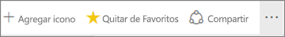

2. Para ver una lista de todo el contenido que agregó como favorito, en el panel de navegación izquierdo, seleccione la flecha situada a la derecha de **Favoritos**. Dado que el panel de navegación izquierdo es una característica permanente del servicio Power BI, tendrá acceso a esta lista desde cualquier parte del servicio Power BI.
   
    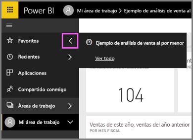
   
    Por ahora tenemos uno solo favorito. Los favoritos pueden ser paneles, informes o aplicaciones.  

1. Otra forma para marcar un panel o un informe como favorito es desde la pestaña de área de trabajo **Paneles** o **Informes**.  Abra la pestaña **Informes** y seleccione el icono de estrella que hay a la izquierda del nombre del informe.
   
   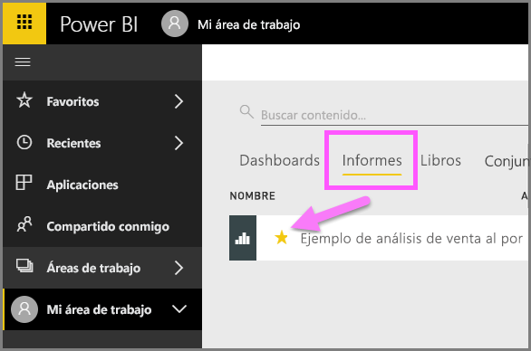

3. Abra el *panel* **Favoritos**; para ello, seleccione **Favoritos** en el panel de navegación izquierdo o bien el icono de estrella .
   
   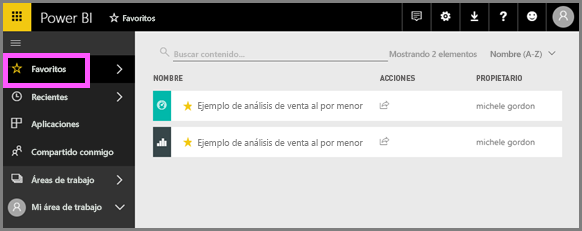
   
   Ahora tendremos dos favoritos: un panel y un informe. Desde aquí podrá abrirlo, buscar, quitarlo de Favoritos o compartirlo con sus compañeros.

4. Seleccione el nombre del informe para abrirlo en el editor de informes.

    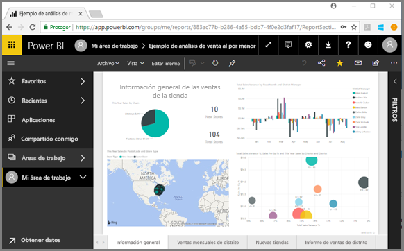

Para obtener más información, consulte [Favoritos](service-dashboard-favorite.md).

## Buscar el contenido más reciente

1. Al igual que sucedía con Favoritos, puede ver rápidamente el último contenido al que ha tenido acceso desde cualquier parte del servicio Power BI. Solo tiene que seleccionar la flecha situada junto a **Recientes** en el panel de navegación izquierdo.

   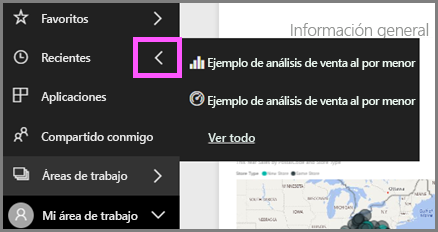

    En el menú flotante, seleccione contenido para abrirlo.

2. Hay veces en que no queremos abrir contenido reciente, sino ver información o realizar otra acción, como compartir algo, ejecutar Insights o exportar a Excel. En estos casos, abra el panel **Recientes**; para ello, seleccione **Recientes** o el icono correspondiente en el panel de navegación izquierdo. En caso de tener más de un área de trabajo, esta lista puede incluir contenido de todas las áreas de trabajo.

   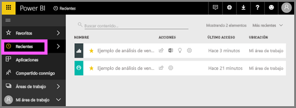

Para más información, consulte [Contenido reciente en el servicio Power BI](service-recent.md)

### Buscar y ordenar contenido
La vista de contenido facilita la búsqueda, el filtrado y la ordenación del contenido. Para buscar un panel, un informe o un libro, escriba en el área de búsqueda. Power BI filtra solo el contenido que contiene la cadena de búsqueda como parte del nombre.

Dado que solo tenemos un ejemplo, la búsqueda y la ordenación no son necesarias.  En cambio, si tuviéramos listas largas de paneles, informes, libros y conjuntos de datos, veríamos que la búsqueda y la ordenación son extremadamente útiles.

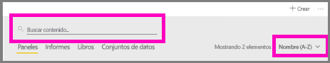

También puede ordenar el contenido por nombre o propietario.  

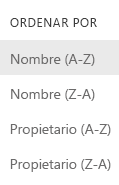

Para más información, consulte [Navegación en Power BI: buscar, ordenar y filtrar](service-navigation-search-filter-sort.md)

## Pasos siguientes

> [!div class="nextstepaction"]
> [Vista de lectura y vista de edición de informes del servicio Power BI](./service-reading-view-and-editing-view.md)