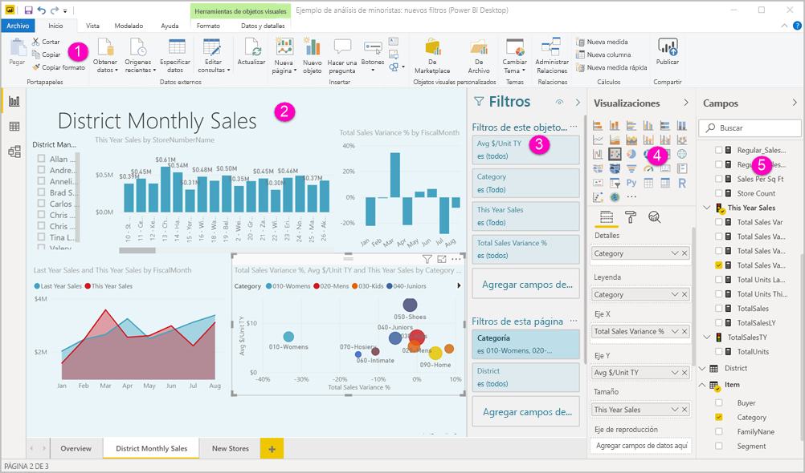
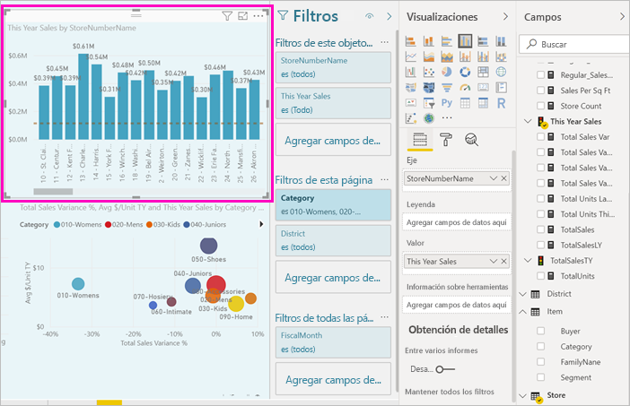
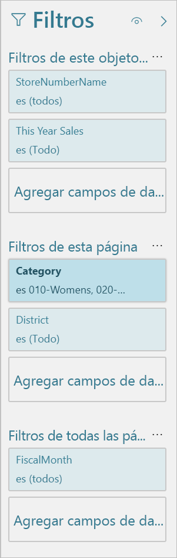
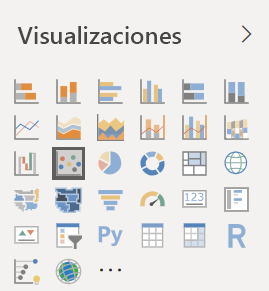
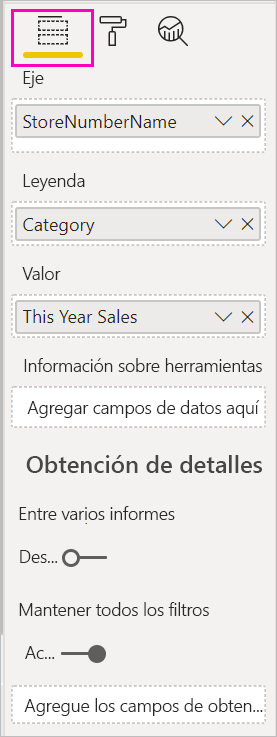
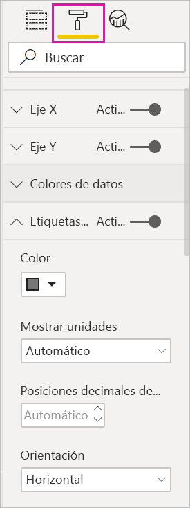
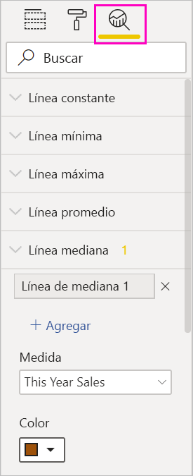
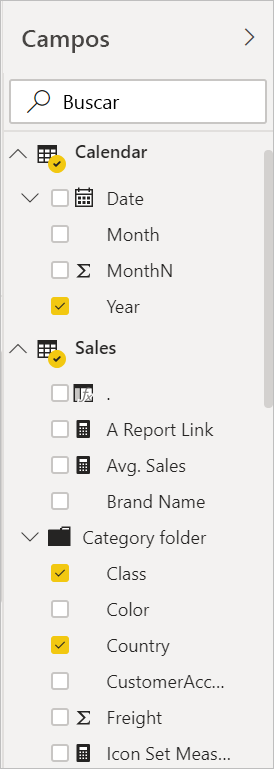

# Paseo por el editor de informes de Power BI

En Power BI Desktop y el servicio Power BI, el *editor de informes* es donde se diseñan los informes que ven los consumidores, con gráficos, tablas, mapas y otros objetos visuales. Es similar en los dos entornos. Normalmente la creación de un informe empieza en Power BI Desktop. Después, se publica en el servicio Power BI, donde se puede seguir modificando. El servicio Power BI es también donde crea los paneles basados en sus informes.

Después de crear sus paneles e informes, los distribuye a sus usuarios de informes. En función de cómo los comparta, los usuarios finales pueden interactuar con ellos en la vista de lectura del servicio Power BI, pero no editarlos. Obtenga más información sobre [qué pueden hacer los usuarios de informes en el servicio Power BI](consumer/end-user-reading-view.md). 

En este vídeo se muestra el editor de informes en Power BI Desktop. En este artículo también se muestra el editor de informes en Power BI Desktop. 

<iframe width="560" height="315" src="https://www.youtube.com/embed/IkJda4O7oGs" frameborder="0" allowfullscreen></iframe>

En el servicio Power BI, el editor de informes solo está disponible en la vista de edición. Para abrir un informe en la vista de edición, debe ser el propietario o el creador del informe, o bien ser colaborador en el área de trabajo donde se hospeda el informe.

El editor de informes de Power BI se divide en varias secciones principales:  

1. Panel de navegación superior
1. Lienzo del informe
1. Panel Filtros
1. Panel Visualizaciones
1. Panel Campos

## 1. Panel de navegación superior
Las acciones disponibles desde el panel de navegación superior son numerosas y se agregan otras nuevas de forma constante. Para obtener información sobre una acción concreta, use la tabla de contenido de la documentación de Power BI o el cuadro de búsqueda.

## 2. El lienzo del informe
El lienzo del informe es donde se muestra el trabajo. Al utilizar los paneles Visualizaciones, Filtros y Campos para crear objetos visuales, estos se compilan y se muestran en el lienzo del informe. Cada pestaña de la parte inferior del lienzo representa una página del informe. Seleccione una pestaña para abrir esa página. 

## Paneles del editor de informes

Al abrir un informe por primera vez, verá tres paneles: Filtros, Visualizaciones y Campos. Los dos primeros paneles del lado izquierdo, Filtros y Visualizaciones, controlan la apariencia de las visualizaciones: el tipo, los colores, el filtrado y el formato. El último panel de la derecha, Campos, administra los datos subyacentes que se usan en las visualizaciones. El contenido mostrado en el editor de informes varía según las opciones seleccionadas en el lienzo de informe. 

Por ejemplo, al seleccionar un objeto visual individual como este gráfico de columnas:

**En el panel Filtros** se muestran todos los filtros del objeto visual, la página o todas las páginas. En este caso, hay filtros de nivel de página, pero no de nivel de objeto visual.

**En la parte superior del panel Visualización** se identifica el tipo de objeto visual en uso. En este ejemplo, un gráfico de columnas agrupadas. 

**La parte inferior del panel Visualizaciones** tiene tres pestañas:

 **Campos** muestra los campos en el objeto visual. Es posible que tenga que desplazarse hacia abajo para ver todos los detalles. En este gráfico se usan StoreNumberName (Nombre y número de tienda) y This Year Sales (Ventas de este año).

 **Formato** Para mostrar el panel de formato de la visualización seleccionada, seleccione el icono de rodillo de pintura.

 **Análisis** Para mostrar el panel Análisis, seleccione el icono de lupa.

**En el panel Campos** se enumeran todas las tablas disponibles en el modelo de datos. Al expandir una tabla, verá los campos que contiene. La marca de verificación de color amarillo indica que al menos un campo de esas tabla está en una visualización.

Siga leyendo para obtener más información sobre cada panel.

## 3. El panel Filtros
Utilice el panel Filtros para ver, establecer y modificar filtros persistentes en los informes en el nivel de página, informe, obtención de detalles y objetos visuales. Sí, se puede hacer el filtrado ad-hoc en las páginas de informe y en los objetos visuales mediante la selección de elementos de los objetos visuales o con herramientas como las segmentaciones. La ventaja de filtrar en el panel Filtros es que se guarda el estado de los filtros con el informe. 

El panel Filtros cuenta con otra característica muy útil: puede filtrar mediante un campo *que todavía no esté en uno de los objetos visuales del informe*. Vamos a explicarlo. Cuando se crea una visualización, Power BI agrega de forma automática todos los campos de la visualización al área de filtros de nivel de objetos visuales del panel Filtros. Si quiere establecer un filtro de objeto visual, de página, de obtención de detalles o de informe mediante un campo que no se use actualmente en la visualización, solo tiene que arrastrarlo a uno de los cubos de filtros.

La nueva experiencia de filtro ofrece más flexibilidad. Por ejemplo, puede dar formato a los filtros para que tengan un aspecto similar al del propio informe. También puede bloquear filtros u ocultarlos a sus usuarios de informes. 

Aprenda más sobre la [nueva experiencia de filtro](power-bi-report-filter.md).

## 4. Panel Visualizaciones

El panel Visualizaciones tiene cuatro secciones. Comenzaremos en la parte superior del panel.

Aquí es donde se selecciona un tipo de visualización. Los iconos pequeños muestran los distintos tipos de visualizaciones que puede crear. En la imagen anterior, se ha seleccionado el gráfico de burbujas. Si empieza a crear una visualización mediante la selección de campos sin seleccionar primero un tipo de visualización, Power BI lo elige de forma automática. Puede mantener la selección de Power BI o cambiar el tipo si selecciona otro icono.

Puede descargar visualizaciones personalizadas en Power BI Desktop. Sus iconos también se mostrarán en este panel. 

### Administración de los campos de una visualización

Los cubos (a veces llamados *listas*) de este panel varían en función del tipo de visualización seleccionada.  Por ejemplo, si ha seleccionado un gráfico de barras, verá Eje, Leyenda y Valores. Al seleccionar un campo o arrastrarlo hasta el lienzo, Power BI lo agrega a uno de los cubos.  También puede arrastrar campos desde la lista de Campos directamente a los cubos.  Algunos cubos están limitados a determinados tipos de datos.  Por ejemplo, **Valores** no aceptará campos no numéricos. Por tanto, si arrastra un campo **Categoría** al cubo **Valores**, Power BI lo cambia a **Recuento de Categoría**.

Para más información, vea [Incorporación de visualizaciones a un informe de Power BI](visuals/power-bi-report-add-visualizations-i.md).

Esta parte del panel también tiene opciones para controlar la [obtención de detalles](desktop-drillthrough.md) y el comportamiento de los filtros.

### Dar formato a los objetos visuales
Seleccione el icono del rodillo de pintura para mostrar la pestaña Formato. Las opciones disponibles dependerán del tipo de visualización seleccionada.

Las posibilidades de formato son numerosas.  Para más información, explore por su cuenta o consulte estos artículos:

* [Personalización de títulos, leyendas y fondos de visualizaciones](visuals/power-bi-visualization-customize-title-background-and-legend.md)
* [Formato de color](visuals/service-getting-started-with-color-formatting-and-axis-properties.md)
* [Personalizar las propiedades de los ejes X e Y](visuals/power-bi-visualization-customize-x-axis-and-y-axis.md)

### Agregar análisis a las visualizaciones
Seleccione el icono de lupa para mostrar el panel de análisis. Las opciones disponibles dependerán del tipo de visualización seleccionada.

Con el panel de análisis del servicio Power BI, puede agregar líneas de referencia dinámicas a visualizaciones y destacar las tendencias o información importantes. Para más información, vea [Panel Análisis en Power BI Desktop](desktop-analytics-pane.md).

## 5. El panel Campos
En el panel Campos se muestran las tablas, las carpetas y los campos de los datos que están disponibles para su uso con el fin de crear visualizaciones.

|  |  |
| --- | --- |
|  |<ul><li>Arrastre un campo a la página para iniciar una nueva visualización.  También puede arrastrar un campo a una visualización existente para agregar el campo a esa visualización.  </li> <li>Cuando se agrega una marca de verificación junto a un campo, Power BI agrega ese campo a la visualización activa (o nueva). Y también decide en qué cubo se va a colocar ese campo.  Por ejemplo, ¿el campo debe usarse como leyenda, eje o valor? Power BI realiza una mejor estimación y podrá moverlo desde ese cubo a otro si es necesario.   </li><li>En cualquier caso, cada campo seleccionado se agrega al panel Visualizaciones en el editor de informes.</li></ul> |

En Power BI Desktop, también tiene opciones para mostrar u ocultar campos, agregar cálculos, etc.

## Iconos de campo

Power BI usa varios iconos diferentes para indicar los tipos de campos de un informe. Cuando pueda reconocerlos, comprenderá mejor cómo actúan en diferentes objetos visuales. Estos son algunos de los más comunes.

|Icono  |Significado  |
|---------|---------|
|  | Carpeta en la lista de campos |
| | Campo numérico: los campos numéricos son agregados que se pueden sumar o promediar, por ejemplo. Los agregados se importan con los datos y se definen en el modelo de datos en el que se basa el informe. Para más información, consulte [Agregados en los informes de Power BI](service-aggregates.md). |
| | Columna calculada con un tipo de datos no numérico: columna no numérica que se crea con una fórmula de Expresiones de análisis de datos (DAX) que define los valores de la columna. Más información sobre las [columnas calculadas](desktop-calculated-columns.md). |
|     |   Columna calculada numérica: columna que se crea con una fórmula de Expresiones de análisis de datos (DAX) que define los valores de la columna. Más información sobre las [columnas calculadas](desktop-calculated-columns.md). |
| |  Medida: una medida tiene su propia fórmula codificada de forma rígida. No se puede cambiar el cálculo, por ejemplo, si es una suma, solo podrá ser una suma. Los valores no se almacenan en una columna. Se calculan sobre la marcha, únicamente en función de su ubicación en un objeto visual. Para más información, lea [Descripción de las medidas](desktop-measures.md). |
|     | Grupo de medida  |
| |      KPI: una indicación visual que comunica el progreso realizado para lograr un objetivo cuantificable. Más información sobre objetos visuales de [ Indicador clave de rendimiento (KPI)](visuals/power-bi-visualization-kpi.md) |
|     |  Jerarquía de campos: seleccione la flecha para ver los campos que componen la jerarquía.  Para más información, vea este vídeo de Power BI en YouTube sobre [cómo crear y trabajar con jerarquías](https://www.youtube.com/watch?v=q8WDUAiTGeU). |
|     | Datos geográficos: estos campos de ubicación se pueden usar para crear visualizaciones de mapa. |
|      | Campo de identidad: los campos con este icono son *campos únicos*, configurados para mostrar todos los valores, incluso si tienen duplicados. Por ejemplo, es posible que los datos tengan dos registros para dos personas distintas llamadas "Robin Smith", y cada uno se tratará de forma única. No se sumarán.   |
|   | Parámetro: establezca parámetros para que elementos de los informes y los modelos de datos (como un filtro de consulta, una referencia de origen de datos, una definición de medida, etc.) dependan de uno o más valores de parámetro. Para más información, vea esta entrada de blog de Power BI sobre los [parámetros de consulta](https://powerbi.microsoft.com/blog/deep-dive-into-query-parameters-and-power-bi-templates/). |
|  | Campo de fecha de calendario con una tabla de fechas integrada |

## Pasos siguientes
[Crear un informe](service-report-create-new.md)

Obtenga más información sobre los informes del [servicio Power BI](service-report-create-new.md), [Power BI Desktop](desktop-report-view.md) y las [aplicaciones móviles de Power BI](consumer/mobile/mobile-apps-view-phone-report.md).

[Conceptos básicos para los diseñadores de Power BI](service-basic-concepts.md)

¿Tiene más preguntas? [Pruebe la comunidad de Power BI](https://community.powerbi.com/)

