# Tutorial: Compilación de un modelo de Machine Learning en Power BI

En este tutorial, se usa **Automated Machine Learning** para crear y aplicar un modelo de predicción binaria en Power BI. Se incluyen instrucciones para crear un flujo de datos de Power BI y usar las entidades definidas en él para entrenar y validar un modelo de aprendizaje automático directamente en Power BI. A continuación, usaremos ese modelo para puntuar los datos nuevos y generar predicciones.

En primer lugar, creará un modelo de aprendizaje automático de predicción binaria para predecir la intención de compra de los compradores en línea según un conjunto de sus atributos de sesión en línea. Para este ejercicio se usa un conjunto de datos de aprendizaje automático de referencia. Después de entrenar un modelo, Power BI genera automáticamente un informe de validación en el que se explican los resultados del modelo. Luego, puede revisar el informe de validación y aplicar el modelo a los datos para su puntuación.

Este tutorial consta de los siguientes pasos:
> [!div class="checklist"]

> * Creación de un flujo de datos con los datos de entrada
> * Creación y entrenamiento de un modelo de aprendizaje automático
> * Revisión del informe de validación del modelo
> * Aplicación del modelo a una entidad de flujo de datos
> * Uso de la salida puntuada del modelo en un informe de Power BI

## Creación de un flujo de datos con los datos de entrada

La primera parte de este tutorial va dirigida a crear un flujo de datos con datos de entrada. Ese proceso conlleva algunos pasos, como se muestra en las secciones siguientes, que comienza con la obtención de datos.

### Obtener datos

El primer paso para crear un flujo de datos es tener preparados los orígenes de datos. En nuestro caso, se va usar un conjunto de datos de aprendizaje automático de un conjunto de sesiones en línea, algunas de las cuales culminaron en una compra. El conjunto de datos contiene un conjunto de atributos sobre estas sesiones, que se usarán para entrenar nuestro modelo.

Puede descargar el conjunto de datos del sitio web de UC Irvine. Para los fines de este tutorial, también está disponible en el siguiente vínculo: [online_shoppers_intention.csv](https://raw.githubusercontent.com/santoshc1/PowerBI-AI-samples/master/Tutorial_AutomatedML/online_shoppers_intention.csv).

### Creación de las entidades

Para crear las entidades en su flujo de datos, inicie sesión en el servicio Power BI y vaya a un área de trabajo de su capacidad dedicada que tenga habilitada la inteligencia artificial.

Si aún no tiene un área de trabajo, puede crear una; para ello, vaya a **Áreas de trabajo** en el menú de navegación del servicio Power BI y seleccione **Create workspace** (Crear área de trabajo) en la parte inferior del panel que aparece. Se abre un panel a la derecha para especificar los datos del área de trabajo. Escriba un nombre de área de trabajo y seleccione **Avanzado**. Confirme que el área de trabajo usa capacidad dedicada mediante el botón de radio, y que está asignada a una instancia de capacidad dedicada que tiene activada la versión preliminar de IA. Luego seleccione **Guardar**.

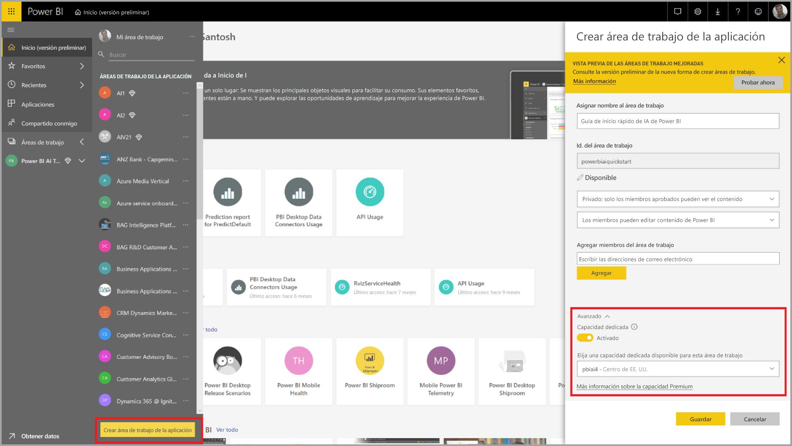

Después de crear el área de trabajo, puede seleccionar **Omitir** en la parte inferior derecha de la pantalla de bienvenida, tal como se muestra en la siguiente imagen.

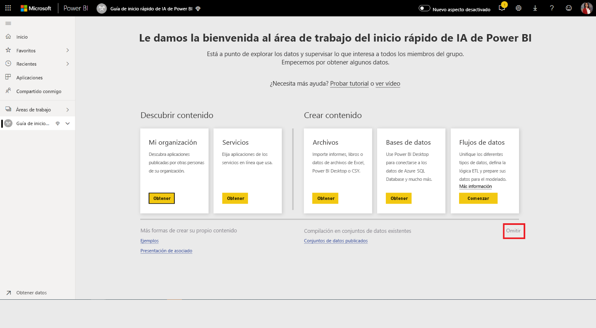

 Seleccione el botón **Crear** en la parte superior derecha del área de trabajo y, luego, **Flujo de datos**.

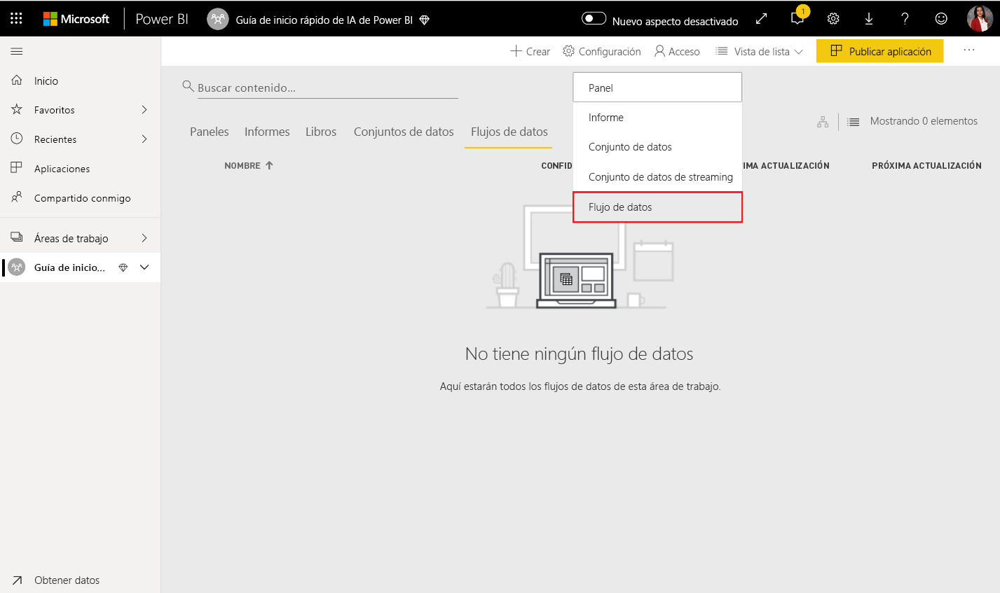

Seleccione **Agregar entidades nuevas**. Se inicia un editor de **Power Query** en el explorador.

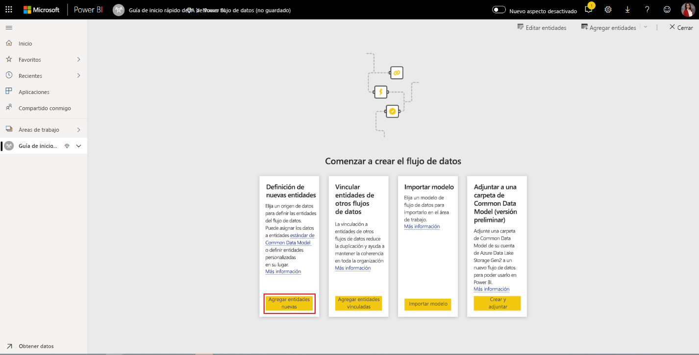

Seleccione **Text/CSV File** (Archivo de texto/CSV) como origen de datos, como se muestra en la imagen siguiente.

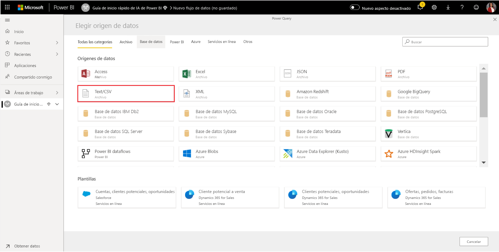

En la página **Conectarse a un origen de datos** que aparece a continuación, pegue el siguiente vínculo en _online_shoppers_intention.csv_ en el cuadro **File path or URL** (Ruta o dirección URL del archivo) y seleccione **Siguiente**.

`https://raw.githubusercontent.com/santoshc1/PowerBI-AI-samples/master/Tutorial_AutomatedML/online_shoppers_intention.csv`

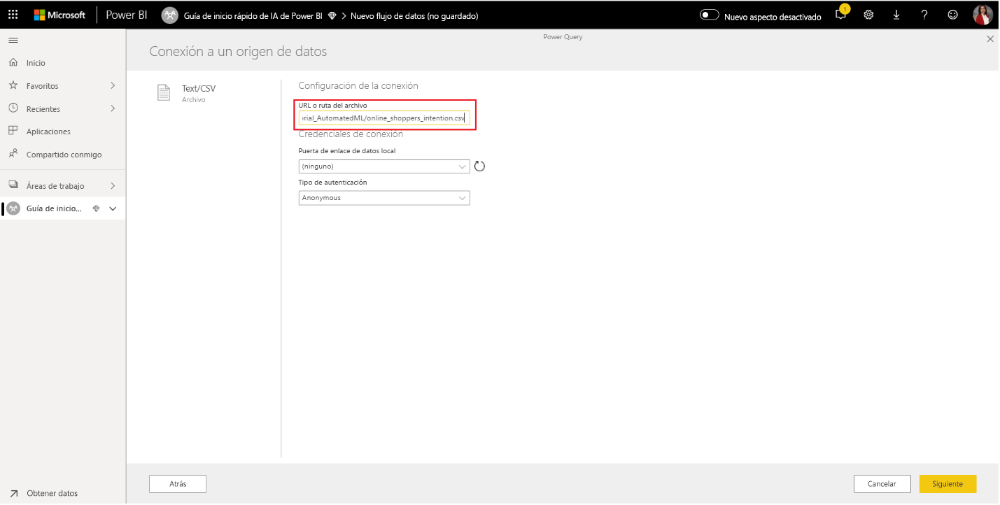

El Editor de Power Query muestra una versión preliminar de los datos del archivo CSV. Puede cambiar el nombre de la consulta por otro más descriptivo en el cuadro Nombre que se encuentra en el panel derecho. Por ejemplo, podría cambiar el nombre de la consulta por _Online Visitors_.

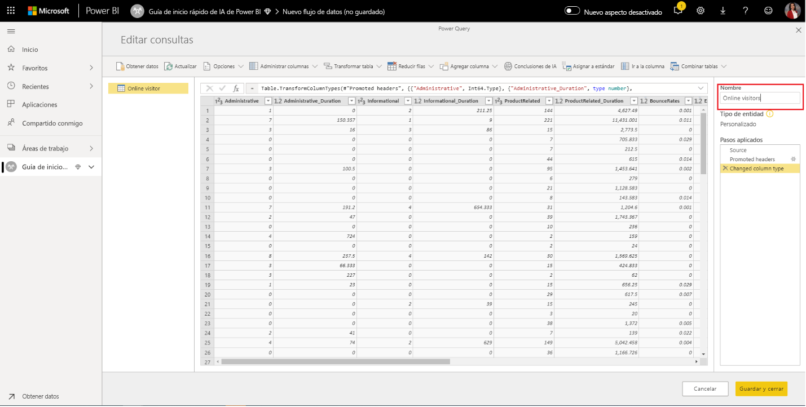

Power Query deduce automáticamente el tipo de las columnas. Para cambiar el tipo de columna, haga clic en el icono de tipo de atributo situado en la parte superior del encabezado de columna. En este ejemplo, el tipo de columna Revenue se cambia a True/False.

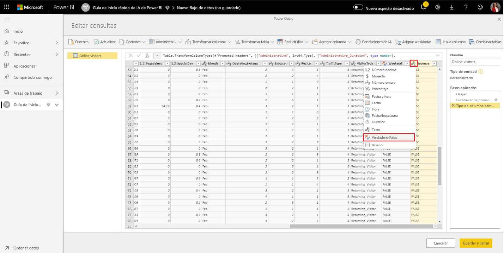

Seleccione el botón **Guardar y cerrar** para cerrar el editor de Power Query. Proporcione un nombre para el flujo de datos y seleccione **Guardar** en el cuadro de diálogo, como se muestra en la siguiente imagen.

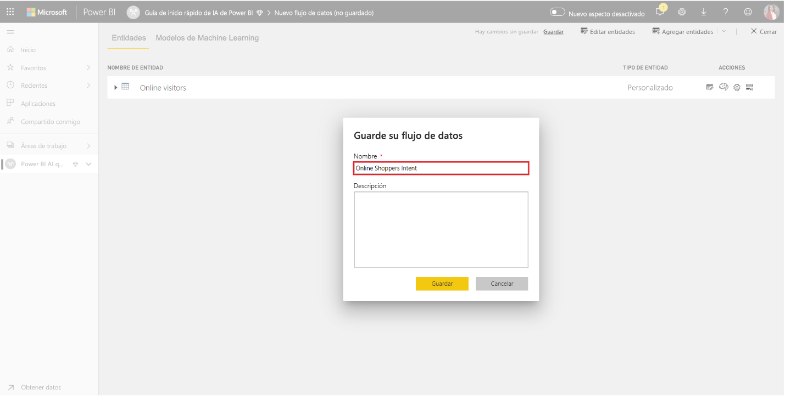

## Creación y entrenamiento de un modelo de aprendizaje automático

Para agregar un modelo de aprendizaje automático, seleccione el botón **Aplicar el modelo de ML** en la lista **Acciones** de la entidad base que contiene los datos de entrenamiento y la información de etiqueta y, luego, seleccione **Agregar un modelo de Machine Learning**.

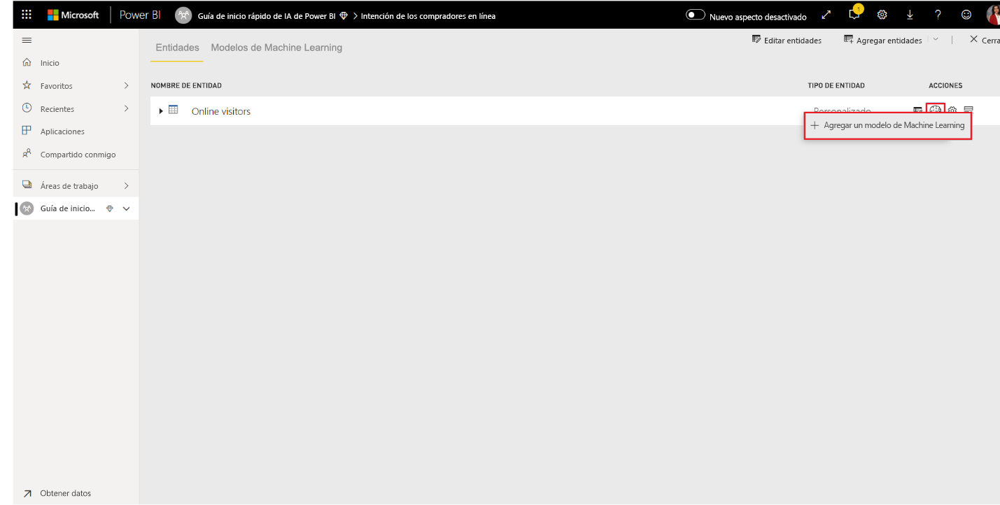

El primer paso para crear el modelo de aprendizaje automático es identificar los datos históricos, como el campo de resultado que quiere predecir. El modelo se crea con el aprendizaje de estos datos.

En el caso del conjunto de datos que vamos a usar, es el campo **Revenue** (Ingresos). Seleccione **Revenue** (Ingresos) como valor de "campo de resultados" y **Siguiente**.

A continuación, es necesario seleccionar el tipo de modelo de aprendizaje automático que se va a crear. Power BI analiza los valores del campo de resultados que ha identificado y sugiere los tipos de modelos de aprendizaje automático que se pueden crear para predecir ese campo.

En este caso, dado que vamos a predecir un resultado binario de si un usuario realiza una compra o no, se recomienda elegir Predicción binaria. Dado que nos interesa predecir los usuarios que realizarán una compra, seleccione True como el resultado de ingresos que más le interesa. Además, puede proporcionar las etiquetas descriptivas de los resultados que se van a usar en el informe generado automáticamente que resumirá los resultados de la validación del modelo. Después, seleccione Siguiente.

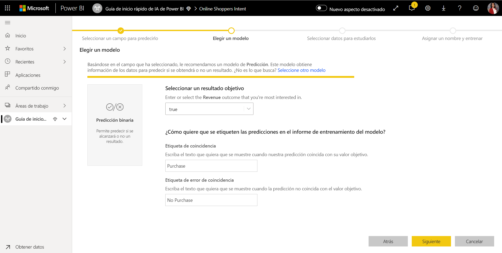

A continuación, Power BI realiza un examen preliminar de una muestra de los datos y sugiere las entradas que pueden generar predicciones más precisas. Si Power BI no recomienda un campo, se proporcionará una explicación junto a él. Tiene la opción de cambiar las selecciones para incluir solo los campos que desea que estudie el modelo o puede seleccionar todos los campos; para ello, active la casilla situada junto al nombre de la entidad. Seleccione **Siguiente** para aceptar las entradas.

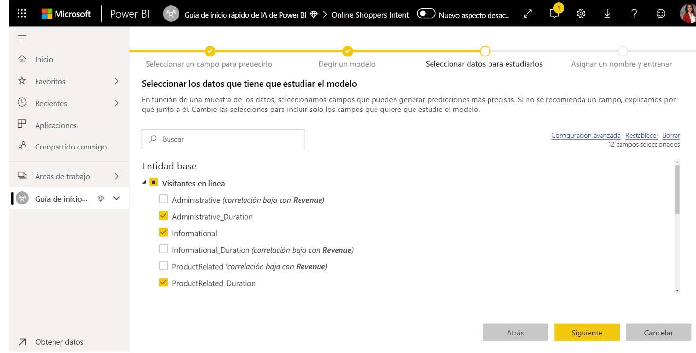

En el paso final, debemos proporcionar un nombre para el modelo. Asígnele al modelo el nombre _Purchase Intent Prediction_. Puede optar por reducir el tiempo de entrenamiento para ver los resultados rápidamente o aumentar el tiempo empleado en el entrenamiento para obtener el mejor modelo. A continuación, seleccione **Guardar y entrenar** para empezar a entrenar el modelo.

El proceso de entrenamiento comenzará con el muestreo y la normalización de los datos históricos y la división del conjunto de datos en dos nuevas entidades _Purchase Intent Prediction Training Data_ (Datos de entrenamiento de predicción de la intención de compra) y _Purchase Intent Prediction Testing Data_ (Datos de prueba de predicción de la intención de compra).

Dependiendo del tamaño del conjunto de datos, el proceso puede tardar desde unos minutos hasta el tiempo seleccionado en la pantalla anterior para el entrenamiento. En este punto, puede ver el modelo en la pestaña **Modelos de Machine Learning** del flujo de datos. El estado Listo indica que el modelo se ha puesto en cola para el entrenamiento o ya se está entrenando.

Puede confirmar que el modelo se está entrenando y validando mediante el estado del flujo de datos. Este estado aparece como una actualización de datos en curso en la pestaña **Flujos de datos** del área de trabajo.

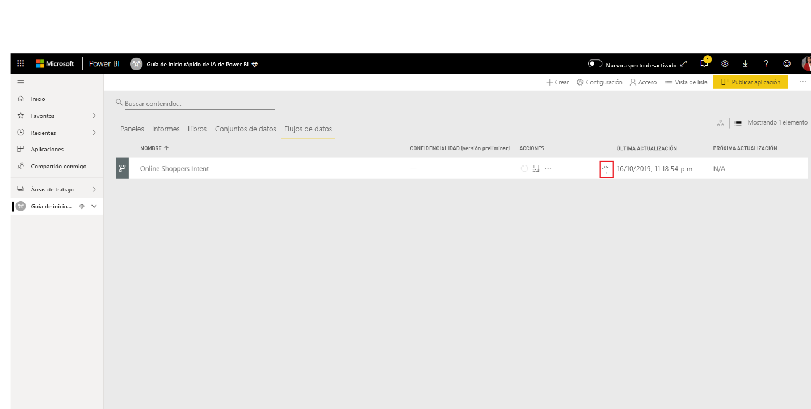

Una vez completado el entrenamiento del modelo, el flujo de datos muestra una hora de actualización. Para confirmar que el modelo está entrenado, vaya a la pestaña **Modelos de Machine Learning** en el flujo de datos. El modelo que ha creado debe mostrar el estado **Entrenado** y la hora de **Último aprendizaje** debe estar ahora actualizada.

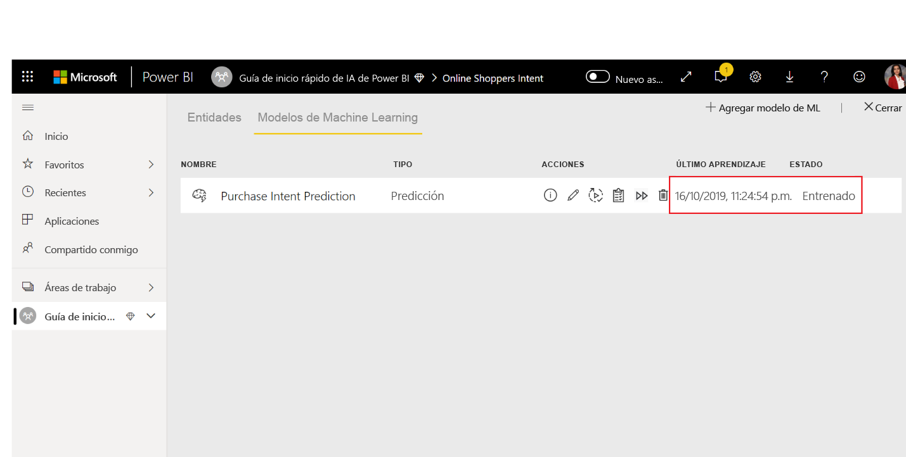

## Revisión del informe de validación del modelo
Para revisar el informe de validación del modelo, en la pestaña Modelos de Machine Learning, seleccione el botón Ver informe de entrenamiento de la columna Acciones del modelo. En este informe se describe cómo es probable que funcione el modelo de aprendizaje automático.

En la página **Rendimiento del modelo** del informe, seleccione **See top predictors** (Ver indicadores principales) para ver los indicadores principales del modelo. Puede seleccionar uno de ellos para ver cómo se asocia la distribución de resultados con ese indicador.

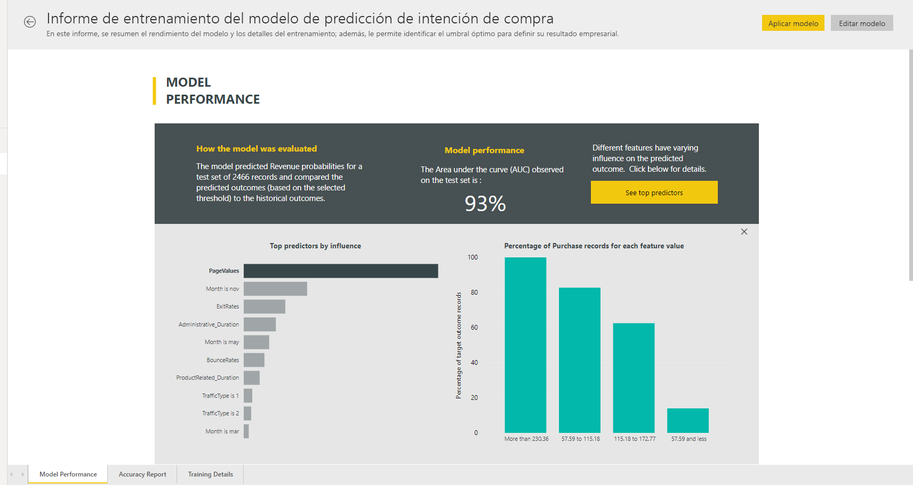

Puede usar el control deslizante **Umbral de probabilidad** de la página Rendimiento del modelo para examinar su influencia en la precisión y la recuperación del modelo.

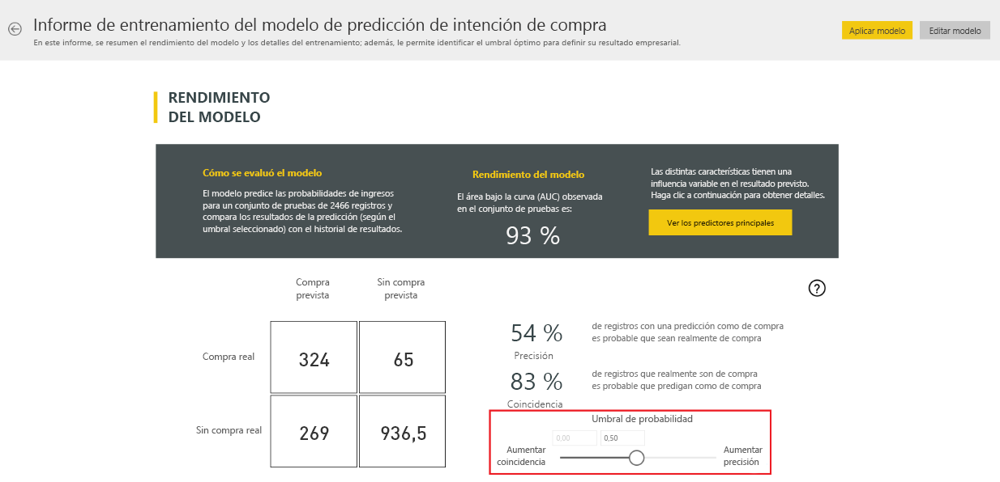

Las demás páginas del informe describen las métricas estadísticas de rendimiento del modelo.

El informe también incluye una página de detalles de aprendizaje que describe las distintas iteraciones que se ejecutaron, cómo se extrajeron las características de las entradas y los hiperparámetros del modelo final usado.

## Aplicación del modelo a una entidad de flujo de datos

Seleccione el botón **Aplicar modelo** en la parte superior del informe para invocar este modelo. En el cuadro de diálogo **Aplicar**, puede especificar la entidad de destino que tiene los datos de origen a los que se debe aplicar el modelo.

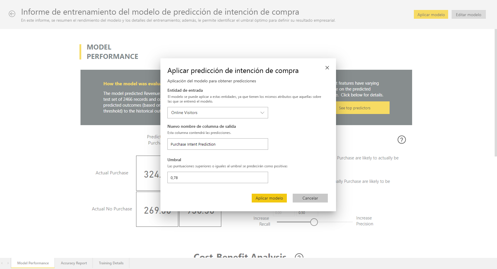

Cuando se le solicite, debe seleccionar **Actualizar** para actualizar el flujo de datos a fin de obtener una vista previa de los resultados del modelo.

Al aplicar el modelo, se crearán dos entidades con el sufijo **<enriched <nombre_del_modelo>** y **enriched <nombre_del_modelo> explanations**. En nuestro caso, al aplicar el modelo a la entidad **Online Visitors** se creará **Online Visitorss enriched Purchase Intent Prediction**, que incluye la salida pronosticada del modelo, y **Online Visitors enriched Purchase Intent Prediction explanations**, que contiene factores principales específicos del registro para la predicción. 

Al aplicar un modelo Predicción binaria, se agregan cuatro columnas con el resultado del pronóstico, la puntuación de probabilidad, los factores principales específicos del registro para la predicción y el índice de explicaciones, cada uno con el nombre de columna especificado como prefijo.  

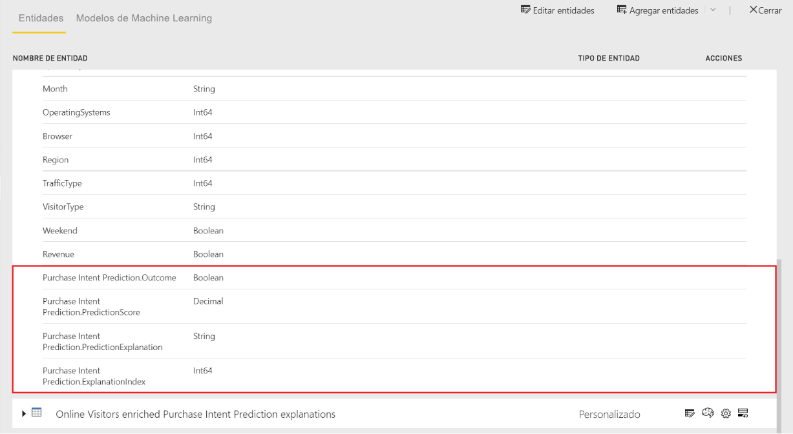

Cuando se haya completado la actualización del flujo de entrada, puede seleccionar la entidad **Online Visitors enriched Purchase Intent Prediction** para ver los resultados.

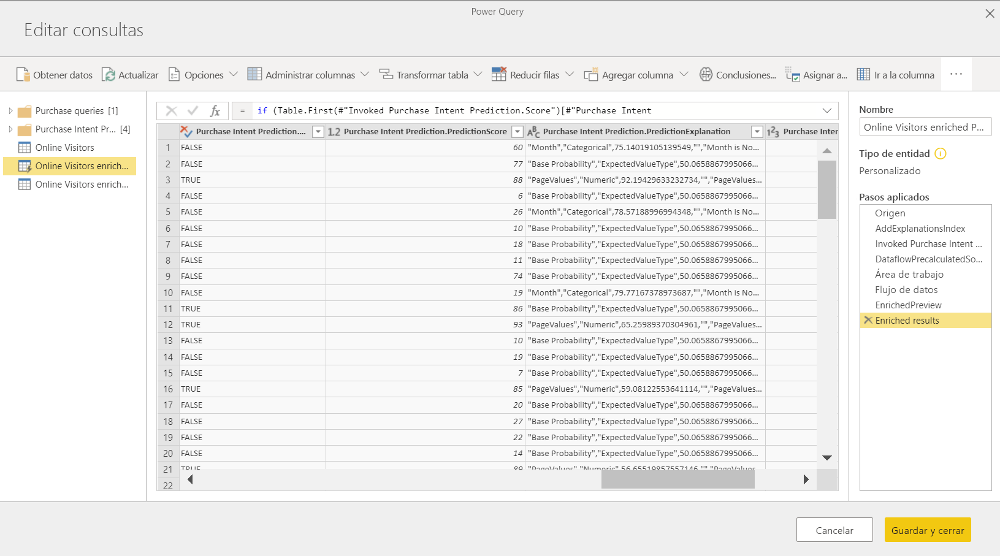

## Uso de la salida puntuada del modelo en un informe de Power BI

Para usar la salida puntuada del modelo de aprendizaje automático, puede conectarse a su flujo de entrada desde Power BI Desktop mediante el conector de flujos de datos. Ahora se puede usar la entidad **Online Visitors enriched Purchase Intent Prediction** para incorporar las predicciones del modelo en los informes de Power BI.

## Pasos siguientes

En este tutorial, ha creado y aplicado un modelo de predicción binaria en Power BI mediante estos pasos:

* Creación de un flujo de datos con los datos de entrada
* Creación y entrenamiento de un modelo de aprendizaje automático
* Revisión del informe de validación del modelo
* Aplicación del modelo a una entidad de flujo de datos
* Uso de la salida puntuada del modelo en un informe de Power BI

Para más información sobre la automatización de Machine Learning en Power BI, consulte [Aprendizaje automático automatizado en Power BI](service-machine-learning-automated.md).
