# Tutorial: Conexión a ejemplos de GitHub con Power BI
En este tutorial, nos conectaremos a datos reales en el servicio de GitHub con Power BI. Power BI creará automáticamente paneles e informes. Nos conectamos al repositorio público de contenido de Power BI (también conocido como *repositorio*) y consultamos la información: ¿Cuántas personas contribuyen al contenido público de Power BI? ¿Quiénes contribuyen en mayor medida? ¿Qué día de la semana ha habido más contribuciones? También hay respuestas a otras preguntas. 

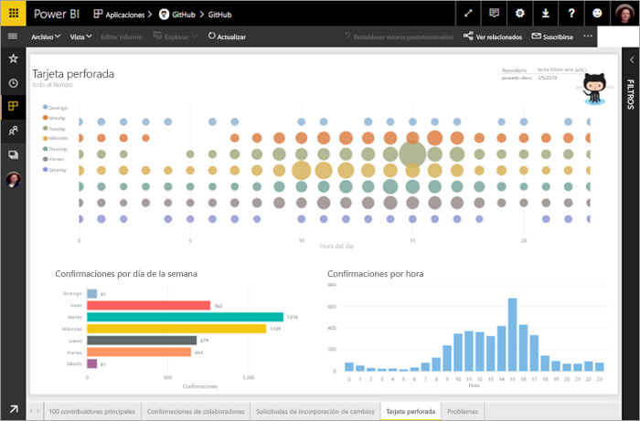

En este tutorial, realizaremos los siguientes pasos:

> [!div class="checklist"]
> * Registrar una cuenta de GitHub, si aún no hay una 
> * Iniciar sesión en la cuenta de Power BI (o registrar una, si aún no la hay)
> * Abrir el servicio Power BI
> * Buscar la aplicación de GitHub
> * Indicar la información del repositorio de GitHub público de Power BI
> * Ver el panel y el informe con datos de GitHub
> * Eliminar la aplicación limpiando los recursos

Si no está registrado en Power BI, [regístrese para obtener una evaluación gratuita](https://app.powerbi.com/signupredirect?pbi_source=web) antes de empezar.

## Requisitos previos

Para completar este tutorial, se necesita una cuenta de GitHub, si aún no tiene una. 

- Registrar una [cuenta de GitHub](https://docs.microsoft.com/contribute/get-started-setup-github)

## Cómo conectarse
1. Inicie sesión en el servicio Power BI (http://powerbi.com)). 
2. En el panel de navegación izquierdo, seleccione **Aplicaciones** y, después, **Obtener aplicaciones**.
   
   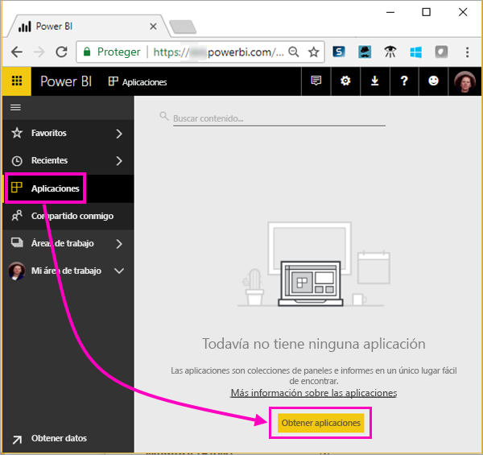 

3. Seleccione **Aplicaciones**, escriba **github** en el cuadro de búsqueda > **Obtenerla ahora**.
   
   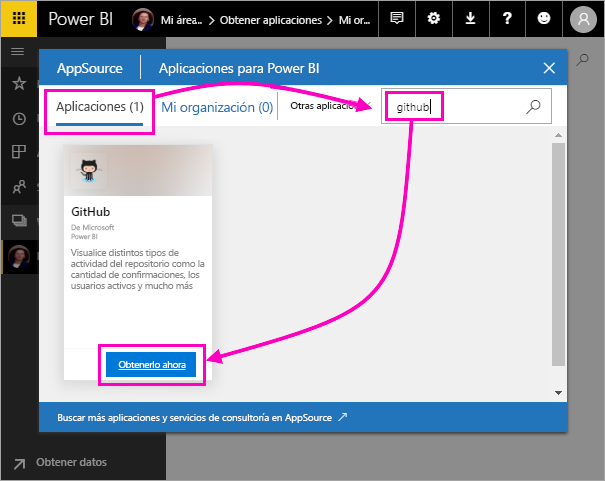 

4. Escriba el nombre del repositorio y el propietario del repositorio. La dirección URL de este repositorio es https://github.com/MicrosoftDocs/powerbi-docs, por lo que **Propietario del repositorio** es **MicrosoftDocs** y **Repositorio**, **powerbi-docs**. 
   
    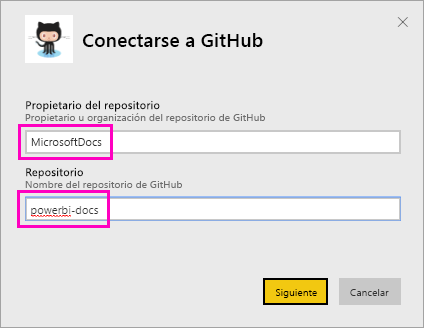

5. Escriba las credenciales de GitHub que ha creado. Puede que Power BI omita este paso si ya ha iniciado sesión en GitHub en el explorador. 

6. En **Método de autenticación**, seleccione **oAuth2** \> **Iniciar sesión**.

7. Siga las pantallas de autenticación de Github. Conceda permisos de Power BI a los datos de GitHub.
   
   Ahora, Power BI se puede conectar a GitHub y a los datos.  Los datos se actualizan una vez al día.

8. Después de que Power BI importe los datos, verá el nuevo icono de GitHub. 
 
   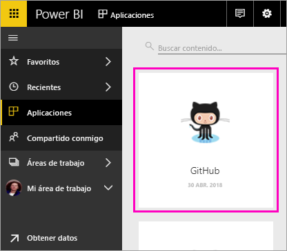 

8. Seleccione el icono de navegación global para minimizar la navegación izquierda y, así, disponer de más espacio.

    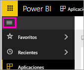

10. Seleccione el icono de GitHub del paso 8. 
    
    Se abre el panel de GitHub. Lo que vemos aquí son datos en directo, por lo que los valores que aparecen pueden ser diferentes.

    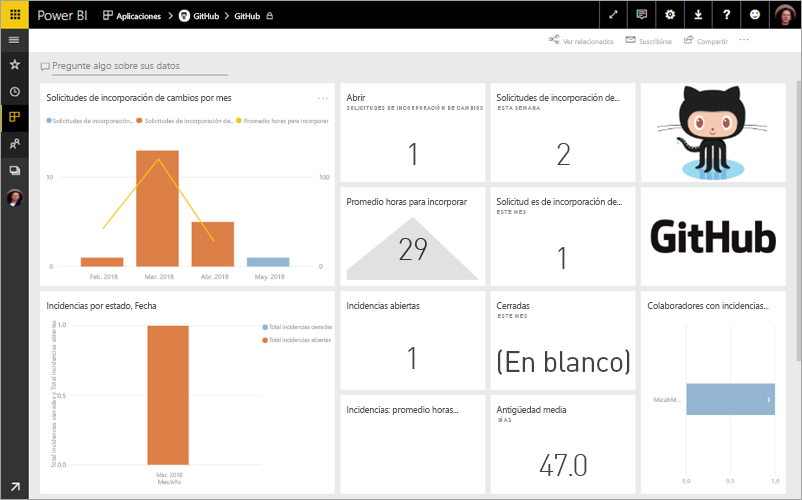

    

## Hacer una pregunta

11. Coloque el cursor en **Pregunte algo sobre sus datos** y seleccione las **solicitudes de extracción**. 

    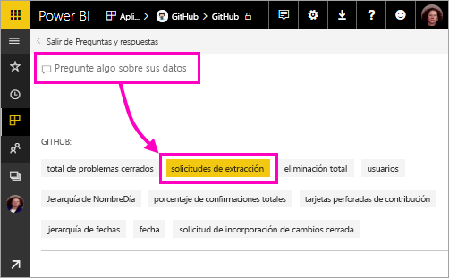

12. Escriba **by month** (por mes).
 
    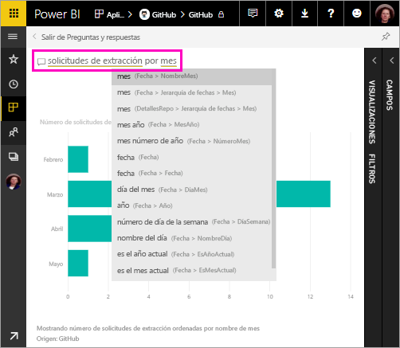

     Power BI crea un gráfico de barras donde se refleja el número de solicitudes de extracción de cada mes.

13. Seleccione **Salir de Preguntas y respuestas**.

## Ver el informe de GitHub 

1. En el panel de GitHub, seleccione el gráfico combinado de líneas y columnas **Pull Requests by Month** (Solicitudes de extracción por mes) para abrir el informe correspondiente.

    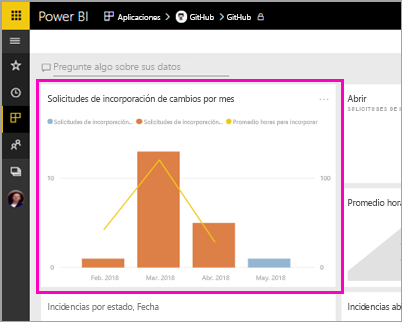

2. Seleccione un nombre de usuario en el gráfico **Total pull requests by user** (Total de solicitudes de extracción por usuario) y, tal y como se aprecia en este ejemplo, compruebe cómo su promedio de horas es superior al promedio total de marzo.

    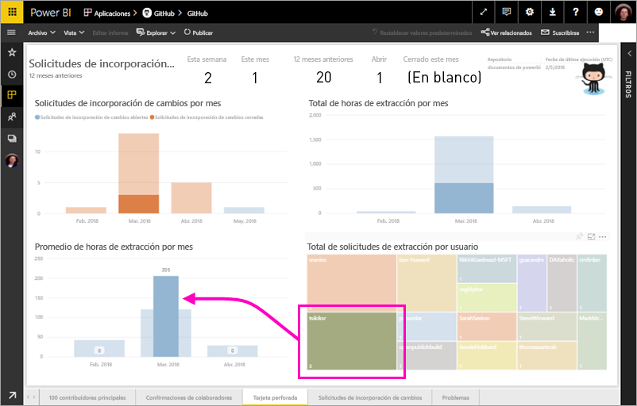

3. Seleccione la pestaña **Tarjeta perforada** para ver la siguiente página en el informe. 
 
    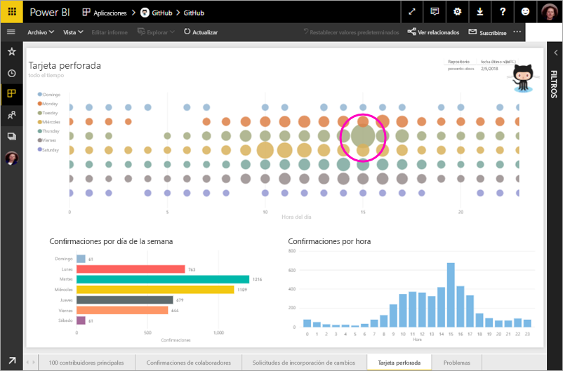

    Parece ser que los martes a las 3 PM es el día y la hora de la semana en los que se realizan *confirmaciones* más habitualmente, que es cuando las personas registran su trabajo.

## Limpiar recursos

Ahora que ya hemos finalizado el tutorial, podemos eliminar la aplicación de GitHub. 

1. Seleccione **Aplicaciones** en la barra de navegación izquierda.
2. Mantenga el puntero sobre el icono de GitHub y seleccione la papelera (**Eliminar**).

    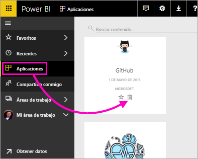

## Pasos siguientes

En este tutorial, nos hemos conectado a un repositorio público de GitHub y hemos obtenido datos, a los que Power BI ha dado formato de panel y de informe. Explorando ese panel y ese informe, hemos hallado respuesta a algunas preguntas sobre los datos. Ahora podemos pasar a obtener más información sobre cómo conectarnos a otros servicios, como Salesforce, Microsoft Dynamics y Google Analytics. 
 
> [!div class="nextstepaction"]
> [Conexión a los servicios que usa](./service-connect-to-services.md)

