# Tutorial: Invocación de un modelo de Machine Learning Studio en Power BI (versión preliminar)

En este tutorial, tratamos la experiencia de incorporar las conclusiones de un modelo de **Azure Machine Learning Studio** en Power BI. En este tutorial se incluyen instrucciones para conceder un acceso de usuario de Power BI a un modelo de Azure ML, creando un flujo de datos y aplicando las conclusiones del modelo de Azure ML a su flujo de datos. También hace referencia a la guía de inicio rápido para crear un modelo de Azure ML si aún no lo tiene.

En el tutorial se le guiará a través de los pasos siguientes:

> [!div class="checklist"]
> * Crear y publicar un modelo de Azure Machine Learning
> * Conceder acceso a un usuario de Power BI para utilizar el modelo
> * Crear un flujo de datos
> * Aplicar las conclusiones del modelo de Azure ML al flujo de datos

## Crear y publicar un modelo de Azure ML

Siga las instrucciones en [Walkthrough Step 1: Create a Machine Learning Studio workspace](https://docs.microsoft.com/azure/machine-learning/studio/walkthrough-1-create-ml-workspace) (Paso 1 del tutorial: Crear un área de trabajo de Machine Learning Studio) para crear un área de trabajo de **Machine Learning**.

Puede usar estos pasos con cualquier modelo de Azure ML o conjunto de datos que ya tenga. Si no tiene un modelo publicado, puede crear un modelo en cuestión de minutos haciendo referencia a [Crear el primer experimento de ciencia en Azure Machine Learning Studio](https://docs.microsoft.com/azure/machine-learning/studio/create-experiment), que configura un modelo de Azure ML para la predicción de los precios de automóviles.

Siga los pasos en [Implementación de un servicio web Azure Machine Learning Studio](https://docs.microsoft.com/azure/machine-learning/studio/publish-a-machine-learning-web-service) para publicar el modelo de Azure ML como servicio web.

## Conceder un acceso de usuario de Power BI

Para obtener acceso a un modelo de Azure ML desde Power BI, debe tener acceso de **lectura** a la suscripción a Azure y al grupo de recursos, y acceso de **lectura** al servicio web Azure Machine Learning Studio para los modelos de Machine Learning Studio.  En el modelo de Azure Machine Learning Service, necesita acceso de **lectura** al área de trabajo del servicio Machine Learning.

En los siguientes pasos se da por sentado que usted es coadministrador de la suscripción a Azure y el grupo de recursos donde se publicó el modelo.

Inicie sesión en [Azure Portal](https://portal.azure.com) y vaya a la página **Suscripciones**, la cual encontrará con la lista **Todos los servicios** del menú de navegación izquierdo.

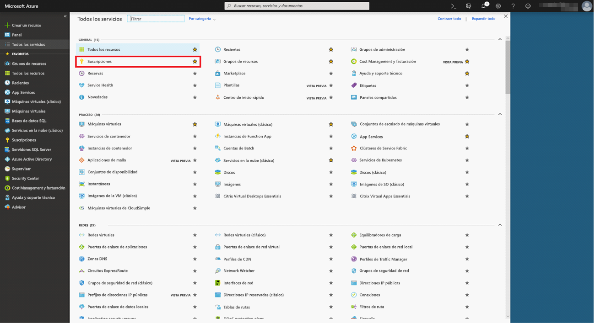

Seleccione la suscripción a Azure que usó para publicar el modelo y seleccione **Access Control (IAM)** . A continuación, seleccione **Agregar asignación de roles** y, a continuación, el rol de **lector** y el usuario de Power BI. Cuando haya terminado, haga clic en **Guardar**. En la siguiente imagen se muestran estas selecciones.

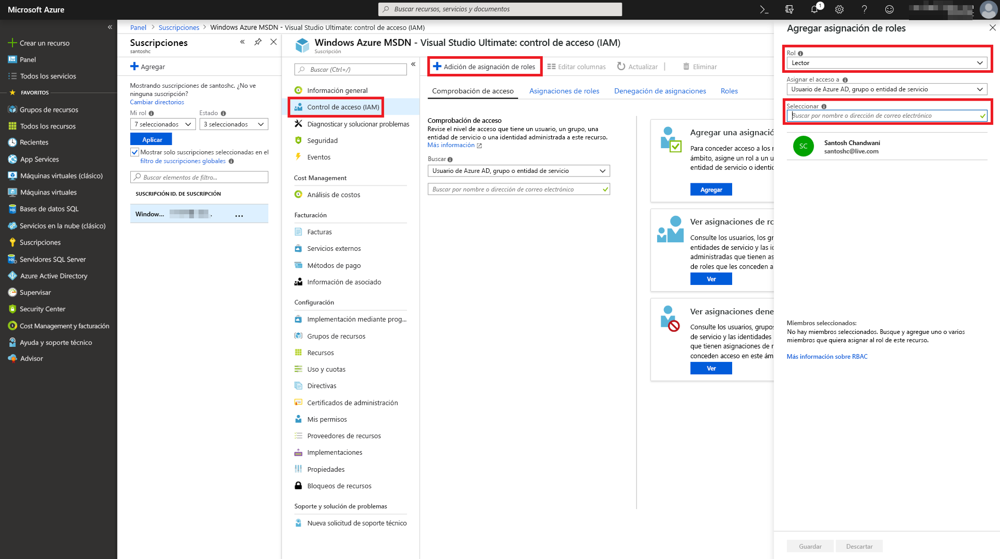

A continuación, repita los pasos anteriores para conceder acceso de rol de **colaborador** al usuario de Power BI para el servicio web Machine Learning específico en el que se ha implementado el modelo de Azure ML.

## Crear un flujo de datos

### Obtener datos para crear el flujo de datos

Inicie sesión en el servicio Power BI con las credenciales del usuario al que concedió acceso al modelo de Azure ML en el paso anterior.

En este paso se da por sentado que tiene los datos que desea puntuar con su modelo de Azure ML en formato CSV.  Si usó el **experimento de precios de automóviles** para crear el modelo en Machine Learning Studio, el conjunto de datos se compartirá en el siguiente vínculo:

* [Modelo de ejemplo de Azure Learning Studio](https://github.com/santoshc1/PowerBI-AI-samples/blob/master/Tutorial_MLStudio_model_integration/Automobile%20price%20data%20_Raw_.csv)

### Crear un flujo de datos

Para crear las entidades en su flujo de datos, inicie sesión en el servicio Power BI y vaya a un área de trabajo de su capacidad dedicada que tenga habilitada la versión preliminar de AI.

Si aún no tiene un área de trabajo, puede crear una seleccionando **Áreas de trabajo** en el menú izquierdo y, a continuación, seleccionar **Crear área de trabajo de la aplicación** en el panel de la parte inferior.  Al hacer esto se abrirá un panel para especificar los datos del área de trabajo. Escriba un nombre para el área de trabajo y, a continuación, seleccione **Guardar**.

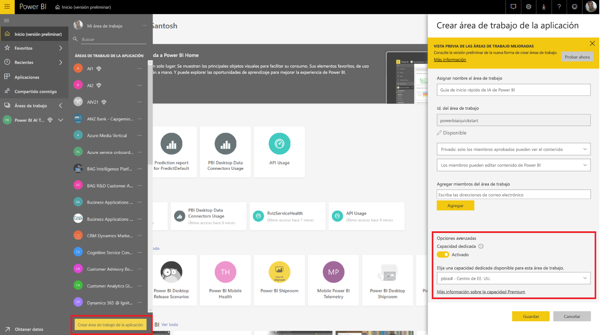

Una vez que se haya creado el área de trabajo, podrá seleccionar **Omitir** en la esquina inferior derecha de la pantalla de bienvenida.

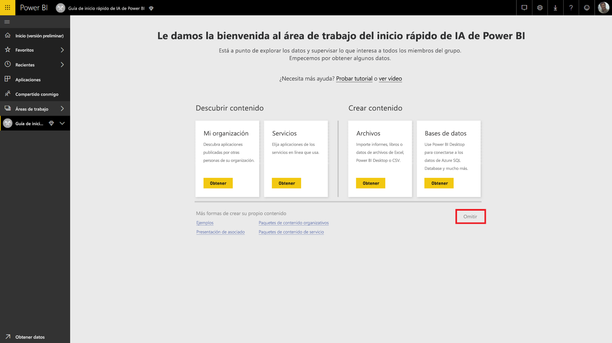

Seleccione la pestaña **Flujos de datos (versión preliminar)** y, a continuación, seleccione el botón **Crear** en la parte superior derecha del área de trabajo. Después, seleccione **Flujo de datos**.

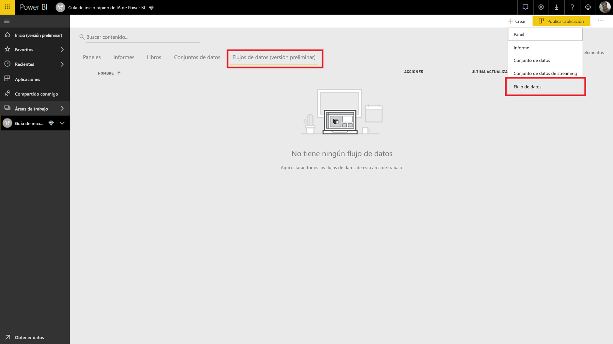

Seleccione **Agregar entidades nuevas**. Al hacer esto se iniciará el **Editor de Power Query** en el explorador.

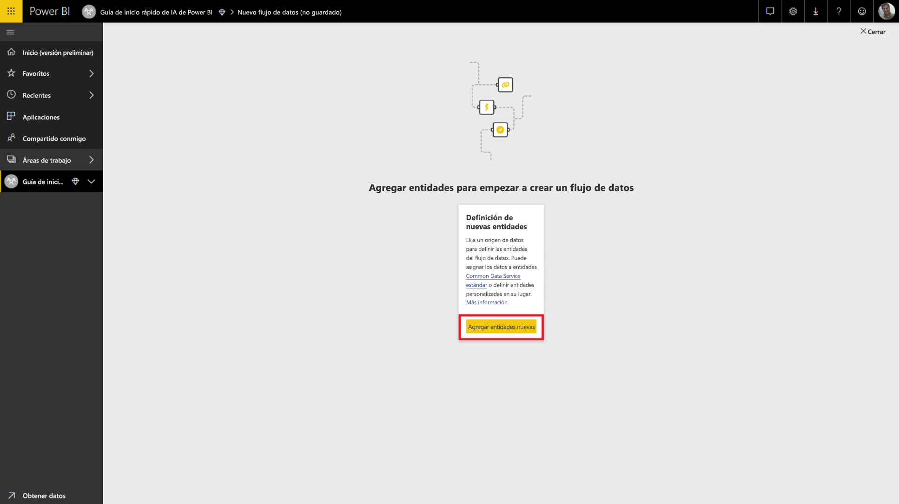

Seleccione **Archivo de texto o CSV** como origen de datos.

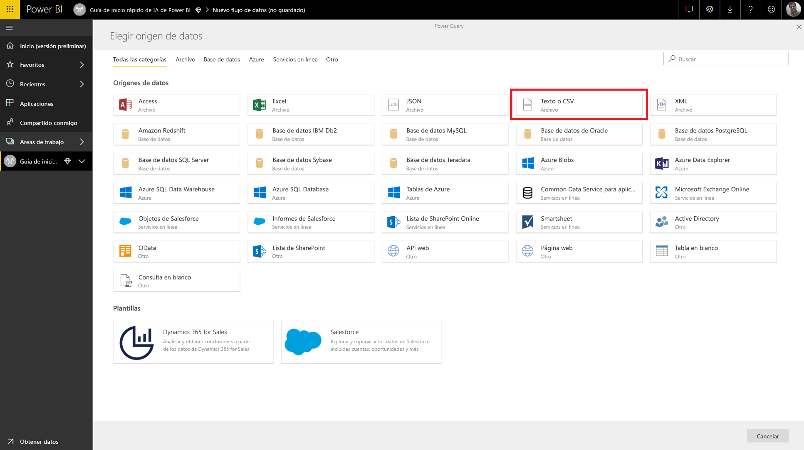

En la siguiente pantalla, se le pedirá que se conecte a un origen de datos. Pegue el vínculo en los datos que usó para crear su modelo de Azure ML. Si usó los datos de los _precios de automoción_, puede pegar el siguiente vínculo en el cuadro **URL o ruta del archivo** y, a continuación, hacer clic en **Siguiente**.

`https://raw.githubusercontent.com/MicrosoftLearning/Principles-of-Machine-Learning-Python/master/Module7/Automobile%20price%20data%20_Raw_.csv`

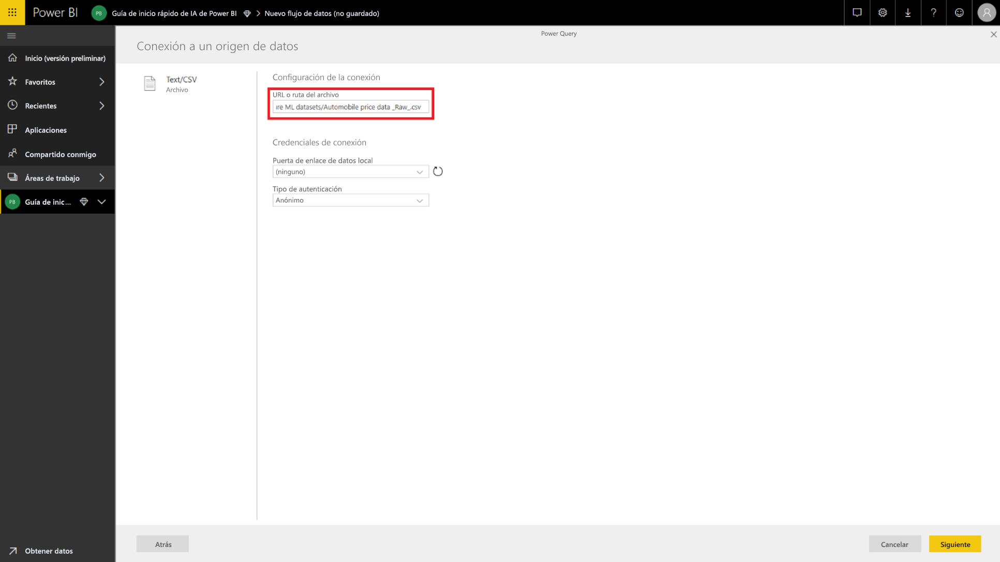

El Editor de Power Query muestra una versión preliminar de los datos del archivo CSV. Seleccione **Transformar tabla** en la cinta de opciones de comando y, a continuación, seleccione **Usar la primera fila como encabezado**.  Al hacer esto se agrega el paso de la consulta _Encabezados promovidos_ en el panel **Pasos aplicados** situado a la derecha. También puede cambiar el nombre de la consulta por uno más descriptivo, como _Precios de automóviles_, con el panel de la derecha.

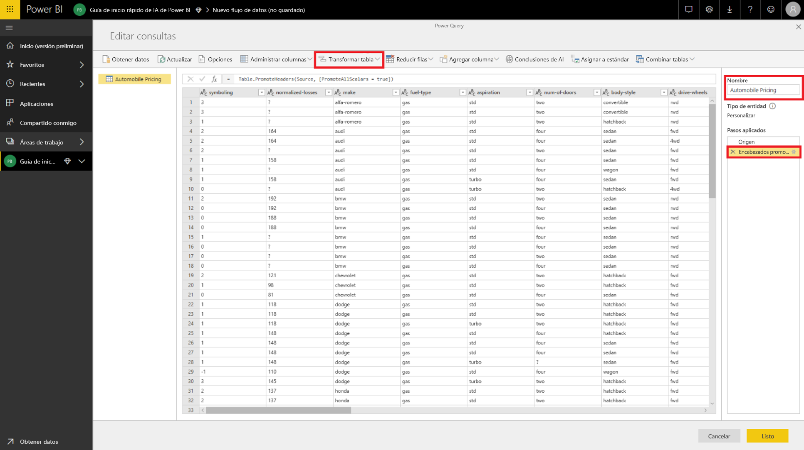

Nuestro conjunto de datos de origen tiene valores desconocidos establecidos en "?".  Para limpiarlo, podemos reemplazar "?" por "0" para evitar errores posteriormente por motivos de simplicidad.  Para ello, seleccione las columnas *normalized-losses*, *bore*, *stroke*, *compression-ratio*, *horsepower*, *peak-rpm* y *price* haciendo clic en su nombre en los encabezados de columna y, a continuación, haga clic en "Transformar columnas" y seleccione "Reemplazar valores".  Reemplace "?" por "0".

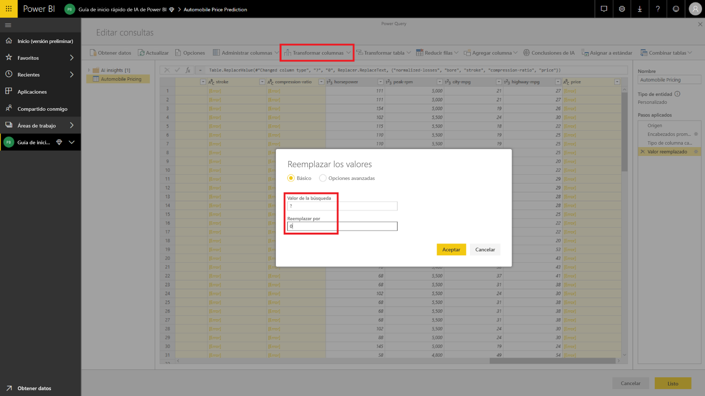

Todas las columnas de la tabla de un origen de texto o CSV se tratan como columnas de texto.  A continuación, debemos cambiar las columnas numéricas por sus tipos de datos correctos.  Puede hacerlo en Power Query haciendo clic en el símbolo de tipo de datos en el encabezado de columna.  Cambie las columnas por los tipos siguientes:

- **Número entero**: symboling, normalized-losses, curb-weight, engine-size, horsepower, peak-rpm, city-mpg, highway-mpg y price
- **Número decimal**: wheel-base, length, width, height, bore, stroke y compression-ratio

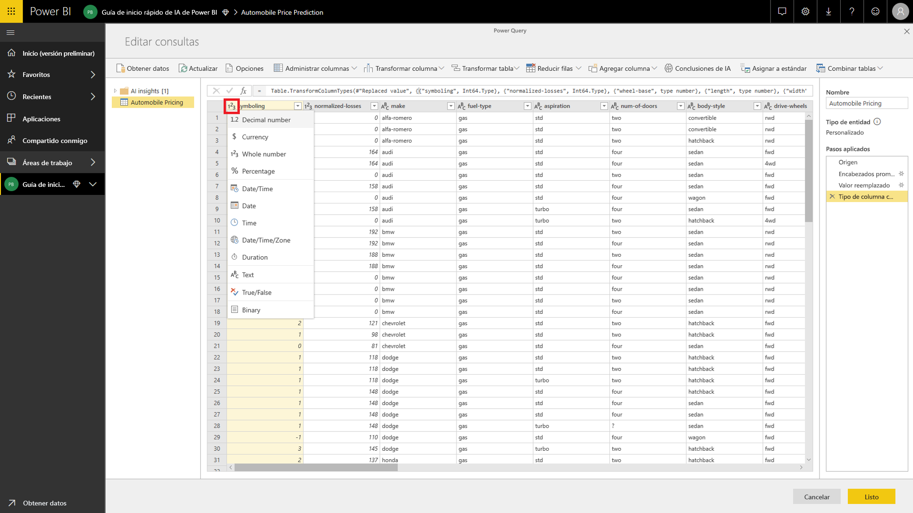

Seleccione **Listo** para cerrar el Editor de Power Query. Al hacer esto se mostrará la lista de entidades con los datos de los _precios de automóviles_ que agregamos. Seleccione **Guardar** en la esquina superior derecha, proporcione un nombre para el flujo de datos y, a continuación, seleccione **Guardar**.

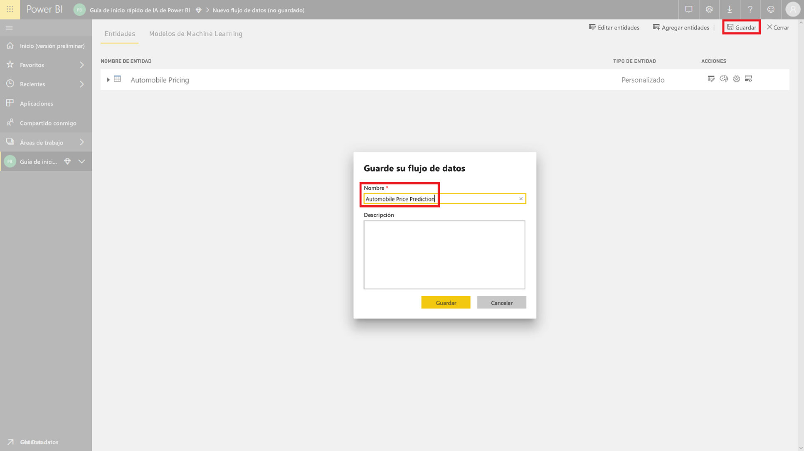

### Actualizar el flujo de datos

Al guardarse el flujo de datos se muestra una notificación en la que se indica que se ha guardado su flujo de datos. Seleccione **Actualizar ahora** para recopilar datos desde el origen en el flujo de datos.

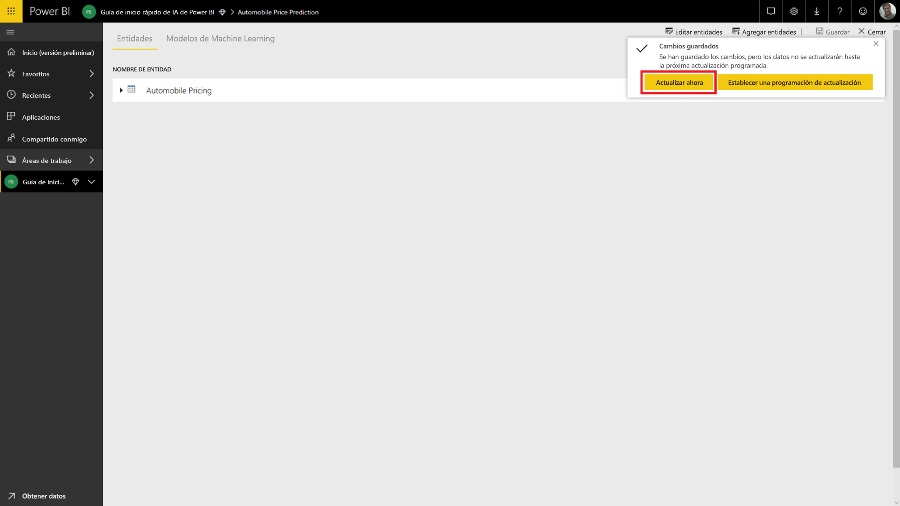

Seleccione **Cerrar** en la esquina superior derecha y espere a que se complete la actualización del flujo de datos.

También puede actualizar su flujo de datos con los comandos **Acciones**. En el flujo de datos se muestra la marca de tiempo al completarse la actualización.

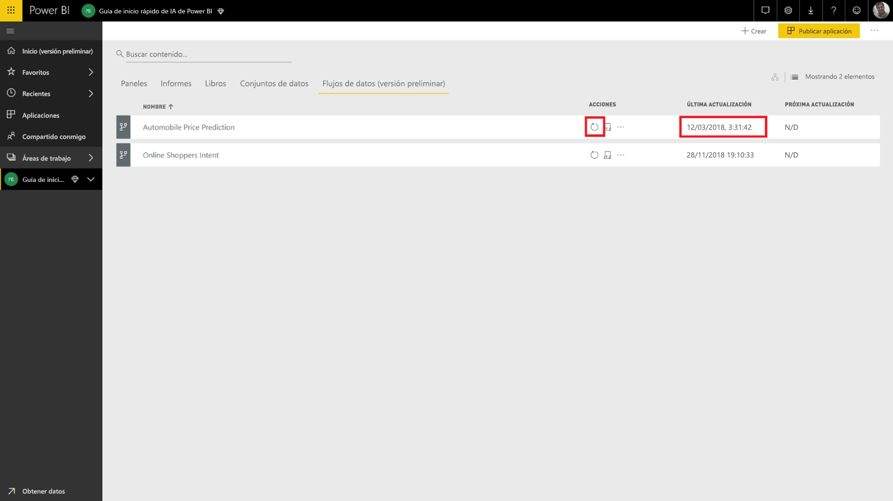

## Aplicar las conclusiones de su modelo de Azure ML

Para obtener acceso al modelo de Azure ML para la _predicción de los precios de automóviles_, puede editar la entidad _Precios de automóviles_ para la que deseamos agregar el precio previsto.

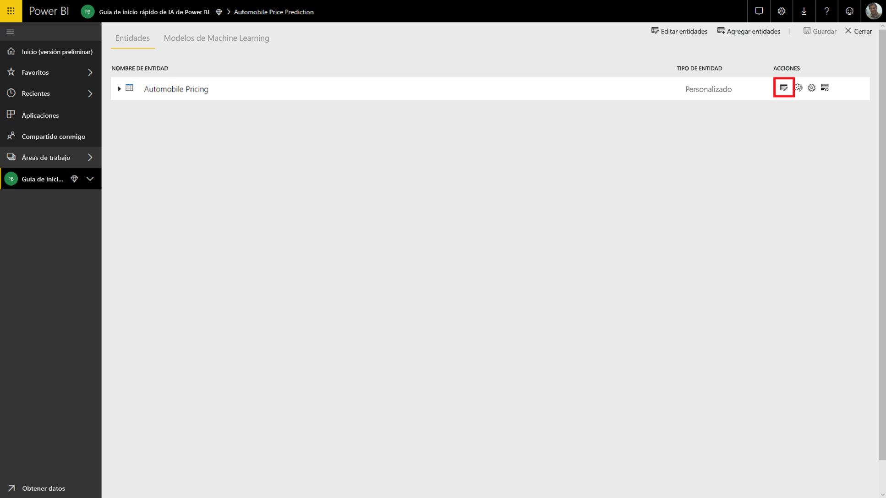

Al seleccionar el icono **Editar** se abre el Editor de Power Query para las entidades de su flujo de datos.

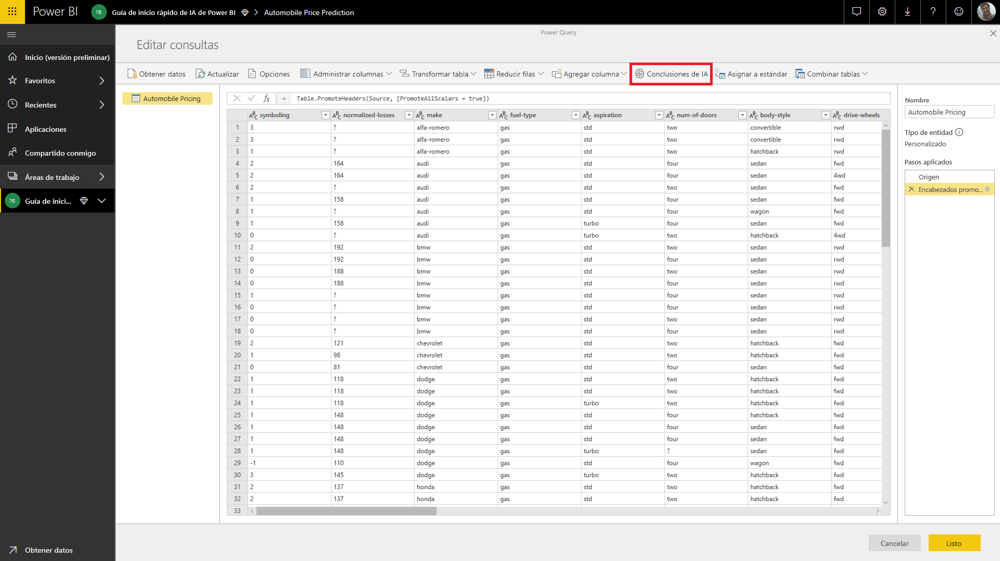

Seleccione el botón **Conclusiones de AI** de la cinta de opciones y, a continuación, seleccione la carpeta _Modelos de Azure Machine Learning_ en el menú de navegación izquierdo.

Los modelos de Azure ML a los que se le ha concedido acceso se enumeran como funciones de Power Query con un prefijo *AzureML.*  Al hacer clic en la función correspondiente al modelo _AutomobilePricePrediction_, los parámetros para el servicio web del modelo se enumeran como parámetros de función.

Para invocar un modelo de Azure ML, puede especificar cualquiera de las columnas de la entidad seleccionadas como entrada del menú desplegable. También puede especificar un valor constante que se va a usar como entrada cambiando el icono de la columna a la izquierda del cuadro de diálogo de entrada. Cuando hay un nombre de columna que coincide con uno de los nombres de parámetro de función, la columna se sugiere automáticamente como entrada.  Si el nombre de columna no coincide, puede seleccionarlo en el menú desplegable.

En el caso del modelo de _predicción de los precios de automóviles_, los parámetros de entrada son:

- make
- body-style
- wheel-base
- engine-size
- horsepower
- peak-rpm
- highway-mpg

En nuestro caso, puesto que nuestra tabla coincide con el conjunto de datos original usado para entrenar el modelo, todos los parámetros tienen las columnas correctas ya seleccionadas.

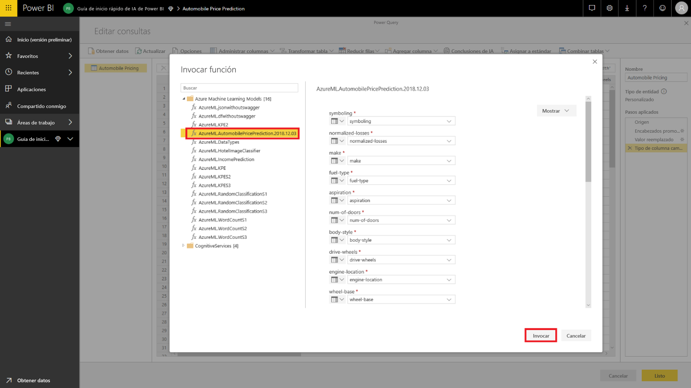

Seleccione **Invocar** para ver la versión preliminar del resultado del modelo de Azure ML como nueva columna en la tabla de entidades. También verá la invocación de modelos como paso aplicado para la consulta.

El resultado del modelo se muestra como registro en la columna de salida. Puede expandir la columna para producir parámetros de salida individuales en columnas independientes. En nuestro caso, solo nos interesan las _etiquetas con puntuación_ que contienen el precio previsto del automóvil.  De este modo, anulamos la selección del resto y seleccionamos **Aceptar**.

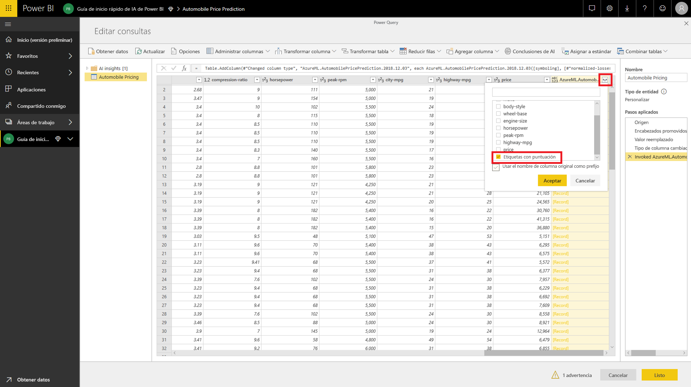

La columna *Etiquetas con puntuación* tiene la predicción de los precios del modelo de Azure ML.

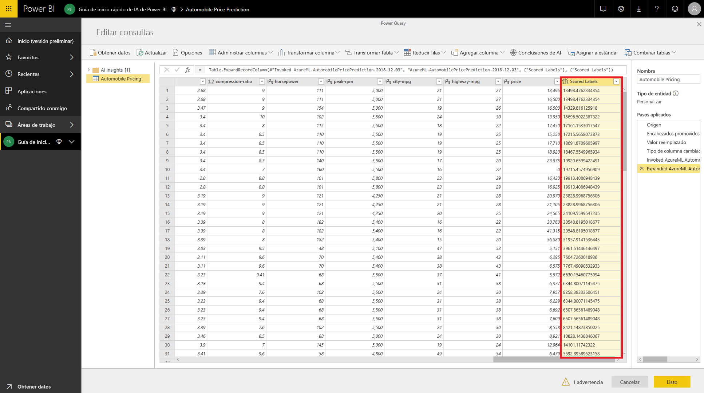

Una vez que guarde su flujo de datos, el modelo de Azure ML se invocará automáticamente al actualizarse el flujo de datos para cualquier fila nueva o actualizada de la tabla de entidades.

## Limpieza de recursos

Si ya no necesita los recursos de Azure que creó con este artículo, elimínelos para evitar incurrir en gastos.  También puede eliminar los flujos de datos que creó, si ya no los necesita.

## Pasos siguientes

En este tutorial, creó un sencillo experimento mediante el uso de Azure Machine Learning Studio, que a su vez utiliza un conjunto de datos sencillo que sigue estos pasos:

- Crear y publicar un modelo de Azure Machine Learning
- Conceder acceso a un usuario de Power BI para utilizar el modelo
- Crear un flujo de datos
- Aplicar las conclusiones del modelo de Azure ML al flujo de datos

Para obtener más información sobre la integración de Azure Machine Learning en Power BI, consulte [Integración de Azure Machine Learning en Power BI (versión preliminar)](service-machine-learning-integration.md).
