# <a name="tutorial-use-cognitive-services-in-power-bi"></a>Tutorial: Uso de Cognitive Services en Power BI

Power BI proporciona acceso a un conjunto de funciones de Azure Cognitive Services para enriquecer sus datos en la preparación de datos de autoservicio para flujos de datos. Los servicios que hoy se admiten son [Análisis de sentimiento](https://docs.microsoft.com/azure/cognitive-services/text-analytics/how-tos/text-analytics-how-to-sentiment-analysis), [Extracción de frases clave](https://docs.microsoft.com/azure/cognitive-services/text-analytics/how-tos/text-analytics-how-to-keyword-extraction), [Detección de idioma](https://docs.microsoft.com/azure/cognitive-services/text-analytics/how-tos/text-analytics-how-to-language-detection) y [Etiquetado de imágenes](https://docs.microsoft.com/azure/cognitive-services/computer-vision/concept-tagging-images). Las transformaciones se ejecutan en el servicio Power BI y no requieren una suscripción a Azure Cognitive Services. Esta característica requiere Power BI Premium.

Las transformaciones de Cognitive Services se admiten en la [preparación de datos de autoservicio para flujos de datos](https://powerbi.microsoft.com/blog/introducing-power-bi-data-prep-wtih-dataflows/). Use los ejemplos paso a paso para el análisis de texto y el etiquetado de imágenes a continuación para empezar a trabajar.

En este tutorial, obtendrá información sobre cómo:

> [!div class="checklist"]
> * Importar datos en un flujo de datos
> * Score sentiment (Puntuar opiniones) y extraer frases clave de una columna de texto en un flujo de datos
> * Conexión a los resultados desde Power BI Desktop


## <a name="prerequisites"></a>Requisitos previos

Para completar este tutorial, necesita lo siguiente: 

- Una cuenta de Power BI. Si no está registrado en Power BI, [regístrese para obtener una evaluación gratuita](https://app.powerbi.com/signupredirect?pbi_source=web) antes de empezar.
- Acceso a una capacidad de Power BI Premium con la carga de trabajo de IA habilitada. Esta carga de trabajo se desactivará de forma predeterminada durante la versión preliminar. Si está en una capacidad Premium y no se muestran las conclusiones de AI, póngase en contacto con su administrador de capacidad Premium para habilitar la carga de trabajo de IA en el portal de administración.

## <a name="text-analytics"></a>Análisis de texto

Siga los pasos de esta sección para completar la parte relativa al análisis de texto del tutorial.

### <a name="step-1-apply-sentiment-scoring-in-power-bi-service"></a>Paso 1: Aplicar la puntuación de opiniones en Power BI Service

Para empezar, vaya al área de trabajo de Power BI con capacidad Premium y cree un nuevo flujo de datos mediante el botón **Crear** en la esquina superior derecha de la pantalla.

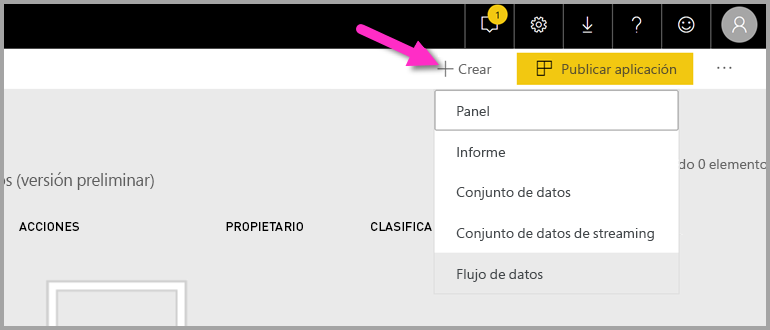

En el cuadro de diálogo Flujo de datos se le muestran las opciones para crear un nuevo flujo de datos. Seleccione **Agregar entidades nuevas.** A continuación, elija **Texto o CSV** en el menú de orígenes de datos.

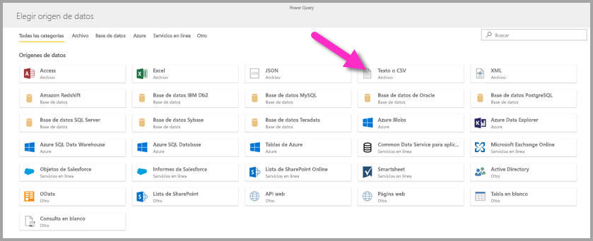

Pegue esta dirección URL en el campo de dirección URL: [https://pbiaitutorials.blob.core.windows.net/textanalytics/FabrikamComments.csv](https://pbiaitutorials.blob.core.windows.net/textanalytics/FabrikamComments.csv) y haga clic en **Siguiente.**

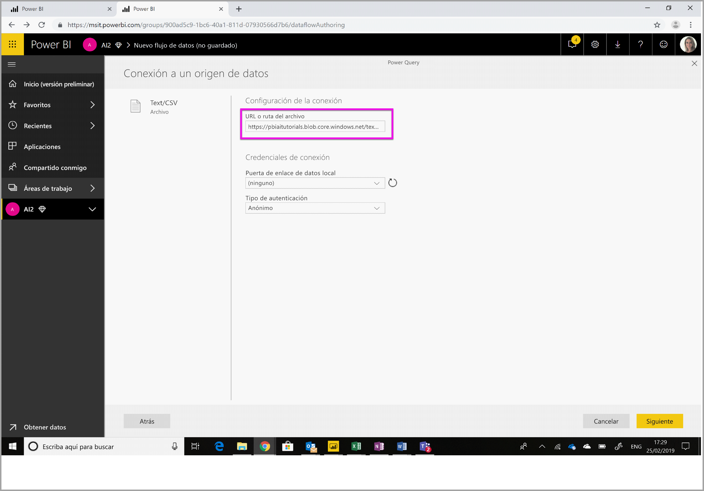

En la cinta de opciones superior, seleccione **Transformar tabla** y, a continuación, elija **Usar la primera fila como encabezado.** Ahora los datos están listos para usarse para el análisis de texto y podemos usar Puntuación de opiniones y Extracción de frases clave en la columna de comentarios del cliente.

En el Editor de Power Query, seleccione **Conclusiones de AI**

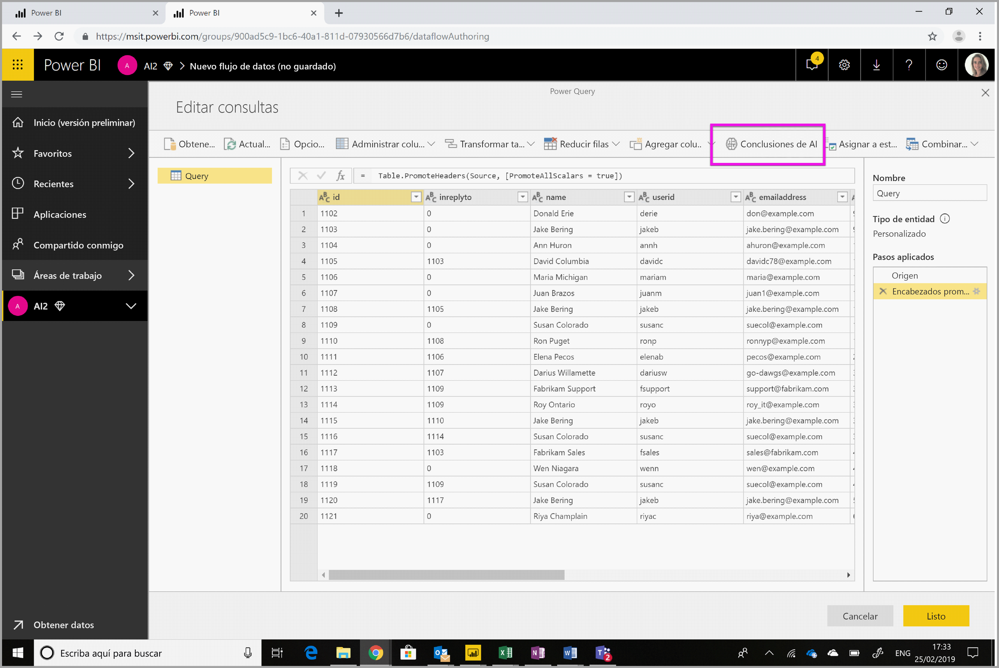

Expanda la carpeta **Cognitive Services** y seleccione la función que desea usar. En este ejemplo se puntúan las opiniones de la columna de comentarios, pero puede seguir los mismos pasos para probar Detección de idioma y Extracción de frases clave.

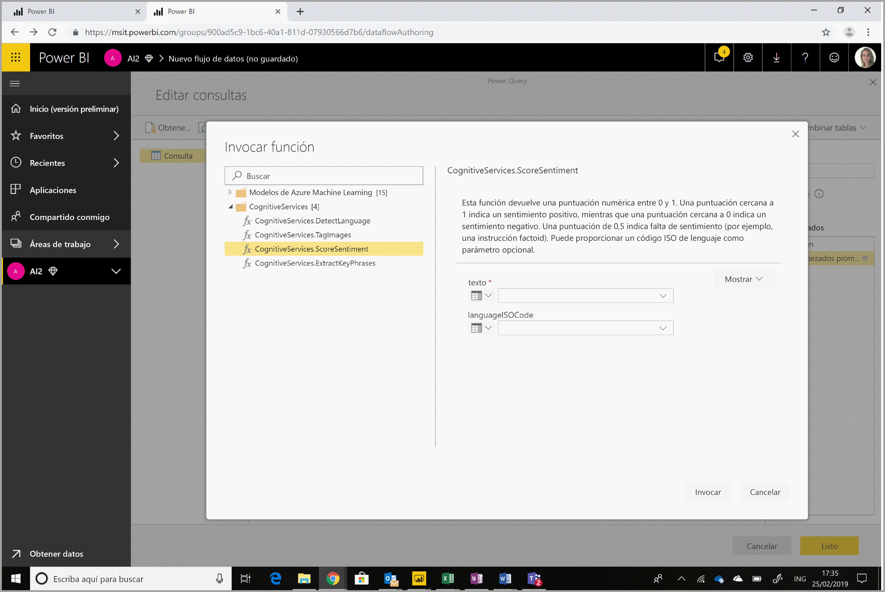

Una vez que se seleccione una función, se mostrarán los campos obligatorios y opcionales. Para puntuar las opiniones de las revisiones de ejemplo, seleccione la columna de revisiones como entrada de texto. La información de referencia cultural es una entrada opcional y requiere un formato ISO. Por ejemplo, escriba "en" si desea que el texto se trate como inglés. Al dejarse en blanco el campo, Power BI detectará en primer lugar el lenguaje del valor de entrada antes de puntuar las opiniones.

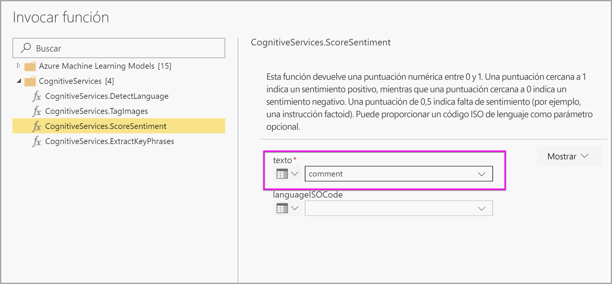

Ahora seleccione **Invocar** para ejecutar la función. Una nueva columna con la puntuación de opiniones para cada fila se agrega a la tabla. Puede volver a **Conclusiones de AI** para extraer frases clave del texto de la crítica de la misma forma.

Una vez que haya terminado con las transformaciones, cambie el nombre de la consulta por "Comentarios del cliente" y seleccione **Listo.**

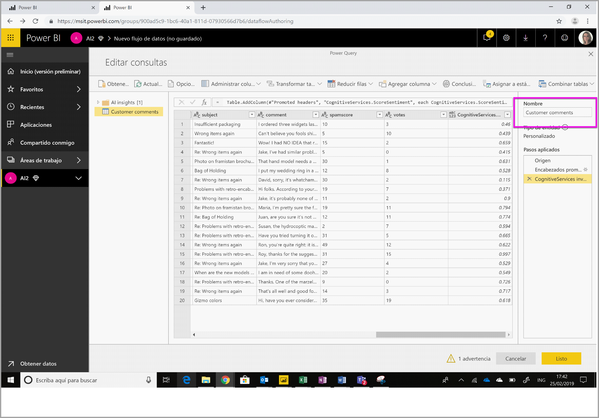

A continuación, **guarde** el flujo de datos y llámelo Fabrikam. Seleccione el botón **Actualizar ahora** que aparece una vez guardado el flujo de datos.

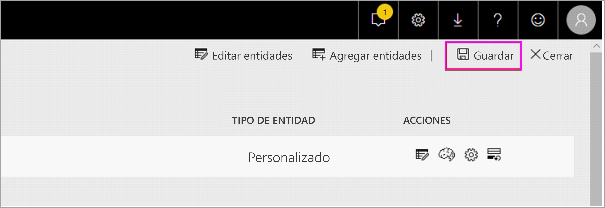

Una vez guardado y actualizado el flujo de datos, puede usarlo en un informe de Power BI.

### <a name="step-2-connect-from-power-bi-desktop"></a>Paso 2: Conectarse desde Power BI Desktop

Abra Power BI Desktop. En la cinta Inicio, seleccione **Obtener datos.**

Vaya a los **flujos de datos de Power BI (Beta**) en la sección de Power BI y seleccione **Conectar.**

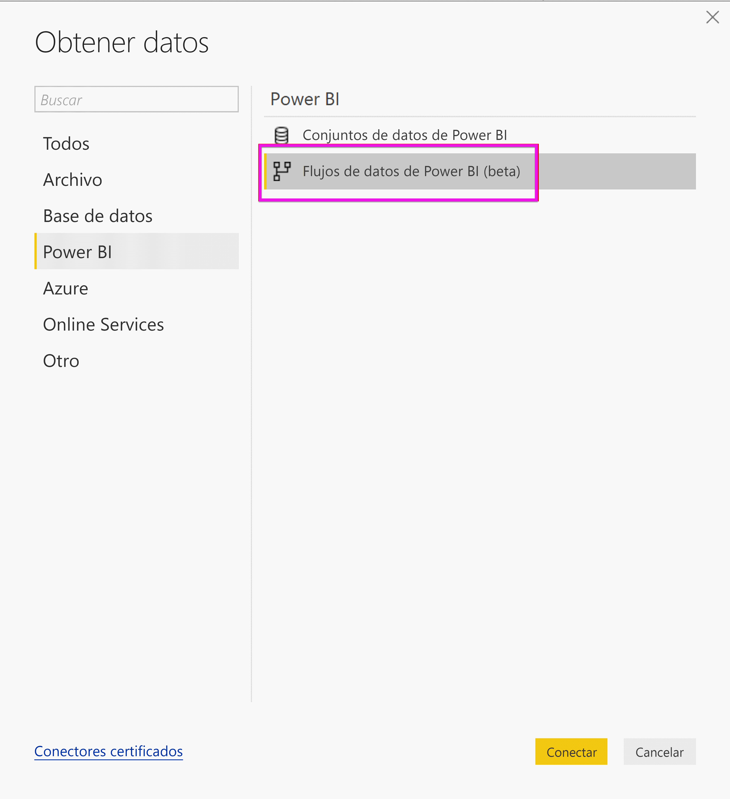

Como esta es una característica en vista previa (GB), el conector le pedirá que acepte las condiciones de la versión preliminar. Tras aceptarlas, inicie sesión con la cuenta de su organización.

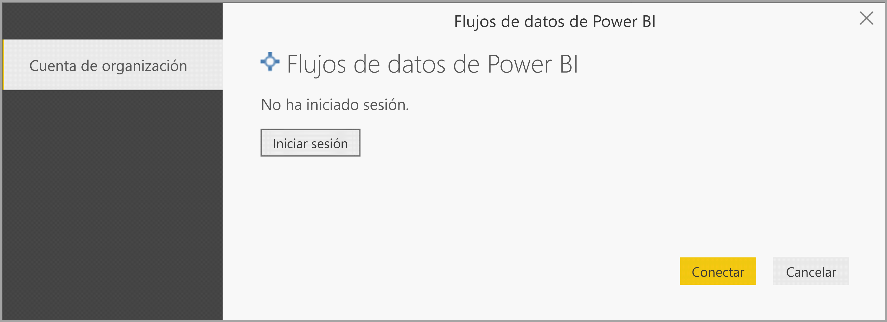

Seleccione el flujo de datos que acaba de crear. Vaya a la tabla de comentarios del cliente y haga clic en **Cargar.**

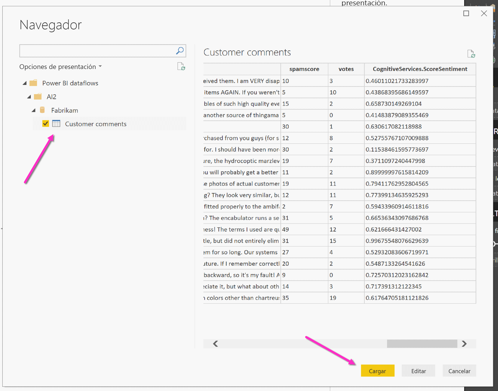

Ahora que se han cargado los datos puede empezar a crear un informe.

## <a name="image-tagging"></a>Etiquetado de imágenes

Vaya a un área de trabajo de Power BI con capacidad Premium. Cree un nuevo flujo de datos con el botón **Crear** en la esquina superior derecha de la pantalla.

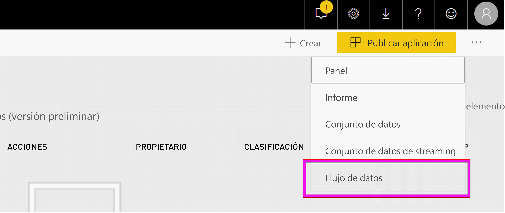

Seleccione **Agregar entidades nuevas**.

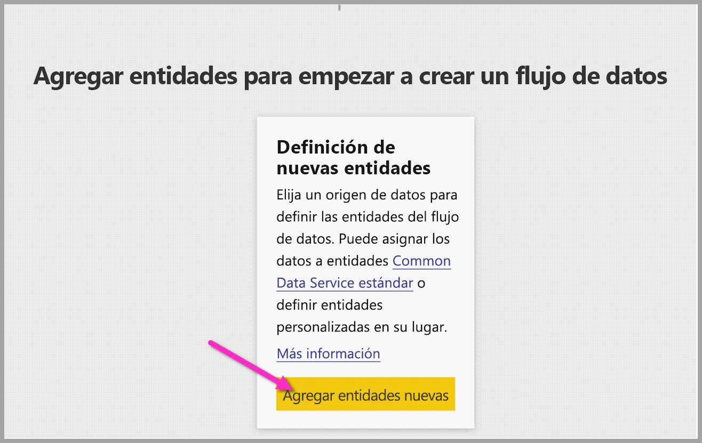

Una vez que se le pida que elija un origen de datos, seleccione **Consulta en blanco.**

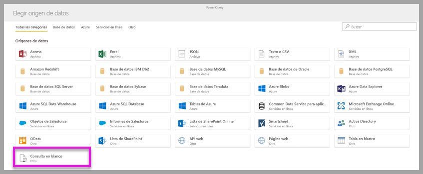

Copie la consulta a continuación en el editor de consultas y haga clic en Siguiente. Puede reemplazar las rutas de acceso de dirección URL a continuación por otras imágenes o agregar más filas. La función *Web.Contents* importa la dirección URL de la imagen como binario. Si tiene un origen de datos con imágenes almacenadas como binario, también podrá darle uso directamente.


```python
let
  Source = Table.FromRows({
  { Web.Contents("https://images.pexels.com/photos/87452/flowers-background-butterflies-beautiful-87452.jpeg") },
  { Web.Contents("https://upload.wikimedia.org/wikipedia/commons/5/53/Colosseum_in_Rome%2C_Italy_-_April_2007.jpg") }}, { "Image" })
in
  Source
```

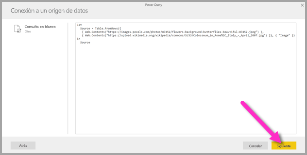

Cuando se pidan las credenciales, seleccione *anónimo*.

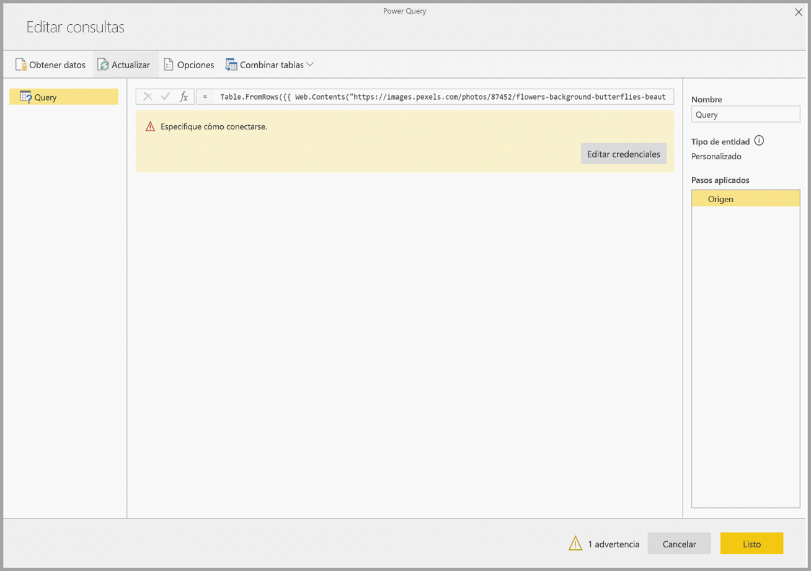

Verá la imagen siguiente.

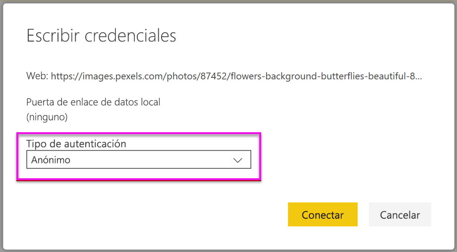

Se le pedirán las credenciales para cada página web individual.

Seleccione **Conclusiones de AI** en el editor de consultas.

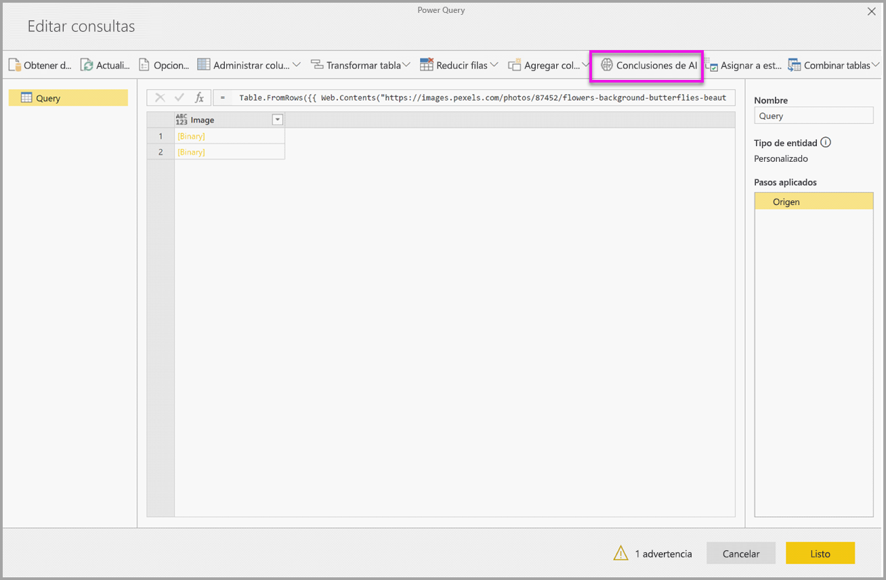

A continuación, inicie sesión con la **cuenta de la organización**.

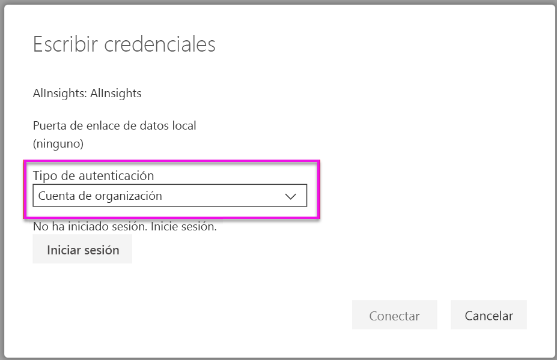

Seleccione la función Tag Images (Etiquetar imágenes) y escriba _[Binario]_ en el campo de columna y _en_ en el campo de información de referencia cultural. 

> [!NOTE]
> Actualmente no puede seleccionar una columna mediante un menú desplegable, lo que se resolverá lo antes posible durante la versión preliminar privada.

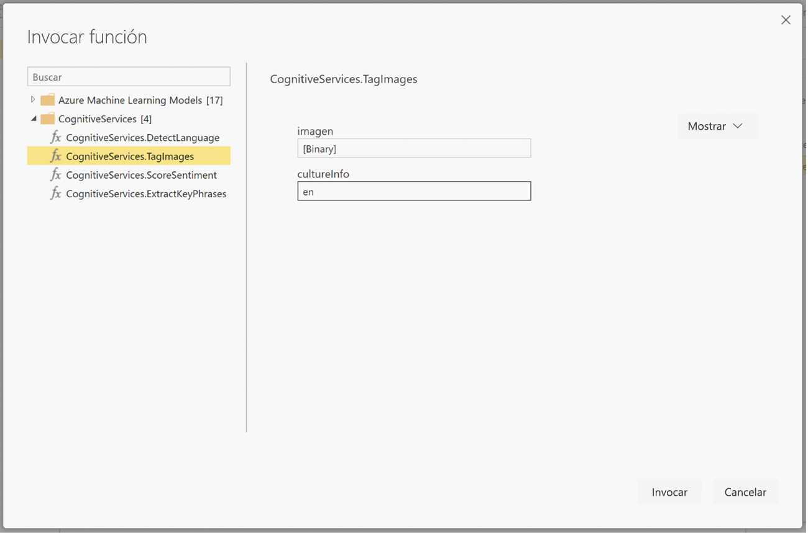

El el editor de funciones, quite las comillas situadas alrededor del nombre de columna. 

> [!NOTE]
> Quitar las comillas es una solución alternativa temporal. Esto se resolverá lo antes posible durante la versión preliminar.

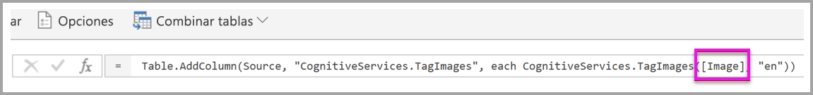

La función devuelve un registro con las etiquetas en dos formatos: separado por comas y como registro JSON. Seleccione el botón de expansión para agregar uno o ambos como columnas a la tabla.

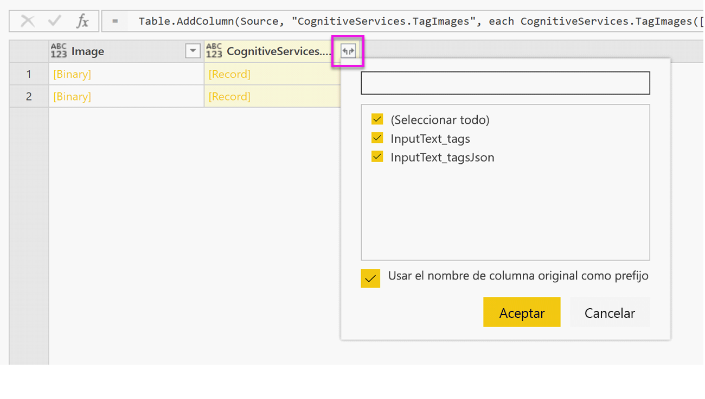

Seleccione **Listo** y guarde el flujo de datos. Una vez que haya actualizado el primer flujo de datos, puede conectarse a él desde Power BI Desktop mediante los conectores de flujos de datos (consulte los pasos en la página 5 de este documento).

## <a name="clean-up-resources"></a>Limpieza de recursos

Cuando ya no sea necesario, elimine la consulta haciendo clic con el botón derecho en el nombre de la consulta en el Editor de Power Query y seleccionando **Eliminar**.

## <a name="next-steps"></a>Pasos siguientes

En este tutorial, aplicó las funciones de puntuación de opiniones y etiquetado de imágenes en un flujo de datos de Power BI. Para obtener más información sobre Cognitive Services en Power BI, lea los siguientes artículos.

* [Cognitive Services en Azure](https://docs.microsoft.com/azure/cognitive-services/)
* Introducción [a la preparación de datos de autoservicio en flujos de datos](service-dataflows-overview.md)
* Más información sobre [Power BI Premium](https://powerbi.microsoft.com/power-bi-premium/)

Puede que también esté interesado en los siguientes artículos.

* [Tutorial: Invocación de un modelo de Machine Learning Studio en Power BI (versión preliminar)](service-tutorial-invoke-machine-learning-model.md)
* [Integración de Azure Machine Learning en Power BI (versión preliminar)](service-machine-learning-integration.md)
* [Cognitive Services en Power BI (versión preliminar)](service-cognitive-services.md)