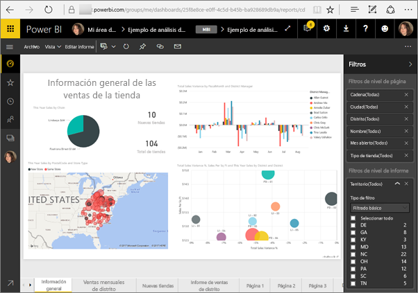
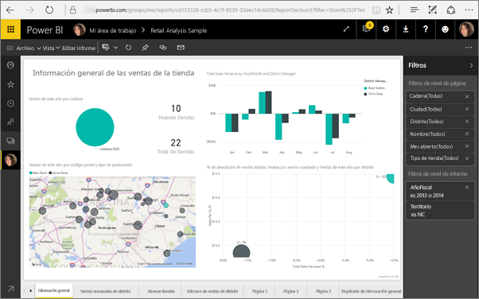
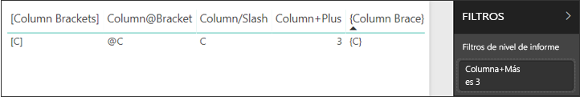
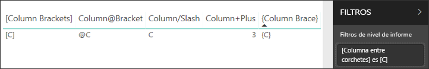

# <a name="filter-a-report-using-query-string-parameters-in-the-url"></a>Filtro de un informe con parámetros de cadena de consulta en la URL

Al abrir un informe en el servicio Power BI, cada página del informe tiene su propia URL única. Para filtrar esa página del informe, podría utilizar el panel Filtros del lienzo de informes.  También podría agregar parámetros de cadena de consulta a la dirección URL para filtrar previamente el informe. Es posible que tenga un informe que quiera prefiltrarlo para mostrarlo a sus compañeros. Una manera de hacerlo es comenzar con la dirección URL predeterminada del informe, agregarle los parámetros de filtro y luego enviar por correo electrónico la nueva dirección URL completa.



## <a name="uses-for-query-string-parameters"></a>Usos de los parámetros de cadena de consulta

Supongamos que está trabajando en Power BI Desktop y quiere crear un informe con vínculos a otros informes de Power BI, pero solo quiere mostrar parte de la información de los otros informes. En primer lugar, filtre los informes con parámetros de cadena de consulta y guarde las direcciones URL. Luego, cree una tabla en Desktop con estas nuevas direcciones URL de informe.  Por último, publique y comparta el informe.

Otro uso de los parámetros de cadena de consulta es para un usuario que va a crear una solución avanzada de Power BI.  Con DAX, crea un informe que genera una dirección URL de informe filtrada basada dinámicamente en la selección que hace su cliente en el informe actual. Cuando los clientes seleccionan la dirección URL, solo ven la información que esperan. 

## <a name="query-string-parameter-syntax-for-filtering"></a>Sintaxis de parámetro de cadena de consulta para filtrar

Con los parámetros, puede filtrar el informe por uno o varios valores, aunque esos valores contengan espacios o caracteres especiales. La sintaxis básica es bastante sencilla: empiece con la dirección URL del informe, agregue un signo de interrogación y luego incorpore la sintaxis de filtro.

URL?filter=***Tabla***/***Campo*** eq '***valor***'


* Los nombres de **Tabla** y **Campo** distinguen mayúsculas de minúsculas, pero **valor** no.
* Todavía se pueden seguir filtrando los campos que están ocultos en la vista de informes.

### <a name="field-types"></a>Tipos de campos

El tipo de campo puede ser un valor de número, fecha y hora o cadena y el tipo usado debe coincidir con el tipo establecido en el conjunto de datos.  Por ejemplo, especificar una columna de tabla de tipo "cadena" no funciona si está buscando un valor de fecha y hora o número en una columna de conjunto de datos establecida como una fecha (por ejemplo, Table/StringColumn eq 1).

* Las **cadenas** deben incluirse entre comillas simples: 'nombre de administrador'.
* Los **números** no requieren ningún formato especial
* Las **fechas y horas** deben escribirse entre comillas simples y deben ir precedidas de la palabra **DateTime**.

Si le sigue sin quedar claro, siga leyendo.  

## <a name="filter-on-a-field"></a>Filtrado por un campo

Supongamos que la URL del informe es la siguiente.


Y que tenemos almacenes en Carolina del Norte, tal como vemos en nuestra visualización de mapas (arriba).

>[!NOTE]
>Este artículo se basa en el ejemplo de [análisis de minoristas](sample-datasets.md).
> 

Para filtrar el informe para que solo muestre los datos de tiendas de "NC" (Carolina del Norte), anexe la URL con lo siguiente:

?filter=Tienda/Territorio eq 'NC'


>[!NOTE]
>*NC* es un valor almacenado en el campo **Territorio** de la tabla **Almacén**.
> 

El informe se filtra por North Carolina; todas las visualizaciones de la página del informe solo muestran datos de Carolina del Norte.



## <a name="filter-on-multiple-fields"></a>Filtrado por varios campos

También puede filtrar por varios campos agregando parámetros adicionales a la dirección URL. Volvamos a nuestro parámetro de filtro original.

```
?filter=Store/Territory eq 'NC'
```

Para filtrar por otros campos, agregue **and** y otro campo en el mismo formato que el mostrado arriba. Este es un ejemplo.

```
?filter=Store/Territory eq 'NC' and Store/Chain eq 'Fashions Direct'
```

<iframe width="640" height="360" src="https://www.youtube.com/embed/0sDGKxOaC8w?showinfo=0" frameborder="0" allowfullscreen></iframe>

## <a name="operators"></a>Operadores

Power BI admite muchos operadores además de **and**. En la tabla siguiente se indican esos operadores junto con el tipo de contenido que admiten.

|operador  | definición | cadena  | número | Fecha |  Ejemplo|
|---------|---------|---------|---------|---------|---------|
|**and**     | y |  sí      | sí |  sí|  product/price le 200 and price gt 3.5 |
|**eq**     | es igual a |  sí      | sí   |  sí       | Address/City eq 'Redmond' |
|**ne**     | no igual |   sí      | sí  | sí        |  Address/City ne 'London' |
|**ge**     |  mayor o igual       | no | sí |sí |  product/price ge 10
|**gt**     | mayor que        |no | sí | sí  | product/price gt 20
|**le**     |   menor o igual      | no | sí | sí  | product/price le 100
|**lt**     |  menor que       | no | sí | sí |  product/price lt 20
|**in****     |  incluido       | no | no |  sí | Student/Age in (27, 29)


\** Al usar **in**, los valores a la derecha de **in** pueden ser una lista separada por comas entre paréntesis o una sola expresión que devuelve una colección.

### <a name="numeric-data-types"></a>Tipos de datos numéricos

Un filtro de dirección URL de Power BI puede incluir números en los siguientes formatos.

|Tipo de número  |Ejemplo  |
|---------|---------|
|**integer**     |   5      |
|**long**     |   5L o 5l      |
|**double**     |   5,5 o 55e-1 o 0,55e+1 o 5D o 5d o 0,5e1D o 0,5e1d o 5,5D o 5,5d o 55e-1D o 55e-1d     |
|**decimal**     |   5M o 5m o 5,5M o 5,5m      |
|**float**     | 5F o 5f o 0,5e1F o 0,5e-1d        |

### <a name="date-data-types"></a>Tipos de datos de fecha

Power BI admite OData V3 y V4 para tipos de datos **Date** y **DateTimeOffset**.  Las fechas se representan con el formato EDM (2019-02-12T00:00:00). Eso significa que cuando se especifica una fecha como aaaa-MM-DD, Power BI la interpreta como aaaa-MM-DDT00:00:00.

Por qué importa esta distinción Supongamos que crea un parámetro de cadena de consulta **Table/Date gt 2018-08-03**.  La duda es si los resultados incluyen el 3 de agosto de 2018 o empiezan con el 4 de agosto de 2018. Puesto que Power BI convierte la consulta en **Table/Date gt 2018-08-03T00:00:00**, los resultados incluyen todas las fechas con una parte de hora distinta de cero, ya que esas fechas son mayores que **2018-08-03T00:00:00**.

## <a name="special-characters-in-url-filters"></a>Caracteres especiales en filtros de URL

Los espacios y los caracteres especiales requieren algún formato adicional. Cuando la consulta contiene espacios, guiones u otros caracteres no ASCII, agregue un prefijo a esos caracteres especiales con un *código de escape* (**_x**) y el valor **Unicode** de cuatro dígitos. Si el valor Unicode tiene menos de cuatro caracteres, debe rellenarlo con ceros. Estos son algunos ejemplos.

|Identificador  |Unicode  | Codificación para Power BI  |
|---------|---------|---------|
|**Nombre de tabla**     | Espacio: 0x20        |  Table_x0020_Name       |
|**Columna**@**Número**     |   @: 0x40     |  Column_x0040_Number       |
|**[Columna]**     |  [:0x005B ]:0x0050       |  _x0058_Column_x0050       |
|**Columna+Más**     | +:0x2B        |  Column_x002B_Plus       |

Table_x0020_Name/Column_x002B_Plus eq 3 


Table_x0020_Special/_x005B_Column_x0020_Brackets_x005D_ eq '[C]' 

### <a name="use-dax-to-filter-on-multiple-values"></a>Usar DAX para filtrar por varios valores

Otra manera de filtrar por varios campos es crear una columna calculada que concatene dos campos a un único valor. Después, puede filtrar por ese valor.

Por ejemplo, tenemos dos campos: Territorio y Cadena. En Power BI Desktop, [cree una nueva columna calculada](desktop-tutorial-create-calculated-columns.md) (Campo) denominada "TerritoryChain". Recuerde que el nombre del **campo** no puede contener espacios. Esta es la fórmula DAX para esa columna.

TerritoryChain = [Territorio] & " - " & [Cadena]

Publique el informe en el servicio Power BI y, luego, use la cadena de consulta de URL para filtrar y mostrar los datos de solo las tiendas Lindseys de Carolina del Norte.

    https://app.powerbi.com/groups/me/reports/8d6e300b-696f-498e-b611-41ae03366851/ReportSection3?filter=Store/TerritoryChain eq 'NC–Lindseys'

## <a name="pin-a-tile-from-a-filtered-report"></a>Anclaje de un icono desde un informe filtrado

Una vez que se ha filtrado el informe con parámetros de cadena de consulta, puede anclar visualizaciones de ese informe al panel.  El icono del panel mostrará los datos filtrados. Al seleccionar ese icono del panel se abrirá el informe que se usó para crearlo.  Sin embargo, el filtrado que se realizó utilizando la URL no se guarda con el informe y, si se selecciona el icono del panel, el informe se abre con su estado sin filtrar.  Es decir, los datos mostrados en el icono del panel no coincidirán con los que aparecen en la visualización de informes.

Esto resulta útil cuando se quieren ver resultados diferentes: filtrados en el panel y sin filtrar en el informe.

## <a name="considerations-and-troubleshooting"></a>Consideraciones y solución de problemas

Hay un par de cosas que tener en cuenta al utilizar los parámetros de cadena de consulta.

* Cuando se usa el operador *in*, los valores a la derecha de *in* deben ser una lista separada por comas entre paréntesis.    
* En Power BI Report Server, puede [pasar parámetros de informes](https://docs.microsoft.com/sql/reporting-services/pass-a-report-parameter-within-a-url?view=sql-server-2017.md) incluyéndolos en una URL de informe. Estos parámetros de URL no tienen prefijo porque se pasan directamente al motor de procesamiento de informes.
* El filtrado de cadena de consulta no funciona con [Publicar en la web](service-publish-to-web.md) ni con Power BI Embedded.   
* El tipo de datos long es (2^53-1) debido a las limitaciones de Javascript.

## <a name="next-steps"></a>Pasos siguientes

[Anclar una visualización a un informe](service-dashboard-pin-tile-from-report.md)  
[Registrarse para obtener una evaluación gratuita](https://powerbi.microsoft.com/get-started/)

¿Tiene más preguntas? [Pruebe a preguntar a la comunidad de Power BI](http://community.powerbi.com/)
