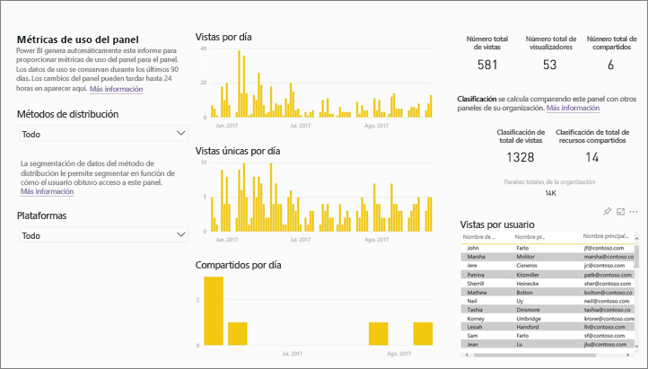
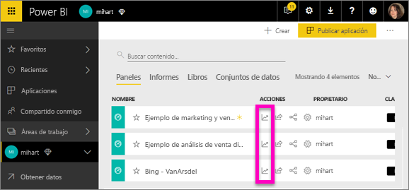
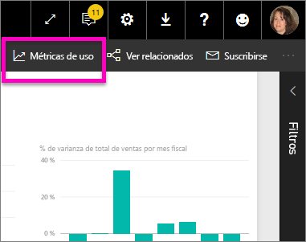
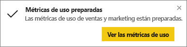
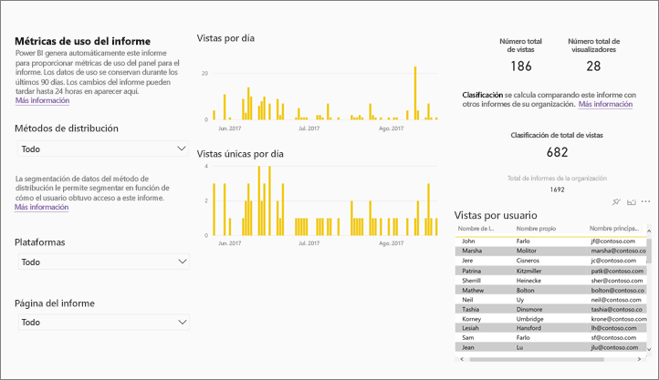
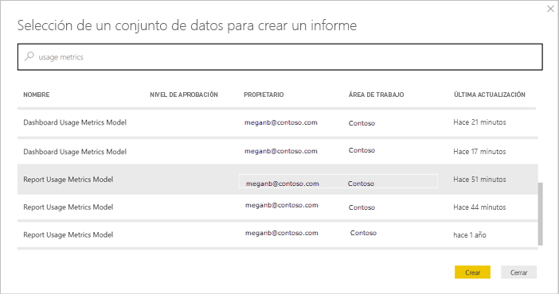
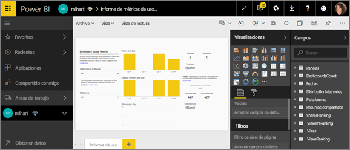
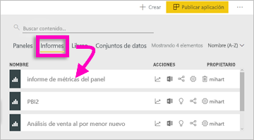
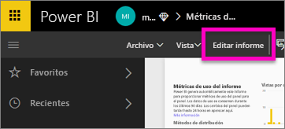
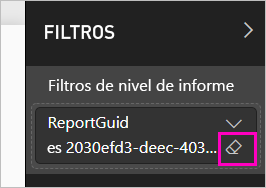

# Supervisar las métricas de uso de paneles e informes de Power BI

Si desea crear paneles e informes, las métricas de uso le ayudan a conocer su impacto. Al ejecutar métricas de uso de panel o de uso de informe, verá cómo se usan estos paneles e informes en toda la organización; qué es lo que se está utilizando en la organización, quién lo usa y con qué finalidad.  

Estos informes de métricas de uso son de solo lectura. Sin embargo, puede copiarlos. Al hacerlo, se crea un informe de Power BI estándar que se puede editar. También puede crear sus propios informes en Power BI Desktop, según el conjunto de datos subyacente, que contiene las métricas de uso para todos los paneles o informes en un área de trabajo. Para empezar, el informe copiado muestra métricas solo del panel o el informe seleccionados. Puede quitar el filtro predeterminado y tener acceso al conjunto de datos subyacente, con todas las métricas de uso del área de trabajo seleccionada. Incluso puede ver los nombres de usuarios específicos si el administrador´lo ha permitido.

> [!NOTE]
> Las métricas de uso hacen un seguimiento del uso de los informes que se insertan en SharePoint Online. Sin embargo, no hacen un seguimiento de los paneles e informes insertados mediante el flujo "el usuario posee las credenciales" o "la aplicación posee las credenciales". Las métricas de uso no hacen un seguimiento del uso de los informes insertados mediante [Publicar en la Web](service-publish-to-web.md).

## ¿Por qué son importantes las métricas de uso?

Conocer cómo se usa el contenido le ayuda a demostrar su impacto y a priorizar sus esfuerzos. Las métricas de uso pueden mostrarle que un segmento considerable de la organización utiliza a diario uno de sus informes y también que un panel que creó no lo está viendo nadie. Este tipo de comentario es muy valioso a la hora de dirigir los esfuerzos de trabajo que realiza.

Solo se pueden ejecutar informes de métricas de uso en el servicio Power BI. Sin embargo, si guarda un informe de métricas de uso o lo ancla a un panel, puede abrirlo e interactuar con ese informe en dispositivos móviles.

## Requisitos previos

- Para ejecutar los datos de métricas de uso y acceder a ellos se necesita una licencia de Power BI Pro. Sin embargo, la característica de métricas de uso permite capturar información de uso de todos los usuarios, sea cual sea la licencia que tengan asignada.
- Para acceder a las métricas de uso de un determinado panel o informe, debe tener acceso de edición a ese panel o informe.
- El administrador de Power BI debe tener habilitadas las métricas de uso para creadores de contenido. Asimismo, es posible que este también haya habilitado la recopilación de datos por usuario en las métricas de uso. Obtenga información sobre cómo [habilitar estas opciones en el portal de administración](service-admin-portal.md#control-usage-metrics). 

## Visualización de un informe de métricas de uso

1. Comience en el área de trabajo que contiene el panel o el informe.
2. En la lista de contenido del área de trabajo o en el panel o el propio informe, seleccione el icono de **Métricas de uso** .

    

    
3. La primera vez que lo haga, Power BI creará el informe de métricas de uso y le informará cuando esté listo.

    
4. Para ver los resultados, seleccione **Ver métricas de uso**.

    Las métricas de uso son un eficaz aliado mientras se trabaja para implementar y mantener los informes y paneles de Power BI. ¿Se pregunta qué páginas del informe son las más útiles y cuáles se deben eliminar gradualmente? Puede segmentar por **página del informe** para averiguarlo. ¿Se pregunta si debe crear un diseño móvil para el panel? Puede segmentar por **Plataformas** para descubrir cuántos usuarios tienen acceso a su contenido a través de las aplicaciones móviles en comparación con los que acceden a través del explorador web.

5. Si lo desea, mantenga el puntero sobre una visualización y seleccione el icono de anclaje para agregar la visualización a un panel. También, en la barra de menús superior, seleccione **Página Anclar elemento activo** para agregar la página completa a un panel. Desde el panel puede supervisar las métricas de uso más fácilmente o compartirlas con otras personas.

    > [!NOTE]
    > Si ancla un icono desde un informe de métricas de uso a un panel, dicho panel no se podrá agregar a una aplicación.

### Informe de métricas de uso del panel

### Informe de métricas de uso del informe

## Información acerca del informe de métricas de uso

Cuando se selecciona **Métricas de uso** o el icono  situado junto a un panel o informe, Power BI genera un informe compilado previamente con métricas de uso de dicho contenido para los últimos 90 días.  Este informe es muy similar a los informes de Power BI con los que ya está familiarizado. Podrá segmentarlo en función de cómo han obtenido acceso sus usuarios finales: si ha sido a través de la Web o de una aplicación móvil, etc. A medida que los paneles e informes evolucionen, evolucionará igualmente el informe de métricas de uso, que se actualiza a diario con nuevos datos.  

Los informes de métricas de uso no aparecen en **Recientes**, **Áreas de trabajo**, **Favoritos** ni otras listas de contenido. Tampoco se pueden agregar a una aplicación. Si ancla un icono desde un informe de métricas de uso a un panel, dicho panel no se podrá agregar a una aplicación.

Para profundizar en los datos del informe, o para crear los suyos propios con el conjunto de datos subyacente, tiene dos opciones: 

- Realice una copia del informe en el servicio Power BI. Consulte la sección [Guardado de una copia del informe de métricas de uso](#save-a-copy-of-the-usage-metrics-report) de más abajo en este artículo para obtener más información.
- Conéctese al conjunto de datos desde Power BI Desktop. Para cada área de trabajo, el conjunto de datos tiene el nombre "Modelo de métricas de uso de informes". Consulte la sección sobre cómo [establecer una conexión con un conjunto de datos publicado](desktop-report-lifecycle-datasets.md#establish-a-power-bi-service-live-connection-to-the-published-dataset) para obtener más información.

    

## ¿Qué métricas se incluyen en el informe?

| Métrica | panel | Informe | Descripción |
| --- | --- | --- | --- |
| Segmentación por método de distribución |sí |sí |Modo de acceso de los usuarios al contenido. Hay tres métodos posibles: los usuarios pueden acceder al panel o al informe por ser miembros de un [área de trabajo](consumer/end-user-experience.md), por tener contenido [compartido con ellos](service-share-dashboards.md) o por instalar una aplicación o paquete de contenido.  Observe que las vistas realizadas mediante una aplicación cuentan como "paquete de contenido". |
| Segmentación por plataforma |sí |sí |¿Se tuvo acceso al panel o informe a través del servicio Power BI (powerbi.com) o mediante un dispositivo móvil? Los dispositivos móviles incluyen todas las aplicaciones iOS, Android y Windows. |
| Segmentación por páginas de informe |no |sí |Si el informe tiene más de una página, se segmenta el informe por las páginas que se han visto. Si ve una opción de lista de "En blanco", significa que recientemente se ha agregado una página del informe (en un plazo de 24 horas, aparece el nombre real de la nueva página en la lista de segmentación) o se han eliminado páginas del informe. "En blanco" captura estos tipos de situaciones. |
| Vistas por día |sí |sí |Número total de vistas por día: una vista se define como la carga de una página del informe o un panel por parte del usuario. |
| Vistas únicas por día |sí |sí |Número de usuarios *diferentes* que han visto el panel o informe (basado en la cuenta de usuario de AAD). |
| Vistas por usuario |sí |sí |Número de vistas en los últimos 90 días, desglosado por usuarios individuales. |
| Compartidos por día |sí |no |Número de veces que el panel se compartió con otro usuario o grupo. |
| Número total de vistas |sí |sí |Número de vistas en los últimos 90 días. |
| Número total de visualizadores |sí |sí |Número de visualizadores únicos en los últimos 90 días. |
| Número total de compartidos |sí |no |Número de veces que el panel o informe se compartió en los últimos 90 días. |
| Total en la organización |sí |sí |Recuento de todos los paneles o informes en toda la organización que han tenido al menos una vista en los últimos 90 días.  Se usa para calcular la clasificación. |
| Clasificación: Número total de vistas |sí |sí |Para el número total de vistas de todos los paneles e informes de la organización en los últimos 90 días, posición en la que se clasifica este panel o informe. |
| Clasificación: Número total de compartidos |sí |no |Para el número total de compartidos de todos los paneles e informes de la organización en los últimos 90 días, posición en la que se clasifica este panel o informe. |

## Guardado de una copia del informe de métricas de uso

Use **Guardar como** para convertir el informe de métricas de uso a uno de Power BI normal que puede personalizar para satisfacer sus necesidades específicas. También puede usar Power BI Desktop para crear informes de métricas de uso personalizados según el conjunto de datos subyacente. Consulte la sección sobre cómo [establecer una conexión con un conjunto de datos publicado](desktop-report-lifecycle-datasets.md#establish-a-power-bi-service-live-connection-to-the-published-dataset) para obtener más información.

Más aún, el conjunto de datos subyacente incluye los detalles de uso para todos los paneles o informes en el área de trabajo. Esto le brinda más posibilidades. Por ejemplo, podría crear un informe que comparara todos los paneles del área de trabajo en función del uso. También podría crear un panel de métricas de uso para la aplicación Power BI agregando el uso de todo el contenido distribuido dentro de esa aplicación.  Vea cómo quitar el filtro y [ver todas las métricas de uso del área de trabajo](#see-all-workspace-usage-metrics) más adelante en este artículo.

### Creación de una copia del informe de uso

Cuando crea una copia del informe de uso pregenerado y de solo lectura, Power BI crea una copia modificable de dicho informe. A primera vista, parece exactamente el mismo. Sin embargo, ahora podrá abrir el informe en la vista Edición; agregar nuevas visualizaciones, filtros y páginas; modificar o eliminar visualizaciones existentes, y mucho más. Power BI guarda el nuevo informe en el área de trabajo actual.

1. En el informe de métricas de uso pregenerado, seleccione **Archivo > Guardar como**. Power BI crea un informe de Power BI editable y lo guarda en el área de trabajo actual.

    
2. Abra el informe en vista de edición e [interactúe con él como lo haría con cualquier otro informe de Power BI](service-interact-with-a-report-in-editing-view.md). Por ejemplo, agregar nuevas páginas y crear nuevas visualizaciones, agregar filtros, dar formato a las fuentes y colores, etc.

    
3. El nuevo informe se guarda en la pestaña **Informes** del área de trabajo actual y se agrega también a la lista de contenido **Recientes**.

    

## Visualización de *todas* las métricas de uso del área de trabajo

Para ver las métricas de todos los paneles o informes del área de trabajo, tendrá que quitar un filtro. De forma predeterminada, el informe se filtra para mostrar métricas solo del panel o informe que se usó para crearlo.

1. Seleccione **Editar informe** para abrir el informe editable en la vista Edición.

    
2. En el panel Filtros, busque el cubo **Filtros de nivel de informe** y quite el filtro seleccionando el borrador junto a **ReportGuid**.

    

    Ahora el informe muestra las métricas de toda el área de trabajo.

## Controles de administración de Power BI para las métricas de uso

Los informes de métricas de uso son una característica que el administrador de Power BI u Office 365 puede activar o desactivar. Los administradores tienen control granular sobre qué usuarios tienen acceso a las métricas de uso. Estas están **activas** de manera predeterminada para todos los usuarios de la organización.

> [!NOTE]
> Solo los administradores del inquilino de Power BI pueden ver el portal de administración y editar la configuración. 

Los datos por usuario están habilitados de forma predeterminada en las métricas de uso, mientras que el informe de métricas incluye información sobre la cuenta del consumidor de contenido. Si los administradores prefieren no incluir esta información de algunos de los usuarios o de ninguno, deshabilite la característica para los grupos de seguridad en cuestión o para toda la organización. En tal caso, la información de la cuenta aparece en el informe como *Sin nombre*.

Al deshabilitar las métricas de uso para toda la organización, los administradores pueden utilizar la opción **Elimine todo el contenido existente de las métricas de uso** para eliminar todos los iconos de informes y paneles existentes que se compilaron mediante los informes de métricas de uso. Esta opción permite eliminar todos los accesos a los datos de métricas de uso de todos los usuarios de la organización que ya los puedan estar usando. La eliminación del contenido de las métricas de uso existentes es irreversible.

Consulte [Control de métricas de uso](service-admin-portal.md#control-usage-metrics) en el artículo del portal de administrador para obtener más información sobre estas opciones. 

## Métricas de uso en nubes nacionales

Power BI está disponible en nubes nacionales independientes. Dichas nubes ofrecen los mismos niveles de seguridad, privacidad, cumplimiento y transparencia que la versión global de Power BI, y todo ello se combina con un modelo único para las regulaciones locales relativas a la prestación de servicios y al acceso, control y residencia de datos. Dado que se trata de un modelo único para las regulaciones locales, las métricas de uso no están disponibles en las nubes nacionales. Para obtener más información, consulte el tema relativo a las [nubes nacionales](https://powerbi.microsoft.com/clouds/).

## Consideraciones y limitaciones

### Discrepancias entre los registros de auditoría y las métricas de uso

Es importante comprender qué diferencias pueden producirse al comparar métricas de uso y registros de auditoría y por qué. Los *registros de auditoría* se recopilan utilizando datos del servicio Power BI, mientras que las *métricas de uso* se recopilan en el cliente. Los recuentos de agregados de las actividades en los registros de auditoría podrían no coincidir siempre con las métricas de uso por los siguientes motivos:

* En ocasiones, las métricas de uso pueden no contar actividades debido a conexiones de red desiguales, bloqueadores de anuncios y otros problemas que pueden interrumpir el envío de los eventos desde el cliente.
* Ciertos tipos de vistas no se incluyen en las métricas de uso, como se ha descrito anteriormente en este artículo.
* En ocasiones, las métricas de uso pueden no contar actividades en situaciones en las que el cliente se actualiza sin necesidad de devolver una solicitud al servicio Power BI.

### Otras consideraciones

Debe ver el contenido del área de trabajo, desde el interior de esa área de trabajo, al menos una vez. Si no ve el contenido del área de trabajo al menos una vez, los datos no podrán relacionarse con las vistas de la aplicación en el informe de métricas de uso. Para desbloquear el procesamiento de datos de este informe, solo tiene que ver el contenido del área de trabajo al menos una vez.

## Preguntas más frecuentes

Además de las posibles diferencias entre métricas de uso y registros de auditoría, las siguientes preguntas y respuestas sobre las métricas de uso pueden ser útiles para los usuarios y administradores:

**P:**    No puedo ejecutar métricas de uso en un panel o informe.

**R:**    R: Solo puede ver métricas de uso para el contenido del que es propietario o para el que tenga permisos de edición.

**P:**    ¿Las métricas de uso capturan vistas de los informes y paneles insertados?

**R:**    Actualmente, las métricas de uso no permiten capturar el uso de paneles insertados, informes y el flujo [Publicar en la web](service-publish-to-web.md). En esos casos, se recomienda utilizar las plataformas de análisis web existentes para realizar un seguimiento del uso del portal o la aplicación de hospedaje.

**P:**    No puedo ejecutar métricas de uso en ningún contenido.

**R1:**    Los administradores pueden desactivar esta característica para su organización.  Póngase en contacto con su administrador para comprobar si este es el caso.

**R2:**    Las métricas de uso son una característica de Power BI Pro.

**P:**    Los datos no parecen actualizados. Por ejemplo, los métodos de distribución no aparecen, faltan de páginas del informe, etc.

**R:**    Los datos pueden tardar hasta 24 horas en actualizarse.

**P:**    Hay cuatro informes en el área de trabajo, pero el informe de métricas de uso solo muestra tres.

**R:**    El informe de métricas de uso solo incluye informes (o paneles) a los que se haya accedido en los últimos 90 días.  Si un informe (o un panel) no aparece, es probable que no se haya usado en más de 90 días.

## Pasos siguientes

[Administración de Power BI en el portal de administración](service-admin-portal.md)

¿Tiene más preguntas? [Pruebe la comunidad de Power BI](https://community.powerbi.com/)
