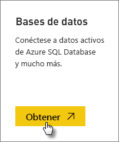
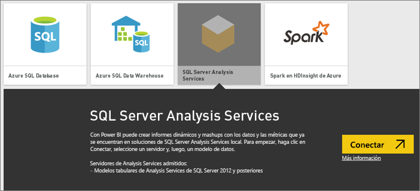
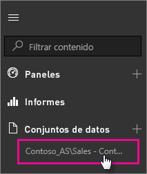

# Datos activos de SQL Server Analysis Services en Power BI

En Power BI hay dos maneras de conectarse a un servidor activo de SQL Server Analysis Services. En **Obtener datos**, puede conectarse a un servidor de SQL Server Analysis Services, o bien puede conectarse a un [archivo de Power BI Desktop](service-desktop-files.md) o a un [libro de Excel](service-excel-workbook-files.md) que ya está conectado a un servidor de Analysis Services. Como procedimiento recomendado, Microsoft recomienda encarecidamente que se use Power BI Desktop por la calidad del conjunto de herramientas y la capacidad de mantener una copia de seguridad del archivo de Power BI Desktop de forma local.

>[!IMPORTANT]
> * Para conectarse a un servidor activo de Analysis Services, un administrador debe instalar y configurar una puerta de enlace de datos local. Para más información, consulte [Puerta de enlace de datos local](service-gateway-onprem.md).
> * Cuando se usa la puerta de enlace, los datos permanecen en local.  Los informes que se crean en función de los datos se guardan en el servicio Power BI. 
> * [La consulta en lenguaje natural de preguntas y respuestas](service-q-and-a-direct-query.md) se encuentra en versión preliminar para las conexiones activas de Analysis Services.

## Para conectarse a un modelo desde Obtener datos

1. En **Mi área de trabajo**, seleccione **Obtener datos**. También puede cambiar a un área de trabajo de grupo, si está disponible.

   

2. Seleccione **Bases de datos y más**.

   

3. Seleccione **SQL Server Analysis Services** > **Conectar**.

   

4. Seleccione un servidor. Si no ve ningún servidor enumerado aquí, significa que una puerta de enlace, y un origen de datos, no están configurados, o que la cuenta no aparece en la ficha **Usuarios** del origen de datos, en la puerta de enlace. Consulte con su administrador.

5. Seleccione el modelo al que desea conectarse. Podría ser Tabular o Multidimensional.

Después de conectarse al modelo, aparecerá en su sitio de Power BI en **Mi área de trabajo/Conjuntos de datos**. Si se le ha cambiado a un área de trabajo de grupo, el conjunto de datos aparecerá dentro del grupo.

## Los iconos de panel

Si ancla objetos visuales de un informe en el panel, los iconos anclados se actualizan automáticamente cada 10 minutos. Si se actualizan los datos en el servidor local de Analysis Services, los iconos se actualizarán de forma automática después de 10 minutos.

## Problemas comunes

* No se puede cargar el error del esquema de modelo: este error se produce cuando el usuario que se conecta a SSAS no tiene acceso a la base de datos SSAS, el cubo y el modelo.

## Pasos siguientes

* [On-premises Data Gateway (Puerta de enlace de datos local)](service-gateway-onprem.md)  
* [Administrar orígenes de datos de Analysis Services](service-gateway-enterprise-manage-ssas.md)  
* [Solución de problemas con la puerta de enlace de datos local](service-gateway-onprem-tshoot.md)  

¿Tiene más preguntas? [Pruebe la comunidad de Power BI](http://community.powerbi.com/)