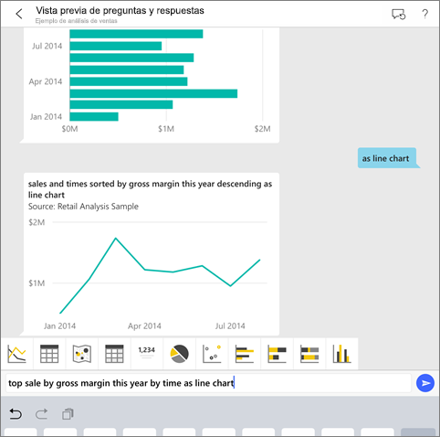
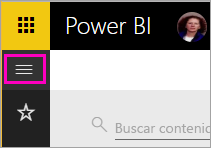
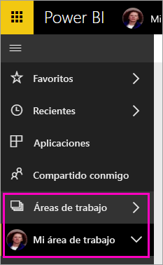
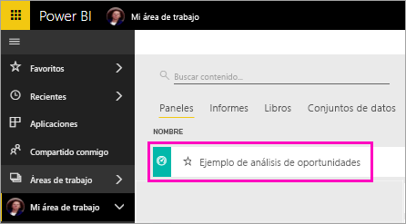
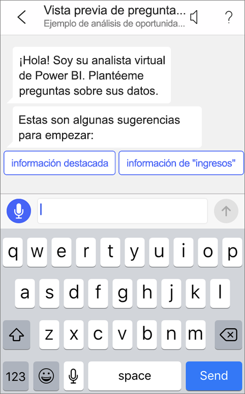

# Tutorial: Formular preguntas sobre los datos con el analista virtual de Preguntas y respuestas en las aplicaciones de iOS: Power BI

La manera más fácil de obtener información acerca de los datos es realizar preguntas con sus propias palabras. En este tutorial, puede plantear preguntas y ver información destacada sobre los datos de ejemplo con el analista virtual de Preguntas y respuestas en la aplicación móvil de Microsoft Power BI en su iPad, iPhone y iPod Touch. 

Se aplica a:

|  |  |
|:--- |:--- |
| iPhone |iPad |

El analista virtual de Preguntas y respuestas es una experiencia de inteligencia empresarial de conversación que accede a los datos subyacentes de Preguntas y respuestas del servicio Power BI [(https://powerbi.com)](https://powerbi.com). Sugiere información sobre los datos, y puede escribir o expresar sus propias preguntas.

En este tutorial, tendrá que:

> [!div class="checklist"]
> * Instalar la aplicación móvil Power BI para iOS
> * Descargar un panel e informe de ejemplo de Power BI
> * Ver qué información destacada sugiere la aplicación móvil

Si no está registrado en Power BI, [regístrese para obtener una evaluación gratuita](https://app.powerbi.com/signupredirect?pbi_source=web) antes de empezar.

## Requisitos previos

### Instalación de la aplicación de Power BI para iOS
[Descargar la aplicación de iOS](http://go.microsoft.com/fwlink/?LinkId=522062 "Descargue la aplicación de iPhone") desde App Store de Apple para su iPad, iPhone o iPod Touch.

Estas versiones admiten la aplicación de Power BI para iOS:
- iPad con iOS 10 o posterior.
- iPhone 5 y versiones posteriores, con iOS 10 o posterior. 
- iPod Touch con iOS 10 o posterior.

### Descarga del ejemplo de análisis de oportunidades
El primer paso del tutorial consiste en descargar el ejemplo de análisis de oportunidades en el servicio Power BI.

1. Abra el servicio Power BI en el explorador (app.powerbi.com) e inicie sesión.

1. Seleccione el icono de navegación global para abrir el panel izquierdo.

    

2. En el panel de navegación izquierdo, seleccione **Áreas de trabajo** > **Mi área de trabajo**.

    

3. En la esquina inferior izquierda, seleccione **Obtener datos**.
   
    

3. En la página Obtener datos, seleccione el icono **Ejemplos**.
   
   

4. Seleccione el **ejemplo de análisis de oportunidades**.
 
    
 
8. Seleccione **Conectar**.  
  
   
   
5. Power BI importa el ejemplo y agrega un nuevo panel, informe y conjunto de datos en la sección Mi área de trabajo.
   
   

Pues bien, ya está listo para ver el ejemplo en el dispositivo iOS.

## Probar la información destacada
1. En su iPhone o iPad, abra la aplicación de Power BI e inicie sesión con las credenciales de la cuenta de Power BI, las mismas que usó en el servicio Power BI en el explorador.

1.  Pulse el botón de navegación global  > **Áreas de trabajo** > **Mi área de trabajo** y abra el panel del ejemplo de análisis de oportunidades.

2. Pulse en el icono del analista virtual de Preguntas y respuestas  en el menú de acciones, en la parte inferior de la página (en la parte superior de la página en un iPad).

     

     El analista virtual de Preguntas y respuestas de Power BI ofrece algunas sugerencias para empezar a trabajar.

     
3. Pulse **featured insights** (información destacada).

     El analista virtual de Preguntas y respuestas sugiere información.
4. Desplácese a la derecha y pulse **Insight 2** (Información 2).

    

     El analista virtual de Preguntas y respuestas muestra Insight 2 (Información 2).

    
5. Pulse el gráfico para abrirlo en modo de enfoque.

    
6. Pulse la flecha de la esquina superior izquierda para volver a la ventana de la experiencia del analista virtual de Preguntas y respuestas.

## Limpieza de recursos

Cuando complete el tutorial, puede eliminar el panel, el informe y el conjunto de datos del ejemplo de análisis de oportunidades.

1. Abra el servicio Power BI (app.powerbi.com) e inicie sesión.

2. En el panel de navegación izquierdo, seleccione **Áreas de trabajo** > **Mi área de trabajo**.

3. En la pestaña **Paneles**, seleccione el icono **Eliminar** de papelera situado junto al panel de análisis de oportunidades.

    

4. Seleccione la pestaña **Informes** y haga lo mismo con el informe de análisis de oportunidades.

5. Seleccione la pestaña **Conjuntos de datos** y haga lo mismo con el conjunto de datos de análisis de oportunidades.

## Pasos siguientes

Ha probado el asistente virtual de Preguntas y respuestas en las aplicaciones móviles de Power BI para iOS. Obtenga más información sobre Preguntas y respuestas en el servicio Power BI.
> [!div class="nextstepaction"]
> [Preguntas y respuestas en el servicio Power BI](/.power-bi-q-and-a.md)

