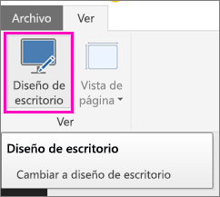
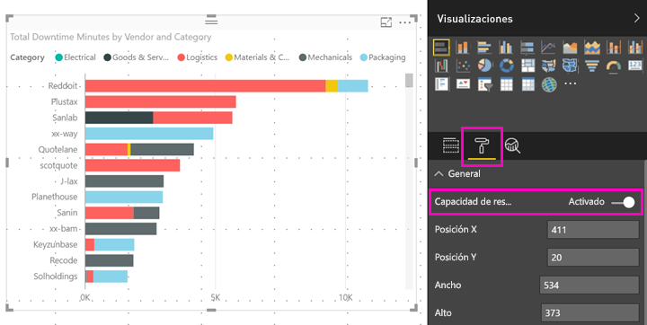

# Optimización de un objeto visual de Power BI de cualquier tamaño
De manera predeterminada, cuando se cree un nuevo informe, los objetos visuales tienen *capacidad de respuesta*: cambian de forma dinámica para mostrar la máxima cantidad de datos, independientemente del tamaño de la pantalla. Para los informes anteriores, puede establecer también sus objetos visuales para que cambien de tamaño de forma dinámica.

A medida que cambia el tamaño de un objeto visual, Power BI prioriza la vista de datos, por ejemplo, eliminando el relleno y desplazando la leyenda de la parte superior del objeto visual automáticamente, para que este siga siendo informativo aunque se haga de menor tamaño. La capacidad de respuesta es especialmente útil para los objetos visuales de la aplicación móvil de Power BI en teléfonos.

Cualquier elemento visual con ejes X e Y, y segmentaciones, puede responder cambiando de tamaño.

## Activación de la capacidad de respuesta en Power BI Desktop
1. En un informe anterior de Power BI Desktop, en la pestaña **Vista**, asegúrese de que se encuentra en **Diseño de escritorio**.
   
    
2. Seleccione un objeto visual y en el panel de **visualizaciones**, seleccione la sección **Formato**.
3. Expanda **General** > deslice el control **Capacidad de respuesta** a **On**.
   
    
   
     Ahora cuando [cree un informe optimizado para el teléfono](../desktop-create-phone-report.md) y agregue este objeto visual, este cambiará de tamaño de forma correcta.

## Activación de la capacidad de respuesta en el servicio Power BI
Puede activar la capacidad de respuesta de un objeto visual en un informe anterior en el servicio Power BI. Debe ser capaz de editar el informe.

1. En un informe del servicio Power BI ([https://powerbi.com](https://powerbi.com)), seleccione **Editar informe**.
2. Seleccione un objeto visual y en el panel de **visualizaciones**, seleccione la sección **Formato**.
3. Expanda **General** > deslice el control **Capacidad de respuesta** a **On**.
   
    
   
     Ahora cuando [cree una vista de teléfono de este informe](../desktop-create-phone-report.md) y agregue este objeto visual, este cambiará de tamaño de forma correcta.

## Pasos siguientes
* [Crear informes optimizados para las aplicaciones de teléfono de Power BI](../desktop-create-phone-report.md)
* [Ver informes de Power BI optimizados para el teléfono](../consumer/mobile/mobile-apps-view-phone-report.md)
* ¿Tiene más preguntas? [Pruebe a preguntar a la comunidad de Power BI](http://community.powerbi.com/)

