# Creación de visualizaciones de matriz en Power BI

[!INCLUDE [power-bi-visuals-desktop-banner](../includes/power-bi-visuals-desktop-banner.md)]

El objeto visual de matriz es similar a una tabla.  Una tabla admite dos dimensiones y los datos son planos; es decir, que los valores duplicados se muestran, pero no se agregan. Una matriz hace que sea más fácil mostrar los datos de manera significativa en múltiples dimensiones, ya que admite un diseño escalonado. La matriz agrega automáticamente los datos y permite explorarlos en profundidad. 

Puede crear objetos visuales de matriz en elementos cruzados e informes de **Power BI Desktop** dentro de la matriz con otros objetos visuales en esa página de informe. Por ejemplo, puede seleccionar filas, columnas y e incluso celdas individuales y realizar un resaltado cruzado. Además, las celdas individuales y las selecciones de celdas múltiples pueden copiarse y pegarse en otras aplicaciones. 

Hay muchas características asociadas a la matriz que iremos revisando en las siguientes secciones de este artículo.

## Descripción del cálculo de los totales por Power BI

Antes de pasar a analizar el uso del objeto visual de matriz, es importante entender cómo hace Power BI para calcular los valores totales y subtotales en tablas y matrices. Para las filas de total y subtotal, Power BI evalúa la medida a través de todas las filas en los datos subyacentes: no es simplemente una suma de los valores de las filas visibles o que se muestran. Esto significa que obtendrá valores diferentes en la fila de total de lo que cabría esperar.

Eche un vistazo a los siguientes objetos visuales de matriz. 

En este ejemplo, cada fila del objeto visual de matriz situado más a la derecha muestra la *cantidad* para cada combinación de fecha y vendedor. Sin embargo, puesto que un vendedor se muestra con varias fechas, los números pueden aparecer más de una vez. Por lo tanto, el total de los datos subyacentes y una simple suma de los valores visibles no coincide. Se trata de un patrón común cuando el valor que está sumando está en el lado "uno" de una relación de uno a varios.

Al examinar los totales y subtotales, recuerde que estos valores se basan en los datos subyacentes. No se basan exclusivamente en los valores visibles.

<!-- use Nov blog post video

## Expanding and collapsing row headers
There are two ways you can expand row headers. The first is through the right-click menu. You’ll see options to expand the specific row header you clicked on, the entire level or everything down to the very last level of the hierarchy. You have similar options for collapsing row headers as well.

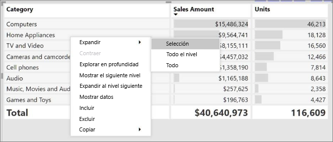

You can also add +/- buttons to the row headers through the formatting pane under the row headers card. By default, the icons will match the formatting of the row header, but you can customize the icons’ color and size separately if you want. 
Once the icons are turned on, they work similarly to the icons from PivotTables in Excel.

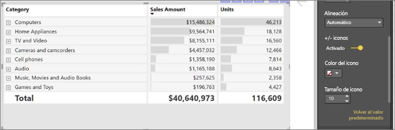

The expansion state of the matrix will save with your report. It can be pinned to dashboards as well, but consumers will need to open up the report to change the state. Conditional formatting will only apply to the inner most visible level of the hierarchy. Note that this expand/collapse experience is not currently supported when connecting to AS servers older than 2016 or MD servers.

Watch the following video to learn more about expand/collapse in the matrix:

-->
## Uso de la exploración en profundidad con el objeto visual de matriz
Con el objeto visual de matriz, puede realizar todo tipo de actividades interesantes de exploración en profundidad que no estaban disponibles anteriormente. Esto incluye la capacidad de explorar en profundidad mediante filas, columnas e incluso en celdas y secciones individuales. Veamos cómo funciona cada una de ellas.

### Exploración en profundidad en encabezados de fila

En el panel Visualizaciones, al agregar varios campos a la sección **Filas** del área **Campos**, se habilita la exploración en profundidad en las filas del objeto visual de matriz. Esto es parecido a la creación de una jerarquía que después permite explorar en profundidad (y, posteriormente, retroceder) por esa jerarquía y analizar los datos de cada nivel.

En la siguiente imagen, la sección **Filas** contiene *Fase de ventas* y *Tamaño de oportunidad*, lo cual permite crear una agrupación (o jerarquía) de las filas que se pueden explorar.

Cuando se ha creado la agrupación en el objeto visual en la sección **Filas**, el mismo objeto visual muestra los iconos *Explorar* y *Expandir* en la esquina superior izquierda del objeto visual.

De forma parecida al comportamiento de exploración y expansión de otros objetos visuales, al hacer clic en esos botones se puede explorar en profundidad (o retroceder) por la jerarquía. En este caso, se puede explorar en profundidad desde *Ventas* a *Tamaño de oportunidad*, como se muestra en la imagen siguiente, en la que se ha hecho clic en el icono de nivel uno de exploración en profundidad (el tridente).

Además de usar esos iconos, puede seleccionar cualquiera de los encabezados de fila y explorar en profundidad seleccionando la opción correspondiente en el menú que aparece.

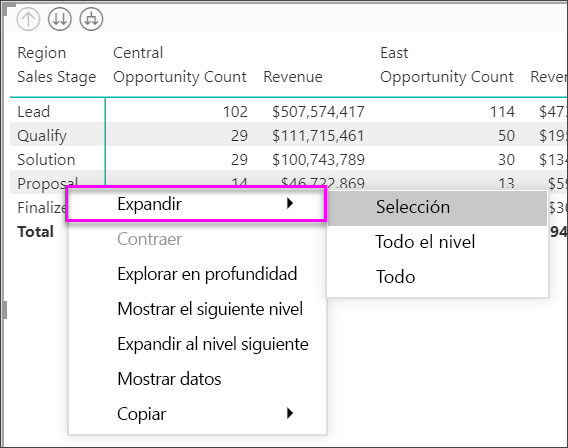

Tenga en cuenta que hay algunas opciones en el menú que aparece que generan resultados diferentes:

Si selecciona **Explorar en profundidad** se expande la matriz de *ese* nivel de fila, *salvo* todos los demás encabezados de fila, a excepción del encabezado que se seleccionó. En la siguiente imagen, se seleccionó **Propuesta** > **Explorar en profundidad**. Tenga en cuenta que otras filas de nivel superior ya no aparecen en la matriz. Esta forma de explorar en profundidad es una característica útil, que se convierte en magnífica cuando se llega a la sección de resaltado cruzado.

Seleccione el icono de **Rastrear agrupando datos** para volver a la vista de nivel superior anterior. Si, a continuación, selecciona **Propuesta** > **Mostrar el siguiente nivel**, obtendrá un listado alfabético de todos los elementos del siguiente nivel (en este caso, el campo *Tamaño de oportunidad*), sin la categorización de jerarquía de nivel superior.

Seleccione el icono de **Rastrear agrupando datos** situado en la esquina superior izquierda para que la matriz muestre todas las categorías de nivel superior; a continuación, seleccione **Propuesta** > **Expandir al siguiente nivel** para ver todos los valores de los dos niveles de la jerarquía: *Fase de ventas* y *Tamaño de oportunidad*.

También puede usar el elemento de menú **Expandir** para controlar aún más la presentación.  Por ejemplo, seleccione **Propuesta** > **Expandir** > **Selección**. Power BI muestra una fila total para cada *fase de ventas* y todas las opciones de *Tamaño de oportunidad* de *Propuesta*.

### Exploración en profundidad en encabezados de columna
Al igual que la funcionalidad de explorar en profundidad en las filas, también se puede hacer en las columnas. En la siguiente imagen, hay dos campos en el conjunto de campos **Columnas**, lo cual permite crear una jerarquía similar a la que hemos usado para las filas anteriormente en este artículo. En el conjunto de campos **Columnas**, tenemos *Región* y *Segmento*. En cuanto el segundo campo se agregó a **Columnas**, un nuevo menú desplegable apareció en el objeto visual; actualmente muestra **Filas**.

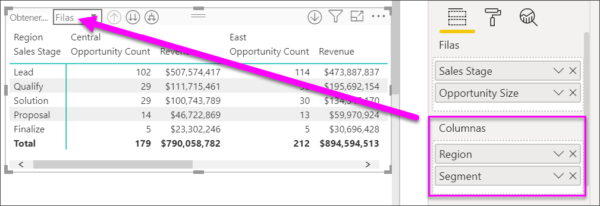

Para explorar en profundidad en las columnas, seleccione **Columnas** desde el menú *Obtener detalles*, que puede encontrarse en la esquina superior izquierda de la matriz. Seleccione la región *Este* y elija **Explorar en profundidad**.

Cuando se selecciona **Explorar en profundidad**, aparece el siguiente nivel de la jerarquía de la columna para *Región > Este* que, en este caso, es *Recuento de oportunidades*. La otra región está oculta.

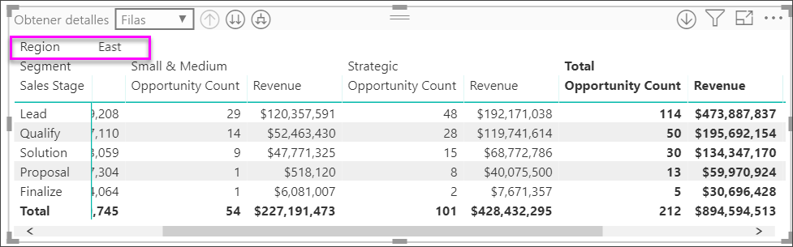

El resto de los elementos de menú funcionan de la misma manera que lo hacen los de las filas (vea la sección anterior, **Exploración en profundidad en encabezados de fila**). También puede seleccionar las opciones **Mostrar el siguiente nivel** y **Expandir al siguiente nivel** con columnas al igual que podía hacer con las filas.

> [!NOTE]
> Los iconos Explorar en profundidad y Explorar agrupando datos situados en la esquina superior izquierda del objeto visual de matriz solo son aplicables a las filas. Para explorar en profundidad por las columnas, debe usar el menú contextual.

## Diseño escalonado con objetos visuales de matriz

El objeto visual de matriz aplica sangría automáticamente a las subcategorías de una jerarquía debajo de cada elemento primario, que se denomina Diseño escalonado.

En la versión original del objeto visual de la matriz, las subcategorías se mostraban en una columna completamente diferente, lo cual ocupaba mucho más espacio en el objeto visual. En la imagen siguiente se muestra la tabla del objeto visual de matriz original; observe que las subcategorías se encuentran en una columna independiente.

En la siguiente imagen, puede ver un objeto visual de matriz con el diseño escalonado en acción. Observe que la categoría *Computers* tiene sus subcategorías (Computers Accessories, Desktops, Laptops, Monitors, etc.) ligeramente con sangría. Esto ofrece un objeto visual más limpio y mucho más reducido.

Puede ajustar fácilmente la configuración del diseño escalonado. Con el objeto visual de matriz seleccionado, en la sección **Formato** (el icono de rodillo de pintura) del panel **Visualizaciones**, expanda la sección de encabezados de fila. Tiene dos opciones: la opción de diseño escalonado (que se puede activar o desactivar) y la opción de sangría de diseño escalonado (que permite especificar el tamaño de la sangría, en píxeles).

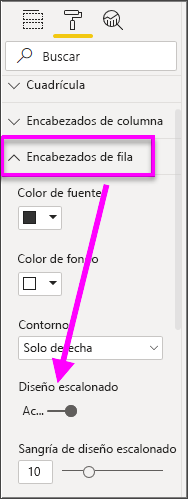

Si desactiva el diseño escalonado, Power BI muestra subcategorías en otra columna en lugar de con una sangría debajo de la categoría primaria.

## Subtotales con objetos visuales de matriz

Puede activar o desactivar subtotales en objetos visuales de matriz tanto para filas como para columnas. En la imagen siguiente, puede ver que los subtotales de fila están establecidos en **Activado**.

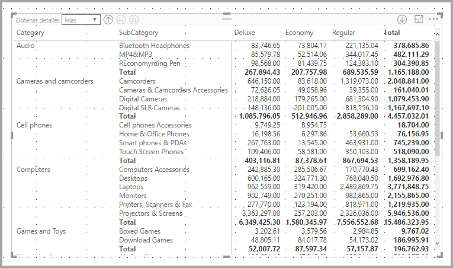

En la sección Formato del panel Visualizaciones, expanda la tarjeta **Subtotales** y mueva el control deslizante Subtotales de fila a **Desactivado**. Al hacerlo, no se muestran los subtotales.

El mismo proceso se aplica a los subtotales de columna.

## Resaltado cruzado con objetos visuales de matriz

Con el objeto visual de matriz, puede seleccionar todos los elementos de la matriz como base para el resaltado cruzado. Seleccione una columna en una matriz para que Power BI resalte la columna, al igual que sucede con los demás objetos visuales de la página de informe. Este tipo de resaltado cruzado ha sido una característica común de otros objetos visuales y selecciones de punto de datos, por lo que ahora el objeto visual de matriz ofrece la misma función.

Además, el uso de Ctrl+clic también funciona para el resaltado cruzado. Por ejemplo, en la siguiente imagen, se ha seleccionado una colección de subcategorías del objeto visual de matriz. Observe que los elementos del objeto visual que no se seleccionaron aparecen atenuados y que los demás objetos visuales de la página reflejan las selecciones realizadas en el objeto visual de matriz.

## Copia de valores de Power BI para su uso en otras aplicaciones

La matriz o tabla puede tener contenido que es posible que quiera usar en otras aplicaciones: Dynamics CRM, Excel y otros informes de Power BI. Con el menú contextual de Power BI, puede copiar una sola celda o una selección de celdas en el portapapeles y pegarlas en la otra aplicación.

* Para copiar el valor de una sola celda, seleccione la celda, haga clic con el botón derecho del ratón y elija **Copiar valor**. Con el valor de la celda sin formato en el portapapeles, ahora puede pegarlo en otra aplicación.

    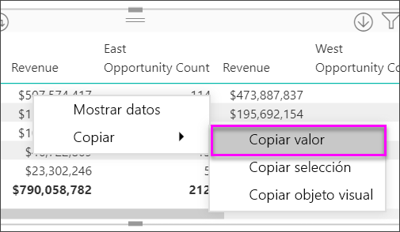

* Para copiar más de una celda, seleccione un rango de celdas o utilice CTRL para seleccionar una o más celdas. 

    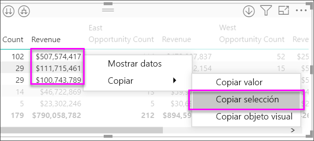

* La copia incluirá los encabezados de columna y de fila.

    

* Si quiere hacer una copia del objeto visual que contiene solo las celdas seleccionadas, seleccione una o varias celdas; para ello, haga clic en CTRL, haga clic con el botón derecho y seleccione **Copiar objeto visual**.

    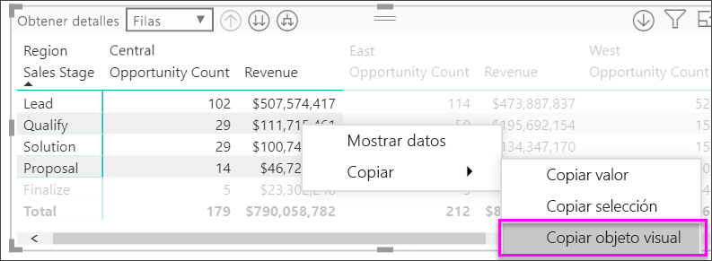

* La copia será otra visualización de la matriz, pero solo contendrá los datos copiados.

    

## Colores de fuente y sombreado con objetos visuales de matriz
Con el objeto visual de matriz, puede aplicar formato condicional (colores, sombreado y barras de datos) al fondo de las celdas de la matriz y también al texto y a los valores propiamente dichos.

Para aplicar formato condicional, seleccione el objeto visual de matriz y abra el panel **Formato**. Expanda la tarjeta **Formato condicional**, y para **Color de fondo**, **Color de fuente** o **Barras de datos**, mueva el control deslizante a **Activar**. Al activar una de estas opciones se muestra un vínculo para *Controles avanzados*, que permite personalizar los colores y los valores del formato de color.
  
  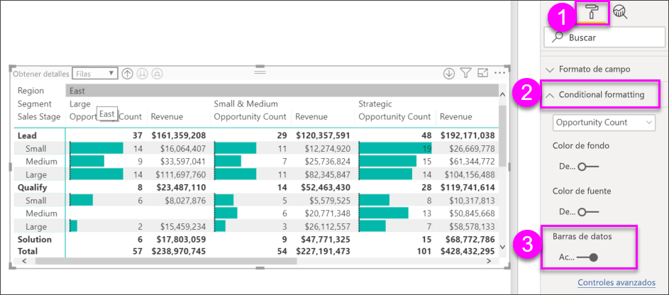

Seleccione *Controles avanzados* para mostrar un cuadro de diálogo, que permite realizar ajustes. En este ejemplo se muestra el cuadro de diálogo de **Barras de datos**.

## Pasos siguientes

[Objeto visual de Power Apps para Power BI](power-bi-visualization-powerapp.md)

[Tipos de visualización en Power BI](power-bi-visualization-types-for-reports-and-q-and-a.md)