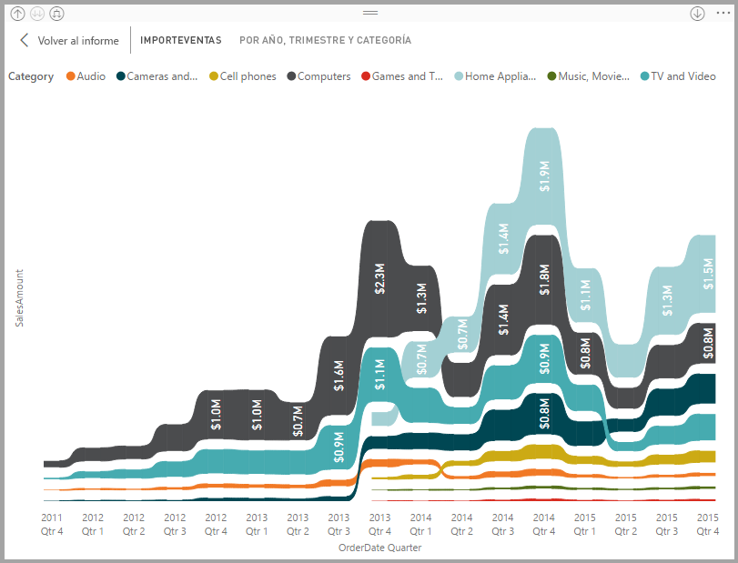
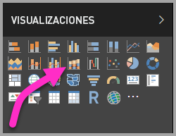
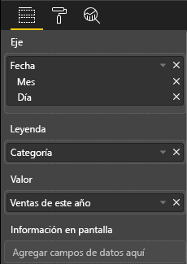
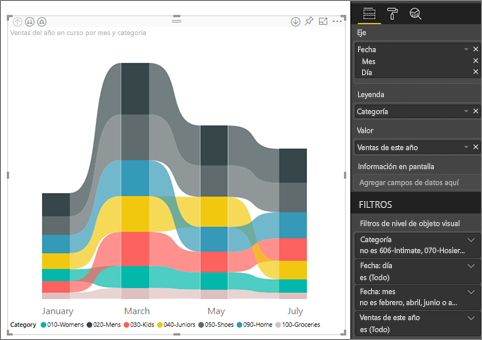
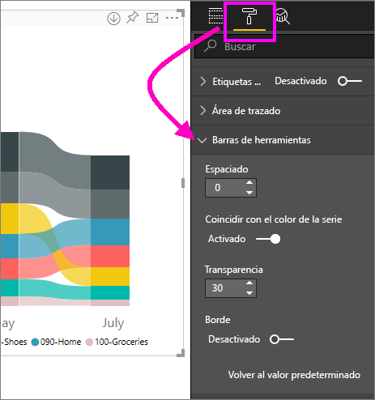
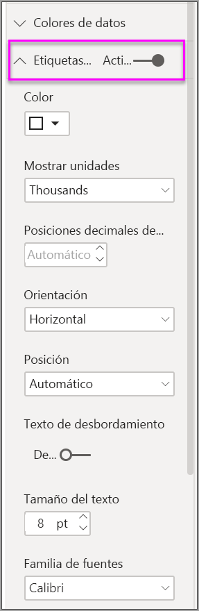
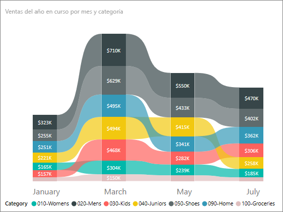

# Uso de gráficos de cinta de opciones en Power BI
Puede usar gráficos de la barra de herramientas para visualizar y detectar rápidamente qué categoría de datos tiene la clasificación más alta (el valor mayor). Los gráficos de cinta de opciones son eficaces para mostrar un cambio de clasificación, con el intervalo más alto (valor) siempre en la parte superior de cada período de tiempo. 

## Creación de un gráfico de cinta de opciones
Para continuar, abra el [ informe Ejemplo de análisis de venta directa](../sample-retail-analysis.md). 

1. Para crear un gráfico de cinta de opciones, seleccione **Gráfico de la barra de herramientas** en el panel **Visualizaciones**.

    

    Los gráficos de la barra de herramientas conectan una categoría de datos en el universo de tiempo visualizado mediante cintas, lo que permite ver cómo se clasifica una categoría determinada a lo largo del intervalo del eje x del gráfico (normalmente la escala de tiempo).

2. Seleccione campos para **Eje**, **Leyenda** y **Valor**.  En este ejemplo, se ha seleccionado lo siguiente: **Fecha**, **Categoría**, y **Ventas de este año**.  

    

    Como el conjunto de datos solo contiene datos de un año, también se ha eliminado el campo **Año** de **Eje**. 

3. En el gráfico de cinta de opciones se muestra la clasificación para los meses alternos. Observe cómo cambia la clasificación en el tiempo.  Por ejemplo, la categoría Home cambia de tercera a cuarta, y después vuelve a la tercera posición. La categoría Juniors pasa de tercera a quinta en julio. 

    

## Formato de un gráfico de cinta de opciones
Cuando se crea un gráfico de cinta de opciones, hay opciones de formato disponibles en la sección **Formato** del panel **Visualizaciones**. Las opciones de formato para los gráficos de cinta de opciones son similares a las de un gráfico de columnas apiladas, con opciones de formato adicionales que son específicas de las cintas de opciones.

Estas opciones de formato para los gráficos de la barra de herramientas permiten realizar ajustes.

* **Espaciado** le permite ajustar la cantidad de espacio que aparece entre las cintas de opciones. El número es el porcentaje del alto máximo de la columna.
* **Coincidir con el color de la serie** permite hacer coincidir el color de las cintas de opciones con el color de la serie. Cuando se establece en **desactivado**, las cintas aparecen en color gris.
* **Transparencia** especifica la transparencia de las cintas de opciones, con el valor predeterminado de 30.
* **Borde** le permite colocar un borde oscuro en la parte superior e inferior de las cintas de opciones. De forma predeterminada, los bordes están desactivados.

Como el gráfico de la barra de herramientas no tiene etiquetas en el eje Y, puede que le interese agregar etiquetas de datos. En el panel Formato, seleccione **Etiquetas de datos**. 

Establezca las opciones de formato para las etiquetas de datos.  En este ejemplo, se ha establecido el color del texto en blanco, las posiciones decimales en cero y las unidades de visualización en miles. 

## Pasos siguientes

[Gráficos de dispersión y de burbujas de Power BI](power-bi-visualization-scatter.md)

[Tipos de visualización en Power BI](power-bi-visualization-types-for-reports-and-q-and-a.md)