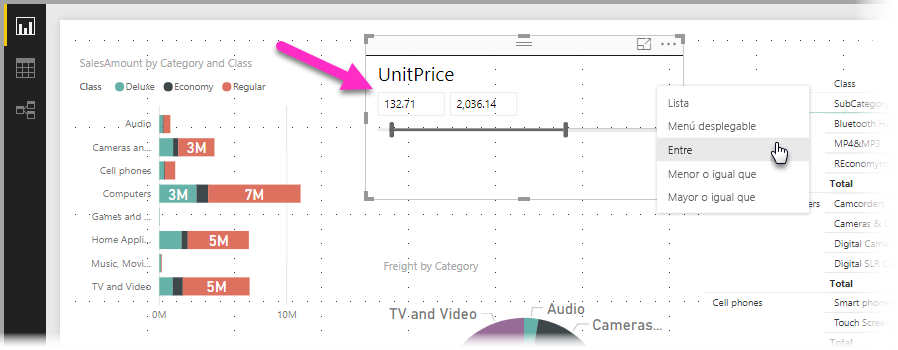
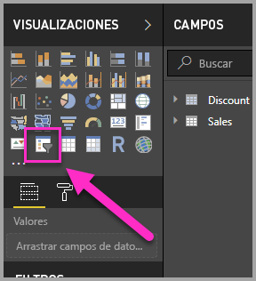
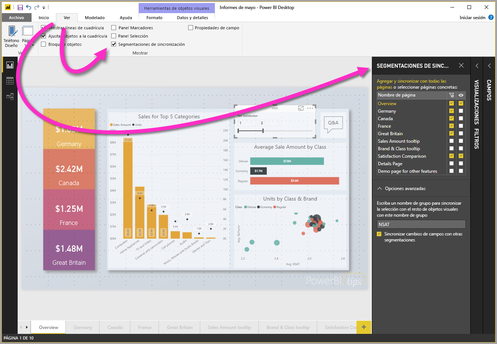
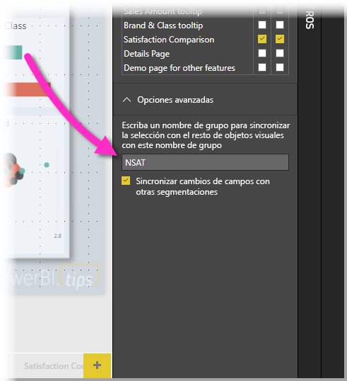

# Uso de segmentaciones de datos en Power BI Desktop

Puede usar una **segmentación de datos** en **Power BI Desktop** para filtrar los resultados de los objetos visuales en la página del informe. Y con las segmentaciones de datos, puede ajustar fácilmente el filtro que se aplica mediante la interacción con la propia segmentación de datos. También puede especificar opciones para la forma en que aparece la segmentación de datos y la interacción con ella. La siguiente imagen muestra una segmentación de datos con su menú desplegable *Tipo* visible. 

Una segmentación de datos se puede mostrar en alguno de estos tipos:

* Lista
* Desplegable
* Entre
* Menor o igual que
* Mayor o igual que

Puede agregar una segmentación de datos a un informe; para ello, haga clic en el objeto visual **segmentación de datos** del panel **Visualizaciones**.

Las segmentaciones de datos se comportan de forma similar en **Power BI Desktop** y el **servicio Power BI**. Para ver un artículo sobre cómo usar las segmentaciones, vea [Segmentaciones en el servicio Power BI](power-bi-visualization-slicers.md).

## Sincronización de las segmentaciones de datos en varias páginas del informe

En **Power BI Desktop** puede sincronizar las segmentaciones de datos en varias páginas del informe. Para sincronizar las segmentaciones de datos, en el panel **Vista** de la cinta de opciones, seleccione **Segmentaciones de sincronización**. Al sincronizar las segmentaciones de datos, aparece el panel **Segmentaciones de sincronización**, como se muestra en la siguiente imagen.

En el panel **Segmentaciones de sincronización**, puede especificar cómo se debe sincronizar la segmentación de datos en las páginas del informe. Puede especificar si cada segmentación de datos debe **aplicarse** a cada página del informe individual, y si la segmentación de datos debe ser **visible** en cada página del informe individual.

Por ejemplo, puede colocar una segmentación de datos en la **página 2** del informe, como se muestra en la siguiente imagen. A continuación, puede seleccionar si desea que esa segmentación de datos se *aplique* a cada página seleccionada, y si esa segmentación de datos debe ser *visible* en cada página seleccionada del informe. Puede aplicar cualquier combinación de estas opciones para cada segmentación. 

Al utilizar el vínculo **Agregar a todo** del panel se aplica la segmentación seleccionada a todas las páginas del informe.

Tenga en cuenta que las selecciones que se muestran en el panel **Segmentaciones de sincronización** se aplican solo a la *segmentación seleccionada*. Puede aplicar varias segmentaciones a distintas páginas, y usar el panel para definir cómo se aplica individualmente cada segmentación de datos a través de las distintas páginas del informe. 

Mientras que la selección de segmentaciones de datos se puede sincronizar, otras selecciones como la aplicación de estilos, la edición y la eliminación *no* se sincronizan. 

## Opciones avanzadas de las segmentaciones

También se puede aplicar un **nombre de grupo** a una colección de segmentaciones en la sección **Opciones avanzadas** del panel **Sincronización de segmentaciones**, así como sincronizar las segmentaciones que compartan el mismo grupo en todas las páginas. 

Esta característica permite crear un grupo personalizado de segmentaciones para mantenerlas sincronizadas. Se indica un nombre predeterminado, pero se puede usar el nombre que se quiera. 

El nombre del grupo proporciona una mayor flexibilidad en las segmentaciones. Así, se pueden crear grupos independientes para sincronizar segmentaciones que usen el mismo campo, o incluir en el mismo grupo segmentaciones que usen campos distintos. 

## Cómo afecta el filtrado a la selección en las segmentaciones

Si realiza una selección en una segmentación y, a continuación, aplica un filtro que normalmente quitaría el elemento seleccionado, este permanece en la parte inferior de la lista de elementos de la segmentación. Si se quita el filtro, la selección sigue presente en la segmentación. Observará que si anula la selección del elemento en la segmentación, este desaparece de la lista.

## Pasos siguientes

Puede que también esté interesado en los siguientes artículos:

* [Segmentaciones en el servicio Power BI](power-bi-visualization-slicers.md)
* [Uso de la segmentación de intervalos numéricos en Power BI Desktop](../desktop-slicer-numeric-range.md)
* [Uso de un filtro o una segmentación de fecha relativa en Power BI Desktop](desktop-slicer-filter-date-range.md)

