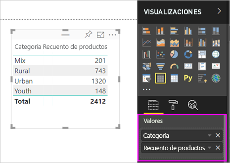
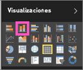
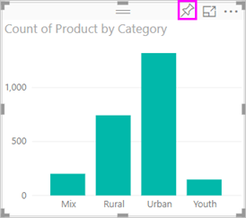

# Parte 1: Incorporación de visualizaciones a un informe de Power BI

En este artículo, se ofrece una introducción rápida a la creación de una visualización en un informe. Se aplica al servicio Power BI y a Power BI Desktop. Para obtener contenido más avanzado, [vea la parte 2](power-bi-report-add-visualizations-ii.md) de esta serie. Vea cómo Amanda demuestra algunas maneras de crear, editar y dar formato a objetos visuales en el lienzo del informe. A continuación, inténtelo usted usando el [ejemplo de marketing y ventas](../sample-datasets.md) para crear su propio informe.

<iframe width="560" height="315" src="https://www.youtube.com/embed/IkJda4O7oGs" frameborder="0" allowfullscreen></iframe>

## Abrir un informe y agregar una nueva página

1. Abra un [informe en la Vista de edición](../service-interact-with-a-report-in-editing-view.md).

    En este tutorial, se usa el [ejemplo de ventas y marketing](../sample-datasets.md).

1. Si el panel **Campos** no está visible, seleccione el icono de flecha para abrirlo.

   

1. Agregue una página en blanco al informe.

## Agregar visualizaciones al informe

1. Cree una visualización seleccionando un campo en el panel **Campos** .

    Comience con un campo numérico como **SalesFact** > **Ventas en USD**. Power BI crea un gráfico de columnas con una sola columna.

    

    O bien, comience con un campo de categoría, como **Nombre** o **Producto**. Power BI crea una tabla y agrega ese campo también a **Valores**.

    

    O bien, comience con un campo de geografía, como **Geografía** > **Ciudad**. Power BI y mapas de Bing crean una visualización de mapa.

    

1. Cree una visualización y, a continuación, cambie su tipo. Seleccione **Producto** > **Categoría** y después **Producto** > **Recuento de productos** para agregarlos al área **Valores**.

   

1. Cambie la visualización a un gráfico de columnas mediante la selección del icono **Gráfico de columnas apiladas**.

   

1. Cuando cree visualizaciones en el informe, puede [anclarlas al panel](../service-dashboard-pin-tile-from-report.md). Para anclar la visualización, seleccione el icono de anclaje .

   
  
## Pasos siguientes

 Continúe con:

* [Parte 2: Incorporación de visualizaciones a un informe de Power BI](power-bi-report-add-visualizations-ii.md)

* [Interactuar con las visualizaciones](../consumer/end-user-reading-view.md) en el informe.

* [Hacer más cosas incluso con visualizaciones](power-bi-report-visualizations.md).

* [Guardar el informe](../service-report-save.md).
