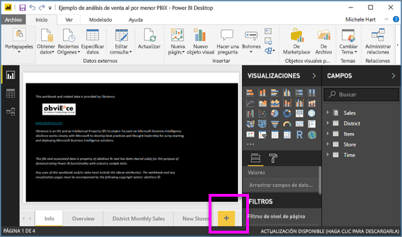
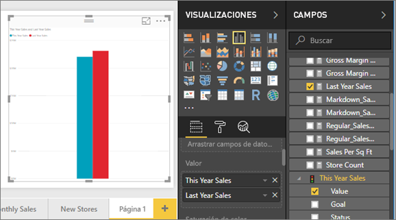
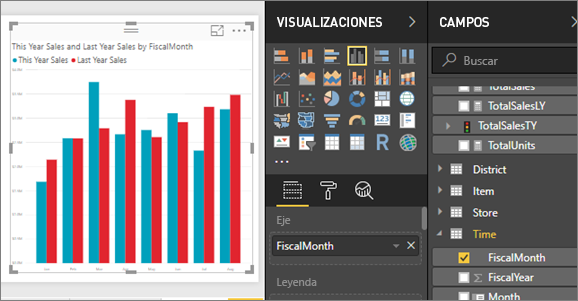
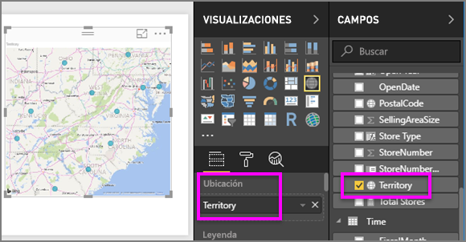
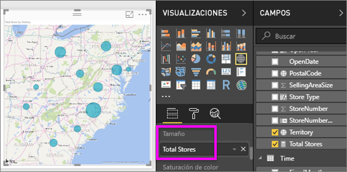
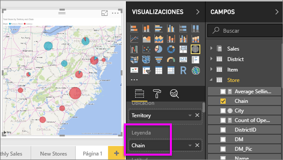

# Parte II, Incorporación de visualizaciones a un informe de Power BI
En la [parte I](power-bi-report-add-visualizations-ii.md), creó una visualización básica activando las casillas junto a los nombres de campo.  En la parte II, aprenderá a usar arrastrar y colocar, y a emplear toda la funcionalidad de los paneles **Campos** y **Visualizaciones** para crear y modificar visualizaciones.

### Requisitos previos
- [Parte 1](power-bi-report-add-visualizations-ii.md)
- Power BI Desktop: se pueden agregar visualizaciones a los informes con el servicio Power BI o Power BI Desktop. En este tutorial se usa Power BI Desktop. 
- [Ejemplo de análisis de minoristas](http://download.microsoft.com/download/9/6/D/96DDC2FF-2568-491D-AAFA-AFDD6F763AE3/Retail%20Analysis%20Sample%20PBIX.pbix)

## Creación de una nueva visualización
En este tutorial, nos adentraremos en el conjunto de datos de análisis de minoristas y crearemos algunas visualizaciones clave.

### Abra un informe y agregue una nueva página en blanco.
1. Abra el archivo .PBIX del Ejemplo de análisis de minoristas en Power BI Desktop. 
      

2. Agregue una nueva página mediante el icono de signo más de color amarillo de la parte inferior del lienzo.

### Agregue una visualización que examine las ventas de este año en comparación con las del año pasado.
1. De la tabla **Sales**, seleccione **This Year Sales** >  y **Last Year Sales** en **Valor**. Power BI crea un gráfico de columnas.  Parece interesante y desea explorarlo en más profundidad. ¿Cómo son las ventas mensuales?  
   
   
2. Desde la tabla Time, arrastre **MesFiscal** al área **Eje**.  
   
3. [Cambie la visualización](power-bi-report-change-visualization-type.md) a un gráfico de áreas.  Hay muchos tipos de visualizaciones para elegir (consulte las [descripciones, las sugerencias de procedimientos recomendadas y los tutoriales](power-bi-visualization-types-for-reports-and-q-and-a.md) de cada uno para decidir cuál deber usar. En el panel Visualizaciones, haga clic en el icono del gráfico de áreas .
4. Para ordenar la visualización, haga clic en el botón de puntos suspensivos (...) y seleccione **Ordenar por MesFiscal**.
5. [Cambie el tamaño de la visualización](power-bi-visualization-move-and-resize.md). Para ello, elíjala, seleccione uno de los círculos del esquema y arrástrelo. Debería ser lo bastante ancha como para que desaparezca la barra de desplazamiento y no demasiado grande, para que quede espacio suficiente para agregar otra visualización.
   
   
6. [Guarde el informe](../service-report-save.md).

### Incorporación de una visualización de mapa que examina las ventas por ubicación
1. En la tabla **Tienda**, seleccione **Territorio**. Power BI reconoce que Territorio es una ubicación y crea una visualización de mapa.  
   
2. Arrastre **Total Stores** al área Tamaño.  
   
3. Agregue una leyenda.  Para ver los datos por nombre de tienda, arrastre **Cadena** al área Leyenda.  
   

## Pasos siguientes
* Más información sobre [Visualizaciones en Power BI](power-bi-report-visualizations.md).  
* ¿Tiene más preguntas? [Pruebe la comunidad de Power BI](http://community.powerbi.com/)

