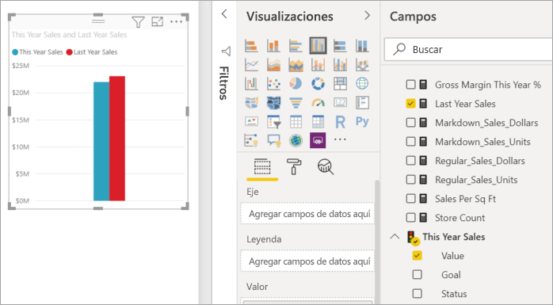
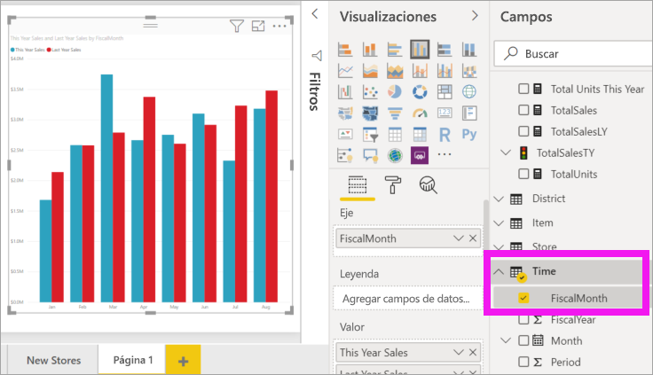
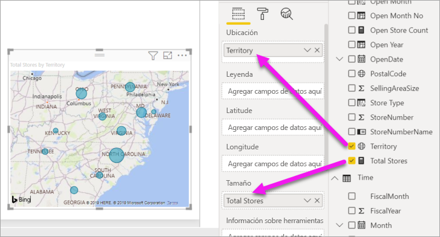
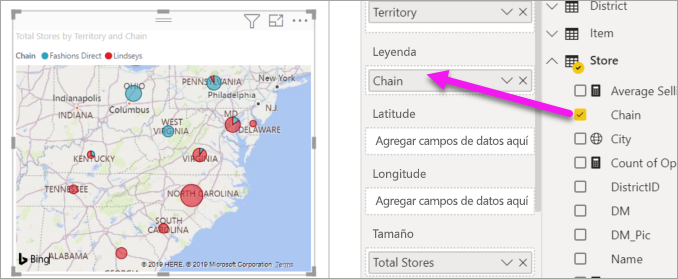

# Parte II, Incorporación de visualizaciones a un informe de Power BI

[!INCLUDE [power-bi-visuals-desktop-banner](../includes/power-bi-visuals-desktop-banner.md)]

En la [parte I](power-bi-report-add-visualizations-i.md), creó una visualización básica activando las casillas junto a los nombres de campo.  En la parte 2, aprenderá a usar arrastrar y colocar, así como a emplear toda la funcionalidad de los paneles **Campos** y **Visualizaciones** para crear y modificar visualizaciones.

## Creación de una nueva visualización
En este tutorial, nos adentraremos en el conjunto de datos Análisis de minoristas y crearemos algunas visualizaciones clave.

## Requisitos previos

En este tutorial se usa el [archivo .PBIX del ejemplo de análisis de minoristas](https://download.microsoft.com/download/9/6/D/96DDC2FF-2568-491D-AAFA-AFDD6F763AE3/Retail%20Analysis%20Sample%20PBIX.pbix).

1. En la sección superior izquierda de la barra de menús de Power BI Desktop, seleccione **Archivo** > **Abrir**.
   
2. Busque la copia del **archivo PBIX del Ejemplo de análisis de minoristas**.

1. Abra el **archivo PBIX del Ejemplo de análisis de minoristas** en la vista de informe .

1. Seleccionar  para agregar una nueva página.

## Agregar visualizaciones al informe

Cree una visualización seleccionando un campo en el panel **Campos** . El tipo de visualización que se cree dependerá del tipo de campo seleccionado. Power BI usa el tipo de datos para determinar qué visualización usar para mostrar los resultados. Para cambiar la visualización que se usa, seleccione otro icono en el panel Visualizaciones. Tenga en cuenta que no todas las visualizaciones pueden mostrar sus datos. Por ejemplo, los datos geográficos no se mostrarán bien si se usan un gráfico de embudo o un gráfico de líneas. 

### Agregue un gráfico de áreas que examine las ventas de este año, en comparación con las del año pasado

1. De la tabla **Sales**, seleccione **This Year Sales** >  y **Last Year Sales** en **Valor**. Power BI crea un gráfico de columnas.  Este gráfico es interesante y desea explorarlo en más profundidad. ¿Cómo son las ventas mensuales?  
   
   

2. Desde la tabla Time, arrastre **MesFiscal** al área **Eje**.  
   

3. [Cambie la visualización](power-bi-report-change-visualization-type.md) a un gráfico de áreas.  Hay muchos tipos de visualizaciones entre los que elegir (consulte las [descripciones, las sugerencias de procedimientos recomendados y los tutoriales](power-bi-visualization-types-for-reports-and-q-and-a.md) de todas ellas para decidir cuál deber usar). En el panel Visualizaciones, seleccione el icono del gráfico de áreas .

4. Para ordenar la visualización, seleccione **Más opciones** (...) y elija **Ordenar por** >  **FiscalMonth**.

5. [Cambie el tamaño de la visualización](power-bi-visualization-move-and-resize.md). Para ello, elíjala, seleccione uno de los círculos del esquema y arrástrelo. Debería ser lo bastante ancha como para que desaparezca la barra de desplazamiento y no demasiado grande, para que quede espacio suficiente para agregar otra visualización.
   
   
6. [Guarde el informe](../service-report-save.md).

### Incorporación de una visualización de mapa que examina las ventas por ubicación

1. En la tabla **Tienda**, seleccione **Territorio**. Arrastre **Total Stores** al área Tamaño. Power BI reconoce que Territorio es una ubicación y crea una visualización de mapa.  
   

2. Agregue una leyenda.  Para ver los datos por nombre de tienda, arrastre **Store** (Tienda)  > **Chain** (Cadena) al área Leyenda.  
   

## Pasos siguientes
* Más información sobre [Visualizaciones en Power BI](power-bi-report-visualizations.md).  
* ¿Tiene más preguntas? [Pruebe la comunidad de Power BI](https://community.powerbi.com/)

