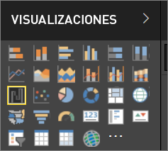
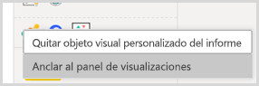
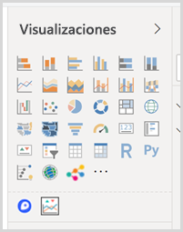

# Visualizaciones en informes de Power BI

Las visualizaciones (también conocidas como objetos visuales) muestran conclusiones que se han descubierto en los datos. Un informe de Power BI puede tener una sola página con un objeto visual o podría tener páginas enteras de objetos visuales. En el servicio Power BI, los objetos visuales pueden ser [anclados desde los informes en los paneles](../service-dashboard-pin-tile-from-report.md).

Es importante distinguir entre *diseñadores* de informes y *consumidores* de informes.  Si es la persona que crea o modifica el informe, es un diseñador.  Los diseñadores tienen permisos de edición en el informe y el conjunto de datos subyacente. En Power BI Desktop, esto significa que puede abrir el conjunto de datos en la vista de datos y crear objetos visuales en la vista de informe. En el servicio Power BI, esto significa que puede abrir el conjunto de datos o el informe en el editor de informes en la [vista de edición](../consumer/end-user-reading-view.md). Si un informe o un panel se ha [compartido con usted](../consumer/end-user-shared-with-me.md), será un **consumidor** del informe. Podrá ver el informe y sus objetos visuales, así como interactuar con ellos, pero no podrá guardar los cambios principales.

Existen muchos tipos diferentes de objetos visuales disponibles directamente desde el panel de VISUALIZACIONES de Power BI.

Para ver más opciones, visite el [sitio web de la comunidad de Microsoft AppSource](https://appsource.microsoft.com) para buscar y [descargar](https://appsource.microsoft.com/marketplace/apps?page=1&product=power-bi-visuals) [objetos visuales](../developer/custom-visual-develop-tutorial.md) personalizados proporcionados por Microsoft y la comunidad.

<iframe width="560" height="315" src="https://www.youtube.com/embed/SYk_gWrtKvM?list=PL1N57mwBHtN0JFoKSR0n-tBkUJHeMP2cP" frameborder="0" allowfullscreen></iframe>

Si no está familiarizado con Power BI o necesita ponerse al día, use los vínculos siguientes para aprender los conceptos básicos de las visualizaciones de Power BI.  También puede usar la tabla de contenido (en el lado izquierdo de este artículo) para buscar información todavía más útil.

## Agregar una visualización en Power BI

[Cree visualizaciones](power-bi-report-add-visualizations-i.md) de las páginas de los informes. Examine la [lista de visualizaciones disponibles y los tutoriales disponibles sobre visualizaciones](power-bi-visualization-types-for-reports-and-q-and-a.md). 

## Cargar una visualización personalizada y usarla en Power BI

Agregue una visualización personalizada creada por usted mismo o que haya encontrado en el [sitio de la comunidad de Microsoft AppSource](https://appsource.microsoft.com/marketplace/apps?product=power-bi-visuals). ¿Se siente creativo? Investigue el código fuente y use nuestras [herramientas de desarrollo](../developer/custom-visual-develop-tutorial.md) para crear un tipo de visualización y [compartirlo con la comunidad](../developer/office-store.md). Para saber más sobre cómo desarrollar objetos visuales personalizados, vea [Desarrollo de objetos visuales personalizados de Power BI](../developer/custom-visual-develop-tutorial.md).

## Personalización del panel de visualización (versión preliminar)

Si descubre que usa el mismo objeto visual personalizado en varios informes, puede anclar la visualización personalizada al panel de visualizaciones. Para anclar la visualización, haga clic con el botón derecho en el objeto visual para anclarlo al panel.

Una vez que haya anclado un objeto visual, se incluye con los demás objetos visuales integrados. Este objeto visual ahora está vinculado a la cuenta con la que ha iniciado sesión, por lo que todos los nuevos informes que cree tendrán automáticamente este objeto visual incluido, siempre que haya iniciado sesión. Esto facilita enormemente estandarizar un objeto visual determinado sin necesidad de agregarlo a todos los informes.

Mientras esta característica esté en versión preliminar, solo verá los objetos visuales anclados en Power BI Desktop. Además, debe iniciar sesión para que esta característica esté disponible.

## Cambiar el tipo de visualización

Intente [cambiar el tipo de visualización](power-bi-report-change-visualization-type.md) para ver cuál funciona mejor con sus datos.

## Anclar la visualización

En el servicio Power BI, cuando tenga la visualización que desea, puede [anclarla a un panel](../service-dashboard-pin-tile-from-report.md) como un icono. Si cambia la visualización que se usa en el informe después de anclarlo, el icono del panel no cambia: si era un gráfico de líneas, se mantiene como un gráfico de líneas, incluso si se cambia a un gráfico de anillos en el informe.

## Limitaciones y consideraciones
- En función del origen de datos y el número de campos (medidas o columnas), puede que un objeto visual cargue lentamente.  Se recomienda limitar los objetos visuales a 10-20 campos de totales, tanto por motivos de legibilidad como de rendimiento. 

- El límite superior de los objetos visuales es de 100 campos (medidas o columnas). Si no se puede cargar el objeto visual, reduzca el número de campos.   

## Pasos siguientes

* [Tipos de visualización en Power BI](power-bi-visualization-types-for-reports-and-q-and-a.md)
* [Objetos visuales personalizados](../power-bi-custom-visuals.md)
