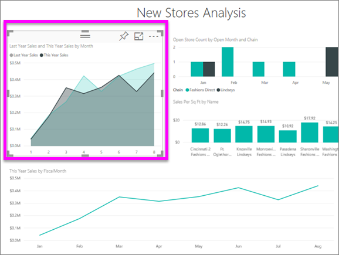
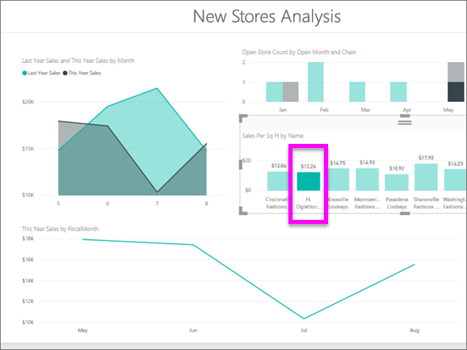

# Gráficos de área básicos
El gráfico de área básico (también conocido como gráfico de área en capas) se basa en el gráfico de líneas. El área situada entre el eje y la línea se rellena con colores para indicar el volumen. 

Los gráficos de área destacan la magnitud del cambio con el tiempo y se pueden usar para llamar la atención sobre el valor total en una tendencia. Por ejemplo, se pueden trazar datos que representan el beneficio en el tiempo en un gráfico de área para destacar el beneficio total.

## Cuándo usar un gráfico de área básico
Los gráficos de área básicos son una excelente opción:

* Para ver y comparar la tendencia del volumen a través de una serie temporal. 
* Para las series individuales que representan un conjunto físicamente contable.

### Requisitos previos
 - Servicio Power BI
 - Ejemplo de análisis de venta al por menor

Para continuar, inicie sesión en Power BI y seleccione **Obtener datos \> Ejemplos \> Ejemplo de análisis de minoristas > Conectar** y elija **Ir al panel**. 

## Crear un gráfico de área básico
 

1. En el panel "Ejemplo de análisis de minoristas", seleccione el informe **Total de tiendas** para abrir el informe "Ejemplo de análisis de minoristas".
2. Seleccione **Editar** para abrir el informe en la vista de edición.
3. Agregue una nueva página del informe mediante el icono de signo de suma de color amarillo (+) de la parte inferior del informe.
4. Cree un gráfico de área que muestra las ventas de este año y las ventas del año pasado por mes.
   
   a. En el panel Campos, seleccione **Ventas \> Ventas del último año** y **Ventas de este año > Valor**.

   

   b.  Para convertir el gráfico en un gráfico de áreas básico, haga clic en el icono de gráfico de áreas en el panel Visualizaciones.

   
   
   c.  Seleccione **Tiempo \> Mes** para agregarlo al área **Ejes**.   
   
   
   d.  Para mostrar el gráfico por mes, seleccione el botón de puntos suspensivos (esquina superior derecha del objeto visual) y elija **Sort by month** (Ordenar por mes). Para cambiar el criterio de ordenación, vuelva a hacer clic en los puntos suspensivos y seleccione **Orden ascendente** u **Orden descendente**.

## Resaltado y filtrado cruzado
Para más información acerca de cómo usar el panel Filtros, consulte [Agregar un filtro a un informe](../power-bi-report-add-filter.md).

Para resaltar un área concreta en el gráfico, seleccione ese área o su borde superior.  A diferencia de otros tipos de visualización, si hay otras visualizaciones en la misma página, el resaltado de un gráfico de área básico no realiza un filtrado cruzado de las otras visualizaciones de la página del informe. Pero otras visualizaciones de la página de informe pueden desencadenar el filtrado cruzado de los gráficos de área. 

1. Para probarlo, seleccione el gráfico de áreas y cópielo en otra página del informe (CTRL+C y CTRL+V).
2. Seleccione una de las áreas sombreadas y después la otra. Comprobará que no afecta a las demás visualizaciones de la página.

    

3. Ahora, seleccione un elemento en una de las otras visualizaciones de la página, como una barra del gráfico de columnas o un mes en un gráfico de líneas. Observe el impacto en el gráfico de áreas: se filtra.  

     

Para más información, consulte [Interacciones de objetos visuales en los informes](../service-reports-visual-interactions.md)

## Consideraciones y solución de problemas   
* [Hacer que el informe sea más accesible para personas con discapacidades](../desktop-accessibility.md)
* Los gráficos de área básicos no son eficaces para comparar valores debido a la ocultación de las áreas en capas. Power BI usa transparencias para indicar la superposición de áreas. Sin embargo, solo funciona bien con dos o tres áreas diferentes. Si necesita comparar tendencias de más de tres medidas, pruebe a usar los gráficos de líneas. Si necesita comparar volúmenes de más de tres medidas, pruebe a usar los gráficos de rectángulos.

## Paso siguiente
[Informes en Power BI](power-bi-visualization-card.md)  

