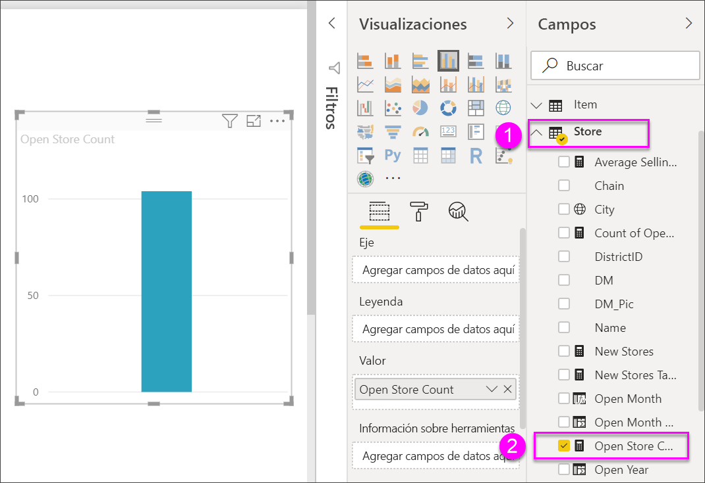
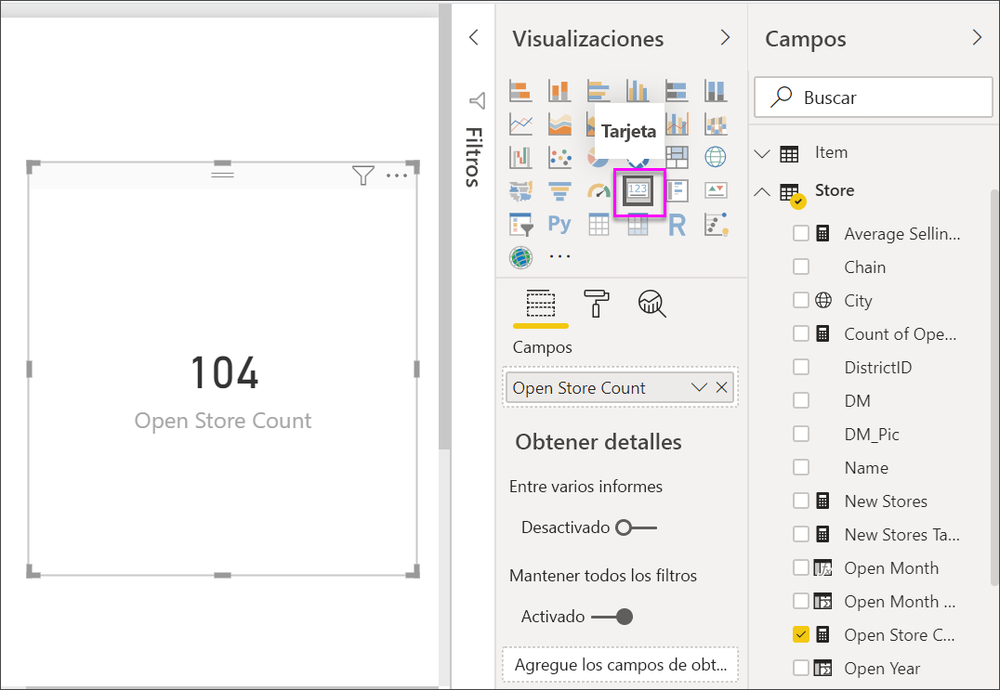
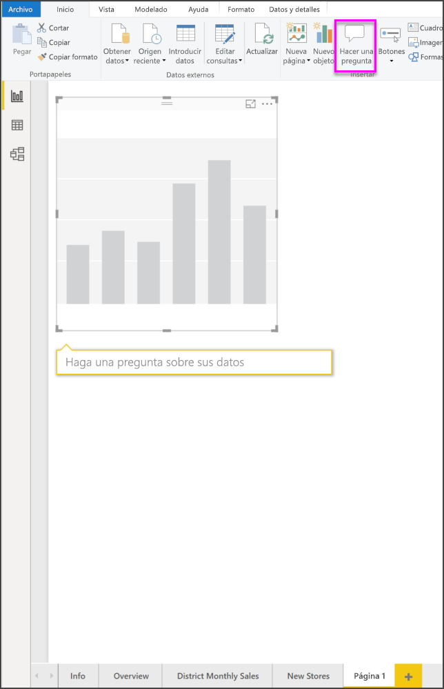
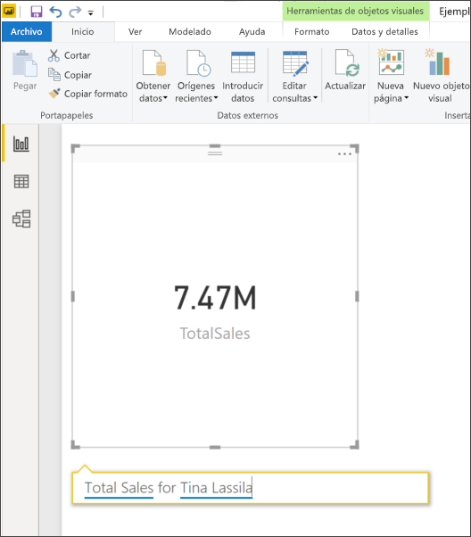
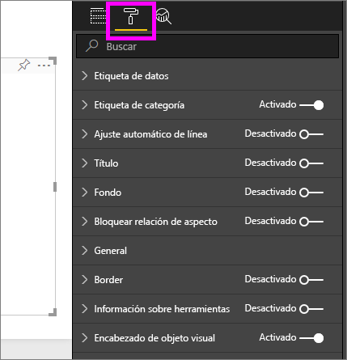
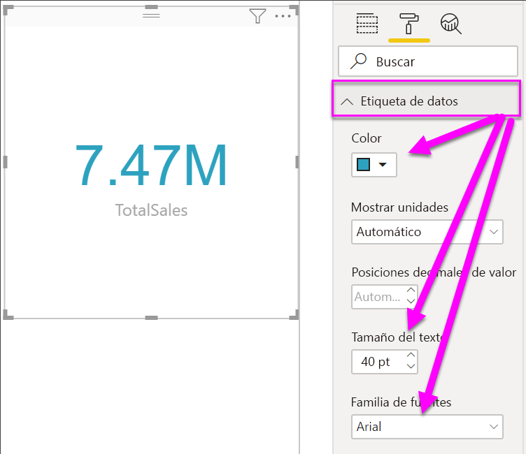
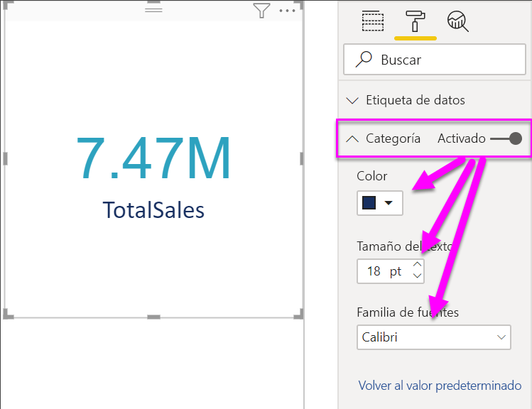
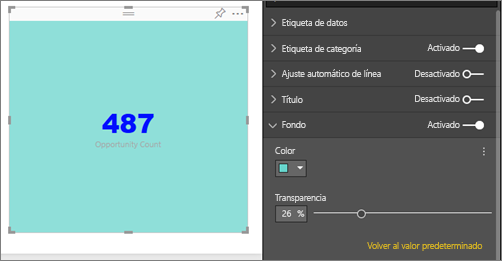

# Visualizaciones de tarjeta

[!INCLUDE [power-bi-visuals-desktop-banner](../includes/power-bi-visuals-desktop-banner.md)]

A veces, un único número es lo más importante que desea seguir en el panel o informe de Power BI, como las ventas totales, la cuota de mercado interanual o el total de oportunidades. Este tipo de visualización se denomina una *tarjeta*. Al igual que con casi todas las visualizaciones nativas de Power BI, se pueden crear tarjetas con el editor de informes o mediante Preguntas y respuestas.

## Requisito previo

En este tutorial se usa el [archivo PBIX del Ejemplo de análisis de minoristas](http://download.microsoft.com/download/9/6/D/96DDC2FF-2568-491D-AAFA-AFDD6F763AE3/Retail%20Analysis%20Sample%20PBIX.pbix).

1. En la sección superior izquierda de la barra de menús, seleccione **Archivo** \> **Abrir**.
   
2. Busque la copia del **archivo PBIX del Ejemplo de análisis de minoristas**.

1. Abra el **archivo PBIX del Ejemplo de análisis de minoristas** en la vista de informe .

1. Seleccionar  para agregar una nueva página.

## Opción 1: Creación de una tarjeta con el editor de informes

El primer método para crear una tarjeta es usar el editor de informes en Power BI Desktop.

1. Comience en una página de informe en blanco y seleccione el campo **Tienda** \> **Abrir recuento de tiendas**.

    Power BI crea un gráfico de columnas con un solo número.

   

2. En el panel Visualizaciones, seleccione el icono tarjeta.

   

Ahora se ha creado correctamente una tarjeta con el editor de informes. Debajo se muestra la segunda opción para crear una tarjeta con el cuadro de preguntas y respuestas.

## Opción 2: Creación de una tarjeta a partir del cuadro de Preguntas y respuestas
El cuadro de preguntas y respuestas es otra opción que puede utilizar al crear una tarjeta. En la vista de informe de Power BI Desktop se encuentra disponible el cuadro de preguntas y respuestas.

1. Inicio en una página de informe en blanco

1. En la parte superior de la ventana, seleccione el icono **Hacer una pregunta**. 

    Power BI creará una tarjeta y un cuadro para la pregunta. 

   

2. Por ejemplo, escriba "ventas totales para Tina" en el cuadro de pregunta.

    El cuadro de pregunta le ayuda con sugerencias y nuevas instrucciones y, por último, muestra el número total.  

   

   

Ahora se ha creado correctamente una tarjeta con el cuadro de preguntas y respuestas. Debajo se indican los pasos necesarios para dar formato a su tarjeta en función de sus propias necesidades.

## Formateo de una tarjeta
Tiene muchas opciones para cambiar las etiquetas, el texto, el color, etc. La mejor manera de aprender consiste en crear una tarjeta y explorar el panel de formato. A continuación se indican solo algunas de las opciones de formato disponibles. 

El panel de formato está disponible cuando se interactúa con la tarjeta en un informe. 

1. Para empezar, seleccione el icono de rodillo para abrir el panel de formato. 

    

2. Con la tarjeta seleccionada, expanda **Etiqueta de datos** y cambie el color, el tamaño y la familia de las fuentes. Si tuviera miles de tiendas, podría usar **Mostrar unidades** para mostrar el número de tiendas por miles y controlar también las posiciones decimales. Por ejemplo, 125,8 K en lugar de 125 832,00.

    

3.  Expanda **Etiqueta de categoría** y cambie el color y el tamaño.

    

4. Expanda **Fondo** y mueva el control deslizante a la posición de activado.  Ahora puede cambiar el color de fondo y la transparencia.

    

5. Siga explorando las opciones de formato hasta que la tarjeta esté exactamente cómo le gustaría. 

## Consideraciones y solución de problemas
Si no ve un cuadro de pregunta, póngase en contacto con el administrador del sistema o del inquilino.    

## Pasos siguientes
[Gráficos combinados en Power BI](power-bi-visualization-combo-chart.md)

[Tipos de visualización en Power BI](power-bi-visualization-types-for-reports-and-q-and-a.md)
