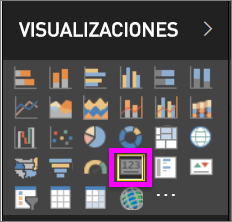
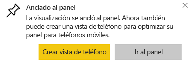
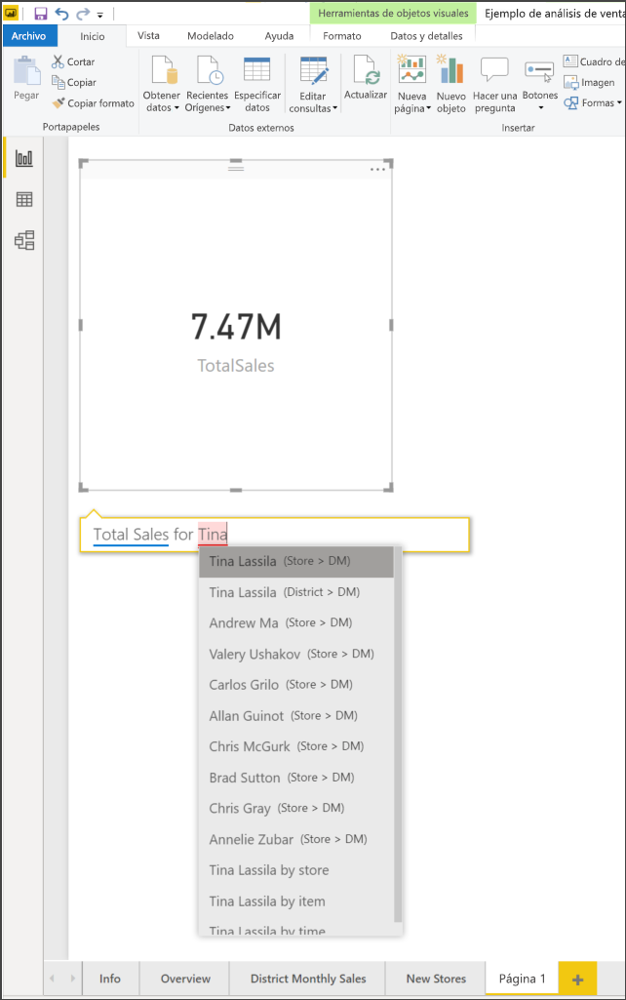
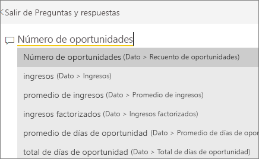
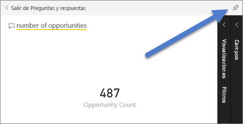
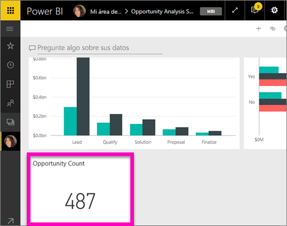
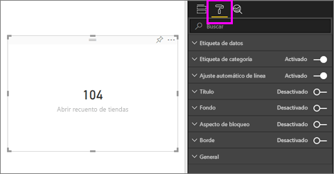
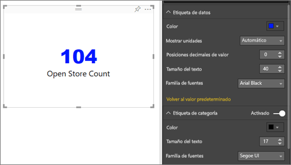
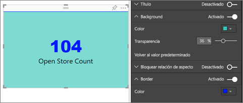

# Visualizaciones de tarjeta
A veces, un único número es lo más importante que desea seguir en el panel o informe de Power BI, como las ventas totales, la cuota de mercado interanual o el total de oportunidades. Este tipo de visualización se denomina una *tarjeta*. Al igual que con casi todas las visualizaciones nativas de Power BI, se pueden crear tarjetas con el editor de informes o mediante Preguntas y respuestas.

## Creación de una tarjeta con el editor de informes
Estas instrucciones usan el Ejemplo de análisis de minoristas. Para poder continuar, [descargue el ejemplo](../sample-datasets.md) del servicio Power BI (app.powerbi.com) o Power BI Desktop.   

1. Comience en una página de informe en blanco y seleccione el campo **Tienda** \> **Abrir recuento de tiendas**. Si está utilizando el servicio Power BI, tendrá que abrir el informe en la [vista de edición](../service-interact-with-a-report-in-editing-view.md).

    Power BI crea un gráfico de columnas con un solo número.

   
2. En el panel Visualizaciones, seleccione el icono Tarjeta.

   
6. Mantenga el puntero sobre la tarjeta y seleccione el icono de anclaje  para agregar la visualización al panel.

   
7. Ancle el icono a un panel existente o a un nuevo panel.

   * Panel existente: seleccione el nombre del panel en la lista desplegable.
   * Nuevo panel: escriba el nombre del nuevo panel.
8. Seleccione **Anclar**.

   Un mensaje de confirmación (cerca de la esquina superior derecha) le permitirá saber que se ha agregado la visualización al panel como un icono.

   
9. Seleccione **Ir al panel**. Allí puede [editar y mover](../service-dashboard-edit-tile.md) la visualización anclada.

## Creación de una tarjeta a partir del cuadro de Preguntas y respuestas
El cuadro de Preguntas y respuestas es la manera más fácil de crear una tarjeta. El cuadro de Preguntas y respuestas está disponible en el servicio Power BI desde un panel o informe, y en la vista de informe de Desktop. Los pasos siguientes describen la creación de una tarjeta desde un panel del servicio Power BI. Si desea crear una tarjeta mediante Preguntas y respuestas en Power BI Desktop, [siga estas instrucciones](https://powerbi.microsoft.com/blog/power-bi-desktop-december-feature-summary/#QandA) para la versión preliminar de Preguntas y respuestas para los informes de Desktop.

1. Cree un [panel](../service-dashboards.md) y [obtenga los datos](../service-get-data.md). Aquí se usa el [ejemplo Análisis de oportunidades](../sample-opportunity-analysis.md).

1. En la parte superior del panel, comience a escribir lo que quiere saber acerca de los datos en el cuadro de pregunta. 

   

> [!TIP]
> Desde un informe del servicio Power BI, en la vista de Edición, haga clic en **Hacer una pregunta** en la barra de menús superior. En un informe de Power BI Desktop, busque algún espacio abierto de un informe y haga doble clic para abrir un cuadro de pregunta.

3. Por ejemplo, escriba "número de oportunidades" en el cuadro de pregunta.

   

   El cuadro de pregunta le ayuda con sugerencias y nuevas instrucciones y, por último, muestra el número total.  
4. Seleccione el icono de anclaje  en la esquina superior derecha para agregar la tarjeta a un panel.

   
5. Ancle la tarjeta, como un icono, a un panel existente o a un nuevo panel.

   * Panel existente: seleccione el nombre del panel en la lista desplegable. Las opciones se limitarán a esos paneles que estén dentro del área de trabajo actual.
   * Nuevo panel: escriba el nombre del nuevo panel y se agregará al área de trabajo actual.
6. Seleccione **Anclar**.

   Un mensaje de confirmación (cerca de la esquina superior derecha) le permitirá saber que se ha agregado la visualización al panel como un icono.  

   
7. Seleccione **Ir al panel** para ver el nuevo icono. Allí, puede [cambiar el nombre, cambiar el tamaño, agregar un hipervínculo y cambiar la posición del icono](../service-dashboard-edit-tile.md) en el panel, entre otras cosas.

   

## Consideraciones y solución de problemas
- Si no ve un cuadro de pregunta, póngase en contacto con el administrador del sistema o del inquilino.    
- Si está utilizando Desktop y hace doble clic en un espacio vacío de un informe, no se abrirá Preguntas y respuestas, ya que debe habilitarlas.  Seleccione **Archivo > Opciones y configuración > Opciones > Características en vista previa > Preguntas y respuestas** y reinicie Desktop.

## Formateo de una tarjeta
Tiene muchas opciones para cambiar las etiquetas, el texto, el color, etc. La mejor manera de aprender consiste en crear una tarjeta y explorar el panel de formato. A continuación se indican solo algunas de las opciones de formato disponibles. 

1. Para empezar, haga clic en el icono de rodillo para abrir el panel Formato. 

    
2. Expanda **Etiqueta de datos** y cambie el color, el tamaño y la familia de fuentes. Si tuviera miles de tiendas, podría usar **Mostrar unidades** para mostrar el número de tiendas por miles y controlar también las posiciones decimales. Por ejemplo, 125,8 K en lugar de 125 832,00.

3.  Expanda **Etiqueta de categoría** y cambie el color y el tamaño.

    

4. Expanda **Fondo** y mueva el control deslizante a la posición de activado.  Ahora puede cambiar el color de fondo y la transparencia.

    

5. Siga explorando las opciones de formato hasta que la tarjeta esté exactamente cómo le gustaría. 

    

## Pasos siguientes
[Gráficos combinados en Power BI](power-bi-visualization-combo-chart.md)

[Tipos de visualización en Power BI](power-bi-visualization-types-for-reports-and-q-and-a.md)
