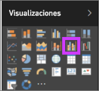
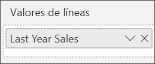
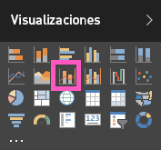

# Gráficos combinados en Power BI

En Power BI, un gráfico combinado es una visualización única que combina un gráfico de líneas y un gráfico de columnas. La combinación de los dos gráficos en uno permite realizar una comparación más rápida de los datos.

Los gráficos combinados pueden tener uno o dos ejes Y.

## Cuándo usar un gráfico combinado

Los gráficos combinados son una excelente opción:

* Si tiene un gráfico de líneas y un gráfico de columnas con el mismo eje X.

* Para comparar varias medidas con distintos intervalos de valores.

* Para ilustrar la correlación entre dos medidas en una visualización.

* Para comprobar si una medida cumple el objetivo que se define mediante otra medida.

* Para ahorrar espacio en el lienzo.

## Requisitos previos

Los gráficos combinados están disponibles en el servicio Power BI y Power BI Desktop. Este tutorial usa el servicio Power BI para crear un gráfico combinado. Asegúrese de que tiene las credenciales de usuario para iniciar sesión en Power BI.

Vea cómo Will crea un gráfico combinado con el Ejemplo de marketing y ventas.

<iframe width="560" height="315" src="https://www.youtube.com/embed/lnv66cTZ5ho?list=PL1N57mwBHtN0JFoKSR0n-tBkUJHeMP2cP" frameborder="0" allowfullscreen></iframe>  

## Creación de un gráfico combinado básico con un eje único

Para poder continuar, abra el servicio Power BI y conéctese al **ejemplo de análisis de venta directa**. Para crear su propio gráfico combinado, inicie sesión en Power BI y seleccione **Obtener datos** > **Ejemplos** > **Ejemplo de análisis de venta directa** > **Conectar**. Aparece el panel de **ejemplo de análisis de venta directa**.

1. En el panel de ejemplo de análisis de venta directa, seleccione el icono **Total de tiendas** para abrir el informe **Información general de las ventas de la tienda**.

1. Seleccione **Editar informe** para abrir el informe en la Vista de edición.

1. En la parte inferior de la página, seleccione **+** para agregar una nueva página del informe.

1. Cree un gráfico de columna que muestra las ventas de este año y el margen bruto por mes.

    1. En el panel Campos, seleccione **Ventas** \> **Ventas de este año** > **Valor**.

    1. Arrastre **Ventas** \> **Margen bruto de este año** al área **Valor**.

    1. Seleccione **Time** \> **FiscalMonth** para agregarlo al área **Eje**.

        

1. Seleccione los puntos suspensivos de la esquina superior derecha de la visualización y seleccione **Ordenar por > MesFiscal**. Para cambiar el criterio de ordenación, vuelva a hacer clic en los puntos suspensivos y elija **Orden ascendente** u **Orden descendente**.

1. Convierta el gráfico de columnas en un gráfico combinado. Hay dos gráficos combinados disponibles: **Gráfico de columnas apiladas y de líneas** y **Gráfico de columnas agrupadas y de líneas**. Con el gráfico de columnas seleccionado, en el panel **Visualizaciones**, seleccione el **Gráfico de columnas agrupadas y de líneas**.

    

1. En el panel **Campos**, arrastre **Ventas** > **Ventas del último año** al área **Valores de línea**.

    

    El gráfico combinado debe tener un aspecto similar al siguiente:

    

## Crear un gráfico combinado con dos ejes

En esta tarea, compararemos el margen bruto y las ventas.

1. Cree un nuevo gráfico de líneas que realice un seguimiento del **porcentaje de margen bruto del último año** por **mes**. Haga clic en los puntos suspensivos para ordenar por **Mes** y **Ascendente**.

    

     En enero el porcentaje de margen bruto fue de un 35 %, en abril alcanzó un máximo de un 45 %, en julio descendió y luego volvió a alcanzar otro máximo en agosto. ¿Se verá un patrón similar en las ventas del año anterior y este año?

1. Agregue **Ventas de este año** > **Valor** y **Ventas del último año** al gráfico de líneas. La escala de **porcentaje de margen bruto del último año** es mucho menor que la escala de **ventas**. Esto dificulta la comparación.

    

1. Para que el objeto visual sea fácil de leer e interpretar, convierta el gráfico de líneas en un gráfico de columnas apiladas y de líneas.

    

1. Arrastre el **Porcentaje de margen bruto del último año** de **Valores de columnas** a **Valores de líneas**. 

    

    Power BI crea dos ejes, lo que permite al servicio escalar los conjuntos de datos de forma diferente. El izquierdo mide las ventas en dólares y el derecho mide los porcentajes. Y vemos la respuesta a nuestra pregunta: Sí, vemos un patrón similar.

## Agregar títulos a los ejes

1. Seleccione el icono de rodillo de pintura  para abrir el panel Formato.

1. Seleccione la flecha hacia abajo para expandir las opciones del **eje Y** .

1. Para **Eje Y (columna)** , seleccione estas opciones:

    | Configuración | Valor |
    | ------- | ----- |
    | Posición | Seleccione **Izquierda**. |
    | Mostrar unidades | Seleccione **Millones**. |
    | Título | Mueva el control deslizante a **Activado**. |
    | Estilo | Seleccione **Mostrar solo título**. |
    | Mostrar secundaria | Mueva el control deslizante a **Activado**.  Muestra opciones para dar formato a la parte del gráfico de líneas del gráfico combinado. |

1. Para **Eje Y (línea)** , seleccione estas opciones:

    | Configuración | Valor |
    | ------- | ----- |
    | Posición | Seleccione **Derecha**. |
    | Título | Mueva el control deslizante a **Activado**. |
    | Estilo | Seleccione **Mostrar solo título**. |

    El gráfico combinado ahora muestra los dos ejes, ambos con títulos.

    

1. Si lo desea, cambie la fuente, el tamaño y el color del texto y establezca otras opciones de formato para mejorar la legibilidad del gráfico y la presentación.

Desde aquí puede realizar las siguientes acciones:

* [Agregue el gráfico combinado como un icono de panel](../service-dashboard-tiles.md).

* [Guarde el informe](../service-report-save.md).

* [Haga que el informe sea más accesible para personas con discapacidades](../desktop-accessibility.md).

## Resaltado cruzado y filtrado cruzado

Al resaltar una columna o una línea en un gráfico combinado, se realiza un resaltado cruzado y un filtrado cruzado de las demás visualizaciones en la página del informe. Para cambiar este comportamiento predeterminado, use [Interacciones de objetos visuales](../service-reports-visual-interactions.md).

## Pasos siguientes

[Gráficos de anillos en Power BI](power-bi-visualization-doughnut-charts.md)

[Tipos de visualización en Power BI](power-bi-visualization-types-for-reports-and-q-and-a.md)