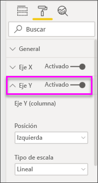
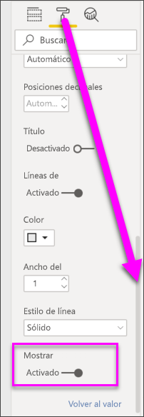

# Gráficos combinados en Power BI
En Power BI, un gráfico combinado es una visualización única que combina un gráfico de líneas y un gráfico de columnas. La combinación de los dos gráficos en uno permite realizar una comparación más rápida de los datos.

Los gráficos combinados pueden tener uno o dos ejes Y.

## Cuándo usar un gráfico combinado
Los gráficos combinados son una excelente opción:

* Si tiene un gráfico de líneas y un gráfico de columnas con el mismo eje X.
* Para comparar varias medidas con distintos intervalos de valores.
* Para ilustrar la correlación entre dos medidas en una visualización.
* Para comprobar si una medida cumple el objetivo que se define mediante otra medida.
* Para ahorrar espacio en el lienzo.

### Requisitos previos
Los gráficos combinados están disponibles en el servicio Power BI y Power BI Desktop. Este tutorial usa el servicio Power BI para crear un gráfico combinado. Para poder continuar, abra el servicio Power BI y conecte con el "Ejemplo de análisis de minoristas" ([consulte las instrucciones a continuación](#create)).

## Crear un gráfico combinado básico con un eje único
Vea cómo Will crea un gráfico combinado con el Ejemplo de marketing y ventas.

<iframe width="560" height="315" src="https://www.youtube.com/embed/lnv66cTZ5ho?list=PL1N57mwBHtN0JFoKSR0n-tBkUJHeMP2cP" frameborder="0" allowfullscreen></iframe>  

 Para crear su propio gráfico combinado, inicie sesión en el servicio Power BI y seleccione **Obtener datos \> Ejemplos \> Ejemplo de análisis de minoristas > Conectar > Ir al panel**.

1. En el panel "Ejemplo de análisis de minoristas", seleccione el informe **Total de tiendas** para abrir el informe "Ejemplo de análisis de minoristas".
2. Seleccione **Editar informe** para abrir el informe en la Vista de edición.
3. Agregue una nueva página de informe.
4. Cree un gráfico de columna que muestra las ventas de este año y el margen bruto por mes.

    a.  En el panel Campos, seleccione **Ventas** \> **Ventas de este año** > **Valor**.

    b.  Arrastre **Ventas** \> **Margen bruto de este año** al área **Valor**.

    c. Seleccione **Time** \> **FiscalMonth** para agregarlo al área **Eje**.

    
5. Haga clic en los puntos suspensivos (...) de la esquina superior derecha de la visualización y seleccione **Ordenar por > MesFiscal**. Para cambiar el criterio de ordenación, vuelva a hacer clic en los puntos suspensivos y elija **Orden ascendente** u **Orden descendente**.

6. Convierta el gráfico de columnas en un gráfico combinado. Hay dos gráficos combinados disponibles: **Gráfico de columnas apiladas y de líneas** y **Gráfico de columnas agrupadas y de líneas**. Con el gráfico de columnas seleccionado, en el panel **Visualizaciones**, seleccione el **Gráfico de columnas agrupadas y de líneas**.

    
7. En el panel **Campos**, arrastre **Ventas** \> **Ventas del último año** al cubo **Valores de línea**.

   

   El gráfico combinado debe tener un aspecto similar al siguiente:

   

## Crear un gráfico combinado con dos ejes
En esta tarea, compararemos el margen bruto y las ventas.

1. Crear un nuevo gráfico de líneas que realice el seguimiento **porcentaje de margen bruto** por **FiscalMonth**. Haga clic en los puntos suspensivos para ordenar por **Mes** y **Ascendente**.  
En enero el porcentaje de margen bruto fue de un 35 %, en abril alcanzó un máximo de un 45 %, en julio descendió y luego volvió a alcanzar otro máximo en agosto. ¿Se verá un patrón similar en las ventas del año anterior y este año?

   
2. Agregue **Ventas de este año > Valor** y **Ventas del último año** al gráfico de líneas. La escala de **porcentaje de margen bruto del último año** es mucho menor que la escala de **Ventas**, lo que dificulta la comparación.      

   
3. Para que el objeto visual sea fácil de leer e interpretar, convierta el gráfico de líneas en un gráfico de columnas apiladas y de líneas.

   
4. Arrastre el **Porcentaje de margen bruto del último año** de **Valores de columnas** a **Valores de líneas**. Power BI crea dos ejes, lo que permite escalar los conjuntos de datos de forma distinta; el izquierdo mide ventas en dólares y el derecho mide porcentajes. Y vemos la respuesta a nuestra pregunta; sí, vemos un patrón similar.

       

## Agregar títulos a los ejes
1. Seleccione el icono del rodillo de pintura  para abrir el panel Formato.
2. Seleccione la flecha hacia abajo para expandir las opciones del **eje Y** .
3. Para **eje y (columna)** , establezca **posición** a **izquierda**, establezca **título** a **en**,  **Estilo** a **mostrar solo el título**, y **mostrar unidades** como **millones**.

   
4. En **eje y (columna)** , desplácese hacia abajo hasta que vea **mostrar secundario**. Como hay tantas opciones para los ejes Y, es posible que deba usar dos barras de desplazamiento. La sección secundaria Show muestra opciones para dar formato a la parte del gráfico de línea del gráfico combinado.

   
5. Para **Eje Y (línea)** , deje **Posición** como **Derecha**, establezca **Título** como **Activado** y **Estilo** como **Mostrar solo el título**.

   El gráfico combinado ahora muestra los dos ejes, ambos con títulos.

   

6. Si lo desea, modifique la fuente, tamaño y color del texto y establezca otras opciones de formato para mejorar la legibilidad del gráfico y la presentación.

Desde aquí puede realizar las siguientes acciones:

* [Agregue el gráfico combinado como un icono de panel](../service-dashboard-tiles.md).
* [Guarde el informe](../service-report-save.md).
* [Haga que el informe sea más accesible para personas con discapacidades](../desktop-accessibility.md).

## Resaltado cruzado y filtrado cruzado

Al resaltar una columna o una línea en un gráfico combinado, se realiza un resaltado cruzado y un filtrado cruzado de las demás visualizaciones en la página del informe y viceversa. Para cambiar este comportamiento predeterminado, use [Interacciones de objetos visuales](../service-reports-visual-interactions.md).

## Pasos siguientes

[Gráficos de anillos en Power BI](power-bi-visualization-doughnut-charts.md)

[Tipos de visualización en Power BI](power-bi-visualization-types-for-reports-and-q-and-a.md)
