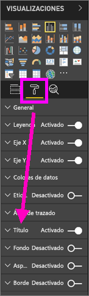
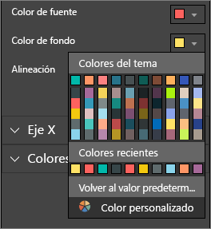
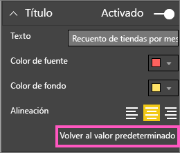
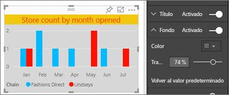
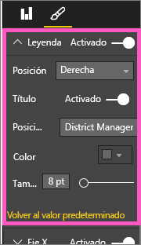
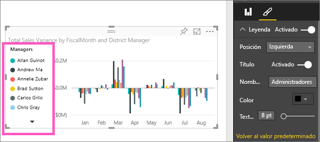

# Personalización de los títulos, las leyendas y los fondos de las visualizaciones

En este tutorial obtendrá información sobre diferentes formas de personalizar las visualizaciones. Hay numerosas opciones para personalizar las visualizaciones. La mejor manera para obtener información de todas ellas es explorando el panel **Formato** (seleccione el icono de rodillo de pintura). Para ayudarle a comenzar, este artículo muestra cómo personalizar un título de visualización, la leyenda y el fondo.

No se pueden personalizar todas las visualizaciones. Consulte la [lista completa](#visualization-types-that-you-can-customize) de visualizaciones para obtener más información.

Avance rápidamente hasta el minuto 4:50 del vídeo para ver una demostración de cómo personalizar las visualizaciones:

<iframe width="560" height="315" src="https://www.youtube.com/embed/IkJda4O7oGs" frameborder="0" allowfullscreen></iframe>

Ahora, siga las instrucciones que aparecen debajo para intentarlo con sus propios datos.

## Requisitos previos

- Servicio Power BI o Power BI Desktop

- Informe del ejemplo de análisis de minoristas

## Personalización de los títulos de las visualizaciones en los informes

Para continuar, inicie sesión en el [servicio Power BI](https://app.powerbi.com) y abra el informe [Ejemplo de análisis de minoristas](../sample-datasets.md) en la vista [Editar informe](../service-interact-with-a-report-in-editing-view.md).

> [!NOTE]
> Al anclar una visualización a un panel, se convierte en un icono de panel. Los iconos también se pueden personalizar con [nuevos títulos y subtítulos, hipervínculos y cambios de tamaño](../service-dashboard-edit-tile.md).

1. Vaya a la página **Nuevas tiendas** del informe **Ejemplo de análisis de minoristas**.

1. Seleccione el gráfico de columnas agrupadas **Recuento de tiendas abiertas por mes abierto y cadena** gráfico de columnas agrupadas.

1. En el panel **Visualizaciones**, seleccione el icono de rodillo para mostrar las opciones de formato.

1. Seleccione **Título** para expandir esa sección.

   

1. Mueva el control deslizante de **Título** a **Activar**.

   

1. Para cambiar el texto del título, escriba *Recuento de tiendas por mes de apertura* en el campo **Texto del título**.

1. Cambie el **color de fuente** a naranja y el **color de fondo** a amarillo.

    1. Seleccione la lista desplegable y elija un color en **Colores del tema**, **Colores recientes**o **Color personalizado**.

        

    1. Seleccione el menú desplegable para cerrar la ventana de colores.

       Guarde los cambios que haya realizado.

       Si necesita revertir todos los cambios, puede volver a los colores predeterminados seleccionando **Volver al valor predeterminado** en la ventana de colores.

1. Aumente el tamaño del texto a **12 puntos**.

1. La última personalización que haremos en el título del gráfico es alinearlo en el centro de la visualización.

    

En este punto del tutorial, el título del gráfico de columnas agrupadas tendrá un aspecto similar al siguiente:

Guarde los cambios realizados y pase a la sección siguiente.

Si necesita revertir todos los cambios, seleccione **Volver al valor predeterminado** en la parte inferior del panel de personalización **Título**.

## Personalización del fondo de la visualización

Con el mismo gráfico de columnas agrupadas seleccionado, expanda las opciones de **Fondo**.

1. Mueva el control deslizante de **Fondo** a **Activar**.

1. Seleccione el menú desplegable y elija un color gris.

1. Cambie la **transparencia** al **74 %** .

En este punto del tutorial, el fondo del gráfico de columnas agrupadas tendrá un aspecto similar al siguiente:

Guarde los cambios realizados y pase a la sección siguiente.

Si necesita revertir todos los cambios, seleccione **Volver al valor predeterminado** en la parte inferior del panel de personalización **Fondo**.

## Personalización de las leyendas de la visualización

1. Abra la página de informe **Introducción** y seleccione el gráfico **Varianza total de ventas por mes fiscal y administrador del distrito**.

1. Seleccione el icono del rodillo de pintura para abrir el panel Formato en la pestaña **Visualización**.

1. Expanda las opciones de **Leyenda**:

      

1. Mueva el control deslizante de **Leyenda** a **Activar**.

1. Mueva la leyenda a la izquierda de la visualización.

1. Agregue un título a la leyenda cambiando **Título** a **Activar**.

1. Escriba *Administradores* en el campo **Nombre de leyenda**.

En este punto del tutorial, la leyenda del gráfico de columnas agrupadas tendrá un aspecto similar al siguiente:

Guarde los cambios realizados y pase a la sección siguiente.

Si necesita revertir todos los cambios, seleccione **Volver al valor predeterminado** en la parte inferior del panel de personalización **Leyenda**.

## Tipos de visualización que se pueden personalizar

A continuación, encontrará una lista de las visualizaciones y opciones de personalización que están disponibles para cada tipo:

| Visualización | Título | Fondo | Leyenda |
|:--- |:--- |:--- |:--- |
| Área | sí | sí |sí |
| Barra | sí | sí |sí |
| Tarjeta | sí | sí |n/d |
| Tarjeta de varias filas | sí | sí | n/d |
| Columna | sí | sí | sí |
| Combinado | sí | sí | sí |
| Anillo | sí | sí | sí |
| Mapa coroplético | sí | sí | sí |
| Embudo | sí | sí | n/d |
| Medidor | sí | sí | n/d |
| KPI | sí | sí | n/d |
| Línea | sí | sí | sí |
| Mapa | sí | sí | sí |
| Matriz | sí | sí | n/d |
| Gráfico circular | sí | sí | sí |
| Dispersión | sí | sí | sí |
| Segmentación | sí | sí | n/d |
| Tabla | sí | sí | n/d |
| Cuadro de texto | no | sí | n/d |
| Gráfico de rectángulos | sí | sí | sí |
| Cascada | sí | sí | sí |

## Pasos siguientes

- [Personalización de las propiedades de los ejes X e Y](power-bi-visualization-customize-x-axis-and-y-axis.md)

- [Introducción a las propiedades de eje y formato de color](service-getting-started-with-color-formatting-and-axis-properties.md)

- [Conceptos básicos para los consumidores del servicio Power BI](../consumer/end-user-basic-concepts.md)

¿Tiene más preguntas? [Pruebe la comunidad de Power BI](https://community.powerbi.com/)
