# Personalización de las propiedades de los ejes X e Y

[!INCLUDE [power-bi-visuals-desktop-banner](../includes/power-bi-visuals-desktop-banner.md)]

En este tutorial, aprenderá muchas formas diferentes de personalizar los ejes X e Y de los objetos visuales. No todos los objetos visuales tienen ejes. Por ejemplo, los gráficos circulares no tienen ejes. Y las opciones de personalización varían de un objeto visual a otro. Hay demasiadas opciones para tratarlas todas en un solo artículo, así que vamos a examinar algunas de las personalizaciones más utilizadas y a familiarizarnos con el panel **Formato** del objeto visual del lienzo de informes de Power BI.  

Vea a Amanda personalizar los ejes X e Y. También mostrará las diferentes maneras de controlar la concatenación cuando se utiliza la exploración en profundidad y el resumen.

> [!NOTE]
> En este vídeo se usa una versión anterior de Power BI.

<iframe width="560" height="315" src="https://www.youtube.com/embed/9DeAKM4SNJM" frameborder="0" allowfullscreen></iframe>

## Requisitos previos

- Power BI Desktop

- [Ejemplo de análisis de minoristas](https://download.microsoft.com/download/9/6/D/96DDC2FF-2568-491D-AAFA-AFDD6F763AE3/Retail%20Analysis%20Sample%20PBIX.pbix)

## Incorporación de una nueva visualización

Antes de personalizar la visualización, tendrá que crearla.

1. En Power BI Desktop, abra el ejemplo de análisis de minoristas.  

2. En la parte inferior, seleccione el icono de signo más gris sobre fondo amarillo para agregar una nueva página. 

    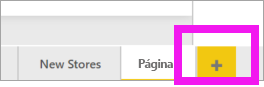

1. En el panel **Visualizaciones**, seleccione el icono del gráfico de columnas apiladas. Se agrega una plantilla vacía al lienzo de informes.

    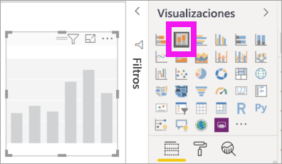

1. Para establecer los valores del eje X, en el panel **Campos**, seleccione **Time** (Tiempo) > **FiscalMonth** (MesFiscal).

1. Para establecer los valores del eje Y, en el panel **Campos**, seleccione **Sales** (Ventas) > **Last Year Sales** (Ventas del año anterior) y **Sales**  (Ventas)  > **This Year Sales** (Ventas de este año) > **Valor**.

    

    Ya puede personalizar el eje X. Power BI proporciona opciones casi ilimitadas para dar formato a cualquier visualización. 

## Personalización del eje X
Hay muchas características del eje X que se pueden personalizar. Puede agregar y modificar las etiquetas de datos y el título del eje X. En cuanto a las categorías, puede modificar el ancho, el tamaño y el relleno de las barras, columnas, líneas y áreas. Y en cuanto a los valores, puede modificar las unidades de visualización, las posiciones decimales y las líneas de la cuadrícula. En el ejemplo siguiente se muestra la personalización de un gráfico de columnas. Vamos a agregar algunas personalizaciones para que se familiarice con las opciones y, después, puede explorar el resto por su cuenta.

### Personalización de las etiquetas del eje X
Las etiquetas del eje X se muestran debajo de las columnas del gráfico. En este momento, son de color gris claro, pequeñas y difíciles de leer. Vamos a modificarlas.

1. En el panel **Visualizaciones**, seleccione **Formato** (el icono del rodillo ). para mostrar las opciones de personalización.

2. Expanda las opciones del eje X.

   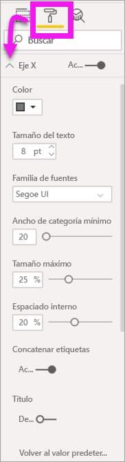

3. Mueva el control deslizante del **eje X** a **Activar**.

    

    Hay algunos motivos por los que es posible que desee establecer el eje X en **desactivado**, por ejemplo, cuando la visualización se entiende fácilmente sin necesidad de etiquetas o si tiene una página de informe muy llena y necesita liberar espacio para mostrar más datos.

4. Aplicar formato mediante color del texto, tamaño y fuente:

    - **Color**: seleccione el color negro.

    - **Tamaño del texto**: especifique *14*.

    - **Familia de fuentes**: seleccione **Arial Black**.

    - **Espaciado interno**: escriba *40 %*

        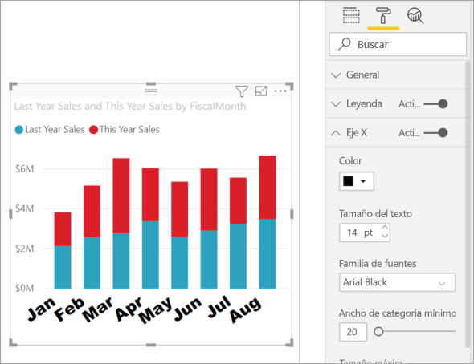
    
5. Tal vez no le guste el modo en que se muestra el texto del eje X en diagonal. Tiene varias opciones. 
    - Cambie el tamaño del texto a un valor inferior a 14.
    - Aumente el tamaño de la visualización. 
    - Muestre menos columnas y agregue una barra de desplazamiento, para lo que debe aumentar el valor de **Ancho de categoría mínimo**. 
    
    Aquí se ha seleccionado la segunda opción y se ha agarrado una de las barras de cambio de tamaño para aumentar el ancho de la visualización. Ahora admite el texto de 14 puntos sin necesidad de mostrarlo en un ángulo o con una barra de desplazamiento. 

   

### Personalización del título del eje X
Si el título del eje X está **Activo**, se muestra debajo de las etiquetas. 

1. Para empezar, coloque el control deslizante del título del eje X en **Activar**.  

    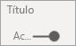

    Lo primero que observará es que la visualización ahora tiene un título de eje X predeterminado.  En este caso, es **FiscalMonth**.

   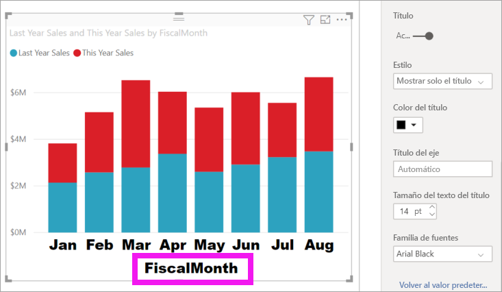

1. Aplique formato mediante el color del texto, tamaño y fuente al título.

    - **Color del título**: seleccione el color naranja.

    - **Título del eje**: escriba *Mes fiscal* (con espacio)

    - **Tamaño del texto del título**: escriba *18*

    Una vez finalizadas las personalizaciones, el aspecto del gráfico de columnas será similar a este:

    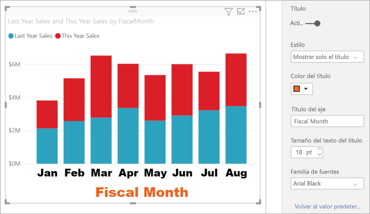

1. Guarde los cambios realizados y pase a la sección siguiente. Si necesita revertir todos los cambios, seleccione **Volver al valor predeterminado** en la parte inferior del panel de personalización del **eje X**. A continuación, va a personalizar el eje Y.

## Personalización del eje Y
Hay muchas características que se pueden personalizar en el eje Y. Puede agregar y modificar las etiquetas de datos, el título del eje X y las líneas de cuadrícula. En cuanto a los valores, puede modificar las unidades de visualización, las posiciones decimales, el punto de inicio y el punto final. Y, en cuanto a las categorías, puede modificar el ancho, el tamaño y el relleno de las barras, columnas, líneas y áreas. 

En el ejemplo siguiente se continúa la personalización de un gráfico de columnas. Vamos a realizar algunos cambios para que se familiarice con las opciones y, después, puede explorar el resto por su cuenta.

### Personalización de las etiquetas del eje Y
Las etiquetas del eje Y se muestran a la izquierda de forma predeterminada. En este momento, son de color gris claro, pequeñas y difíciles de leer. Vamos a modificarlas.

1. Expanda las opciones del eje Y.

   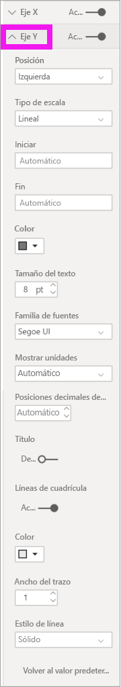

1. Mueva el control deslizante del **eje Y** a **Activar**.  

    

    Un motivo por el que podría desear desactivar el eje Y es ahorrar espacio para más datos.

1. Aplicar formato mediante color del texto, tamaño y fuente:

    - **Color**: seleccione el color negro.

    - **Tamaño del texto**: escriba *10*

    - **Mostrar unidades**: seleccione **Millones**

    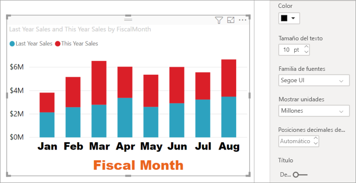

### Personalización del título del eje Y
Si el título del eje Y está **Activo**, se muestra al lado de las etiquetas. Para esta visualización, tener un título de eje Y no mejora el objeto visual, por lo que puede dejar **Título** en **Desactivar**. Más adelante agregaremos títulos de eje Y a un objeto visual de dos ejes. 

### Personalización de las líneas de cuadrícula
Vamos a hacer que las líneas de cuadrícula se resalten cambiando el color y aumentando el trazo:

- **Color**: seleccione el color naranja.

- **Trazo**: especifique *2*.

Después de todas estas personalizaciones, el gráfico de columnas debe tener un aspecto similar al siguiente:

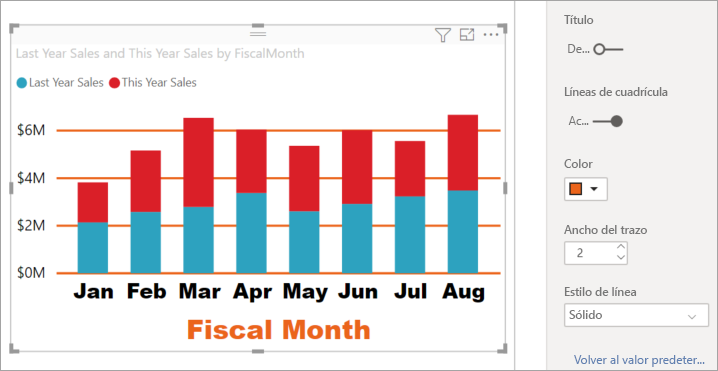

## Personalización de visualizaciones con dos ejes Y

Algunas visualizaciones pueden beneficiarse de tener dos ejes Y. Los gráficos combinados son un ejemplo de ello. Antes de poder formatear los dos ejes Y, vamos a crear un gráfico combinado que compare las tendencias de las ventas y el margen bruto.  

### Creación de un gráfico con dos ejes Y

1. Seleccione el gráfico de columnas y cámbielo a un gráfico de *columnas agrupadas y de líneas*. Este tipo de objeto visual admite un solo valor de gráfico de líneas y varios valores de columna apilables. 

    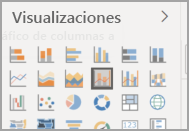
   

2. Arrastre **Ventas** > **Gross Margin Last Year %** (Porcentaje del margen bruto del último año) del panel Campos a **Valores de línea**.

    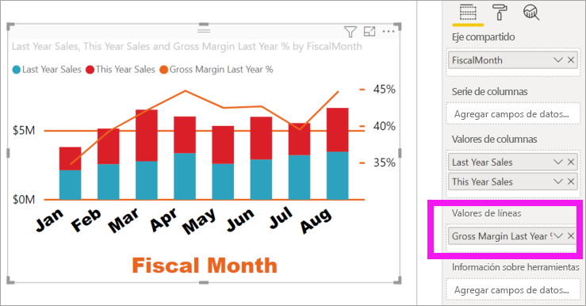

    
3. Vuelva a dar formato a la visualización para que las etiquetas del eje X dejen de aparecer inclinadas. 

   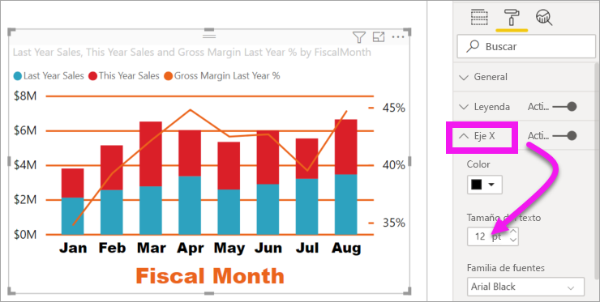

   Power BI crea dos ejes Y, lo que permite que los valores se escalen de manera diferente. El eje izquierdo mide los dólares de las ventas, mientras que el eje derecho mide porcentajes del margen bruto.

### Formato del segundo eje Y
Como comenzamos con una visualización con un eje Y con formato, Power BI creó el segundo eje Y con la misma configuración. Ahora vamos a cambiar esa configuración. 

1. En el panel **Visualizaciones**, seleccione el icono de rodillo para mostrar las opciones de formato.

1. Expanda las opciones del eje Y.

1. Desplácese hacia abajo hasta que encuentre la opción **Mostrar secundario**. Compruebe que está en **Activar**. El eje Y secundario representa el gráfico de líneas.

   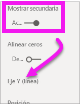

1. (Opcional) Personalice el color, el tamaño y las unidades de presentación de los dos ejes. Si cambia **Posición** para el eje de columna o el eje de línea, los dos ejes intercambian los lados.

### Incorporación de títulos a ambos ejes

Cuando la visualización es compleja, resulta útil agregar títulos a los ejes.  Los títulos ayudan a sus colegas a comprender la historia que está contando su visualización.

1. Cambie **Título** a **Activado** para **Eje Y (columna)** y **Eje Y (línea)** .

1. Establezca **Estilo** en **Mostrar solo el título** para ambos.

   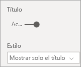

1. El gráfico combinado ahora muestra los dos ejes, ambos con títulos.

   

1. Dé formato a los títulos. En este ejemplo, se ha acortado uno de los títulos y se ha reducido el tamaño de fuente de ambos. 
    - Tamaño de fuente: **9**
    - Se ha acortado el **título de eje** del primer eje Y (el gráfico de columnas): Ventas del año anterior y de este año

    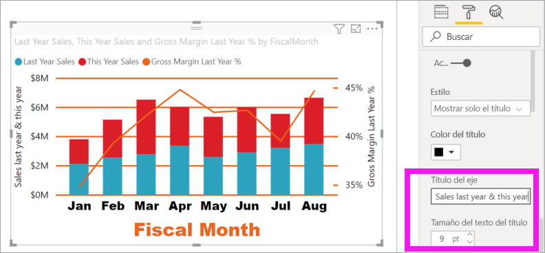

Para más información, consulte [Sugerencias y trucos para el formato de color en Power BI](service-tips-and-tricks-for-color-formatting.md) y [Personalización de los títulos, las leyendas y los fondos de las visualizaciones](power-bi-visualization-customize-title-background-and-legend.md). Y busque nuevas actualizaciones para dar formato, ya que estarán disponibles próximamente. 

## Pasos siguientes

- [Visualizaciones en informes de Power BI](power-bi-report-visualizations.md)

¿Tiene más preguntas? [Pruebe la comunidad de Power BI](https://community.powerbi.com/)
