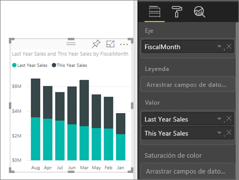
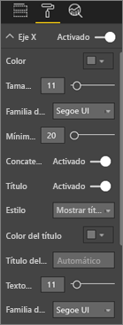
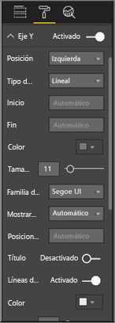
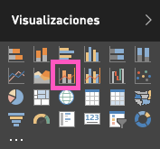
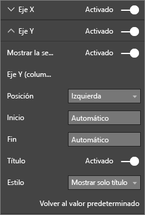

# Personalización de las propiedades de los ejes X e Y

En este tutorial, aprenderá multitud de formas diferentes de personalizar los ejes X e Y de los objetos visuales. No todos los objetos visuales tienen ejes. Por ejemplo, los gráficos circulares no tienen ejes. Y las opciones de personalización varían de un objeto visual a otro. Hay demasiadas opciones para tratar en un único artículo, por tanto eche un vistazo a algunas de las personalizaciones de ejes más utilizadas y familiarícese con el panel **Formato** del objeto visual del lienzo de informes de Power BI.  

> [!NOTE]
> Esta página se aplica al servicio Power BI y a Power BI Desktop. Estas personalizaciones, que están disponibles cuando se selecciona el icono **Formato** (el icono de rodillo ), también están disponibles en Power BI Desktop.

Vea a Amanda personalizar los ejes X e Y. Mostrará las diferentes maneras de controlar la concatenación cuando se utiliza la exploración en profundidad y el resumen.

<iframe width="560" height="315" src="https://www.youtube.com/embed/9DeAKM4SNJM" frameborder="0" allowfullscreen></iframe>

## Requisitos previos

- El servicio Power BI

- Informe del Ejemplo de análisis de minoristas

## Personalización de los ejes X e Y de visualización en los informes

Para continuar, inicie sesión en el [servicio Power BI](https://app.powerbi.com) y abra el informe [Ejemplo de análisis de minoristas](../sample-datasets.md) en la vista [Editar informe](../service-interact-with-a-report-in-editing-view.md).

### Creación de una visualización de gráfico de columnas apiladas

Antes de personalizar la visualización, tendrá que crearla.

1. En el servicio Power BI, expanda **Mi área de trabajo**.

1. Desplácese hacia abajo y seleccione **Ejemplo de análisis de minoristas** en la lista de **Conjuntos de datos**.

1. En el panel **Visualizaciones**, seleccione el icono del gráfico de columnas apiladas.

    

1. Para establecer los valores del eje X, desde el panel **Campos**, seleccione **Tiempo** > **MesFiscal**.

1. Para establecer los valores del eje Y, en el panel **Campos**, seleccione **Ventas** > **Ventas del año anterior** y **Ventas** > **Ventas de este año** > **Valor**.

    

### Personalización del eje X

Ahora puede personalizar el eje X.

1. En el panel **Visualizaciones**, seleccione **Formato** (el icono de rodillo ) para mostrar las opciones de personalización.

1. Expanda las opciones del eje X.

   

1. Mueva el control deslizante del **eje X** a **Activar**.

    

    Un motivo por el que podría desear desactivar el eje X es ahorrar espacio para más datos.

1. Aplicar formato mediante color del texto, tamaño y fuente:

    - **Color**: seleccione el color negro.

    - **Tamaño del texto**: especifique *14*.

    - **Familia de fuentes**: seleccione **Arial Black**.

1. Deslice la opción **Título** a **Activado** para mostrar el nombre del eje X. En este caso, es **FiscalMonth**.

1. Aplique formato mediante el color del texto, tamaño y fuente al título.

    - **Color del título**: seleccione el color naranja.

    - **Título del eje**: Escriba *Mes fiscal*.

    - **Tamaño del texto del título**: Escriba *21*.

Una vez finalizadas las personalizaciones, el gráfico de columnas apiladas tendrá un aspecto similar al siguiente:

Guarde los cambios realizados y pase a la sección siguiente.

Si necesita revertir todos los cambios, seleccione **Volver al valor predeterminado** en la parte inferior del panel de personalización del **eje X**.

### Personalización del eje Y

A continuación, va a personalizar el eje Y.

1. Expanda las opciones del eje Y.

   

1. Mueva el control deslizante del **eje Y** a **Activar**.  

    

    Un motivo por el que podría desear desactivar el eje Y es ahorrar espacio para más datos.

1. Establezca la **posición** del eje Y a la **derecha**.

1. Aplicar formato mediante color del texto, tamaño y fuente:

    - **Color**: seleccione el color negro.

    - **Tamaño del texto**: especifique *14*.

    - **Familia de fuentes**: seleccione **Arial Black**.

1. Establezca **Mostrar unidades** en **Millones** y **Posiciones decimales de valores** en *0*.

1. Para esta visualización, tener un título de eje Y no mejora el objeto visual, por lo que puede dejar **Título** en **Desactivar**.  

1. Vamos a hacer que las líneas de cuadrícula se resalten cambiando el color y aumentando el trazo:

    - **Color**: Seleccione el color gris oscuro.

    - **Trazo**: especifique *2*.

Después de todas estas personalizaciones, el gráfico de columnas debe tener un aspecto similar al siguiente:

## Personalización de visualizaciones con dos ejes Y

Primero deberá crear un gráfico combinado que busca el impacto que el recuento de tiendas tiene en las ventas. Este es el mismo gráfico que se crea en el [tutorial del gráfico combinado](power-bi-visualization-combo-chart.md). A continuación, deberá formatear los dos ejes Y.

### Creación de un gráfico con dos ejes Y

1. Cree un nuevo gráfico de líneas que realice un seguimiento de **Ventas > Porcentaje de margen bruto** por **Tiempo > FiscalMonth**.

    

    > [!NOTE]
    > Para ordenar por mes, consulte [Ordenación siguiendo otros criterios](../consumer/end-user-change-sort.md#other).

    En enero, el porcentaje de margen bruto fue del 35 %, alcanzó su punto máximo en abril con un 45 %, cayó en julio y volvió a alcanzar su punto máximo en agosto. ¿Se verá un patrón similar en las ventas del año anterior y este año?

1. Agregue **Ventas de este año > Valor** y **Ventas del último año** al gráfico de líneas.

    

    La escala de **porcentaje de margen bruto del último año** (la línea azul que está junto a la línea de cuadrícula de **0M%** ) es mucho menor que la escala de **Ventas**, lo que dificulta la comparación. Y los porcentajes de etiqueta del eje Y son absurdos.

1. Para que el objeto visual sea fácil de leer e interpretar, convierta el gráfico de líneas en un gráfico de columnas apiladas y de líneas.

   

1. Arrastre el **Porcentaje de margen bruto del último año** de **Valores de columnas** a **Valores de líneas**.

    

    Ahora tiene el gráfico de columnas apiladas que creó en la primera sección con un gráfico de líneas sobrepuesto. Si lo desea, utilice lo aprendido anteriormente para dar formato de fuente, color y tamaño al eje.

   

   Power BI crea dos ejes Y que permiten que los conjuntos de datos se escalen de manera diferente. El eje izquierdo mide dólares y el eje derecho mide porcentajes.

### Formato del eje Y secundario

1. En el panel **Visualizaciones**, seleccione el icono de rodillo para mostrar las opciones de formato.

1. Expanda las opciones del eje Y.

1. Desplácese hacia abajo hasta que encuentre la opción **Mostrar secundario**. Compruebe que está en **Activar**.

   

1. (Opcional) Personalice los dos ejes. Si cambia **Posición** para el eje de columna o el eje de línea, los dos ejes intercambian los lados.

### Incorporación de títulos a ambos ejes

Cuando la visualización es complicada, resulta útil agregar títulos a los ejes.  Los títulos ayudan a sus colegas a comprender la historia que está contando su visualización.

1. Cambie **Título** a **Activado** para **Eje Y (columna)** y **Eje Y (línea)** .

1. Establezca **Estilo** en **Mostrar solo el título** para ambos.

   

1. El gráfico combinado ahora muestra los dos ejes, ambos con títulos.

   

Para más información, consulte [Sugerencias y trucos para el formato de color en Power BI](service-tips-and-tricks-for-color-formatting.md).

## Consideraciones y solución de problemas

Si el eje X está clasificado por el propietario del informe como un tipo de fecha, se mostrará la opción **Tipo** y podrá seleccionar entre continuo o por categorías.

## Pasos siguientes

- [Visualizaciones en informes de Power BI](power-bi-report-visualizations.md)

- [Personalización de los títulos, las leyendas y los fondos de las visualizaciones](power-bi-visualization-customize-title-background-and-legend.md)

- [Introducción a las propiedades de eje y formato de color](service-getting-started-with-color-formatting-and-axis-properties.md)

- [Conceptos básicos para los consumidores del servicio Power BI](../consumer/end-user-basic-concepts.md)

¿Tiene más preguntas? [Pruebe la comunidad de Power BI](http://community.powerbi.com/)
