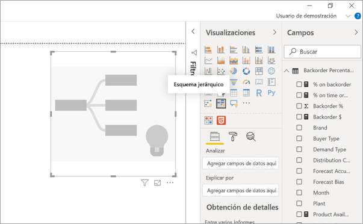
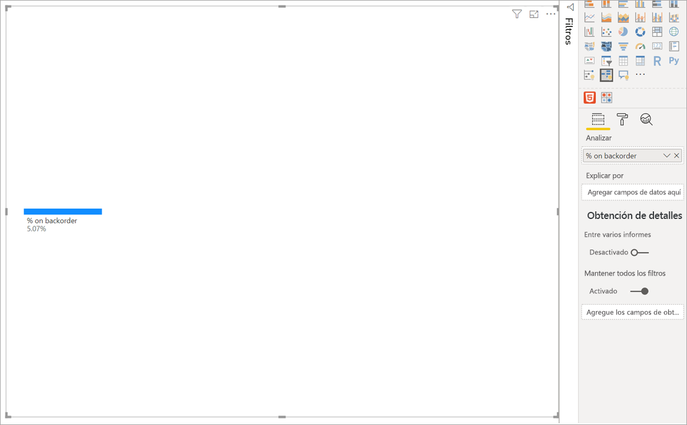
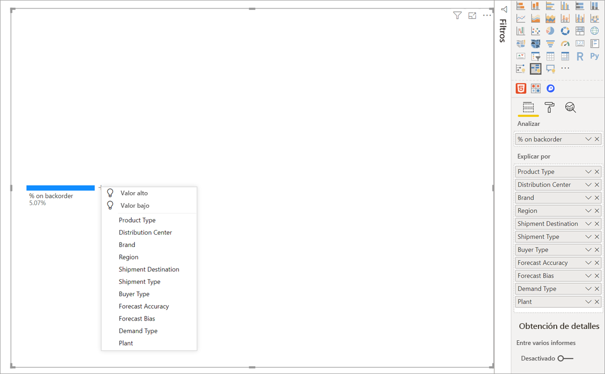
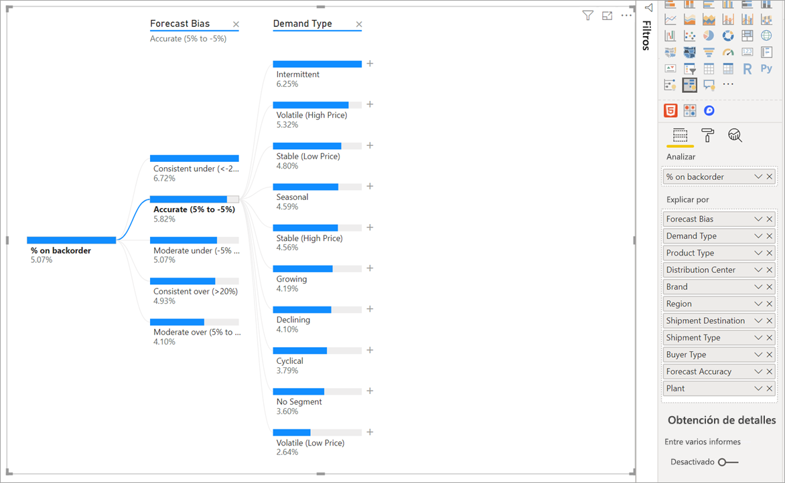
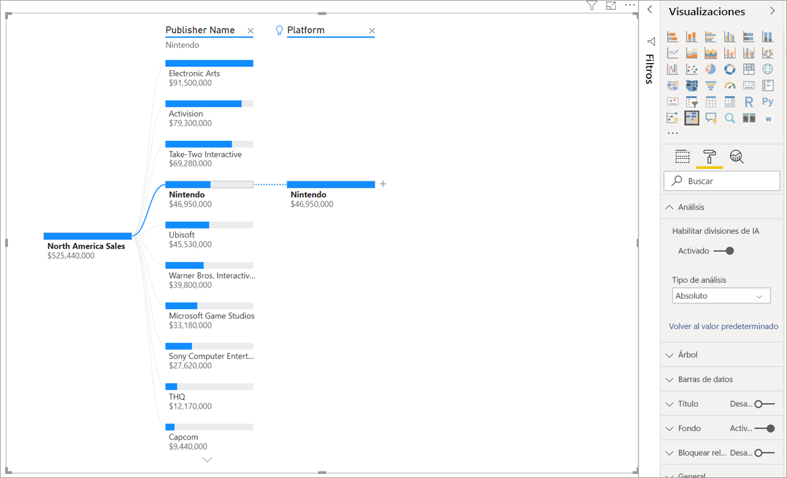
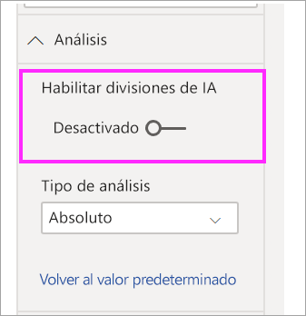

# Creación y visualización de objetos visuales de esquema jerárquico en Power BI (versión preliminar)
[!INCLUDE [power-bi-visuals-desktop-banner](../includes/power-bi-visuals-desktop-banner.md)]

El objeto visual del esquema jerárquico de Power BI le permite visualizar datos en varias dimensiones. Agrega datos de manera automática y permite explorar en profundidad las dimensiones en cualquier orden. También es una visualización de inteligencia artificial (IA), por lo que puede pedirle que busque la dimensión siguiente para explorar en profundidad en función de ciertos criterios. Esto lo convierte en una herramienta valiosa para la exploración ad hoc y para analizar la causa principal.

En este tutorial se usan dos ejemplos:

- Un escenario de cadena de suministro que analiza el porcentaje de productos que una empresa tiene como pendientes (sin existencias).  
- Un escenario de ventas que divide las ventas de videojuegos en numerosos factores, como el género y el publicador del juego.

## Comenzar
Seleccione el icono del esquema jerárquico en el panel Visualizaciones.

La visualización requiere dos tipos de entrada.

**Analyze**: la métrica que quisiera analizar. Debe ser una medida o un agregado.  
**Explain By**: una o más dimensiones que quisiera explorar en profundidad.

Una vez que arrastra la medida al campo, el objeto visual se actualiza y muestra la medida agregada. En el ejemplo siguiente, se visualiza el % promedio de los productos pendientes (5,07 %) 

El paso siguiente consiste en incorporar una o varias dimensiones que quisiera explorar en profundidad. Agregue estos campos al cubo **Explain by**. Observe que aparece un signo más junto al nodo raíz. Al seleccionar el signo +, puede elegir qué campo quiere explorar en profundidad (puede explorar los campos en el orden que quiera).

Si selecciona **Forecast bias** (Sesgo de la previsión), el árbol se expandirá y desglosará la medida según los valores de la columna. Es posible repetir este proceso si elige otro nodo que desglosar.

Al seleccionar un nodo del último nivel, se realiza un filtrado cruzado de los datos. Al seleccionar un nodo de un nivel anterior, se cambia la ruta de acceso.

Al interactuar con otros objetos visuales, se realiza un filtrado cruzado del esquema jerárquico. Como resultado, el orden de los nodos dentro de los niveles podría cambiar.
En el ejemplo siguiente, aplicamos un filtro cruzado del árbol por Ubisoft. La ruta de acceso se actualiza y las ventas de Xbox pasan del primer al segundo lugar, superadas por las ventas de PlayStation. 

Si luego aplicamos un filtro cruzado del árbol por Nintendo, las ventas de Xbox estarán en blanco, porque no hay ningún juego de Nintendo desarrollado para Xbox. Xbox, junto con su ruta de acceso subsiguiente, se filtra de la vista.

A pesar de que la ruta de acceso desaparece, los niveles existentes (en este caso, el género del juego) siguen anclados en el árbol. Si selecciona el nodo Nintendo, el árbol se expande de manera automática a Género del juego.

## Divisiones de IA

Puede usar "Divisiones de IA" para saber en qué parte de los datos debe fijarse a continuación. Estas divisiones aparecen en la parte superior de la lista y están marcadas con una bombilla. Las divisiones están allí para ayudarlo a buscar valores altos y bajos en los datos de manera automática.

El análisis puede funcionar de dos maneras según sus preferencias. El comportamiento predeterminado es el siguiente:

**Valor alto**: considera todos los campos disponibles y determina cuál se debe explorar en profundidad para obtener el valor más alto de la medida que se está analizando.  
**Valor bajo**: considera todos los campos disponibles y determina cuál se debe explorar en profundidad para obtener el valor más bajo de la medida que se está analizando.  

Si selecciona **Valor alto** en el ejemplo de los pedidos pendientes, ocurre lo siguiente: 

Aparece una bombilla junto a **Tipo de producto**, lo que indica que se trataba de una "división de IA". El árbol también proporciona una línea de puntos que recomienda el nodo **Supervisión del paciente**, que genera el valor más alto de pedidos pendientes (9,2 %). 

Mantenga el mouse sobre la bombilla para ver información sobre herramientas. En este ejemplo, la información sobre herramientas es "qué % de pedidos pendientes es mayor cuando el Tipo de producto es Supervisión del paciente".

Puede configurar el objeto visual para encontrar divisiones de IA **relativas** en lugar de **absolutas**. 

El modo relativo busca valores altos que se destaquen (en comparación con el resto de los datos de la columna). Para ilustrar esto, echemos un vistazo a un ejemplo: 

En la captura de pantalla anterior, examinamos una venta de videojuegos en Norteamérica. Primero dividimos el árbol por **Nombre del publicador** y, luego, desglosamos hasta llegar a Nintendo. Si selecciona **Valor alto**, se expande **La plataforma es Nintendo**. Dado que Nintendo (el publicador) solo desarrolla para consolas de Nintendo, no hay más que un valor presente y, por lo tanto, no sorprende que sea el valor más alto.

No obstante, una división más interesante sería ver qué valor alto se destaca con respecto a otros valores de la misma columna. Si cambiamos el tipo de análisis de **Absoluto** a **Relativo**, obtenemos el resultado siguiente para Nintendo: 

Esta vez, el valor recomendado es **Plataforma dentro del género del juego**.  La plataforma no genera un valor absoluto mayor que Nintendo (USD 19 950 000 frente a USD 46 950 000). Sin embargo, es un valor que destaca.

Más concretamente, dado que hay 10 valores de Género del juego, el valor esperado para la plataforma sería USD 4,6 millones si se dividiera en partes iguales. Como la plataforma tiene un valor de USD 20 millones, es un resultado interesante porque es cuatro veces mayor que el resultado esperado.

El cálculo es el siguiente:

Ventas de Norteamérica por plataforma/ Absoluto(Promedio(Ventas de Norteamérica por Género del juego))  
en comparación con  
Ventas de Norteamérica por Nintendo / Absoluto(Promedio(Ventas de Norteamérica por plataforma))  

Lo que se traduce en:

19 550 000 / (19 550 000 + 11 140 000 + … + 470 000 + 60 000 /10) = 4,25x  
en comparación con  
46 950 000/ (46 950 000/1) = 1x  

Si prefiere no usar ninguna división de IA en el árbol, también tiene la opción de desactivarlas en las opciones **Analysis formatting** (Formato de análisis):  

## Interacciones del esquema con divisiones de IA

Puede tener varios niveles de IA subsiguientes. También puede combinar varios tipos de niveles de IA (vaya de Valor alto a Valor bajo y vuelva a Valor alto): 

Si selecciona otro nodo del árbol, las divisiones de IA se recalculan de cero. En el ejemplo siguiente, cambiamos el nodo seleccionado en el nivel **Forecast Bias** (Sesgo de la previsión). Los niveles subsiguientes cambian para generar los valores Alto y Bajo correctos 

Los niveles de IA también se recalculan cuando se aplica un filtro cruzado del esquema jerárquico según otro objeto visual. En el ejemplo siguiente, podemos ver que el porcentaje de pedidos pendientes es mayor para la planta n.° 0477.

Pero si seleccionamos **Abril** en el gráfico de barras, el valor más alto cambia a **Product Type is Advanced Surgical** (El tipo de producto es Cirugía avanzada). En este caso, no solo se trata de que se reordenaron los nodos, sino que se eligió una columna totalmente distinta. 

Si queremos que los niveles de IA se comporten como niveles que no son de IA, seleccione la bombilla para volver al comportamiento predeterminado. 

Aunque se pueden encadenar varios niveles de IA, un nivel que no sea de IA no puede seguir a un nivel de IA. Si hacemos una división manual después de una división de IA, desaparece la bombilla del nivel de IA y el nivel se transforma en un nivel normal. 

## Bloqueo

Un creador de contenido puede bloquear niveles para los consumidores de informes. Cuando un nivel está bloqueado, no se puede quitar ni cambiar. Un consumidor puede explorar distintas rutas de acceso dentro del nivel bloqueado, pero no puede cambiar el nivel mismo. Como creador, puede mantener el mouse sobre los niveles existentes para ver el icono de candado. Puede bloquear tantos niveles como desee, pero no puede tener niveles desbloqueados antes que los niveles bloqueados.

En el ejemplo siguiente, los dos primeros niveles están bloqueados. Esto significa que los consumidores de informes pueden cambiar el nivel 3 y 4 e incluso agregar nuevos niveles después. Sin embargo, los dos primeros niveles no se pueden cambiar:

## Limitaciones conocidas

El número máximo de niveles del esquema es 50. El número máximo de puntos de datos que se pueden visualizar al mismo tiempo en el esquema es 5000. Los niveles se truncan para mostrar los n principales. Actualmente, el n superior por nivel se establece en 10. 

El esquema jerárquico no se admite en los escenarios siguientes:  
-   Analysis Services local

Las divisiones de IA no se admiten en los escenarios siguientes:  
-   Azure Analysis Services
-   Direct Query
-   Power BI Report Server
-   Publicar en web
-   Medidas complejas y medidas de los esquemas de extensión en "Analyze"

Otras limitaciones de la versión preliminar:
- Power BI Mobile  
- Anclaje en el panel
- Funcionalidad Mostrar datos
- Soporte dentro de Preguntas y respuestas

## Pasos siguientes

[Gráfico de anillos de Power BI](power-bi-visualization-doughnut-charts.md)

[Visualizaciones de Power BI](power-bi-report-visualizations.md)

