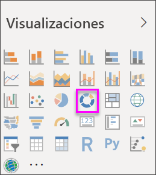
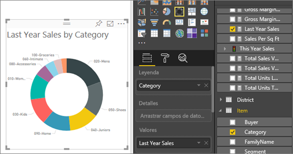

# Gráficos de anillos en Power BI
Un gráfico de anillos es similar a un gráfico circular porque muestra la relación de las partes con el todo. La única diferencia es que el centro está en blanco y deja espacio para un icono o una etiqueta.

## Crear un gráfico de anillos
Estas instrucciones usan el ejemplo de análisis de venta directa para crear un gráfico de anillos que muestra las ventas de este año por categorías. Para poder continuar, [descargue el ejemplo](../sample-datasets.md) del servicio Power BI o Power BI Desktop.

1. Empiece en una página de informe en blanco. Si está utilizando el servicio Power BI, asegúrese de que abre el informe en [Vista de edición](../service-interact-with-a-report-in-editing-view.md).

2. En el panel Campos, seleccione **Ventas** \> **Ventas del último año**.  
   
3. En el panel Visualizaciones, seleccione el icono del gráfico de anillos  para convertir el gráfico de barras en un gráfico de anillos. Si **Ventas del último año** no está en el área **Valores**, arrástrelo aquí.
     
   

4. Seleccione **Elemento** \> **Categoría** para agregarlo al área **Leyenda**. 
     
    

5. Si lo desea, [ajuste el tamaño y el color del texto del gráfico](power-bi-visualization-customize-title-background-and-legend.md). 

## Consideraciones y solución de problemas
* La suma de los valores del gráfico de anillos debe ser el 100%.
* Demasiadas categorías dificultan la lectura y la interpretación.
* Los gráficos de anillos son útiles para comparar una sección determinada con el total, en lugar de comparar secciones individuales entre sí. 

## Pasos siguientes
[Gráficos de embudo en Power BI](power-bi-visualization-funnel-charts.md)

[Tipos de visualización en Power BI](power-bi-visualization-types-for-reports-and-q-and-a.md)

