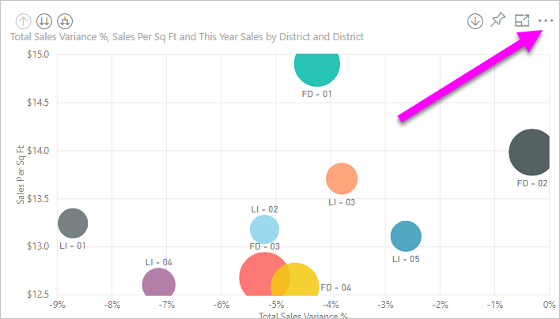
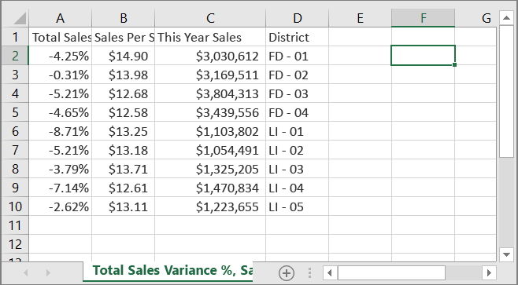
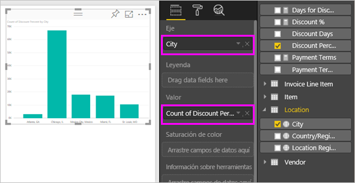
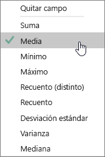
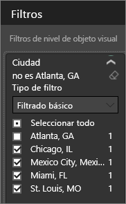
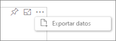
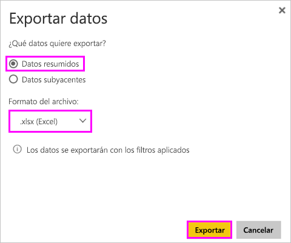
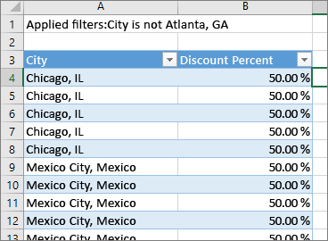
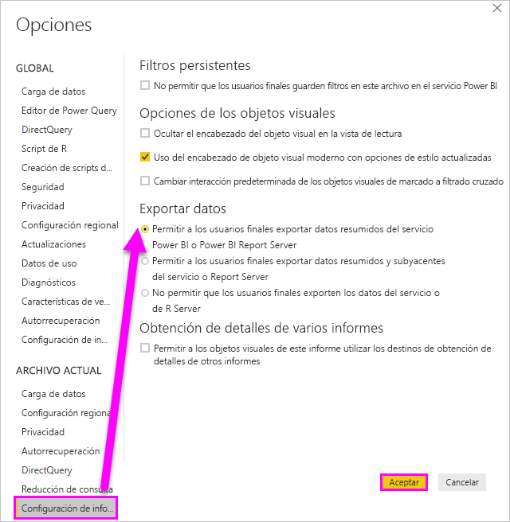

# Exportar datos de visualizaciones
Si quiere ver los datos que se usan para crear una visualización, [puede mostrar estos datos en Power BI](service-reports-show-data.md) o exportarlos a Excel como un archivo .xlsx o .csv. La opción de exportar los datos requiere una licencia Pro o Premium y editar los permisos del conjunto de datos y del informe. 

Observe cómo Will exporta los datos de una de las visualizaciones de su informe, los guarda como un archivo .xlsx y los abre en Excel. Luego, siga las instrucciones paso a paso que aparecen debajo del vídeo para intentarlo.

<iframe width="560" height="315" src="https://www.youtube.com/embed/KjheMTGjDXw" frameborder="0" allowfullscreen></iframe>

## Desde una visualización en un panel de Power BI
1. Seleccione los puntos suspensivos en la esquina superior derecha de la visualización.

    
2. Elija el icono **Exportar datos**.

    
3. Los datos se exportan a un archivo .csv. Si el objeto visual está filtrado, también se filtrarán los datos descargados.    
4. El explorador le pedirá que guarde el archivo.  Una vez que lo haya guardado, abra el archivo .csv en Excel.

    

## Desde una visualización en un informe
Para poder continuar, abra el [informe de ejemplo de análisis de adquisiciones](../sample-procurement.md) en la vista de edición. Agregue una nueva página de informe en blanco. A continuación, siga estos pasos para agregar una agregación y un filtro de nivel de visualización.

1. Cree un nuevo gráfico de columna.  En el panel Campos, seleccione **Ubicación > Ciudad** y **Factura > Porcentaje de descuento**.  Puede que tenga que mover el **Porcentaje de descuento** a Valor. 

    
2. Cambie la agregación de **Porcentaje de descuento** de **Recuento** a **Media**. En Valor, seleccione la flecha situada a la derecha de **Porcentaje de descuento** (es posible que ponga **Recuento de porcentaje de descuento**) y elija **Media**.

    
3. Agregue un filtro a **Ciudad** para quitar **Atlanta**.

   

   Ahora ya puede probar ambas opciones de exportación de datos. 

4. Seleccione los puntos suspensivos en la esquina superior derecha de la visualización. Elija **Exportar datos**.

   
5. En Power BI en línea, si la visualización tiene un agregado (un ejemplo sería si ha cambiado **Recuento** a *Media*, *Suma* o *Mínimo*), tendrá dos opciones: **Datos resumidos** y **Datos subyacentes**. En Power BI Desktop, solo tendrá la opción de **Datos resumidos**. Para entender mejor los agregados, consulte [Agregados en Power BI](../service-aggregates.md).
    
6. Seleccione **Datos resumidos** > **Exportar** y elija .xlsx o .csv. Power BI exporta los datos.  Si ha aplicado filtros a la visualización, los datos exportados se exportarán como filtrados. Cuando seleccione **Exportar**, el explorador le pedirá que guarde el archivo. Una vez que lo haya guardado, abra el archivo en Excel.

   **Datos resumidos**: seleccione esta opción si quiere exportar los datos de lo que ve en ese objeto visual.  Este tipo de exportación muestra únicamente los datos (columnas y medidas) que eligió para crear el objeto visual.  Si el objeto visual tiene un agregado, se exportarán los datos agregados. Por ejemplo, si tiene un gráfico de barras que muestra 4 barras, obtendrá 4 filas de datos. Los datos resumidos están disponibles como .xlsx y .csv.

   En este ejemplo, la exportación a Excel muestra un total por cada ciudad. Puesto que se ha filtrado por Atlanta, esta no se incluye en los resultados.  La primera fila de nuestra hoja de cálculo muestra los filtros que se usaron al extraer los datos de Power BI.

   
7. Ahora pruebe a seleccionar **Datos subyacentes** > **Exportar** y elija .xlsx. Power BI exporta los datos. Si ha aplicado filtros a la visualización, los datos exportados se exportarán como filtrados. Cuando seleccione **Exportar**, el explorador le pedirá que guarde el archivo. Una vez que lo haya guardado, abra el archivo en Excel.

   >[!WARNING]
   >Al exportarse los datos subyacentes, se permite a los usuarios ver todos los datos detallados, es decir, todas las columnas en los datos. Los administradores del servicio Power BI pueden desactivar esta opción para su organización. Si es el propietario de un conjunto de datos, puede establecer las columnas de propiedad en "oculto" para que no aparezcan en la lista Campo en el servicio de escritorio o Power BI.

   **Datos subyacentes**: seleccione esta opción si quiere ver los datos en el objeto visual ***y*** más datos del modelo (vea el gráfico de abajo para obtener más información).  Si la visualización tiene un agregado, al seleccionar *Datos subyacentes* se quita el agregado. Cuando selecciona **Exportar**, los datos se exportan a un archivo .xlsx y el explorador le pide que guarde el archivo. Una vez que lo haya guardado, abra el archivo en Excel.

   En este ejemplo, la exportación de Excel muestra una fila para cada fila de ciudad del conjunto de datos y el porcentaje de descuento para esa única entrada. En otras palabras, los datos están aplanados y no se agregan. La primera fila de nuestra hoja de cálculo muestra los filtros que se usaron al extraer los datos de Power BI.  

   

## Exportación de los detalles de los datos subyacentes
Lo que se muestra al seleccionar **Datos subyacentes** puede variar. Para comprender estos detalles, puede que sea necesaria la ayuda de su administrador o del departamento de TI. En Power BI Desktop o en el servicio, en la vista Informes, aparece una *medida* en la lista de campos con un icono de calculadora . Las medidas se crean en Power BI Desktop, pero no en el servicio Power BI.

| Contenido del objeto visual |                                                                              Información que se mostrará durante la exportación                                                                              |
|-----------------|-------------------------------------------------------------------------------------------------------------------------------------------------------------------------------------|
|   Agregados    |                                                 *Primer* agregado y datos no ocultos de la tabla completa de dicho agregado                                                  |
|   Agregados    | Datos relacionados: si el objeto visual utiliza datos de otras tablas de datos que están *relacionadas* con la tabla de datos que contiene el agregado (siempre y cuando la relación sea\*:1 o 1:1) |
|    Medidas     |                                      Todas las medidas en el objeto visual *y* todas las medidas de cualquier tabla de datos que contenga una medida usada en el objeto visual                                      |
|    Medidas     |                                       Todos los datos no ocultos de las tablas que contengan esa medida (siempre y cuando la relación sea \*:1 o 1:1)                                       |
|    Medidas     |                                      Todos los datos de todas las tablas relacionadas con la tabla o tablas que contengan las medidas a través de una cadena de tipo \*:1 o 1:1)                                      |
|  Solo medidas  |                                                   Todas las columnas no ocultas de todas las tablas relacionadas (para expandir la medida)                                                   |
|  Solo medidas  |                                                             Datos resumidos de todas las filas duplicadas de medidas del modelo                                                              |

### Configuración de las opciones de exportación
Los diseñadores de informes de Power BI controlan los tipos de opciones de exportación de datos que están disponibles para sus consumidores. Las opciones son:
- Permitir exportación solo de datos resumidos (este es el valor predeterminado para nuevos informes) 
- Permitir la exportación de datos resumidos y subyacentes (este era el valor predeterminado antes de octubre de 2018) 
- No permitir la exportación de datos  

    > [!IMPORTANT]
    > Se recomienda que los diseñadores de informes revisen los informes antiguos y restablezcan manualmente la opción de exportación según sea necesario.

1. Para establecer estas opciones, inicie en Power BI Desktop.

2. En la esquina superior izquierda, seleccione **Archivo** > **Opciones y configuración** > **Opciones**. 

3. En **Archivo actual**, seleccione **Configuración del informe**.

    

4. Seleccione una opción en la lista desplegable **Exportar datos**.

También puede actualizar esta configuración en el servicio Power BI.  

Es importante tener en cuenta que si la configuración del portal de administración de Power BI entra en conflicto con la configuración del informe para exportar datos, la configuración de administrador anulará la configuración de exportar datos. 

## Limitaciones y consideraciones
* El número máximo de filas que se pueden exportar desde **Power BI Desktop** y el **servicio Power BI** a .csv es 30 000.
* El número máximo de filas que se puede exportar a .xlsx es 150 000.
* La exportación utilizando *Datos subyacentes* no funcionará si el origen de datos es una conexión dinámica de Analysis Services y la versión es anterior a 2016 y las tablas del modelo no tienen una clave única.  
* La exportación utilizando *Datos subyacentes* no funcionará si la opción *Mostrar elementos sin datos* está habilitada para la visualización que se va a exportar.
* Cuando use DirectQuery, la cantidad máxima de datos que se pueden exportar es de 16 MB. Debido a esto puede que se exporte un número de filas inferior al máximo, especialmente si hay muchas columnas, los datos son difíciles de comprimir o debido a otros factores que hacen que aumente el tamaño y se reduzca el número de filas exportadas.
* Si el objeto visual emplea datos de más de una tabla de datos y no existe ninguna relación con esas tablas en el modelo de datos, se exportan solo los datos de la primera tabla. 
* Actualmente no se admiten objetos visuales personalizados ni objetos visuales de R.
* La exportación de datos no está disponible para aquellos usuarios fuera de la organización que usan un panel que se ha compartido con ellos. 
* En Power BI, puede cambiarse el nombre de un campo (columna) haciendo doble clic en el campo y escribiendo un nuevo nombre.  Este nuevo nombre se conoce como *alias*. Es posible que un informe de Power BI pueda acabar con nombres de campo duplicados, pero Excel no permite duplicados.  De modo que si los datos se exportan a Excel, los alias de los campos cambian a sus nombres originales de campo (columna).  
* Si el archivo .csv incluye caracteres Unicode, es posible que el texto no se muestre correctamente en Excel. Sin embargo, si lo abre en el Bloc de notas funcionará sin problemas. Algunos ejemplos de caracteres Unicode son los símbolos de moneda y palabras en otros idiomas. Para solucionar este problema, puede importar el archivo .csv a Excel en lugar de abrirlo directamente. Para hacerlo:

  1. Abra Excel
  2. En la pestaña **Datos**, seleccione **Obtener datos externos** > **Desde un archivo de texto**.
* Los administradores de Power BI tienen la capacidad de deshabilitar la exportación de datos.

¿Tiene más preguntas? [Pruebe a preguntar a la comunidad de Power BI](http://community.powerbi.com/)

