# Mapas coropléticos en Power BI
Los mapas coropléticos usan sombreado, tintes o patrones para mostrar las diferencias de un valor en proporción en una ubicación geográfica o región.  Muestre rápidamente estas diferencias relativas con sombreados que va del claro (valores menos frecuentes o inferiores) a oscuro (más frecuentes o superiores).    

## Qué se envía a Bing
Power BI se integra con Bing para proporcionar coordenadas de mapas predeterminadas (un proceso denominado geocodificación). Cuando se crea una visualización de mapa en el servicio Power BI o en Power BI Desktop, se envían a Bing los datos en los cubos **Ubicación**, **Latitud** y **Longitud** (que se usan para crear la visualización).

Puede que usted o su administrador tengan que actualizar el firewall para permitir el acceso a las direcciones URL que utiliza Bing para geocodificación.  Estas direcciones URL son:
- https://dev.virtualearth.net/REST/V1/Locations    
- https://platform.bing.com/geo/spatial/v1/public/Geodata    
- https://www.bing.com/api/maps/mapcontrol

Para más información sobre los datos que se envían a Bing, así como sugerencias para lograr mejores resultados con la geocodificación, consulte [Sugerencias y trucos para visualizaciones de mapa](power-bi-map-tips-and-tricks.md).

## Cuándo usar un mapa coroplético
Los mapas coropléticos son una excelente opción:

* Para mostrar información cuantitativa en un mapa.
* Para mostrar las relaciones y patrones espaciales.
* Cuando los datos están normalizados.
* Cuando se trabaja con datos socioeconómicos.
* Cuando las regiones definidas son importantes.
* Para obtener una visión general de la distribución en las ubicaciones geográficas.

### Requisitos previos
- Servicio Power BI o Power BI Desktop
- Ejemplo de marketing y ventas

Para continuar, el tutorial utiliza el servicio Power BI, no Power BI Desktop.

## Crear un mapa coroplético básico
En este video, Kim crea un mapa básico y lo convierte en un mapa coroplético.

<iframe width="560" height="315" src="https://www.youtube.com/embed/ajTPGNpthcg" frameborder="0" allowfullscreen></iframe>

### Obtención de datos y adición de una nueva página en blanco al informe
1. Para crear su propio mapa coroplético, [descargue el ejemplo de marketing y ventas](../sample-datasets.md). Para ello, inicie sesión en Power BI y seleccione **Obtener datos \> Ejemplos \> Ventas y marketing \> Conectar**.
2. Cuando aparezca el mensaje de operación correcta, ciérrelo y haga clic en la pestaña **Informes**. Después, seleccione **Ejemplo de marketing y ventas** para abrir el informe.

   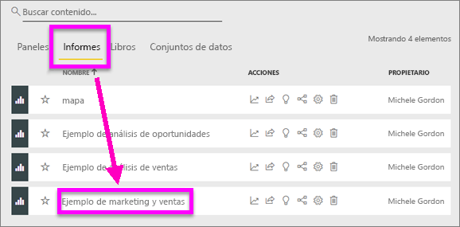
3. Power BI abre el informe. Haga clic en **Editar informe** para abrir el informe en [Vista de edición](../service-interact-with-a-report-in-editing-view.md).

4. Para agregar una página nueva, haga clic en el icono de signo de suma de color amarillo de la parte inferior del lienzo del informe.

    

### Creación de un mapa coroplético
1. En el panel Campos, seleccione el campo **Zona geográfica** \> **Estado**.    

   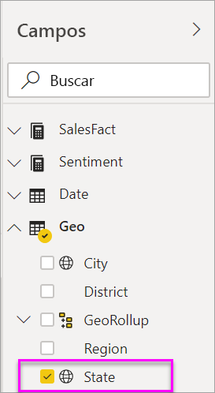
5. [Convierta el gráfico](power-bi-report-change-visualization-type.md) en un mapa coroplético. Observe que **Estado** está ahora en el área **Ubicación**. Bing Maps usa el campo del área **Ubicación** para crear el mapa.  La ubicación puede ser una gran variedad de ubicaciones válidas: países, estados, provincias, ciudades, códigos postales, etc. Bing Maps proporciona mapas coropléticos para ubicaciones en todo el mundo. Sin una entrada válida en el área Ubicación, Power BI no puede crear el mapa coroplético.  

   
6. Filtre el mapa para mostrar solo el territorio continental de Estados Unidos.

   a.  En la parte inferior del panel Visualizaciones, busque el área **Filtros** .

   b.  Pase el mouse sobre **Estado** y haga clic en el botón de contenido adicional.  
   

   c.  Coloque una marca de verificación junto a **Todos** y quite la marca de verificación junto a **AK**.

   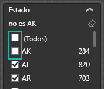
7. Seleccione **SalesFact** \> **Opinión** para agregarlo al área **Saturación de color**. El campo en el área **Saturación de color** controla el sombreado del mapa.  
   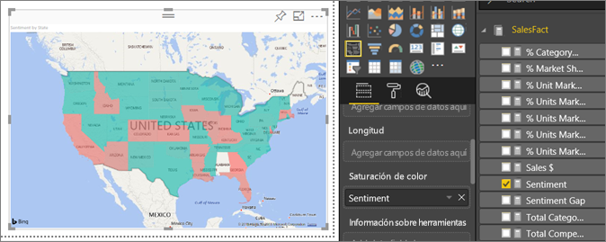
8. El mapa coroplético se sombrea en color verde y rojo; el rojo representa los números de opinión más bajos y el verde la opinión más alta y más positiva.  Aquí hemos resaltado el estado de Wyoming (WY) y vemos que la opinión es muy buena, 74.  
   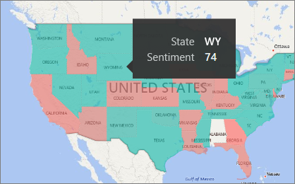
9. [Guarde el informe](../service-report-save.md).
##    Ajuste del formato de color
Power BI le proporciona mucho control sobre la apariencia del mapa coroplético.
1. Haga clic en el icono del rodillo de pintura para abrir el panel Formato.

    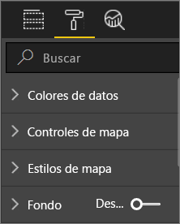

2. Haga clic en **Colores de datos** para mostrar las opciones de color.
3. Establezca los colores Mínimo y Máximo en amarillo y azul. Y agregue los valores Mínimo y Máximo, en función de los datos. Practique con estos controles hasta que obtenga el aspecto que quiera. 

    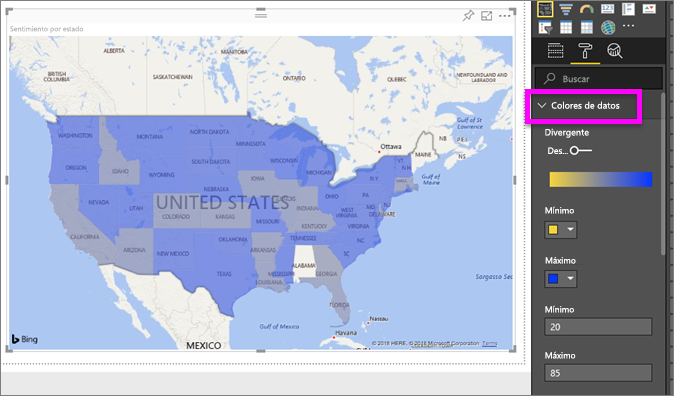

## Resaltado y filtrado cruzado
Para más información acerca de cómo usar el panel Filtros, consulte [Agregar un filtro a un informe](../power-bi-report-add-filter.md).

Al resaltar una ubicación en un mapa coroplético, se realiza un filtrado cruzado de las demás visualizaciones en la página del informe, y viceversa.

1. Para poder continuar, primero debe guardar este informe seleccionando **Archivo > Guardar**. 

2. Presione CTRL-C para copiar el mapa coroplético.

3. En la parte inferior del lienzo del informe, haga clic en la pestaña **Opiniones** para abrir la página del informe Opinión.

    

4. Mueva y cambie el tamaño de las visualizaciones de la página para hacer espacio, y después presione CTRL+V para pegar el mapa coroplético del informe anterior.

   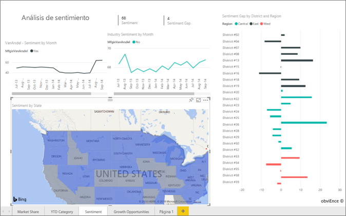

5. En el mapa coroplético, seleccione un estado.  Esto resalta las demás visualizaciones de la página. Al seleccionar **Texas**, por ejemplo, se muestra que la opinión es 74, que Texas está en el distrito Central \#23.   
   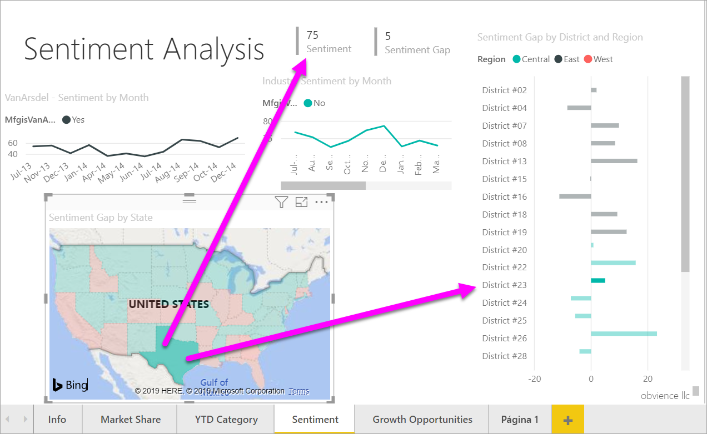
2. Seleccione un punto de datos en el gráfico de líneas VanArsdel - Opinión por mes. Al hacerlo, se filtra el mapa coroplético para mostrar los datos de opinión de VanArsdel y no de la competencia.  
   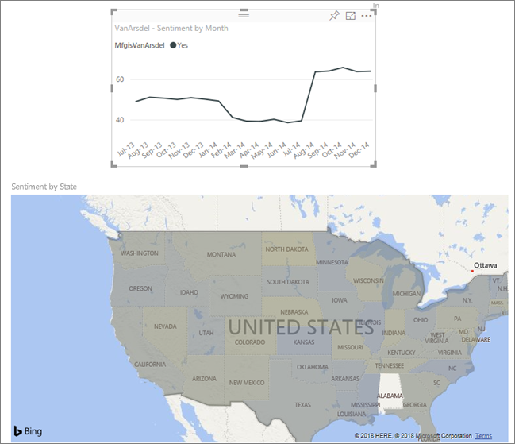

## Consideraciones y solución de problemas
Los datos de mapas pueden ser ambiguos.  Por ejemplo, hay un París, Francia, pero también hay un París, Texas. Los datos geográficos probablemente se almacenan en columnas diferentes: una columna para los nombres de ciudades, una columna para los nombres de estado o provincia, etc., por lo que Bing no podrá decir qué Paris es cual. Si el conjunto de datos ya contiene datos de latitud y longitud, Power BI tiene campos especiales para ayudar a que los datos de mapas no sean ambiguos. Simplemente arrastre el campo que contiene los datos de latitud al área Visualizaciones \> Latitud.  Y haga lo mismo para los datos de longitud.    

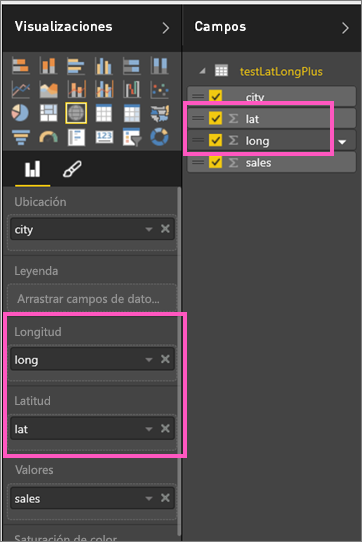

Si tiene permisos para editar el conjunto de datos en Power BI Desktop, vea este vídeo para saber cómo abordar la ambigüedad de los mapas.

<iframe width="560" height="315" src="https://www.youtube.com/embed/Co2z9b-s_yM" frameborder="0" allowfullscreen></iframe>

Si no tiene acceso a los datos de latitud y longitud, [siga estas instrucciones para actualizar el conjunto de datos](https://support.office.com/article/Maps-in-Power-View-8A9B2AF3-A055-4131-A327-85CC835271F7).

Para más ayuda con las visualizaciones de mapa, consulte [Sugerencias y trucos para visualizaciones de mapa](../power-bi-map-tips-and-tricks.md).

## Pasos siguientes

[Mapa de formas](desktop-shape-map.md)

[Tipos de visualización en Power BI](power-bi-visualization-types-for-reports-and-q-and-a.md)