# Visualización de influenciadores clave
Los influenciadores clave visuales le ayudará a comprender los factores de esa unidad una métrica que le interesa. Analiza los datos, clasifica los factores que son importantes y los muestra como influenciadores clave. Por ejemplo, suponga que desea averiguar qué influencias de rotación de empleados, que es también conocida como renovación. Uno de los factores podría ser la longitud de contrato de empleo, y otro factor que podría ser la edad del empleado. 
 
## Cuándo usar a influenciadores clave 
El objeto visual de influenciadores clave es una excelente opción si desea: 
- Vea qué factores afectan a la métrica que se está analizada.
- Compare la importancia relativa de estos factores. Por ejemplo, ¿los contratos a corto plazo tienen más impacto en el abandono que los contratos a largo plazo? 

## Requisitos de los influenciadores clave 
La métrica que analiza debe ser un campo de categoría o numérico (agregados y las medidas no todavía admiten).

## Características de los influenciadores clave visuales

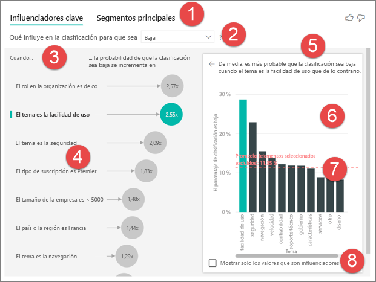

1. **Pestañas**: Seleccione una ficha para cambiar entre vistas. **Clave influenciadores** muestra los principales colaboradores en el valor de métrica seleccionado. **Principales segmentos** muestra los segmentos principales que contribuyen al valor de métrica seleccionado. Un *segmento* está formado por una combinación de valores. Por ejemplo, un segmento podría ser los consumidores que han sido los clientes durante al menos 20 años y residen en la región Oeste. 

2. **Cuadro de lista desplegable**: El valor de la métrica está investigando. En este ejemplo, examine la métrica **clasificación**. El valor seleccionado es **bajo**.

3. **Redefinición**: Le ayuda a interpretar el objeto visual en el panel izquierdo.

4. **Panel izquierdo**: El panel izquierdo contiene un objeto visual. En este caso, el panel izquierdo muestra una lista de los influenciadores clave superiores.

5. **Redefinición**: Le ayuda a interpretar el objeto visual en el panel derecho.

6. **Panel derecho**: El panel derecho contiene un objeto visual. En este caso, el gráfico de columnas muestra todos los valores para la persona con influencia clave **tema** que seleccionó en el panel izquierdo. El valor específico de **facilidad de uso** en el panel izquierdo se muestra en verde. Todos los valores de **tema** se muestran en color negro.

7. **Línea promedio**: Se calcula el promedio para todos los otros valores posibles para **tema** excepto **facilidad de uso**. Por lo tanto, el cálculo se aplica a todos los valores de color negro. Indica qué porcentaje de los demás **temas** le dio la clasificación de gravedad baja. En otras palabras, cuando se especifica una clasificación por un cliente, ese cliente también describe el motivo o el tema para la clasificación. Algunos de estos temas son la facilidad de uso, velocidad y seguridad. 

   **Tema es la facilidad de uso** es la persona con influencia clave segunda mayor para la clasificación de gravedad baja, según el objeto visual en el panel izquierdo. Si calcula la media de todos los temas y su contribución a una clasificación de **baja**, obtendrá el resultado se muestra en rojo. De todos los demás temas dado, sólo 11.35% son mayor que **facilidad de uso**.

8. **Casilla de verificación**: **Mostrar solo los valores que son personas con influencia**.

## Creación de un objeto visual de influenciadores clave 
 
Vea este vídeo para aprender a crear a un influenciadores clave visual. A continuación, siga estos pasos para crear uno. 

<iframe width="560" height="315" src="https://www.youtube.com/embed/fDb5zZ3xmxU" frameborder="0" allow="accelerometer; autoplay; encrypted-media; gyroscope; picture-in-picture" allowfullscreen></iframe>

El jefe de producto desea averiguar que factores clientes potenciales a los clientes para dejar las revisiones negativo sobre su servicio en la nube. Para continuar, abra el [archivo PBIX de comentarios del cliente](https://github.com/Microsoft/powerbi-desktop-samples/blob/master/2019/customerfeedback.pbix) en Power BI Desktop. También puede descargar el [archivo de Excel de comentarios del cliente para el servicio Power BI o Power BI Desktop](https://github.com/Microsoft/powerbi-desktop-samples/blob/master/2019/customerfeedback.xlsx). 

> [!NOTE]
> El conjunto de datos de comentarios del cliente es S. Moro, P. Cortez y P. Rita basándose en [Moro et al, 2014]. "Un controladas por datos enfoque para predecir el éxito del banco Telemarketing." *Compatibilidad con sistemas de decisión*, Elsevier, 62:22-31, junio de 2014. 

1. Abra el informe y seleccione el **clave influenciadores** icono. 

    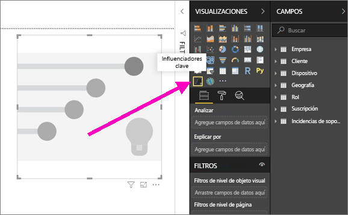

2. Mover la métrica que desea investigar en el **analizar** campo. El **analizar** campo admite variables de contiguos, o categoría. Para ver lo que impulsa un cliente calificación del servicio sea baja, seleccione **tabla Customer** > **clasificación**. 
3. Campos de movimiento que cree que podrían influir en **clasificación** en el **explican por** campo. Puede mover tantos campos como desee. En este caso, comience con:
    - País-región 
    - Rol en la organización 
    - Tipo de suscripción 
    - Tamaño de la empresa 
    - Tema 
1. Para centrarse en las clasificaciones negativo, seleccione **baja** en el **lo que influye en la clasificación sea** cuadro de lista desplegable.  

    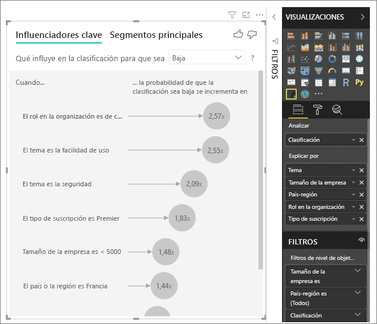

El análisis se ejecuta en el nivel de tabla del campo que se está analizando. En este caso, tiene la **clasificación** métrica. Esta métrica se define en un nivel de cliente. Cada cliente le ha concedido una puntuación alta o una puntuación baja. Todos los factores explicativos deben definirse en el nivel de cliente para el objeto visual hacer uso de los mismos. 

En el ejemplo anterior, todos los factores explicativos tienen un uno a uno o una relación de varios a uno con la métrica. En este caso, cada puntuación tiene exactamente un tema asociado con él. Este tema fue el tema principal de la revisión del cliente. De forma similar, los clientes proceden de un país, tener un tipo de pertenencia y realizar un rol en su organización. Los factores explicativos ya son atributos de un cliente, y no se necesita ninguna transformación. El objeto visual puede hacer un uso inmediato de ellos. 

Más adelante en el tutorial, examine los ejemplos más complejos que tienen relaciones uno a varios. En esos casos, las columnas deben en primer lugar, se agregan hasta el nivel de cliente antes de poder ejecutar el análisis. 

Las medidas y agregados que se utilizan como factores explicativos también se evalúan en el nivel de tabla de la **analizar** métrica. Más adelante en este artículo se muestran algunos ejemplos. 

## Interpretar a categorías influenciadores clave 
Echemos un vistazo a los influenciadores clave para las calificaciones bajas. 

### Principales único factor que influye en la probabilidad de clasificación de gravedad baja

La organización en este ejemplo tiene tres roles: consumidor, el administrador y el publicador. Un consumidor es el factor superior que contribuye a la clasificación de gravedad baja. 

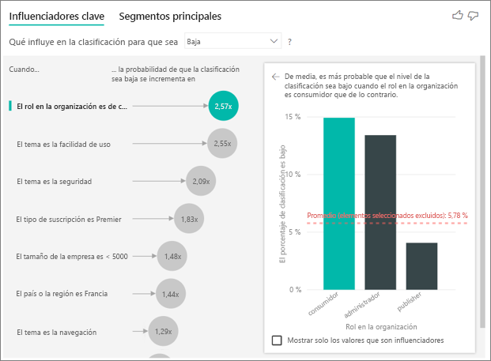

Más concretamente, los consumidores son 2,57 veces más probables que asigne una puntuación negativa a su servicio. Los influenciadores clave de gráfico listas **rol en la organización es consumidor** primero en la lista de la izquierda. Seleccionando **rol en la organización es consumidor**, Power BI muestra detalles adicionales en el panel derecho. Se muestra el efecto comparativo de cada rol en la probabilidad de clasificación de gravedad baja.
  
- % de 14.93 de los consumidores darán una puntuación baja. 
- En promedio, todos los demás roles proporcionan una puntuación baja 5.78% del tiempo.
- Los consumidores son 2,57 veces más probables dar una puntuación baja en comparación con todas las demás funciones. Puede determinarlo dividiendo la barra verde mediante la línea de puntos roja. 

### Segundo factor único que influye en la probabilidad de clasificación de gravedad baja

Los influenciadores clave visuales compara y clasifica los factores de muchas variables diferentes. La segunda persona con influencia tiene nada que ver con **rol en Org**. Seleccione la segunda persona con influencia en la lista, que es **tema es la facilidad de uso**. 

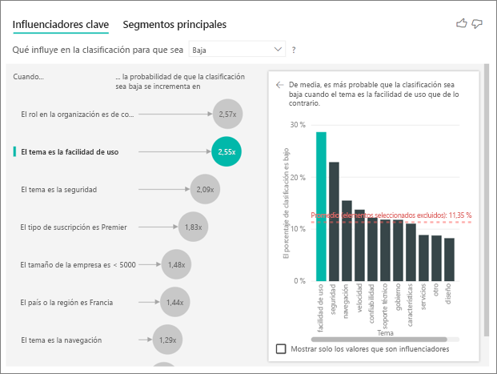

El segundo factor más importante se relaciona con el tema de revisión del cliente. Los clientes que se comentó sobre la facilidad de uso del producto eran 2,55 veces más probables dar una puntuación baja en comparación con los clientes que se comentó en otros temas, como la confiabilidad, el diseño o la velocidad. 

Entre los objetos visuales, la media, lo que se muestra en la línea de puntos rojos, cambia de 5.78% 11.34%. El promedio es dinámico, porque se basa en el promedio de todos los demás valores. Para la primera persona con influencia, el promedio excluir del rol de cliente. Para la segunda persona con influencia, había excluido el tema de facilidad de uso. 
 
Seleccione el **mostrar solo los valores que son personas con influencia** casilla de verificación para filtrar usando solo los valores destacados. En este caso, son los roles que controlan una puntuación baja. Los temas de doce se reducen a los cuatro que Power BI identificado como los temas que controlan las calificaciones bajas. 

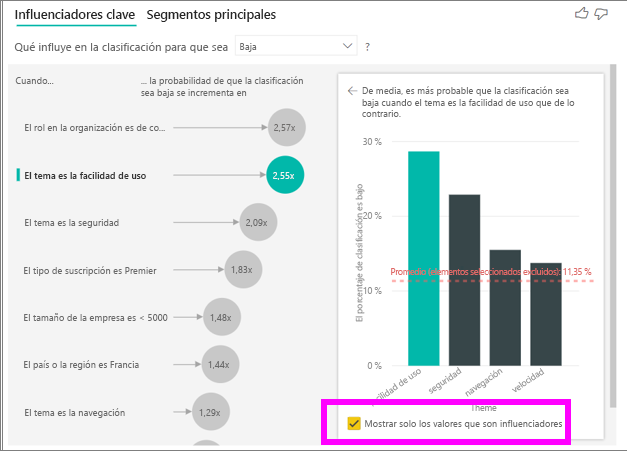

## Interactuar con otros objetos visuales 
 
Cada vez que se selecciona otro objeto visual en el lienzo, filtro o una segmentación de datos, los influenciadores clave visuales vuelve a ejecutar el análisis en la parte de datos nueva. Por ejemplo, puede mover **tamaño de la compañía** en el informe y utilizarlo como una segmentación de datos. Úselo para ver si los influenciadores clave para los clientes de empresa son diferentes de la población general. Un tamaño de la empresa enterprise es mayor que 50.000 empleados.
 
Seleccionar **> 50.000** vuelve a ejecutar el análisis y puede ver que las personas con influencia cambiado. Para los clientes de empresa de gran tamaño, la persona con influencia superior para las calificaciones bajas tiene un tema relacionado con la seguridad. Es posible que desee investigar más para ver si hay características de seguridad específicos que son habituados a los clientes grandes. 

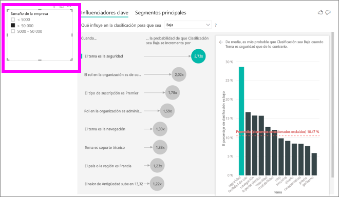

## Interpretar a continua influenciadores clave 
 
Hasta ahora, ha visto cómo usar el objeto visual para explorar los campos de categorías diferentes cómo influyen las calificaciones bajas. También es posible que haya factores continuous como edad, altura y el precio en el **explican por** campo. Echemos un vistazo a lo que sucede cuando **antigüedad** se mueve de la tabla customer en **explican por**. Antigüedad muestra cuánto tiempo un cliente ha usado el servicio. 
 
A medida que aumenta la permanencia, también aumenta la probabilidad de recibir una clasificación inferior. Esta tendencia sugiere que los clientes a largo plazo es más probable dar una puntuación negativa. Esta información es interesante y otro que desee realizar un seguimiento más adelante. 
 
La visualización muestra que cada vez antigüedad sube por 13.44 meses, en promedio la probabilidad de clasificación de gravedad baja aumenta en 1,23 veces. En este caso, 13,44 meses representa la desviación estándar de la antigüedad. Por lo que la información que reciba examina cómo aumentar la permanencia en una cantidad estándar, que es la desviación estándar de antigüedad, afecta a la probabilidad de recibir una clasificación de gravedad baja. 
 
El gráfico de dispersión en el panel derecho traza el porcentaje medio de las calificaciones bajas para cada valor de antigüedad. Resalta la pendiente con una línea de tendencia.

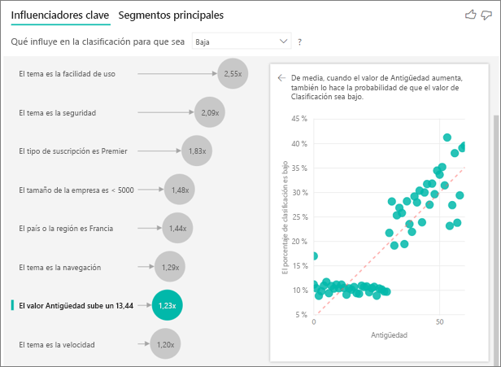

## Interpretar las medidas y agregados como influenciadores clave 
 
Puede usar las medidas y agregados como factores explicativos dentro de su análisis. Por ejemplo, es posible que desea ver qué efecto tiene el número de incidencias de soporte técnico al cliente o la duración media de un vale abierto en la puntuación de recepción. 
 
En este caso, desea ver si el número de incidencias de soporte técnico que un cliente tiene influye en la puntuación proporcionan. Ahora incorporar **Id. de vale de soporte técnico** desde la tabla de vales de soporte técnico. Dado que un cliente puede tener varios incidencias de soporte técnico, agregar el identificador para el nivel de cliente. Agregación es importante porque el análisis se ejecuta en el nivel de cliente, por lo que todos los controladores deben definirse en ese nivel de granularidad. 
 
Veamos el recuento de identificadores. Cada fila del cliente tiene un recuento de incidencias de soporte técnico asociado con él. En este caso, como el número de aumentos de vales de soporte técnico, la probabilidad de la clasificación que se aumenta bajo 5.51 veces. El objeto visual de la derecha muestra el número promedio de incidencias de soporte técnico por distintas **clasificación** valores que se evalúa en el nivel de cliente. 

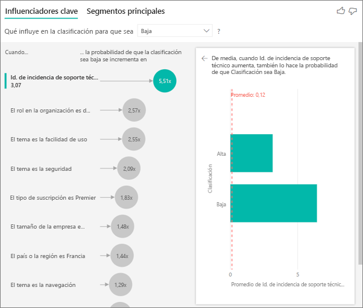

## Interpretar los resultados: Segmentos principales 
 
Puede usar el **clave influenciadores** tab para evaluar cada factor de forma individual. También puede usar el **principales segmentos** pestaña para ver cómo una combinación de factores afecta a la métrica que está analizando. 
 
Segmentos principales inicialmente muestran información general de todos los segmentos que ha descubierto Power BI. El ejemplo siguiente se muestra que se encontraron seis segmentos. Estos segmentos se clasifican según el porcentaje de las calificaciones bajas dentro del segmento. Segmento 1, por ejemplo, tiene 74.3% las clasificaciones de cliente que están bajo mínimos. Cuanto mayor sea la burbuja, mayor será la proporción de clasificaciones bajas. Representa el tamaño de la burbuja de cuántos clientes se encuentran dentro del segmento. 

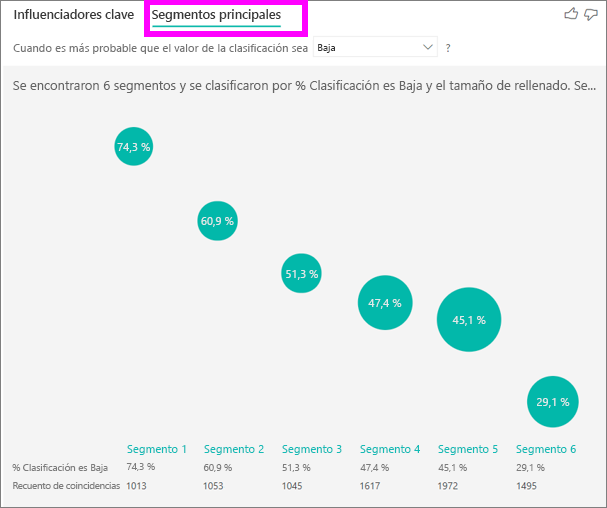

Al seleccionar una burbuja se profundiza en los detalles del segmento. Si selecciona 1 segmento, por ejemplo, encontrará que se compone de los clientes relativamente establecidos. Se ha estado a los clientes de más de 29 meses y tienen más de cuatro incidencias de soporte técnico. Por último, no son los publicadores, para que sean los consumidores o los administradores. 
 
En este grupo, 74.3% de los clientes le asignó una puntuación baja. El cliente promedio dio una baja clasificación del 11,7% del tiempo, por lo que este segmento tiene una mayor proporción de las calificaciones bajas. Es 63 en puntos de porcentaje más alto. Segmento 1 también contiene aproximadamente 2,2% de los datos, por lo que representa una parte de la población direccionable. 

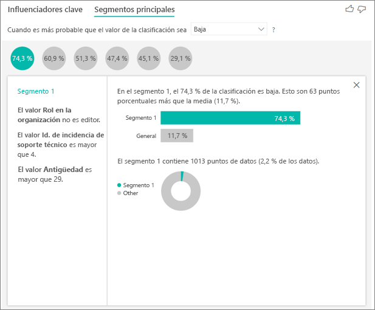

## Trabajar con datos numéricos

Si mueve un campo numérico en el **analizar** campo, tiene la opción de cómo administrar ese escenario. Puede cambiar el comportamiento del objeto visual, vaya a la **panel formato** y cambiar entre **categorías de tipo de análisis** y **tipo análisis continuo**.

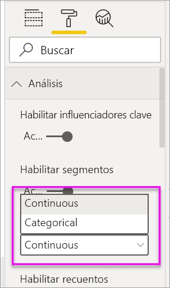

Un **categorías de tipo de análisis** se comporta como se describió anteriormente. ¿Por ejemplo, si se han llevado a las puntuaciones de encuesta comprendido entre 1 y 10, podría pedir 'Lo que afecta a las puntuaciones de encuesta debe ser 1'?

Un **tipo análisis continuo** cambia la pregunta a una continua. ¿En el ejemplo anterior, nuestra nueva pregunta sería 'Lo que afecta a las puntuaciones de encuesta para aumentar o disminuir'?

Esta distinción es muy útil cuando se tiene una gran cantidad de valores únicos en el campo que se va a analizar. En el ejemplo siguiente, nos centramos en los precios de la casa. No es muy significativo para solicitar "Lo que influye en el precio de casa sea 156,214?" ya que es muy específica y se es probable que no tenemos datos suficientes para inferir un patrón.

¿En su lugar, nos conviene pregunte, 'Lo que influye en el precio de casa para aumentar'? que nos permite tratar los precios de la casa como un intervalo en lugar de valores distintos.

## Interpretar los resultados: Influenciadores clave 

En este escenario, nos centramos en 'Lo que influye en el precio de casa para aumentar'. Estamos examinando una serie de factores explicativas que pueden afectar a un precio de la casa como **año creado** (año se compiló la casa), **KitchenQual** (calidad cocina) y **YearRemodAdd** (año que rediseñó la casa). 

En el ejemplo siguiente, nos centramos en nuestra persona con influencia superior que es el que se va a excelente de calidad de cocina. Los resultados son muy similares a las que vimos cuando nos estábamos analizar las métricas de categorías con algunas diferencias importantes:

- El gráfico de columnas de la derecha es mirar los promedios, en lugar de porcentajes. Por lo tanto nos muestra lo que el precio promedio casa de una casa con una cocina excelente es (barra verde) en comparación con el precio medio de enrutamiento de una casa sin una cocina excelente (línea de puntos)
- El número de la burbuja sigue siendo la diferencia entre la línea de puntos rojos y la barra de color verde, pero se expresa como un número ($158. 49K) en lugar de una probabilidad (1.93 x). Etc. promedio, casas con cocinas excelente son casi $160 KB más costoso que casas sin cocinas excelente.

En el ejemplo siguiente, examinamos el impacto un factor continua (año rediseñó casa) tiene sobre el precio de la casa. Las diferencias en comparación con cómo se analizan a influenciadores continua de las métricas de categorías son los siguientes:

-   El gráfico de dispersión en el panel derecho traza el precio medio de enrutamiento para cada valor distinto del año Remodelado. 
-   El valor de la burbuja muestra cuánto el promedio de enrutamiento aumenta el precio (en este caso 2 USD. 87k) cuando el año de la casa estaba Remodelado aumenta por la desviación estándar (en este caso 20 años)

Por último, en el caso de las medidas que estamos examinando el medio año se creó una casa. El análisis aquí es como sigue:

-   El gráfico de dispersión en el panel derecho traza el precio medio de enrutamiento para cada valor distinto en la tabla
-   El valor de la burbuja muestra cuánto el promedio de enrutamiento aumenta el precio (en este caso, $1. 35K) cuando aumenta el año promedio por su desviación estándar (en este caso 30 años)

## Interpretar los resultados: Segmentos principales

Segmentos principales para destinos numéricos muestran a grupos donde la casa los precios de Media son mayores que en el conjunto de datos general. Por ejemplo, a continuación podemos ver que **1 segmento** se compone de casas donde **GarageCars** (número de automóviles puede ajustarse el garaje) es mayor que 2 y el **RoofStyle** es Hip. Casas con estas características tienen un precio promedio de $355K en comparación con la media general de los datos que es de $180 KB.

## Consideraciones y solución de problemas 
 
**¿Cuáles son las limitaciones de la versión preliminar?** 
 
Los influenciadores clave visuales está actualmente en versión preliminar pública, y tiene algunas limitaciones. La funcionalidad que no está disponible actualmente incluye: 
- Análisis de métricas que están agregados o medidas.
- Consumiendo el objeto visual en Power BI Embedded.
- Consumiendo el objeto visual en aplicaciones móviles de Power BI.
- Compatibilidad con RLS.
- Compatibilidad con Direct Query.
- Compatibilidad con la conexión en vivo.

**Veo un error que se encontraron ninguna influenciadores o segmentos. ¿Por qué?** 

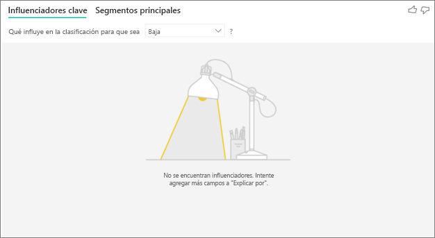

Este error se produce cuando se incluyen los campos de **explican por** pero no se encontraron ningún influenciadores. 
- Incluye la métrica que se ha analizando en **analizar** y **explican por**. Quítelo de **explican por**. 
- Los campos explicativos tienen demasiadas categorías con pocas observaciones. Esta situación dificulta la visualización determinar los factores que son personas con influencia. Es difícil generalizar según solo algunas observaciones. Si está analizando un campo numérico es posible que desee cambiar de **Analysis categorías** a **análisis continuo** en el **panel formato** bajo el  **Análisis** tarjeta.
- Los factores explicativos tienen suficiente observaciones para generalizar, pero la visualización no encontró cualquier correlaciones significativas al informe.
 
**Veo un error que la métrica que estoy analizando no tiene suficientes datos para ejecutar el análisis en. ¿Por qué?** 

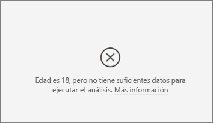

La visualización funciona examinando los patrones en los datos de un grupo en comparación con otros grupos. Por ejemplo, busca los clientes que le proporcionó las calificaciones bajas en comparación a los clientes que le proporcionó conducen a calificaciones altas. Si los datos en el modelo tienen solo algunas observaciones, son difíciles de encontrar patrones. Si la visualización no tiene suficientes datos para buscar fuentes de influencia significativas, indica que se necesitan más datos para ejecutar el análisis. 

Recomendamos que tenga al menos 100 observaciones del estado seleccionado. En este caso, el estado es los clientes que renovación. También necesita al menos 10 observaciones de los Estados que utiliza para la comparación. En este caso, el estado de la comparación es los clientes que no la renovación.

Si está analizando un campo numérico es posible que desee cambiar de **Analysis categorías** a **análisis continuo** en el **panel formato** bajo el  **Análisis** tarjeta.

**Aparece un error que un campo en *explican por* inequívocamente no están relacionados con la tabla que contiene la métrica que estoy analizando. ¿Por qué?**
 
El análisis se ejecuta en el nivel de tabla del campo que se está analizando. Por ejemplo, si analiza los comentarios del cliente para el servicio, podría tener una tabla que indica si un cliente indicó una calificación alta o baja una clasificación. En este caso, el análisis se está ejecutando en el nivel de tabla de cliente. 

Si tiene una tabla relacionada que se define en un nivel más granular que la tabla que contiene la métrica, verá este error. Este es un ejemplo: 
 
- Analiza lo que impulsa a los clientes para proporcionar a las calificaciones bajas de su servicio.
- Desea ver si el dispositivo en el que el cliente ya está consumiendo el servicio influye en las revisiones que se proporcionan.
- Un cliente puede consumir el servicio de varias maneras diferentes.
- En el ejemplo siguiente, cliente 10000000 usa un explorador y una tableta para interactuar con el servicio.

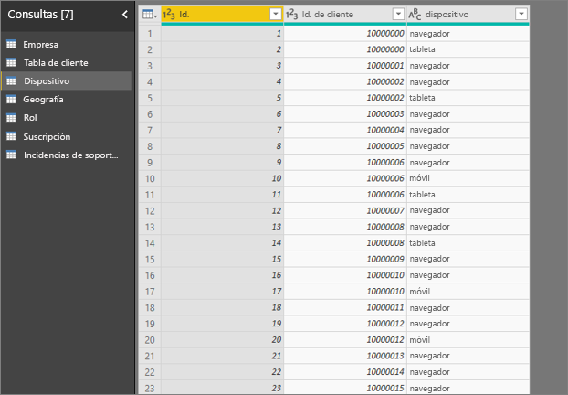

Si intenta usar la columna de dispositivo como un factor explicativo, consulte el siguiente error: 

Este error aparece porque el dispositivo no está definido en el nivel de cliente. Un cliente puede consumir el servicio en varios dispositivos. Para que la visualización en busca de patrones, el dispositivo debe ser un atributo del cliente. Existen varias soluciones que dependen de su comprensión de la empresa: 
 
- Puede cambiar el resumen de dispositivos para contar. Por ejemplo, usar recuento si el número de dispositivos puede afectar a la puntuación que le ofrece un cliente. 
- Puede dinamizar la columna de dispositivo para ver si utilizar el servicio en un dispositivo específico influye en la clasificación de un cliente.
 
En este ejemplo, los datos se dinamiza para crear nuevas columnas para el explorador, móvil y de tablet PC. Ahora puede usar estos dispositivos específicos en **explican por**. Todos los dispositivos resultan para ser personas con influencia, y el explorador tiene el mayor efecto en la puntuación del cliente.

Más concretamente, los clientes que no usan el explorador para consumir el servicio son 3,79 veces más probables dar una puntuación baja a los clientes que realizan. Detalles inferior en la lista, para dispositivos móviles a la inversa es true. Los clientes que usan la aplicación móvil están más probable que asigne a una puntuación baja a los clientes que no. 

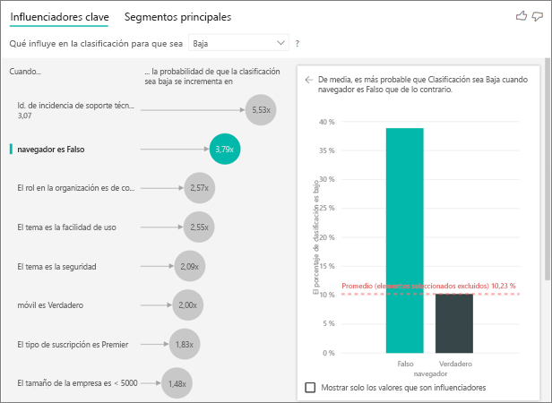

**Ver una advertencia que las medidas no se hayan incluido en mi análisis. ¿Por qué?** 

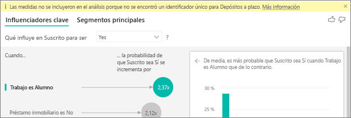

El análisis se ejecuta en el nivel de tabla del campo que se está analizando. Si analiza el abandono de clientes, podría tener una tabla que indica si un cliente renovados o no. En este caso, el análisis se ejecuta en el nivel de tabla de cliente.
 
Las medidas y agregados son analizados en el nivel de tabla de forma predeterminada. Si hubiera una medida para su gasto mensual promedio, se podría analizar en el nivel de tabla de cliente. 

Si la tabla de cliente no tiene un identificador único, no se puede evaluar la medida y el análisis se pasa por alto. Para evitar esta situación, asegúrese de que la tabla con la métrica tiene un identificador único. En este caso, es la tabla customer y el identificador único es el identificador de cliente. También es fácil agregar una columna de índice mediante Power Query.
 
**Puedo ver una advertencia de que la métrica que estoy analizando tiene más de 10 valores únicos y que esta cantidad podría afectar a la calidad del análisis. ¿Por qué?** 

La visualización de inteligencia artificial puede analizar los campos de categorías y los campos numéricos. En el caso de los campos de categorías, un ejemplo puede ser el abandono es Sí o No, y la satisfacción del cliente es alta, Media o baja. Aumentar el número de categorías para analizar significa que hay menos observaciones por categoría. Esta situación dificulta la visualización buscar patrones en los datos. 

Al analizar los campos numéricos tienen una elección entre el tratamiento de los campos numéricos como texto en cuyo caso se ejecutará el mismo análisis como lo haría para datos categóricos (**categorías Analysis**). Si tiene una gran cantidad de distintos valores, le recomendamos que cambie el análisis a **análisis continuo** como eso significa que podemos deducir los patrones de cuando los números de aumentar o disminuir en lugar de tratarlas como distintos valores. Puede cambiar de **Analysis categorías** a **análisis continuo** en el **panel de formato** bajo el **Analysis** tarjeta.

Para buscar a los influenciadores más seguros, le recomendamos que agrupe valores similares en una sola unidad. Por ejemplo, si tiene una métrica por precio, seguramente obtener mejores resultados mediante la agrupación de los precios similar en alta, Media y baja categorías frente al uso de puntos de precio individuales. 

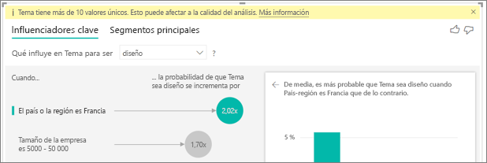

**Hay factores de Mis datos que parece indicar que deberían influenciadores clave, pero no lo son. ¿Cómo puede suceder esto?**

En el ejemplo siguiente, los clientes que son los consumidores de la unidad las calificaciones bajas, con 14.93% de las clasificaciones que sean bajos. El rol de administrador también tiene una proporción elevada de las calificaciones bajas, 13.42%, pero no se considera una persona con influencia. 

La razón de esta decisión es que la visualización también tiene en cuenta el número de puntos de datos cuando encuentra personas con influencia. El siguiente ejemplo tiene más de 29,000 consumidores y administradores de menos de 10 veces, aproximadamente 2,900. 390 solo de ellos le asignó una puntuación baja. El objeto visual no tiene suficientes datos para determinar si se encontró un patrón con las clasificaciones de administrador o si es simplemente una oportunidad de encontrar. 

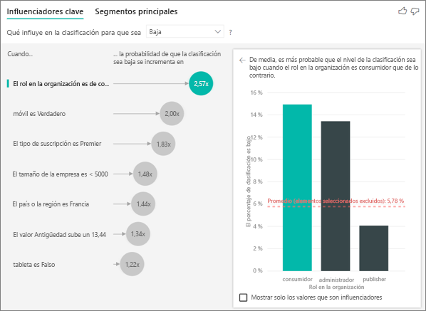

**¿Cómo calcular los influenciadores clave para el análisis de categorías?**

En segundo plano, se usa la visualización de inteligencia artificial [ML.NET](https://dotnet.microsoft.com/apps/machinelearning-ai/ml-dotnet) para ejecutar una regresión logística para calcular los influenciadores clave. Una regresión logística es un modelo estadístico que compara los distintos grupos entre sí. 

Si desea ver lo que impulsa las calificaciones bajas, la regresión logística examina cómo los clientes que le asignó una puntuación baja se diferencian de los clientes que le asignó una puntuación más alta. Si tiene varias categorías, como las puntuaciones altos, neutras y bajos, observa cómo los clientes que le asignó una puntuación baja se diferencian de los clientes que no asigne una clasificación de gravedad baja. ¿En este caso, cómo los clientes que le asignó una puntuación baja se diferencia de los clientes que le asignó una calificación alta o una clasificación neutra? 
 
La regresión logística busca patrones en los datos y busca cómo los clientes que le asignó una clasificación de gravedad baja pueden diferir de los clientes que le asignó una calificación alta. Por ejemplo, podría encontrar que los clientes con más de incidencias de soporte técnico proporcionan un porcentaje superior de las calificaciones bajas de los clientes con pocos o ningún incidencias de soporte técnico.
 
La regresión logística también tiene en cuenta cuántos puntos de datos están presentes. Por ejemplo, si los clientes que desempeñan un rol de administrador puntuarlos proporcionalmente más negativo, pero hay solo unos pocos administradores, este factor no se considera influyente. Esta determinación se realiza porque no hay suficientes puntos de datos disponibles para deducir un modelo. Una prueba estadística, conocida como una prueba wald lo, se usa para determinar si un factor se considera una persona con influencia. El objeto visual utiliza un valor p de 0,05 para determinar el umbral. 

**¿Cómo calcular los influenciadores clave para el análisis numérico?**

En segundo plano, se usa la visualización de inteligencia artificial [ML.NET](https://dotnet.microsoft.com/apps/machinelearning-ai/ml-dotnet) para ejecutar una regresión lineal para calcular los influenciadores clave. Una regresión lineal es un modelo estadístico que estudia cómo cambia el resultado del campo que está analizando según sus factores explicativos.

Por ejemplo, si estamos analizando los precios de casa, será una regresión lineal en el impacto que tiene que una cocina excelente tendrá en el precio de la casa. ¿Casas con cocinas excelente generalmente tienen precios casa mayor o menor en comparación con las casas sin cocinas excelente?

La regresión lineal también tiene en cuenta el número de puntos de datos. Por ejemplo, si las casas de tenis tienen precios más altos pero tenemos que muy pocas casas que tienen una pista de tenis, este factor no se considera influyente. Esta determinación se realiza porque no hay suficientes puntos de datos disponibles para deducir un modelo. Una prueba estadística, conocida como una prueba wald lo, se usa para determinar si un factor se considera una persona con influencia. El objeto visual utiliza un valor p de 0,05 para determinar el umbral. 

**¿Cómo se calculan los segmentos?**

En segundo plano, se usa la visualización de inteligencia artificial [ML.NET](https://dotnet.microsoft.com/apps/machinelearning-ai/ml-dotnet) para ejecutar un árbol de decisión para buscar los subgrupos interesantes. El objetivo del árbol de decisión es acabar con un subgrupo de puntos de datos relativamente alta de la métrica que le interesa. Podría tratarse de clientes con las calificaciones bajas o casas con los precios altos.

El árbol de decisión toma cada factor explicativo e intenta motivo el factor que le ofrece mejor *dividir*. ¿Por ejemplo, si filtra los datos para incluir a solo los clientes de grandes empresas, separará nuestros clientes que le proporcionó una calificación alta frente a la clasificación de gravedad baja? ¿O tal vez es mejor para filtrar los datos para incluir a solo los clientes con comentarios sobre la seguridad? 

Después de que el árbol de decisión realiza una división, toma el subgrupo de datos y determina la división siguiente recomendada para los datos. En este caso, el subgrupo está los clientes que se comentó sobre seguridad. Después de cada división, también tiene en cuenta si tiene suficientes puntos de datos de ese grupo para ser lo suficientemente representativos para deducir un patrón de o si es una anomalía en los datos y no un segmento real. Se aplica otra estadística de prueba para comprobar la importancia estadística de la condición de división con el valor p de 0,05. 

Cuando finalice el árbol de decisión, toma todas las divisiones, como comentarios de seguridad y grandes empresas y crea los filtros de Power BI. Esta combinación de filtros se empaqueta como un segmento en el objeto visual. 
 
**¿Por qué ciertos factores se convierten en influenciadores o deje de serlo influenciadores a medida que me desplazo más campos en el *explican por* campo?**

La visualización evalúa todos los factores explicativos conjuntamente. Un factor podría ser una persona con influencia por sí mismo, pero cuando se considera con otros factores que no. Suponga que desea analizar lo que impulsa un precio de casa sea alta, con el tamaño de la casa como factores explicativas y dormitorios:

- Por sí mismo, dormitorios más podrían ser un controlador para los precios de casa sea alta.
- Tamaño de casa incluidos en el análisis significa que ahora Examinemos lo que ocurre en dormitorios, mientras que el tamaño de casa permanece constante.
- Si el tamaño de la casa se fija en 1.500 pies cuadrados, no es probable que un aumento continuo en el número de dormitorios aumentará considerablemente el precio de la casa. 
- Dormitorios podrían no ser tan importantes de un factor que tenía antes de que se consideró como el tamaño de la casa. 

## Pasos siguientes
- [Gráficos combinados en Power BI](power-bi-visualization-combo-chart.md)
- [Tipos de visualización en Power BI](power-bi-visualization-types-for-reports-and-q-and-a.md)
