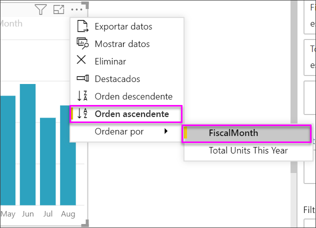

# Objetos visuales de indicador clave de rendimiento (KPI)

Un indicador clave de rendimiento (KPI) es una indicación visual que comunica el progreso realizado para lograr un objetivo cuantificable. Para más información sobre KPI, vea [Indicadores clave de rendimiento (KPI) en PowerPivot](/previous-versions/sql/sql-server-2012/hh272050(v=sql.110)).

Puede ver otro en el que Will muestra cómo crear objetos visuales de métricas individuales: medidores, tarjetas y KPI.

<iframe width="560" height="315" src="https://www.youtube.com/embed/xmja6EpqaO0?list=PL1N57mwBHtN0JFoKSR0n-tBkUJHeMP2cP" frameborder="0" allowfullscreen></iframe>

## Cuándo usar un KPI

Los KPI son una excelente opción:

* Para medir el progreso. Responde a la pregunta "¿en qué voy por delante o por detrás?"

* Para medir la distancia hasta un objetivo. Responde a la pregunta "¿A qué distancia por delante o por detrás estoy?"

## Requisitos de KPI

Un diseñador basa un objeto visual de KPI en una medida específica. La intención del KPI es ayudarlo a evaluar el valor y el estado actuales de una métrica con respecto a un objetivo definido. Un objeto visual de KPI requiere una medida *base* que se evalúa en un valor, una medida o un valor de *destino* y un *umbral* u *objetivo*.

Un conjunto de datos de KPI debe contener los valores objetivo de un KPI. Si el conjunto de datos no contiene valores objetivo, puede crearlos mediante la incorporación de una hoja de Excel con los objetivos a su modelo de datos o archivo PBIX.

## Requisitos previos

Si no está registrado en Power BI, [regístrese para obtener una evaluación gratuita](https://app.powerbi.com/signupredirect?pbi_source=web) antes de empezar.

* [Power BI Desktop](https://powerbi.microsoft.com/get-started/): ¡es gratuito!

* [Archivo PBIX del ejemplo de análisis de minoristas](http://download.microsoft.com/download/9/6/D/96DDC2FF-2568-491D-AAFA-AFDD6F763AE3/Retail%20Analysis%20Sample%20PBIX.pbix)

## Cómo crear un KPI

Para continuar, abra el [archivo PBIX de análisis de minoristas](http://download.microsoft.com/download/9/6/D/96DDC2FF-2568-491D-AAFA-AFDD6F763AE3/Retail%20Analysis%20Sample%20PBIX.pbix) en Power BI Desktop. Creará un KPI que mide el progreso que ha realizado para lograr un objetivo de ventas.

1. Abra **Ejemplo de análisis de minoristas**  en la vista de informe .

1. Seleccionar  para agregar una nueva página.

1. En el panel **Campos**, seleccione **Ventas > Total de unidades este año**.  Este valor será el indicador.

1. Agregue **Tiempo > MesFiscal**.  Este valor representará la tendencia.

1. En la esquina superior derecha del objeto visual, seleccione los puntos suspensivos y compruebe que Power BI ordenó las columnas en orden ascendente por **MesFiscal**.

    > [!IMPORTANT]
    > Una vez que convierta la visualización en un KPI **no** habrá ninguna opción para ordenar. Debe ordenarlo correctamente ahora.

    

    Una vez ordenado correctamente, el objeto visual tendrá este aspecto:

    

1. Para convertir el objeto visual en un KPI, seleccione el icono **KPI** en el panel **Visualización**.

    

1. Para agregar un objetivo, arrastre **Total de unidades año anterior** al campo **Objetivos de destino**.

    

1. Para dar formato al KPI, seleccione el icono de rodillo de pintar para abrir el panel Formato.

    * **Indicador**: controla las unidades de visualización y los decimales del indicador.

    * **Eje de tendencia**: cuando se establece en **Activado**, el objeto visual muestra el eje de tendencia como el fondo del objeto visual de KPI.  

    * **Objetivos**: cuando se establece en **Activado**, el objeto visual muestra el objetivo y la distancia desde el objetivo como un porcentaje.

    * **Codificación del color > Dirección**: las personas consideran algunos KPI mejores para valores *más altos* y otros mejores para valores *más bajos*. Por ejemplo, ganancias frente a tiempo de espera. Normalmente, un mayor valor de ganancias es mejor que un mayor valor de tiempo de espera. Seleccione **Alto está bien** y, opcionalmente, cambie la configuración del color.

Los KPI están también disponibles en el servicio Power BI y en los dispositivos móviles. Ofrece la opción de estar siempre conectado al latido de su empresa.

## Consideraciones y solución de problemas

Si el KPI no se parece al anterior, puede deberse a que no ordenó por **MesFiscal**. Los KPI no tienen una opción de ordenación. Necesitará empezar de nuevo y ordenar por **MesFiscal** *antes* de convertir la visualización en un KPI.

## Pasos siguientes

* [Sugerencias y trucos para las visualizaciones de mapas de Power BI](power-bi-map-tips-and-tricks.md)

* [Tipos de visualización en Power BI](power-bi-visualization-types-for-reports-and-q-and-a.md)

¿Tiene más preguntas? [Pruebe la comunidad de Power BI](http://community.powerbi.com/)
