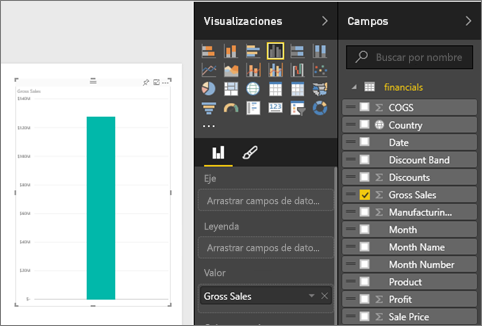
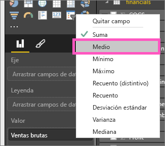
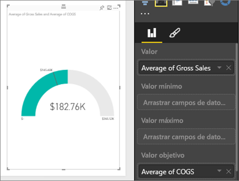
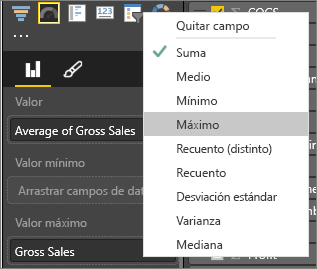
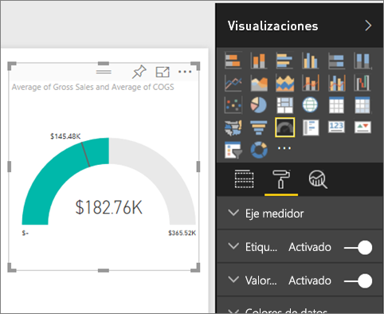
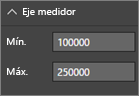
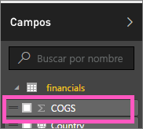
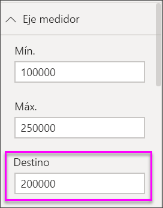
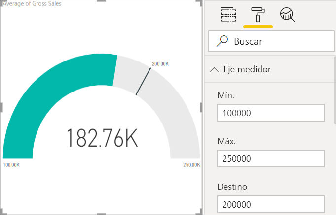

# Gráficos de medidor radial en Power BI

Un gráfico de medidor radial tiene un arco circular y muestra un único valor que mide el progreso hacia un objetivo o un indicador clave de rendimiento (KPI). La línea (o *aguja*) representa el objetivo o valor de destino. El sombreado representa el progreso hacia ese objetivo. El valor dentro del arco representa el valor del progreso. Power BI distribuye todos los valores posibles por igual a lo largo del arco, del mínimo (valor más a la izquierda) al máximo (valor más a la derecha).

En este ejemplo, es un vendedor de automóviles y realiza el seguimiento de la media de ventas por mes del equipo de ventas. La aguja representa un objetivo de ventas de 140 automóviles. La media mínima posible de ventas es 0 y la máxima es 200.  El sombreado azul muestra que la media del equipo de ventas de este mes es de aproximadamente 120. Por suerte, hay todavía otra semana para alcanzar el objetivo.

Puede ver otro en el que Will muestra cómo crear objetos visuales de métricas individuales: medidores, tarjetas y KPI.

<iframe width="560" height="315" src="https://www.youtube.com/embed/xmja6EpqaO0?list=PL1N57mwBHtN0JFoKSR0n-tBkUJHeMP2cP" frameborder="0" allowfullscreen></iframe>

## Cuándo usar un medidor radial

Los medidores radiales son una excelente opción para:

* Mostrar el progreso hacia un objetivo.

* Representar una medida percentil, como un KPI.

* Mostrar el estado de una única medida.

* Mostrar la información que puede explorar y comprender rápidamente.

## Requisitos previos

* Servicio Power BI o Power BI Desktop

* Libro de Excel de ejemplos financieros: [descargar el ejemplo directamente](http://go.microsoft.com/fwlink/?LinkID=521962).

## Crear un medidor radial básico

En estas instrucciones se utiliza el servicio Power BI. Para poder continuar, inicie sesión en Power BI y abra el archivo de Excel del ejemplo financiero.

### Paso 1: Abrir el archivo de Excel del ejemplo financiero

1. Descargue el [archivo de Excel del ejemplo financiero](../sample-financial-download.md) si aún no lo ha hecho. Recuerde dónde lo ha guardado.

1. En el servicio Power BI, seleccione **Obtener datos** > **Archivos**.

1. Seleccione **Archivo local** y vaya a la ubicación del archivo de ejemplo.

1. Seleccione **Importar**. Power BI agrega el ejemplo financiero al área de trabajo como un conjunto de datos.

1. Desde la lista de contenido **Conjuntos de datos**, seleccione el icono **Crear informe** para el **ejemplo financiero**.

    

### Paso 2: Crear un medidor para realizar un seguimiento de las ventas brutas

En la última sección, cuando selecciona el icono **Crear informe**, Power BI crea un informe en blanco en la vista de edición.

1. En el panel **Campos**, seleccione **Ventas brutas**.

   

1. Cambie la agregación a **Media**.

   

1. Seleccione el icono del medidor  para convertir el gráfico de columnas en un gráfico de medidor.

    

    Dependiendo de cuándo descargue el archivo **Ejemplo financiero**, es posible que vea números que no coinciden con estos números.

    > [!TIP]
    > De forma predeterminada, Power BI crea un gráfico de medidor, donde se supone que el valor actual (en este caso, **Media de ventas brutas**) está en el punto medio del medidor. Dado que el valor de la **media de ventas brutas** es de 182,76 USD, el valor inicial (mínimo) se establece en 0 y el valor final (máximo) se establece en el doble del valor actual.

### Paso 3: Establecer un valor de destino

1. Arrastre **COGS** desde el panel **Campos** al área **Valor de destino**.

1. Cambie la agregación a **Media**.

   Power BI agrega una aguja para representar el valor del objetivo de **145 480 USD**.

   

    Observe que hemos superado nuestro objetivo.

   > [!NOTE]
   > También puede escribir manualmente un valor de objetivo. Consulte la sección [Uso de las opciones de formato manual para establecer los valores mínimo, máximo y de destino](#use-manual-format-options-to-set-minimum-maximum-and-target-values).

### Paso 4: Establecer un valor máximo

En el paso 2, Power BI usó el campo **Valor** para establecer automáticamente el valor mínimo y el valor máximo. ¿Qué ocurre si desea establecer su propio valor máximo? Supongamos que, en lugar de usar el doble del valor actual como valor máximo posible, desea establecerlo en la cifra de ventas brutas más alta del conjunto de datos.

1. Arrastre **Ventas brutas** desde el panel **Campos** al **Valor máximo**.

1. Cambie la agregación a **Máximo**.

   

   Se vuelve a dibujar el medidor con un nuevo valor final, 1,21 millones en ventas brutas.

   

### Paso 5: Guardar el informe

1. [Guarde el informe](../service-report-save.md).

1. [Agregue el gráfico de medidor como un icono de panel](../service-dashboard-pin-tile-from-report.md). 

## Uso de las opciones de formato manual para establecer los valores mínimo, máximo y de destino

1. Quite **Ventas brutas máximas** del área **Valor máximo** .

1. Seleccione el icono del rodillo de pintura para abrir el panel **Formato**.

   

1. Expanda el **Eje medidor** y escriba valores para **Mín.** y **Máx**.

    

1. Desactive la opción **COGS** en el panel **Campos** para quitar el valor de destino.

    

1. Cuando el campo **Destino** aparezca debajo del **Eje medidor**, escriba un valor.

     

1. Si quiere, puede seguir dando formato al gráfico de medidor.

Una vez que haya terminado con estos pasos, tendrá un gráfico de medidor que se parece a este:

## Paso siguiente

* [Objetos visuales del indicador clave de rendimiento (KPI)](power-bi-visualization-kpi.md)

* [Tipos de visualización en Power BI](power-bi-visualization-types-for-reports-and-q-and-a.md)

¿Tiene más preguntas? [Pruebe la comunidad de Power BI](http://community.powerbi.com/)