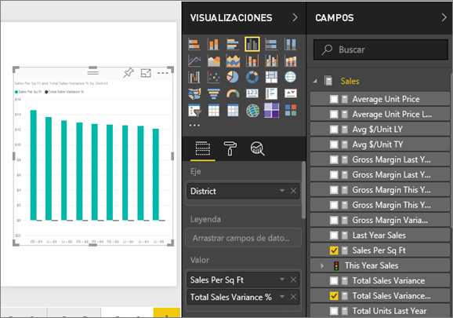
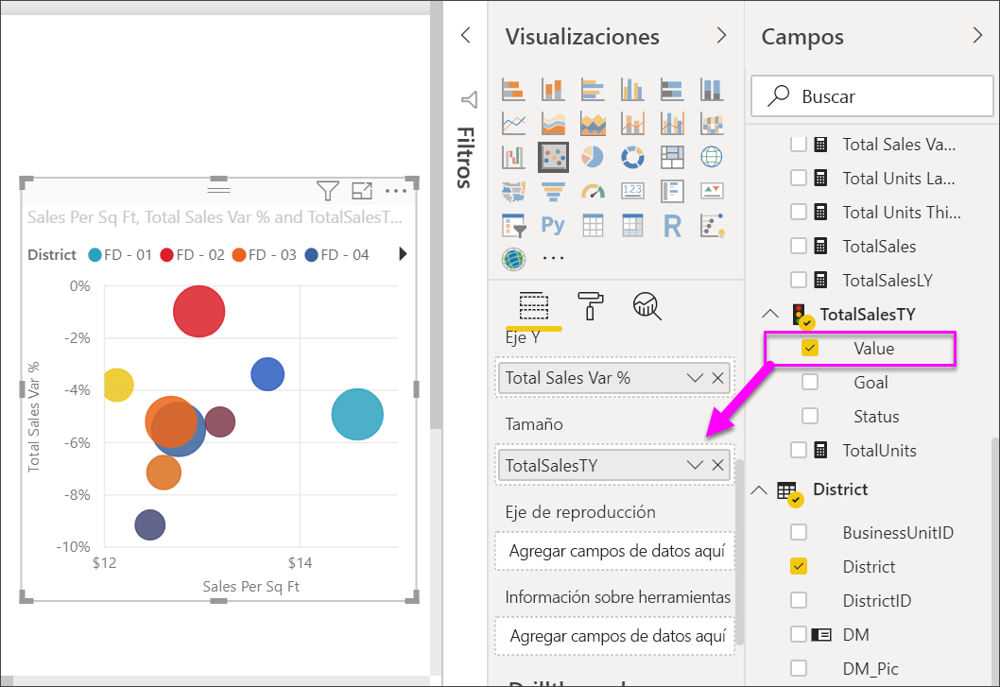
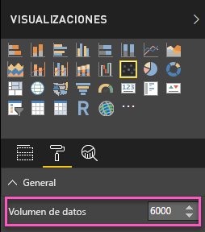
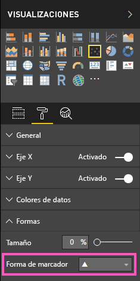
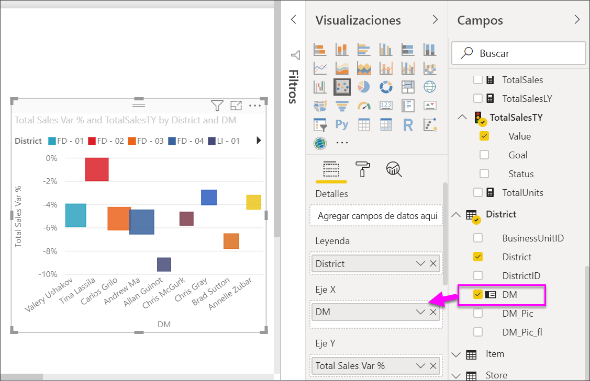
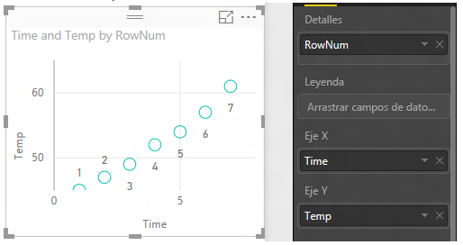
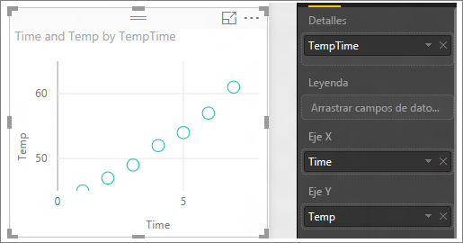

# Gráficos de dispersión, de burbujas y de trazado de punto de Power BI
Un gráfico de dispersión siempre tiene dos ejes de valores con el fin de mostrar un conjunto de datos numéricos en un eje horizontal y otro conjunto de valores numéricos a lo largo de un eje vertical. El gráfico muestra puntos en la intersección de un valor numérico x e y, y combina estos valores en puntos de datos únicos. Estos puntos de datos pueden estar distribuidos uniformemente o de forma desigual entre el eje horizontal, en función de los datos.

Un gráfico de burbujas reemplaza los puntos de datos con burbujas, cuyo *tamaño* representa una dimensión adicional de los datos.

Un gráfico de trazado de puntos es similar a un gráfico de burbujas y a un gráfico de dispersión, excepto que se pueden trazar datos numéricos o categóricos a lo largo del eje X. 

Puede establecer el número de puntos de datos, hasta un máximo de 10 000.  

## Cuándo se debe usar un gráfico de dispersión o un gráfico de burbujas
### Los gráficos de dispersión son una opción excelente:
* para mostrar las relaciones entre 2 (dispersión) o 3 (burbuja) valores **numéricos** .
* para trazar dos grupos de números como una serie de coordenadas xy.
* en lugar de un gráfico de líneas cuando quiere cambiar la escala del eje horizontal    
* para convertir el eje horizontal en una escala logarítmica.
* para mostrar datos de la hoja de cálculo que incluyen pares o conjuntos de valores agrupados. En un gráfico de dispersión, puede ajustar las escalas independientes de los ejes para obtener más información acerca de los valores agrupados.
* para mostrar patrones en grandes conjuntos de datos, por ejemplo, al mostrar los valores atípicos, los clústeres y las tendencias lineales o no lineales.
* para comparar gran cantidad de números de puntos de datos sin tener en cuenta en el tiempo.  Cuantos más datos incluya en un gráfico de dispersión, mejores comparaciones podrá realizar.

### Los gráficos de burbujas son una excelente opción:
* si los datos tienen 3 series de datos que contienen un conjunto de valores.
* para presentar datos financieros.  Los tamaños de burbuja diferentes son útiles para resaltar visualmente valores específicos.
* para usarlos con cuadrantes.

### Los gráficos de trazado de punto son una gran opción en lugar de un gráfico de burbuja o de dispersión:
* si desea incluir datos de categorías en el eje X

## Crear un gráfico de dispersión
Vea este vídeo para ver como Will crea un gráfico de dispersión y, después, siga los pasos que se indican a continuación para crear uno propio.

<iframe width="560" height="315" src="https://www.youtube.com/embed/PVcfPoVE3Ys?list=PL1N57mwBHtN0JFoKSR0n-tBkUJHeMP2cP" frameborder="0" allowfullscreen></iframe>

Estas instrucciones usan el Ejemplo de análisis de minoristas. Para poder continuar, [descargue el ejemplo](../sample-datasets.md) del servicio Power BI (app.powerbi.com) o Power BI Desktop.   

1. Abra el informe en la Vista de edición y seleccione el icono de signo más de color amarillo para crear una página de informe en blanco.
 
2. En el panel Campos, seleccione los siguientes campos:
   - **Ventas** > **Ventas por metro cuadrado**
   - **Ventas** >  **% de varianza de ventas total**
   - **Distrito** > **Distrito**

     

     Si está utilizando el servicio Power BI, asegúrese de que abre el informe en [Vista de edición](../service-interact-with-a-report-in-editing-view.md).

3. Conviértalo en un gráfico de dispersión. En el panel Visualización, seleccione el icono Gráfico de dispersión.

   .

4. Arrastre **Distrito** desde **Detalles** a **Leyenda**. Esto muestra un gráfico de dispersión que traza el **porcentaje de varianza de ventas total** a lo largo del eje Y y las **ventas por metro cuadrado** en el eje X. Los colores del punto de datos representan distritos:

    

Ahora vamos a agregar una tercera dimensión.

## Crear un gráfico de burbujas

1. En el panel **Campos**, arrastre **Ventas** > **Ventas de este año** > **Valor** al área **Tamaño**. Los puntos de datos se expanden a volúmenes proporcionales al valor de ventas.
   
   

2. Mantenga el mouse encima de una burbuja. El tamaño de la burbuja refleja el valor de **Ventas de este año**.
   
    

3. Para establecer el número de puntos de datos que se van a mostrar en el gráfico de burbujas, en la sección **Formato** del panel **Visualizaciones**, expanda la tarjeta **General** y ajuste el **Volumen de datos**. Puede establecer el volumen de datos máximo en cualquier número hasta 10 000. Si va a usar cifras más altas, recomendamos probar primero para garantizar un buen rendimiento. 

     

   Dado que más puntos de datos pueden significar un tiempo de carga mayor, si opta por publicar informes con límites en el extremo superior de la escala, asegúrese de probar los informes en Internet y en dispositivos móviles para garantizar que el rendimiento se ajusta a las expectativas de los usuarios. 

4. Puede [aplicar formato a los colores de la visualización, las etiquetas, los títulos, el fondo, etc.](service-getting-started-with-color-formatting-and-axis-properties.md) Para [mejorar la accesibilidad](../desktop-accessibility.md), considere la posibilidad de agregar formas de marcador a cada línea. El empleo de una forma de marcador distinta para cada línea permite que los lectores del informe puedan diferenciar cada una de las líneas (o áreas) con más facilidad. Para seleccionar la forma de marcador, expanda la tarjeta **Formas** y luego seleccione una forma de marcador.

      

   También puede cambiar la forma del marcador en forma de rombo, triángulo o cuadrado:

   

## Creación de un gráfico de trazado de punto
Para crear un gráfico de trazado de punto, sustituya el campo numérico del eje X por un campo categórico.

Desde el panel **Eje X**, quite **Ventas por metro cuadrado** y reemplácelo por **Distrito > DM**.
   

## Consideraciones y solución de problemas

### **El gráfico de dispersión solo tiene un punto de datos**
¿El gráfico de dispersión tiene solo un punto de datos que agrega todos los valores de los ejes X e Y?  ¿O quizás agrega todos los valores a lo largo de una sola línea horizontal o vertical?

Agregue un campo en el área **Detalles** para indicar a Power BI cómo se deben agrupar los valores. El campo debe ser único para cada punto que quiera trazar; como un número de fila simple o un campo de identificador.

O bien, si sus datos no incluyen eso, cree un campo que concatene los valores X e Y en un valor exclusivo por cada punto:

Para crear un nuevo campo, [use el Editor de consultas de Power BI Desktop para agregar una columna de índice](../desktop-add-custom-column.md) al conjunto de datos.  A continuación, agregue esta columna al área **Detalles** de la visualización.

## Pasos siguientes

[Gráficos de dispersión de alta densidad](desktop-high-density-scatter-charts.md)

[Tipos de visualización en Power BI](power-bi-visualization-types-for-reports-and-q-and-a.md)

