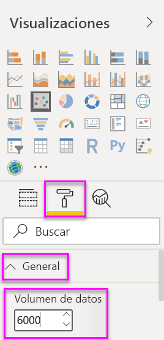
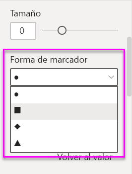
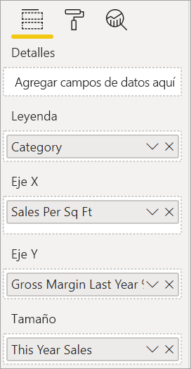
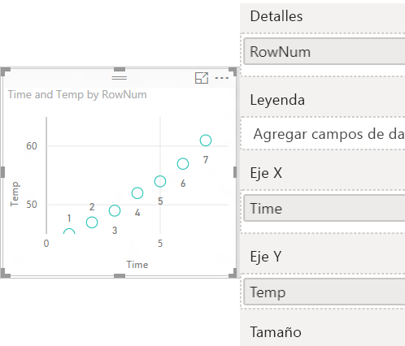
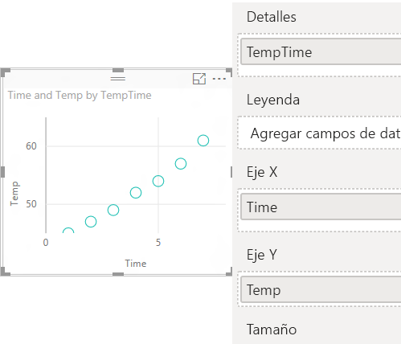

# Gráficos de dispersión, de burbujas y de trazado de punto de Power BI

[!INCLUDE [power-bi-visuals-desktop-banner](../includes/power-bi-visuals-desktop-banner.md)]

Un gráfico de dispersión siempre tiene dos ejes de valores con el fin de mostrar un conjunto de datos numéricos en un eje horizontal y otro conjunto de valores numéricos a lo largo de un eje vertical. El gráfico muestra puntos en la intersección de un valor numérico x e y, y combina estos valores en puntos de datos únicos. Power BI puede distribuir estos puntos de datos de manera uniforme o desigual a través del eje horizontal. Depende de los datos que el gráfico representa.

Vea este vídeo para ver como Will crea un gráfico de dispersión y, después, siga los pasos que se indican a continuación para crear uno propio.
   > [!NOTE]
   > En este vídeo se usa una versión anterior de Power BI Desktop.
   > 
   > 
<iframe width="560" height="315" src="https://www.youtube.com/embed/PVcfPoVE3Ys?list=PL1N57mwBHtN0JFoKSR0n-tBkUJHeMP2cP" frameborder="0" allowfullscreen></iframe>

Puede establecer el número de puntos de datos, hasta un máximo de 10 000.  

## Cuándo utilizar un gráfico de dispersión, un gráfico de burbujas o un gráfico de puntos

### Gráficos de dispersión y de burbujas

Un gráfico de dispersión muestra la relación entre dos valores numéricos. Un gráfico de burbujas reemplaza los puntos de datos con burbujas, cuyo *tamaño* representa una tercera dimensión adicional de datos.

Los gráficos de dispersión son una opción excelente:

* Para mostrar las relaciones entre dos valores numéricos.

* Para trazar dos grupos de números como una serie de coordenadas x e y.

* Para usarlo en lugar de un gráfico de líneas cuando quiere cambiar la escala del eje horizontal.

* Para convertir el eje horizontal en una escala logarítmica.

* Para mostrar datos de la hoja de cálculo que incluyen pares o conjuntos de valores agrupados.

    > [!TIP]
    > En un gráfico de dispersión, puede ajustar las escalas independientes de los ejes para obtener más información acerca de los valores agrupados.

* Para mostrar patrones en grandes conjuntos de datos, por ejemplo, al mostrar los valores atípicos, las agrupaciones y las tendencias lineales o no lineales.

* Para comparar gran cantidad de números de puntos de datos sin tener en cuenta en el tiempo.  Cuantos más datos incluya en un gráfico de dispersión, podrá realizar mejores comparaciones.

Además de lo que los gráficos de dispersión pueden hacer, los gráficos de burbujas son una excelente opción:

* Si los datos tienen tres series de datos que contienen un conjunto de valores.

* Para presentar datos financieros.  Los tamaños de burbuja diferentes son útiles para resaltar visualmente valores específicos.

* Para usarlos con cuadrantes.

### Gráficos de trazado de puntos

Un gráfico de trazado de puntos es similar a un gráfico de burbujas y a un gráfico de dispersión, pero se puede usar para trazar datos categóricos a lo largo del eje X.

Es una excelente elección si desea incluir datos de categorías en el eje X.

## Requisitos previos

En este tutorial se usa el [archivo PBIX del Ejemplo de análisis de minoristas](https://download.microsoft.com/download/9/6/D/96DDC2FF-2568-491D-AAFA-AFDD6F763AE3/Retail%20Analysis%20Sample%20PBIX.pbix).

1. En la sección superior izquierda de la barra de menús, seleccione **Archivo** > **Abrir**.
   
2. Busque la copia del **archivo PBIX del Ejemplo de análisis de minoristas**.

1. Abra el **archivo PBIX del Ejemplo de análisis de minoristas** en la vista de informe .

1. Seleccionar  para agregar una nueva página.

## Crear un gráfico de dispersión

1. Empiece en una página de informe en blanco y, en el panel **Campos**, seleccione estos campos:

    * **Ventas** > **Ventas por metro cuadrado**

    * **Ventas** >  **% de varianza de ventas total**

    * **Distrito** > **Distrito**

    

1. En el panel **Visualización**, seleccione  Para convertir el gráfico de columnas agrupadas en un gráfico de dispersión.

   

1. Arrastre **Distrito** desde **Detalles** a **Leyenda**.

    Power BI muestra un gráfico de dispersión que traza el **porcentaje de varianza de ventas total** a lo largo del eje Y y las **ventas por metro cuadrado** en el eje X. Los colores del punto de datos representan distritos:

    

Ahora vamos a agregar una tercera dimensión.

## Crear un gráfico de burbujas

1. En el panel **Campos**, arrastre **Ventas** > **Ventas de este año** > **Valor** al área **Tamaño**. Los puntos de datos se expanden a volúmenes proporcionales al valor de ventas.

   

1. Mantenga el mouse encima de una burbuja. El tamaño de la burbuja refleja el valor de **Ventas de este año**.

    

1. Para establecer el número de puntos de datos que se van a mostrar en el gráfico de burbujas, en la sección **Formato** del panel **Visualizaciones**, expanda la **General** y ajuste el **Volumen de datos**.

    

    Puede establecer el volumen de datos máximo en cualquier número hasta 10 000. Si va a usar cifras más altas, recomendamos probar primero para garantizar un buen rendimiento.

    > [!NOTE]
    > Más puntos de datos pueden significar un tiempo de carga más largo. Si decide publicar informes con límites en el extremo superior de la escala, asegúrese de probar los informes también en la web y en el dispositivo móvil. Desea confirmar que el rendimiento del gráfico se adapta a las expectativas de los usuarios.

1. Continúe con la aplicación de formato a los colores de la visualización, las etiquetas, los títulos, el fondo, etc. Para [mejorar la accesibilidad](../desktop-accessibility.md), considere la posibilidad de agregar formas de marcador a cada línea. Para seleccionar la forma del marcador, expanda **Formas**, seleccione **Forma de marcador** y seleccione una forma.

    

    Cambie la forma del marcador por un rombo, triángulo o cuadrado. El empleo de una forma de marcador distinta para cada línea permite que los lectores del informe puedan diferenciar cada una de las líneas (o áreas) con más facilidad.

1. Abra el panel Analytics  para agregar información adicional a la visualización.  
    - Agregue una línea mediana. Seleccione **Línea mediana** > **Agregar**. De forma predeterminada, Power BI agrega una línea mediana para *Ventas por metro cuadrado*. Esto no es muy útil, ya que se puede ver que hay 10 puntos de datos y se sabe que la mediana se creará con cinco puntos de datos a cada lado. En su lugar, cambie la **Medida** a *% de desviación de ventas totales*.  

        

    - Agregue sombreado de simetría para mostrar qué puntos tienen un valor mayor de la medida del eje X en comparación con la medida del eje Y, y viceversa. Al activar el sombreado de simetría en el panel Analytics, Power BI muestra el fondo del gráfico de dispersión simétricamente en función de los límites superior e inferior del eje actual. Se trata de una manera muy rápida de identificar qué medida de eje favorece un punto de datos, sobre todo si tiene un intervalo de ejes diferente para los ejes X e Y.

        a. Cambie el campo **% de desviación de ventas totales** a **% de margen bruto del último año**

        

        b. En el panel Analytics, agregue **Sombreado de simetría**. A partir del sombreado se observa que Calcetería (la burbuja verde en el área sombreada de color rosa) es la única categoría que favorece el margen bruto en lugar de sus ventas por metro cuadrado de tienda. 

        

    - Continúe con la exploración del panel Analytics para descubrir información interesante sobre los datos. 

        

## Creación de un gráfico de trazado de punto

Para crear un gráfico de trazado de punto, sustituya el campo numérico del **eje X** por un campo categórico.

Desde el panel **Eje X**, quite **Ventas por metro cuadrado** y reemplácelo por **Distrito** > **Administrador del distrito**.

## Consideraciones y solución de problemas

### El gráfico de dispersión solo tiene un punto de datos

¿El gráfico de dispersión tiene solo un punto de datos que agrega todos los valores de los ejes X e Y?  ¿O quizás agrega todos los valores a lo largo de una sola línea horizontal o vertical?

Agregue un campo en el área **Detalles** para indicar a Power BI cómo se deben agrupar los valores. El campo debe ser único para cada punto que quiera trazar. Un campo de identificador o un número de fila simple será suficiente.

Si sus datos no incluyen eso, cree un campo que concatene los valores X e Y en un valor exclusivo por cada punto:

Para crear un nuevo campo, [use el Editor de consultas de Power BI Desktop para agregar una columna de índice](../desktop-add-custom-column.md) al conjunto de datos. A continuación, agregue esta columna al área **Detalles** de la visualización.

## Pasos siguientes

* [Muestreo de alta densidad en los gráficos de dispersión de Power BI](desktop-high-density-scatter-charts.md)

* [Tipos de visualización en Power BI](power-bi-visualization-types-for-reports-and-q-and-a.md)

¿Tiene más preguntas? [Pruebe la comunidad de Power BI](https://community.powerbi.com/)
