# Tablas en informes y paneles de Power BI

Una tabla es una cuadrícula que contiene datos relacionados en una serie lógica de filas y columnas. También puede contener encabezados y una fila de totales. Las tablas funcionan bien con comparaciones cuantitativas en las que está mirando muchos valores para una única categoría. Por ejemplo, en esta tabla se muestran cinco medidas distintas para **Categoría**.

Cree tablas en los informes y resalte los elementos dentro de la tabla con otros objetos visuales en la misma página del informe. Puede seleccionar filas, columnas e incluso celdas individuales y realizar un resaltado cruzado. También puede copiar y pegar las celdas individuales y las selecciones de celdas múltiples en otras aplicaciones.

## Cuándo usar una tabla

Las tablas son una excelente opción:

* Para ver y comparar datos detallados y valores exactos (en lugar de representaciones visuales).

* Para mostrar datos en un formato tabular.

* Para mostrar datos numéricos por categorías.

> [!NOTE]
> Si una tabla tiene demasiados valores, considere la posibilidad de convertirla en una matriz o de realizar una exploración en profundidad. El número máximo de puntos de datos que se mostrará en una tabla es 3 500.

## Requisitos previos

* Servicio Power BI o Power BI Desktop

* Informe del Ejemplo de análisis de minoristas

## Obtención del informe del Ejemplo de análisis de minoristas

Estas instrucciones usan el Ejemplo de análisis de minoristas. La creación de una visualización requiere permisos de edición para el conjunto de datos e informes. Por suerte, los ejemplos de Power BI son todos editables. Si alguien comparte un informe con usted, no podrá crear visualizaciones en informes. Para continuar, abra el [informe del Ejemplo de análisis de minoristas](../sample-datasets.md).

Después de obtener el conjunto de datos **Ejemplo de análisis de minoristas**, puede empezar a trabajar.

## Crear una tabla

Vamos a crear la tabla que aparece al principio del artículo para mostrar los valores de ventas por categoría de producto.

1. En **Mi área de trabajo**, seleccione **Conjuntos de datos** > **Crear un informe**.

    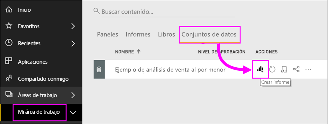

1. En el panel **Campos**, seleccione **Artículo** > **Categoría**.

    Power BI crea automáticamente una tabla que enumera todas las categorías.

    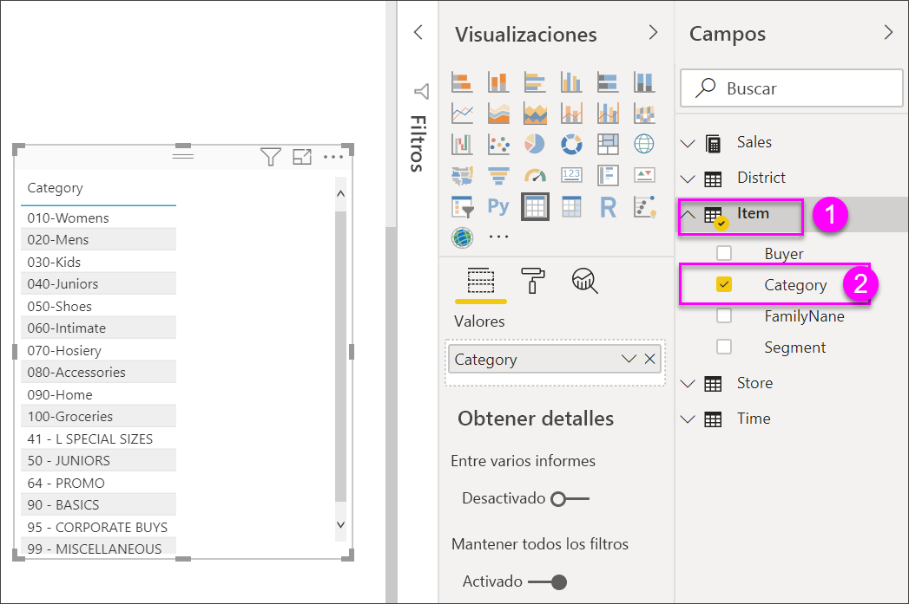

1. Seleccione **Ventas > Precio unitario medio** y **Ventas > Ventas del año anterior**

1. A continuación, seleccione **Ventas > Ventas de este año** y, a continuación, las tres opciones: **Valor**, **Objetivo** y **Estado**.

1. En el panel **Visualizaciones**, busque el área **Valores** y arrastre y coloque los valores hasta que el orden de las columnas del gráfico coincida con la primera imagen de esta página. El área **Valores** será similar a esta:

    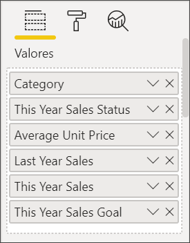

1. Ancle la tabla al panel seleccionando el icono de anclar.  en la esquina superior derecha del objeto visual.

## Dar formato a la tabla

Existen muchas formas de aplicar formato a una tabla. Aquí solo se analizan algunas. Una buena manera de conocer las demás opciones de formato es abrir el panel **Formato** (icono de rodillo de pintar ) y explorarlo.

* Pruebe a dar formato a la cuadrícula de tabla. En este caso agregará una cuadrícula vertical azul y espacio a las filas, y aumentará el esquema y el tamaño de texto.

    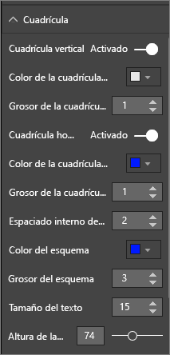

    

* Para los encabezados de columna, cambie el color de fondo, agregue un esquema y aumente el tamaño de fuente.

    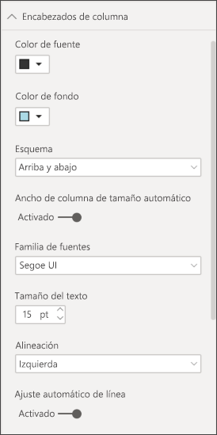

    

* Incluso puede aplicar formato a encabezados de columna y columnas individuales. Empiece por ampliar el **Formato de campo** y seleccione la columna a la que se va a dar formato en la lista desplegable. Dependiendo de los valores de columna, el **Formato de campo** permite configurar parámetros como mostrar unidades, el color de fuente, el número de posiciones decimales, el fondo, la alineación y más. Una vez que haya ajustado la configuración, decida si desea aplicar esta configuración también al encabezado y la fila de totales.

    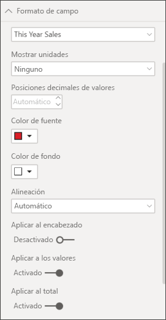

    

* Después de algunos cambios de formato adicionales, esta es nuestra tabla final.

    

### Formato condicional

El *formato condicional* es un tipo de formato. Power BI aplica formato condicional a los campos del área **Valores** del panel **Visualizaciones**.

Con el formato condicional para tablas, puede especificar colores personalizados de fondo de las celdas y colores de fuente según los valores de la celda e incluso puede usar colores de degradado.

1. En el panel **Visualizaciones**, seleccione el icono **Campos** .

1. Seleccione la flecha hacia abajo que está situada junto al valor del área **Valores** que desea formatear (o haga clic con el botón derecho en el campo).

    > [!NOTE]
    > El formato condicional solo se puede administrar en el área **Valores** de **Campos**.

    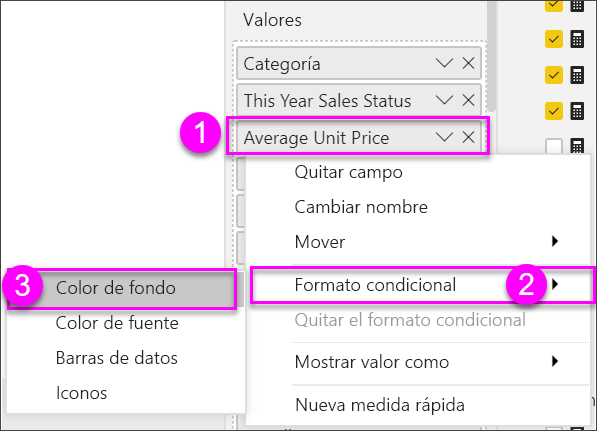

1. Seleccione **Color de fondo**.

1. En el cuadro de diálogo que aparece, puede configurar el color, así como los valores de **Mínimo** y **Máximo**. Si selecciona la opción **Divergente**, también puede configurar un valor **Centro** opcional.

    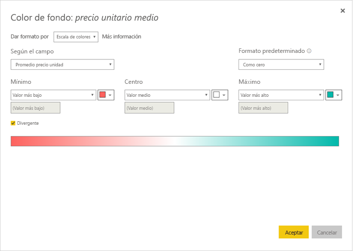

    Vamos a aplicar un formato personalizado a los valores de Precio unitario medio. Seleccione **Divergente**, agregue algunos colores y seleccione **Aceptar**.

    
1. Agregue un nuevo campo a la tabla que contenga valores positivos y negativos. Seleccione **Ventas > Varianza total de ventas**.

    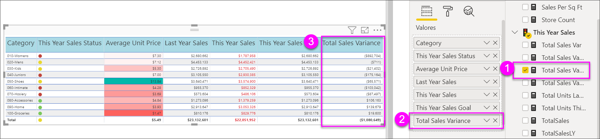

1. Agregue el formato condicional de la barra de datos seleccionando la flecha abajo situada junto a **Varianza total de ventas** y eligiendo **Formato condicional > Barras de datos**.

    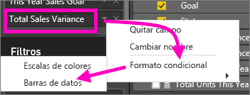

1. En el cuadro de diálogo que aparece, establezca los colores para **Barra positiva** y **Barra negativa**, seleccione la opción **Mostrar solo la barra** y realice cualquier otro cambio que desee.

    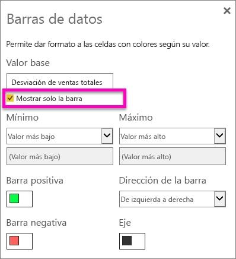

1. Seleccione **Aceptar**.

    Las barras de datos reemplazarán los valores numéricos en la tabla, lo cual facilitará el análisis.

    

Si desea quitar el formato condicional de una visualización, simplemente vuelva a hacer clic con el botón derecho en el campo y seleccione **Quitar formato condicional**.

> [!TIP]
> El formato condicional también está disponible en el panel **Formato**. Seleccione el valor al que va a dar formato y, a continuación, establezca **Escalas de colores** o **Barras de datos** en **Activado** para aplicar la configuración predeterminada o, para personalizar la configuración, y seleccione **Controles avanzados**.

## Copia de los valores de las tablas de Power BI para su uso en otras aplicaciones

Su tabla o matriz puede tener contenido que le gustaría utilizar en otras aplicaciones, como Dynamics CRM, Excel e incluso otros informes de Power BI. En Power BI, al hacer clic con el botón derecho dentro de una celda, puede copiar los datos en una sola celda o una selección de celdas en el portapapeles y pegarlas en las otras aplicaciones.

Para copiar el valor de una sola celda:

1. Seleccione la celda que desea copiar.

1. Haga clic con el botón derecho dentro de la celda.

1. Seleccione **Copiar** > **Copiar valor**.

    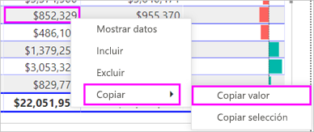

    Con el valor de la celda sin formato en el portapapeles, puede pegarlo en otra aplicación.

Para copiar más de una celda:

1. Seleccione un rango de celdas o use **Ctrl** para seleccionar una o varias celdas.

1. Haga clic con el botón derecho en una de las celdas seleccionadas.

1. Seleccione **Copiar** > **Copiar selección**.

    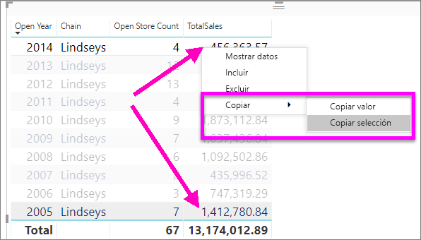

    La copia incluye los encabezados de columna y de fila.

    

## Ajustar el ancho de columna de una tabla

A veces, Power BI trunca un encabezado de columna en un informe o un panel. Para mostrar el nombre de columna completo, mantenga el puntero sobre el espacio a la derecha del encabezado para mostrar las flechas dobles, selecciónelas y arrástrelas.

## Consideraciones y solución de problemas

Al aplicar el formato de las columnas, solo puede elegir una opción de alineación por cada columna: **Automática**, **Izquierda**, **Centro** y **Derecha**. Normalmente, una columna contiene todo el texto o todos los números, y no una combinación de ellos. En casos donde una columna contiene números y texto, **Automática** alineará el texto a la izquierda y los números a la derecha. Este comportamiento es compatible con idiomas en los que se lee de izquierda a derecha.

## Pasos siguientes

* [Gráficos de rectángulos en Power BI](power-bi-visualization-treemaps.md)

* [Tipos de visualización en Power BI](power-bi-visualization-types-for-reports-and-q-and-a.md)
