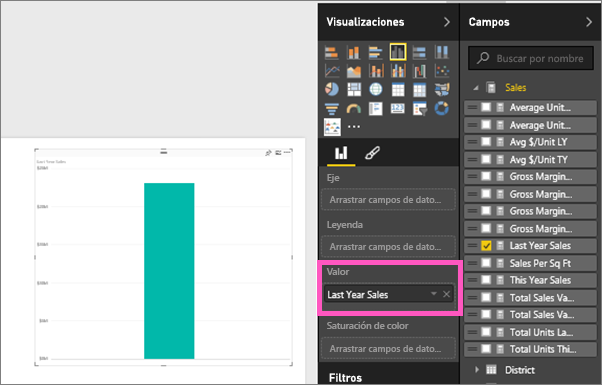
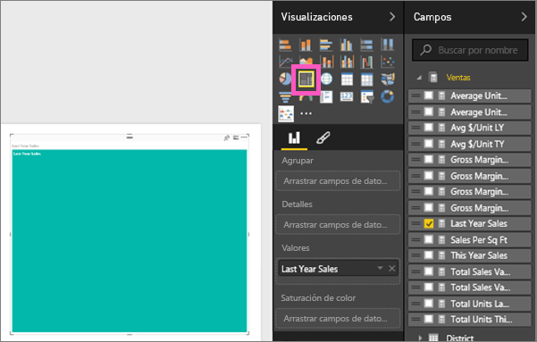
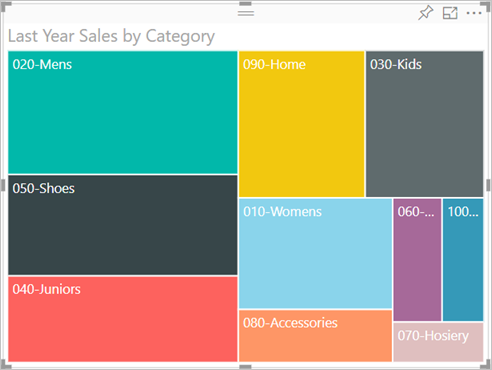
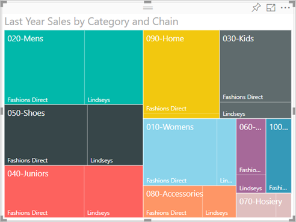
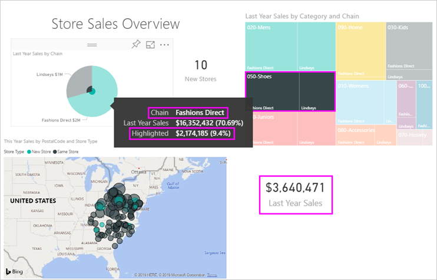

# Gráficos de rectángulos en Power BI
Los gráficos de rectángulos muestran los datos jerárquicos como un conjunto de rectángulos anidados.  Cada nivel de la jerarquía se representa mediante un rectángulo de color (llamado "rama") que contiene otros rectángulos ("hojas").  El espacio dentro de cada rectángulo se asigna en función del valor que se va a medir. Y los rectángulos se organizan por tamaño desde la esquina superior izquierda (mayor) a la inferior derecha (menor).

Por ejemplo, si estoy analizando mis ventas, es posible que tenga rectángulos de nivel superior, también llamados *ramas*, para las categorías de ropa: **Urbana**, **Rural**, **Joven** y **Mezcla**.  Los rectángulos de categoría se dividirán en rectángulos más pequeños, también denominados *hojas*, para los fabricantes de ropa dentro de esa categoría. Y estos rectángulos más pequeños se cambiarán de tamaño y se sombrearán en función del número vendido.  

En la rama **Urbana** anterior, se ha vendido una gran cantidad de ropa `Maximus`, menos de `Natura` y `Fama`, y algunas prendas de `Leo`.  Por tanto, la rama **Urbana** de mi gráfico de rectángulos tendría:
* el rectángulo más grande para `Maximus` en la esquina superior izquierda
* rectángulos ligeramente menores para `Natura` y `Fama`
* muchos otros rectángulos para todas las demás prendas vendidas, y 
* un pequeño rectángulo para `Leo`.  

Y podría comparar el número de elementos vendidos en las demás categorías de prendas si comparo el tamaño y el sombreado de cada nodo de hoja; los rectángulos de mayor tamaño y más oscuros significarán un valor mayor.

## Cuándo usar un gráfico de rectángulos
Los gráficos de rectángulos son una excelente opción:

* Para mostrar grandes cantidades de datos jerárquicos.
* Cuando un gráfico de barras no puede administrar eficazmente un gran número de valores.
* Para mostrar las proporciones entre cada parte y el todo.
* Para mostrar el patrón de la distribución de la medida en cada nivel de categorías de la jerarquía.
* Para mostrar los atributos mediante códigos de color y tamaño.
* Para detectar patrones, valores atípicos, colaboradores más importantes y excepciones.

### Requisitos previos
 - Servicio Power BI o Power BI Desktop
 - Ejemplo de análisis de venta al por menor

## Crear un gráfico de rectángulos básico
¿Quiere ver primero a otra persona creando un gráfico de rectángulos?  Vaya al minuto 2:10 de este vídeo para ver cómo Amanda crea un gráfico de rectángulos.

<iframe width="560" height="315" src="https://www.youtube.com/embed/IkJda4O7oGs" frameborder="0" allowfullscreen></iframe>

También puede crear su propio gráfico de rectángulos. Estas instrucciones usan el Ejemplo de análisis de minoristas. Para continuar, inicie sesión en el servicio Power BI y seleccione **Obtener datos \> Ejemplos \> Ejemplo de análisis de minoristas \> Conectar \> Ir al panel**. La creación de visualizaciones en un informe requiere permisos de edición para el conjunto de datos y los informes. Por suerte, los ejemplos de Power BI son todos editables. Pero no puede agregar visualizaciones a un informe que alguien haya compartido con usted.  

1. En el panel, seleccione el icono "Total stores" para abrir el informe de ejemplo Retail Analysis.    
2. Abra la [vista de edición](../service-interact-with-a-report-in-editing-view.md) y seleccione la medida **Sales** > **Last Years Sales**.   
      
3. Convierta el gráfico en un gráfico de rectángulos.  
      
4. Arrastre **Elemento** > **Categoría** al área **Grupo**. Power BI crea un gráfico de rectángulos donde el tamaño de los rectángulos se basa en las ventas totales y el color representa la categoría.  En esencia, creó una jerarquía que describe visualmente el tamaño relativo de las ventas totales por categoría.  La categoría **Hombres** tiene las ventas más altas y la categoría **Calcetería** tiene los valores más bajos.   
      
5. Arrastre **Store** > **Chain** al área **Detalles** para completar el gráfico de rectángulos. Ahora puede comparar las ventas del último año por categoría y cadena.   
   
   
   > [!NOTE]
   > La saturación de color y los detalles no se pueden usar al mismo tiempo.
   > 
   > 
5. Mantenga el mouse encima de un área de **Cadena** para que aparezca la información sobre herramientas de la parte de la **Categoría**.  Por ejemplo, al pasar el cursor sobre **Fashions Direct** en el rectángulo **090-Home**, se muestra la información en pantalla para la parte Fashions Direct de la categoría Home.  
   
6. [Agregue el gráfico de rectángulos como un icono de panel (ancle el objeto visual)](../service-dashboard-tiles.md). 
7. [Guarde el informe](../service-report-save.md).

## Resaltado y filtrado cruzado
Para más información acerca de cómo usar el panel Filtros, consulte [Agregar un filtro a un informe](../power-bi-report-add-filter.md).

Al resaltar una Categoría o un Detalle en un gráfico de rectángulos, se realiza un resaltado y un filtrado cruzados de las demás visualizaciones de la página de informe, y viceversa. Para poder continuar, agregue algunos objetos visuales a esta página del informe o copie el gráfico de rectángulos en una de las otras páginas que no están en blanco de este informe.

1. En el gráfico de rectángulos, seleccione una Categoría o una Cadena dentro de una Categoría.  Esto realiza un resaltado cruzado de las demás visualizaciones de la página. Seleccionar **050-Zapatos**, por ejemplo, muestra que las ventas de zapatos del último año fueron de 3.640.471 USD, de los que 2.174.185 procedieron de Fashions Direct.  
   

2. En el gráfico circular **Last Year Sales by Chain**, seleccione el sector **Fashions Direct**.  
       

3. Para administrar cómo se realiza un resaltado y un filtrado cruzados de los gráficos, consulte [Interacciones de visualización en un informe de Power BI](../service-reports-visual-interactions.md).

## Pasos siguientes

[Gráficos de cascada en Power BI](power-bi-visualization-waterfall-charts.md)

[Tipos de visualización en Power BI](power-bi-visualization-types-for-reports-and-q-and-a.md)