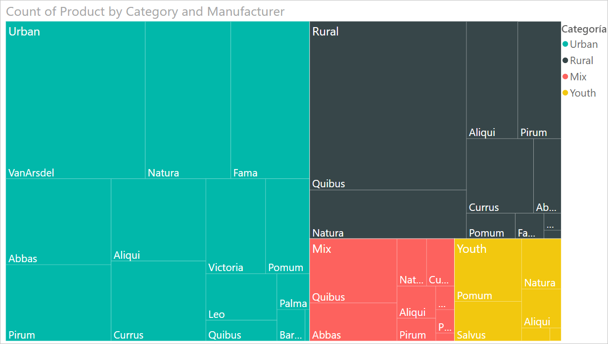
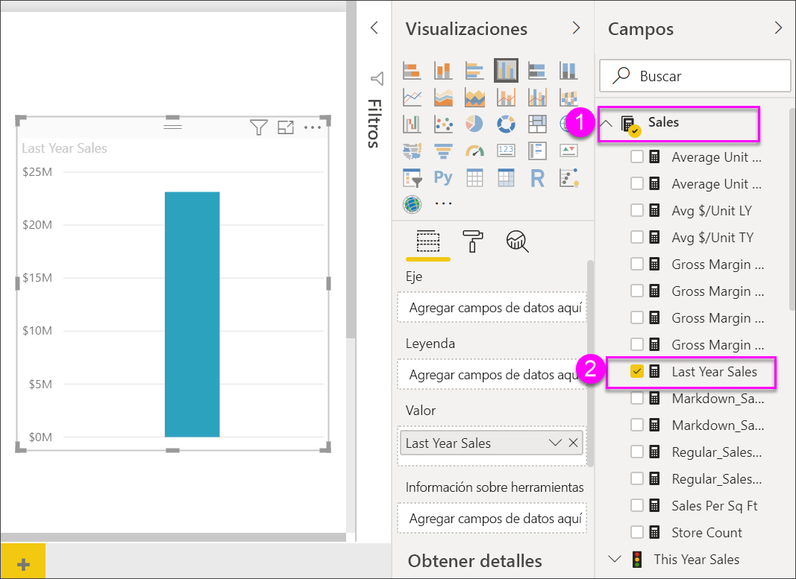

# Gráficos de rectángulos en Power BI

[!INCLUDE [power-bi-visuals-desktop-banner](../includes/power-bi-visuals-desktop-banner.md)]

Los gráficos de rectángulos muestran los datos jerárquicos como un conjunto de rectángulos anidados. Cada nivel de la jerarquía se representa mediante un rectángulo de color (rama) que contiene rectángulos más pequeños (hojas). Power BI basa el tamaño del espacio dentro de cada rectángulo en el valor medido. Los rectángulos se organizan por tamaño desde la esquina superior izquierda (mayor) a la inferior derecha (menor).

Por ejemplo, si está analizando sus ventas, es posible que tenga ramas de alto nivel para las categorías de ropa: **Urbana**, **Rural**, **Joven** y **Mezcla**. Power BI dividiría los rectángulos de su categoría en hojas, para los fabricantes de ropa dentro de esa categoría. Estas hojas cambiarán de tamaño y se sombrearán en función del número vendido.

En la rama **Urban** anterior, se vendieron mucha ropa de **VanArsdel**. Se vendió menos de **Natura** y **Fama**. Solo se vendieron unos pocos **Leo**. Por lo tanto, la rama **Urban** del gráfico de rectángulos tiene:

* El rectángulo más grande para **VanArsdel** en la esquina superior izquierda.

* Rectángulos ligeramente más pequeños para **Natura** y **Fama**.

* Muchos otros rectángulos para todas las demás prendas vendidas.

* Un pequeño rectángulo para **Leo**.

Podría comparar el número de elementos vendidos en las demás categorías de prendas si comparo el tamaño y el sombreado de cada nodo de hoja; los rectángulos de mayor tamaño y más oscuros significarán un valor mayor.

¿Quiere ver primero a otra persona creando un gráfico de rectángulos? Vaya al minuto 2:10 de este vídeo para ver cómo Amanda crea un gráfico de rectángulos.

   > [!NOTE]
   > En este vídeo se usa una versión anterior de Power BI Desktop.
   > 
   > 

<iframe width="560" height="315" src="https://www.youtube.com/embed/IkJda4O7oGs" frameborder="0" allowfullscreen></iframe>

## Cuándo usar un gráfico de rectángulos

Los gráficos de rectángulos son una excelente opción:

* Para mostrar grandes cantidades de datos jerárquicos.

* Cuando un gráfico de barras no puede administrar eficazmente un gran número de valores.

* Para mostrar las proporciones entre cada parte y el todo.

* Para mostrar el patrón de la distribución de la medida en cada nivel de categorías de la jerarquía.

* Para mostrar los atributos mediante códigos de color y tamaño.

* Para detectar patrones, valores atípicos, colaboradores más importantes y excepciones.

## Requisito previo

En este tutorial se usa el [archivo PBIX del Ejemplo de análisis de minoristas](https://download.microsoft.com/download/9/6/D/96DDC2FF-2568-491D-AAFA-AFDD6F763AE3/Retail%20Analysis%20Sample%20PBIX.pbix).

1. En la sección superior izquierda de la barra de menús, seleccione **Archivo** > **Abrir**.
   
2. Busque la copia del **archivo PBIX del Ejemplo de análisis de minoristas**.

1. Abra el **archivo PBIX del Ejemplo de análisis de minoristas** en la vista de informe .

1. Seleccionar  para agregar una nueva página.

Después de obtener el conjunto de datos **Ejemplo de análisis de minoristas**, puede empezar a trabajar.

## Crear un gráfico de rectángulos básico

Va a crear un informe y agregar un gráfico de rectángulos básico.

1. En el panel **Campos**, seleccione la medida **Ventas** > **Ventas del último año**.

   

1. Seleccione el icono de gráfico de rectángulos  para convertir el gráfico en un gráfico de rectángulos.

   

1. Seleccione **Elemento** > **Categoría** para agregar **Categoría** al área **Grupo**.

    Power BI crea un gráfico de rectángulos donde el tamaño de los rectángulos se basa en las ventas totales y el color representa la categoría. En esencia, creó una jerarquía que describe visualmente el tamaño relativo de las ventas totales por categoría. La categoría **Hombres** tiene las ventas más altas y la categoría **Calcetería** tiene los valores más bajos.

    

1. Seleccione **Tienda** > **Cadena** que agregará **Cadena** al área **Detalles** para completar el gráfico de rectángulos. Ahora puede comparar las ventas del último año por categoría y cadena.

   

   > [!NOTE]
   > La saturación de color y los detalles no se pueden usar al mismo tiempo.

1. Mantenga el mouse encima de un área de **Cadena** para que aparezca la información sobre herramientas de la parte de la **Categoría**.

    Por ejemplo, al pasar el cursor sobre **Fashions Direct** en el rectángulo **090-Home**, se muestra la información en pantalla para la parte Fashions Direct de la categoría Home.

   

## Resaltado y filtrado cruzado

Al resaltar una **Categoría** o un **Detalle** en un gráfico de rectángulos, se realiza un resaltado y un filtrado cruzados del resto de visualizaciones de la página de informe. Para poder continuar, agregue algunos objetos visuales a esta página del informe o copie el gráfico de rectángulos en una de las otras páginas de este informe. En la imagen siguiente, el gráfico de rectángulos se ha copiado en la página **Información general**. 

1. En el gráfico de rectángulos, seleccione una **categoría** o una **cadena** dentro de una **categoría**. Esto realiza un resaltado cruzado de las demás visualizaciones de la página. Si se selecciona **050-Shoes**, por ejemplo, se muestra que las ventas de zapatos del último año fueron de **16 352 432 USD** de las cuales **Fashions Direct** representaron **2 174 185 USD** de dichas ventas.

   

1. En el gráfico circular **Last Year Sales by Chain**, seleccione el sector **Fashions Direct**.
   

1. Para administrar cómo se realiza un resaltado y un filtrado cruzados de los gráficos, consulte [Cambiar cómo interactúan los objetos visuales en un informe de Power BI](../service-reports-visual-interactions.md).

## Pasos siguientes

* [Gráficos de cascada en Power BI](power-bi-visualization-waterfall-charts.md)

* [Tipos de visualización en Power BI](power-bi-visualization-types-for-reports-and-q-and-a.md)
