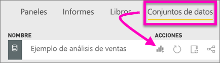
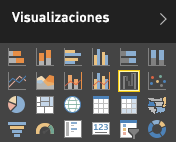

# Gráficos de cascada en Power BI
Los gráficos de cascada muestran un total acumulado a medida que se suman o se restan valores. Son útiles para comprender cómo afecta una serie de cambios positivos y negativos a un valor inicial (por ejemplo, ingresos netos).

Las columnas están codificadas por color para identificar rápidamente los aumentos y las disminuciones. Las columnas de valores iniciales y finales a menudo [comienzan en el eje horizontal](https://support.office.com/article/Create-a-waterfall-chart-in-Office-2016-for-Windows-8de1ece4-ff21-4d37-acd7-546f5527f185#BKMK_Float "comienzan en el eje horizontal"), mientras que los valores intermedios son columnas flotantes. Debido a este "aspecto", los gráficos de cascada también se denominan gráficos de puente.

<iframe width="560" height="315" src="https://www.youtube.com/embed/qKRZPBnaUXM" frameborder="0" allow="autoplay; encrypted-media" allowfullscreen></iframe>

## Cuándo usar un gráfico de cascada
Los gráficos de cascada son una excelente opción:

* Cuando la medida sufre cambios a lo largo de una serie temporal o en distintas categorías.
* Para auditar los cambios más importantes que contribuyen al valor total.
* Para trazar el beneficio anual de la compañía mostrando varias fuentes de ingresos y obtener la ganancia total (o pérdida).
* Para ilustrar la plantilla inicial y final de su empresa en un año.
* Para visualizar la cantidad de dinero que genera y gasta cada mes, y el saldo corriente de su cuenta. 

## Crear un gráfico de cascada
Vamos a crear un gráfico en cascada que muestre la varianza de las ventas (ventas estimadas frente a las ventas reales) por mes. Para continuar, inicie sesión en Power BI y seleccione **Obtener datos \> Ejemplos \> Ejemplo de análisis de minoristas**. 

1. Seleccione la pestaña **Conjuntos de datos** y vaya al nuevo conjunto de datos "Ejemplo de análisis de minoristas".  Seleccione el icono **Crear informe** para abrir el conjunto de datos en la vista de edición del informe. 
   
    
2. En el panel **Campos**, seleccione **Ventas \> Varianza total de ventas**. 
3. Convierta el gráfico en un **Gráfico de cascada**. Si **Varianza total de ventas** no está en el área **Eje Y** , arrástrelo aquí.
   
    
4. Seleccione **Tiempo** \> **FiscalMonth** para agregarlo al área **Categoría**. 
   
    
5. Ordene el gráfico en cascada cronológicamente. En la esquina superior derecha del gráfico, seleccione el botón de puntos suspensivos (...) y elija **FiscalMonth**.
   
    
   
    
6. Profundice un poco más para ver lo que está contribuyendo más a los cambios de un mes a otro. Arrastre **Store** > **Territory** al cubo **Desglose**.
   
    
7. De forma predeterminada, Power BI agrega los principales 5 factores que contribuyen a los aumentos o disminuciones por mes. Pero solo nos interesan los 2 factores principales.  En el panel Formato, seleccione **Desglose** y establezca **Máximo** en 2.
   
    
   
    Una revisión rápida revela que los territorios de Ohio y Pennsylvania son los factores que más contribuyen al movimiento, negativo y positivo, en el gráfico en cascada. 
   
    
8. Este es un dato interesante. ¿Ohio y Pennsylvania tienen tal impacto porque las ventas en estos dos territorios son mucho mayores que en los otros territorios?  Podemos comprobarlo. Cree un mapa que examine el valor de ventas por territorio para el año en curso y el anterior.  
   
    
   
    Nuestro mapa confirma nuestra teoría.  Muestra que estos 2 territorios tenían el mayor valor de ventas del año anterior (tamaño de burbuja) y este año (sombreado de burbuja).

## Resaltado y filtrado cruzado
Para más información acerca de cómo usar el panel Filtros, consulte [Agregar un filtro a un informe](../power-bi-report-add-filter.md).

Al resaltar una columna en un gráfico de cascada, se realiza un filtrado cruzado de las demás visualizaciones de la página del informe, y viceversa. Sin embargo, la columna Total no desencadena el resaltado ni responde al filtrado cruzado.

## Pasos siguientes

[Interacciones de objetos visuales](../service-reports-visual-interactions.md)

[Tipos de visualización en Power BI](power-bi-visualization-types-for-reports-and-q-and-a.md)