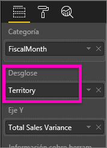

# Gráficos de cascada en Power BI

[!INCLUDE [power-bi-visuals-desktop-banner](../includes/power-bi-visuals-desktop-banner.md)]

Los gráficos de cascada muestran un total acumulado a medida que Power BI agrega y resta valores. Son útiles para comprender cómo afecta una serie de cambios positivos y negativos a un valor inicial (por ejemplo, ingresos netos).

Las columnas están codificadas por color para identificar rápidamente los aumentos y las disminuciones. Las columnas de los valores inicial y final a menudo [comienzan en el eje horizontal](https://support.office.com/article/Create-a-waterfall-chart-in-Office-2016-for-Windows-8de1ece4-ff21-4d37-acd7-546f5527f185#BKMK_Float "inicio en el eje horizontal"), mientras que los valores intermedios son columnas flotantes. Debido a este estilo, los gráficos de cascada también se denominan gráficos de puente.

   > [!NOTE]
   > En este vídeo se usa una versión anterior de Power BI Desktop.
   > 
   > 

<iframe width="560" height="315" src="https://www.youtube.com/embed/qKRZPBnaUXM" frameborder="0" allow="autoplay; encrypted-media" allowfullscreen></iframe>

## Cuándo usar un gráfico de cascada

Los gráficos de cascada son una excelente opción:

* Cuando la medida sufre cambios con el transcurso del tiempo y a través de una serie o de diferentes categorías.

* Para auditar los cambios más importantes que contribuyen al valor total.

* Para trazar el beneficio anual de la compañía mostrando varias fuentes de ingresos y obtener la ganancia total (o pérdida).

* Para ilustrar la plantilla inicial y final de su empresa en un año.

* Para visualizar la cantidad de dinero que genera y gasta cada mes, y el saldo corriente de su cuenta.

## Requisito previo

En este tutorial se usa el [archivo PBIX del Ejemplo de análisis de minoristas](https://download.microsoft.com/download/9/6/D/96DDC2FF-2568-491D-AAFA-AFDD6F763AE3/Retail%20Analysis%20Sample%20PBIX.pbix).

1. En la sección superior izquierda de la barra de menús, seleccione **Archivo** > **Abrir**.
   
2. Busque la copia del **archivo PBIX del Ejemplo de análisis de minoristas**.

1. Abra el **archivo PBIX del Ejemplo de análisis de minoristas** en la vista de informe .

1. Seleccionar  para agregar una nueva página.

## Crear un gráfico de cascada

Vamos a crear un gráfico de cascada que muestre la varianza de las ventas (ventas estimadas frente a las ventas reales) por mes.

### Crear el gráfico de cascada

1. En el panel **Campos**, seleccione **Ventas** > **Varianza total de ventas**.

   

1. Seleccione el icono de cascada 

    

1. Seleccione **Tiempo** > **MesFiscal** para agregarlo al área **Categoría**.

    

### Ordenar el gráfico de cascada

1. Asegúrese de que Power BI ordena el gráfico de cascada cronológicamente por mes. En la esquina superior derecha del gráfico, seleccione **Más opciones** (...).

    En este ejemplo, seleccione **Ordenar por** y seleccione **MesFiscal**. Un indicador amarillo junto a la selección indica cuándo se aplica la opción de selección.

    
    
    Para mostrar los meses en orden cronológico, seleccione **Orden ascendente**. Como en el paso anterior, compruebe que hay un indicador amarillo a la izquierda de la opción **Orden ascendente.** Esto indica que se está aplicando la opción seleccionada.

    

    

    Tenga en cuenta que el gráfico se ordena de enero a agosto para MesFiscal.  

### Explorar el gráfico de cascada

Profundice un poco más para ver lo que está contribuyendo más a los cambios de un mes a otro.

1.  Seleccione **Tienda** > **Territorio** para agregar **Territorio** al cubo **Desglose**.

    

    Power BI usa el valor de **Desglose** para agregar datos adicionales a la visualización. Agrega los principales cinco factores que contribuyen a los aumentos o disminuciones para cada mes fiscal. Esto significa que febrero, por ejemplo, ahora tiene seis puntos de datos en lugar de uno.  

    

    Supongamos que solo le interesan los dos factores principales.

1. En el panel **Formato**, seleccione **Desglose** y establezca **Número máximo de desgloses** en **2**.

    

    Una revisión rápida revela que los territorios de Ohio y Pennsylvania son los factores que más contribuyen al movimiento, negativo y positivo, en el gráfico de cascada.

    

## Pasos siguientes

* [Cambiar cómo interactúan los objetos visuales en un informe de Power BI](../service-reports-visual-interactions.md)

* [Tipos de visualización en Power BI](power-bi-visualization-types-for-reports-and-q-and-a.md)
