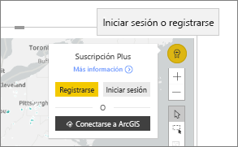

# Interactuación con mapas de ArcGIS en Power BI
Este tema se escribe desde el punto de vista de una persona que usa un mapa de ArcGIS en el servicio Power BI, Desktop o para dispositivos móviles. Después de que un diseñador comparta un objeto visual ArcGIS Map for Power BI con usted, existen numerosas maneras de interactuar con él.  Para más información sobre cómo crear un mapa de ArcGIS, vea [Tutorial de mapas de ArcGIS de Esri](../visuals/power-bi-visualization-arcgis.md).

Con la combinación de ArcGIS Maps y Power BI, los mapas no se limitan a ser una representación de puntos, sino que alcanzan un nivel completamente nuevo. Los diseñadores de informes comienzan con un mapa, al que adjuntan capas de datos demográficos. La combinación de estas capas de datos basadas en la ubicación (como datos del censo) en un mapa con el análisis espacial transmite una comprensión más profunda de los datos en las visualizaciones.

> [!TIP]
> GIS son las siglas en inglés para sistema de información geográfica.
> 

En este objeto visual de mapa ArcGIS para Power BI se muestran las ventas del año pasado por ciudad y se usa un mapa base de calle y una capa de referencia de promedio de ingresos domésticos. El mapa contiene dos marcas (de color rojo y amarillo) y un radio de tiempo de conducción (en color púrpura).

> [!TIP]
> Visite la [página de Esri en Power BI](https://www.esri.com/powerbi) para ver numerosos ejemplos y leer testimonios. Y, después, consulte la [página de introducción a ArcGIS Maps para Power BI](https://doc.arcgis.com/en/maps-for-powerbi/get-started/about-maps-for-power-bi.htm) de Esri.
> 
> 

## Consentimiento del usuario

La primera vez que un compañero de trabajo comparta un mapa de ArcGIS con usted, Power BI mostrará una petición de consentimiento. Esri proporciona ArcGIS Maps for Power BI (https://www.esri.com) y el uso de ArcGIS Maps for Power BI está sujeto a los términos y a la directiva de privacidad de Esri). Los usuarios de Power BI que quieran usar objetos visuales de ArcGIS Maps para Power BI tienen que aceptar el cuadro de diálogo de consentimiento.

## Descripción de los niveles

Un objeto visual ArcGIS Maps for Power BI puede tener varios tipos de niveles de información de ubicación demográfica diferentes.

### Mapas base

Cada objeto visual ArcGIS Maps for Power BI empieza con un mapa base. Los mapas base se pueden considerar el lienzo para los datos. Un mapa base podría ser un lienzo básico oscuro o claro,

 

o bien un lienzo con detalles de transporte y calles. 

  

El mapa base se aplica al lienzo completamente; a medida que se realizan movimientos panorámicos y de zoom, el mapa se actualiza. Acerque la vista para ver información más detallada sobre la calle y el transporte. Al realizar un movimiento panorámico de un continente a otro, el nivel de detalle permanece constante. En este caso, se ha realizado un movimiento panorámico desde Oporto a Pekín.

  

### Capas de referencia

Un *diseñador* de informes puede agregar una capa de referencia. Las capas de referencia se hospedan en ESRI y proporcionan una capa adicional de información demográfica sobre una ubicación. El ejemplo siguiente tiene una capa de referencia para la densidad de población. Los colores más oscuros representan una mayor densidad.

  

### Infografías

Un *diseñador* de informes puede agregar muchas capas de infografías. Las infografías son indicadores visuales rápidos que se muestran en el lado derecho del lienzo visual. Las infografías se hospedan en ESRI y proporcionan una capa adicional de información demográfica sobre una ubicación. En el ejemplo siguiente se aplican tres infografías. No se muestran en el mapa, sino en tarjetas. Las tarjetas de infografías se actualizan a medida que se realizan movimientos de zoom o panorámicos, y se seleccionan áreas en el mapa.

  

### Marcas

Las marcas representan ubicaciones precisas, como una ciudad o una dirección. A veces, los *diseñadores* de informes usan marcas con el radio de tiempo de conducción. En este ejemplo se muestran tiendas en un radio de 50 millas de Charlotte, Carolina del Norte.

 

## Interacción con un objeto visual de ArcGIS Maps for Power BI
Las características disponibles dependen de cómo se haya compartido el informe con usted y el tipo de cuenta de Power BI. Consulte con el administrador del sistema si tiene alguna pregunta. Los objetos visuales ArcGIS Maps for Power BI se comportan de manera muy parecida a otros objetos visuales de un informe. Podrá [mostrar los datos que se usan para crear la visualización](../consumer/end-user-show-data.md), ver el mapa en [modo de enfoque y de pantalla completa](../consumer/end-user-focus.md), [agregar comentarios](../consumer/end-user-comment.md), [interactuar con los filtros](../consumer/end-user-report-filter.md) establecidos por el *diseñador* del informes y mucho más. Los objetos visuales de ArcGIS pueden filtrar otros objetos visuales en la página del informe y viceversa.

Mantenga el mouse sobre las ubicaciones del mapa base (por ejemplo, una burbuja) para mostrar información sobre herramientas. Además, use las herramientas de selección de objetos visuales de ArcGIS para mostrar información sobre herramientas adicional y realizar selecciones específicas en el mapa base o en la capa de referencia.  

### Herramientas de selección

ArcGIS Maps for Power BI permite cinco modos de selección. Se puede seleccionar un máximo de 250 puntos de datos a la vez.

#### Herramienta de selección única

 

Seleccione un punto de datos, una burbuja, una marca o un punto de datos individual de la capa de referencia. Power BI mostrará información sobre herramientas con los detalles de la selección. La selección única realiza un filtrado cruzado de los otros objetos visuales de la página de informe en función de la selección, y actualiza las tarjetas de infografías para el área seleccionada. 

Aquí se ha seleccionado un punto de datos de burbuja marrón del mapa base. Power BI:
- resalta la selección,
- muestra una información sobre herramientas para ese punto de datos, 
- actualiza las tarjetas de infografías para mostrar solo los datos de la selección y
- realiza un filtrado cruzado del gráfico de columnas.

Si el mapa tiene una capa de referencia, al seleccionar ubicaciones se muestran los detalles en una información sobre herramientas. Aquí se ha seleccionado Seneca County y se ven datos de la capa de referencia (densidad de población) que el *diseñador* del informe ha agregado al mapa. En este ejemplo, el punto de datos incluye dos condados diferentes, por lo que la información sobre herramientas tiene dos páginas. Cada página tiene un gráfico. Seleccione una barra del gráfico para mostrar detalles adicionales. 

> [!TIP]
  > A veces, puede reducir el número de páginas de la información sobre herramientas si se acerca para seleccionar una ubicación específica.  En caso contrario, si existen ubicaciones superpuestas, Power BI puede presentar más de una información sobre herramientas a la vez. Seleccione las flechas para moverse entre las distintas informaciones sobre herramientas
  > 
  > 

#### Herramienta de selección múltiple

 

Dibuja un rectángulo en el mapa y selecciona los puntos de datos contenidos. Use CTRL para seleccionar más de un área rectangular. La selección múltiple actualiza las tarjetas de infografías del área seleccionada y resalta los demás objetos visuales de la página del informe en función de la selección.

 

#### Herramienta de capa de referencia

 

Permite usar los límites o polígonos en las capas de referencia para seleccionar puntos de datos contenidos. Es difícil de ver, pero hay un contorno amarillo en la capa de referencia. A diferencia de la herramienta de selección única, no se obtiene información sobre herramientas. En su lugar, se obtienen datos sobre los puntos de datos contenidos en los bordes de ese contorno. En este ejemplo, la selección contiene un punto de datos, para una tienda Lindseys en Winston Salem.

 

#### Herramienta de búfer

 

Permite la selección de puntos de datos mediante una capa de búfer. Por ejemplo, use esta herramienta para seleccionar un radio de tiempo de conducción y seguir interactuando con el resto del informe. El radio de tiempo de conducción permanece activo y las tarjetas de infografías lo siguen reflejando, pero al seleccionar otros puntos de datos en el mapa se aplica un filtro cruzado a los demás objetos visuales de la página del informe.

 

#### Herramienta Buscar similares

 

Permite buscar ubicaciones con atributos similares. Para empezar, se seleccionan uno o más puntos de interés, o ubicaciones de referencia, y se definen hasta cinco dimensiones que se quieran usar en el análisis. Después, Buscar similares calcula las 10 ubicaciones en el mapa que sean más parecidas a las ubicaciones de referencia definidas. Después, puede usar las tarjetas de infografías para obtener más información sobre los datos demográficos de cada uno de los resultados, crear áreas de tiempo de conducción para hacerse una idea de lo que se encuentra dentro de la distancia de conducción en cada una de estas ubicaciones, o bien incluso usar la herramienta Buscar similares para filtrar el informe y obtener más detalles. Lo más importante es que todo el cálculo se realiza de forma local en el equipo, por lo que puede estar seguro de que los datos confidenciales permanecen protegidos.

## Consideraciones y limitaciones
ArcGIS Maps para Power BI está disponible en los siguientes servicios y aplicaciones:

|Servicio/aplicación  |Disponibilidad  |
|---------|---------|
|Power BI Desktop     |     Sí    |
|Servicio Power BI (app.powerbi.com)     |    Sí     |
|Aplicaciones móviles de Power BI     |  Sí      |
|Publicar en Web de Power BI     |  No       |
|Power BI Embedded     |     No    |
|Inserción del servicio Power BI (PowerBI.com)  | No |

## ¿Cómo funciona ArcGIS Maps for Power BI?
Esri es quien proporciona ArcGIS Maps for Power BI (https://www.esri.com). Su uso de ArcGIS Maps for Power BI está sujeto a los [términos](https://go.microsoft.com/fwlink/?LinkID=8263222) y a la [directiva de privacidad](https://go.microsoft.com/fwlink/?LinkID=826323) de Esri. Los usuarios de Power BI que quieran usar objetos visuales de ArcGIS Maps for Power BI tienen que aceptar el cuadro de diálogo de consentimiento (vea Consentimiento del usuario para más detalles).  El uso de ArcGIS Maps for Power BI de Esri está sujeto a los términos y a la directiva de privacidad de Esri, a la que puede acceder desde el vínculo del cuadro de diálogo de consentimiento. Cada usuario debe dar su consentimiento antes de usar ArcGIS Maps for Power BI por primera vez. Una vez que el usuario acepta el consentimiento, los datos enlazados al objeto visual se envían a los servicios de Esri al menos para su geocodificación, lo que implica transformar la información de ubicación en información de latitud y longitud que se pueda representar en un mapa. Debe tener en cuenta que los datos enlazados a la visualización de datos pueden enviarse a los servicios de Esri. Esri proporciona servicios como mapas base, análisis espacial, geocodificación, etc. El objeto visual de ArcGIS Maps for Power BI interactúa con estos servicios mediante una conexión SSL protegida por un certificado proporcionado y mantenido por Esri. Puede obtener más información sobre ArcGIS Maps for Power BI en la [Página del producto ArcGIS Maps for Power BI](https://www.esri.com/powerbi) de Esri.

### Power BI Plus

Cuando un usuario realiza una suscripción a Plus ofrecida por Esri mediante ArcGIS Maps for Power BI, está entablando una relación directa con Esri. Power BI no envía información personal sobre el usuario a Esri. El usuario inicia sesión en una aplicación AAD proporcionada por Esri, y confía en ella, mediante su propia identidad AAD. Al hacerlo, el usuario comparte su información personal directamente con Esri. Una vez que el usuario agrega contenido Plus a un objeto visual de ArcGIS Maps for Power BI, los compañeros de trabajo que quieran ver o modificar ese objeto visual también necesitarán una suscripción Plus de Esri. 

Para realizar preguntas técnicas detalladas sobre el funcionamiento de ArcGIS Maps for Power BI de Esri, póngase en contacto con Esri a través de su sitio de soporte técnico.

## Consideraciones y solución de problemas

**El mapa de ArcGIS no aparece**    
En los servicios o aplicaciones donde ArcGIS Maps para Power BI no está disponible, la visualización mostrará un objeto visual vacío con el logotipo de Power BI.

**No veo toda mi información en el mapa**    
Cuando se geocodifica la latitud o longitud en el mapa, se muestran hasta 30 000 puntos de datos. Cuando se geocodifican puntos de datos como códigos postales o direcciones, solo se geocodifican los primeros 15 000 puntos de datos. La geocodificación de nombres de lugares o países no está sujeto al límite de 1500 direcciones.

**¿Hay algún cargo por usar ArcGIS Maps para Power BI?**

ArcGIS Maps para Power está disponible para todos los usuarios de Power BI sin costo adicional. Es un componente que proporciona **Esri** y su uso está sujeto a los términos y a la directiva de privacidad que proporciona **Esri**, como se ha indicado anteriormente en este artículo. Si se suscribe a ArcGIS **Plus**, hay un cargo.

**Recibo un mensaje de error sobre el hecho de que la caché está llena**

Este comportamiento es un error que se está solucionando.  Mientras tanto, seleccione el vínculo que aparece en el mensaje de error para ver instrucciones sobre cómo borrar la caché de Power BI.

**¿Puedo ver mi mapas de ArcGIS sin conexión?**

No, Power BI necesita conectividad de red para mostrar los mapas.

## Pasos siguientes
Obtener ayuda: **Esri** ofrece [documentación exhaustiva](https://go.microsoft.com/fwlink/?LinkID=828772) sobre el conjunto de características de **ArcGIS Maps para Power BI**.

Puede formular preguntas, buscar la información más reciente, notificar problemas y encontrar respuestas en el [hilo de la comunidad de Power BI relacionado con **ArcGIS Maps para Power BI**](https://go.microsoft.com/fwlink/?LinkID=828771).

[Página del producto ArcGIS Maps para Power BI](https://www.esri.com/powerbi)
