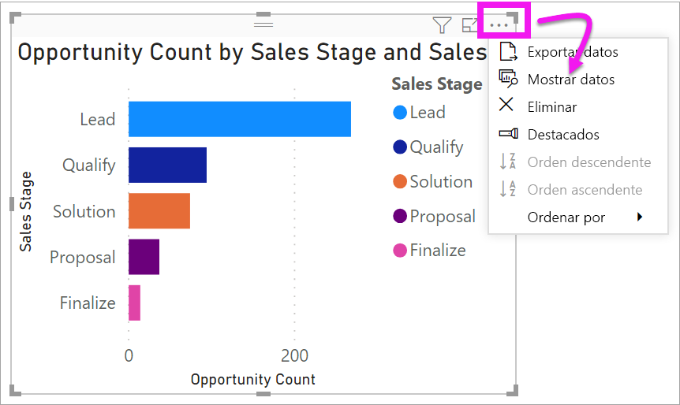
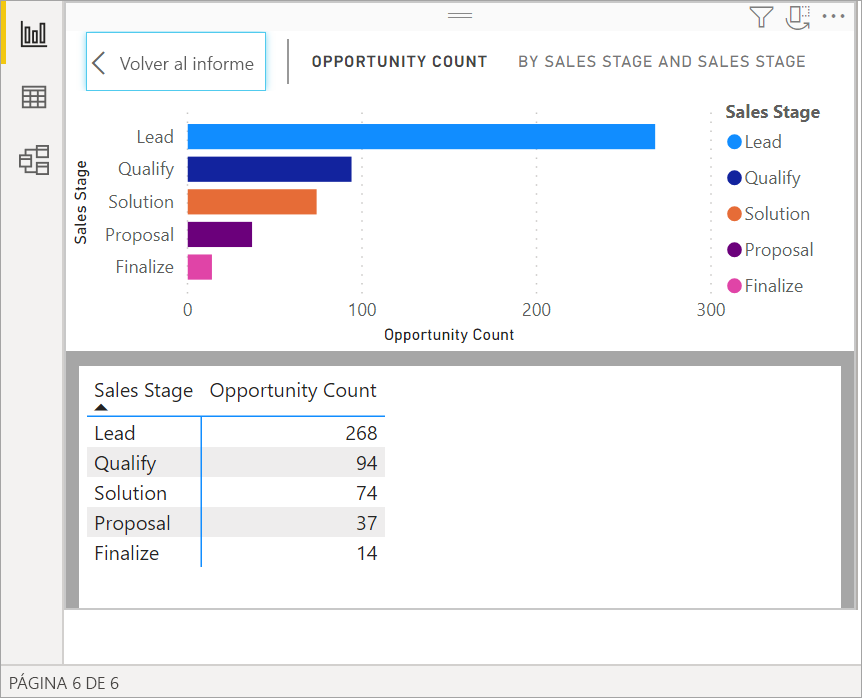
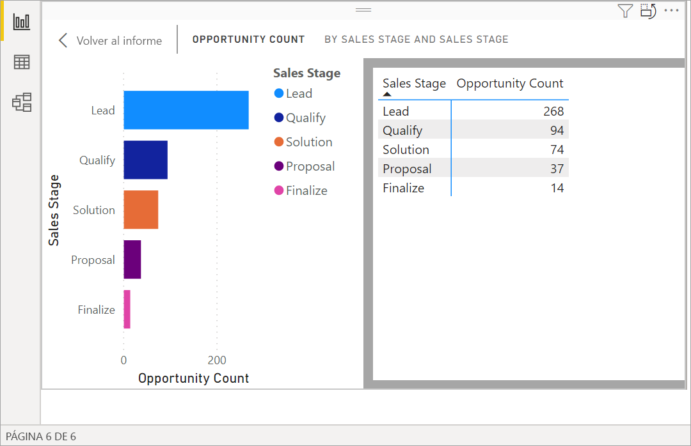
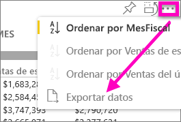
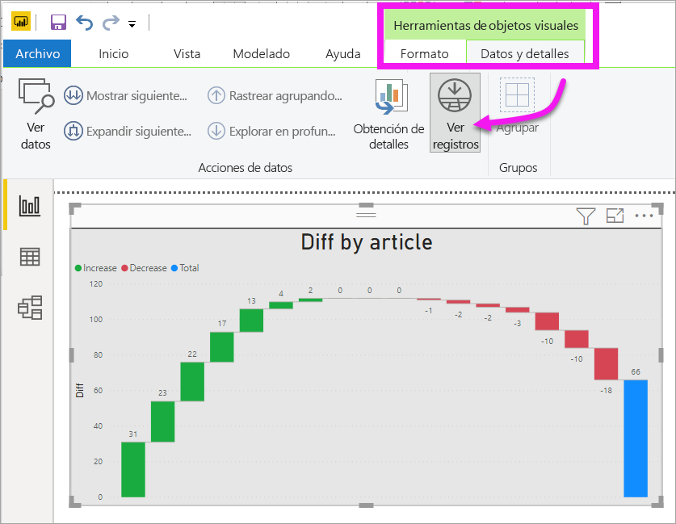
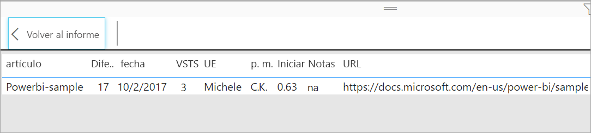

# Mostrar los datos que se utilizaron para crear la visualización
## Mostrar datos
Una visualización de Power BI se construye con datos provenientes de los conjuntos de datos. Si quiere ver lo que sucede en segundo plano, Power BI le permite *mostrar* los datos que se usan para crear el objeto visual. Cuando se selecciona **Mostrar datos**, Power BI muestra los datos que están situados debajo (o cerca) de la visualización.

También puede exportar los datos que se usan para crear la visualización como un archivo .xlsx o .csv y verlos en Excel. Para obtener más información, consulte [Exportar datos de visualizaciones de Power BI](power-bi-visualization-export-data.md).

> [!NOTE]
> Las opciones *Mostrar datos* y *Exportar datos* están disponibles en el servicio Power BI y Power BI Desktop. Pero Power BI Desktop proporciona un nivel adicional de detalle. Mediante [*Mostrar registros*, se muestran las filas reales del conjunto de datos](../desktop-see-data-see-records.md).
> 
> 

## Uso de *Mostrar datos* 
1. En Power BI Desktop, seleccione una visualización para activarla.

2. Seleccione **Más opciones** (...) y, después, **Mostrar datos**. 
    

3. De manera predeterminada, los datos aparecen debajo del objeto visual.
   
   

4. Para cambiar la orientación, seleccione el diseño vertical  en la esquina superior derecha de la visualización.
   
   
5. Para exportar los datos a un archivo .csv, seleccione los puntos suspensivos y elija **Exportar datos**.
   
    
   
    Para obtener más información sobre cómo exportar los datos a Excel, consulte [Exportar datos de visualizaciones de Power BI](power-bi-visualization-export-data.md).
6. Para ocultar los datos, anule la selección de **Explorar** > **Mostrar datos**.

## Uso de Mostrar registros
También puede centrarse en un registro de datos de una visualización y profundizar en los datos que contiene. 

1. Para usar **Ver registros**, seleccione una visualización para activarla. 

2. En la cinta de opciones Escritorio, seleccione la pestaña de **Herramientas de objetos visuales**  > **Datos y detalles**  > **Ver registros**. 

    

3. Seleccione un punto de datos o una fila en la visualización. En este ejemplo hemos seleccionado la cuarta columna desde la izquierda. Power BI nos muestra el registro del conjunto de datos de este punto de datos.

    

4. Seleccione **Volver al informe** para volver al lienzo de informe del Escritorio. 

## Consideraciones y solución de problemas

- Si el botón **Ver registros** de la cinta está deshabilitado y en gris, significa que la visualización seleccionada no admite Ver registros.
- No puede cambiar los datos de la vista Ver registros y guardarlos de nuevo en el informe.
- No se puede usar Ver registros cuando el objeto visual utilice una medida calculada.
- No se puede usar Ver registros al conectarse a un modelo multidimensional (MD) activo.  

## Pasos siguientes
[Exportación de datos de visualizaciones de Power BI](power-bi-visualization-export-data.md)    

¿Tiene más preguntas? [Pruebe la comunidad de Power BI](https://community.powerbi.com/)

